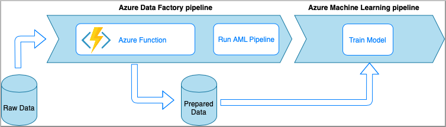
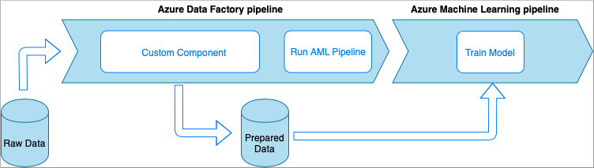
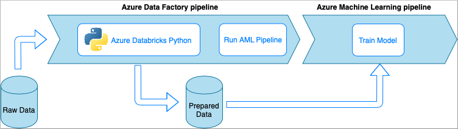
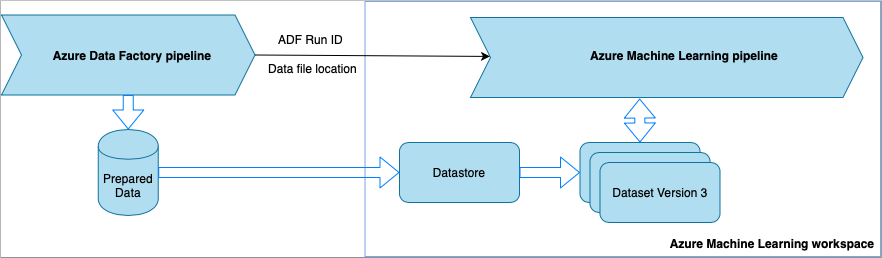

# Data ingestion with Azure Data Factory

In this article, you learn how to build a data ingestion pipeline with Azure Data Factory (ADF). This pipeline is used to ingest data for use with Azure Machine Learning. Azure Data Factory allows you to easily extract, transform, and load (ETL) data. Once the data has been transformed and loaded into storage, it can be used to train your machine learning models.

Simple data transformation can be handled with native ADF activities and instruments such as [data flow](https://docs.microsoft.com/azure/data-factory/control-flow-execute-data-flow-activity). When it comes to more complicated scenarios, the data can be processed with some custom code. For example, Python or R code.

There are several common techniques of using Azure Data Factory to transform data during ingestion. Each technique has pros and cons that determine if it is a good fit for a specific use case:

| Technique | Pros | Cons |
| ----- | ----- | ----- |
| ADF + Azure Functions | Low latency, serverless compute Stateful functions Reusable functions | Only good for short running processing |
| ADF + custom component | Large-scale parallel computing Suited for heavy algorithms | Wrapping code into an executable Complexity of handling dependencies and IO |
| ADF + Azure Databricks notebook | Apache Spark Native Python environment | Can be expensive Creating clusters initially takes time and adds latency

## ADF with Azure functions

Azure Functions allows you to run small pieces of code (functions) without worrying about application infrastructure. In this option, the data is processed with custom Python code wrapped into an Azure Function. 

The function is invoked with the [ADF Azure Function activity](https://docs.microsoft.com/azure/data-factory/control-flow-azure-function-activity). This approach is a good option for lightweight data transformations. 

* Pros:
    * The data is processed on a serverless compute with a relatively low latency
    * ADF pipeline can invoke a [Durable Azure Function](/azure/azure-functions/durable/durable-functions-overview) that may implement a sophisticated data transformation flow 
    * The details of the data transformation are abstracted away by the Azure Function that can be reused and invoked from other places
* Cons:
    * The Azure Functions must be created before use with ADF
    * Azure Functions is good only for short running data processing

## ADF with Custom Component Activity

In this option, the data is processed with custom Python code wrapped into an executable. It is invoked with an [ADF Custom Component activity](https://docs.microsoft.com/azure/data-factory/transform-data-using-dotnet-custom-activity). This approach is a better fit for large data than the previous technique.

* Pros:
    * The data is processed on [Azure Batch](https://docs.microsoft.com/azure/batch/batch-technical-overview) pool, which provides large-scale parallel and high-performance computing
    * Can be used to run heavy algorithms and process significant amounts of data
* Cons:
    * Azure Batch pool must be created before use with ADF
    * Over engineering related to wrapping Python code into an executable. Complexity of handling dependencies and input/output parameters

## ADF with Azure Databricks Python notebook

[Azure Databricks](https://azure.microsoft.com/services/databricks/) is an Apache Spark-based analytics platform in the Microsoft cloud.

In this technique, the data transformation is performed by a [Python notebook](https://docs.microsoft.com/azure/data-factory/transform-data-using-databricks-notebook), running on an Azure Databricks cluster. This is probably, the most common approach that leverages the full power of an Azure Databricks service. It is designed for distributed data processing at scale.

* Pros:
    * The data is transformed on the most powerful data processing Azure service, which is backed up by Apache Spark environment
    * Native support of Python along with data science frameworks and libraries including TensorFlow, PyTorch, and scikit-learn
    * There is no need to wrap the Python code into functions or executable modules. The code works as is.
* Cons:
    * Azure Databricks infrastructure must be created before use with ADF
    * Can be expensive depending on Azure Databricks configuration
    * Spinning up compute clusters from "cold" mode takes some time that brings high latency to the solution 
    

## Consuming data in Azure Machine Learning pipelines

The transformed data from the ADF pipeline is saved to data storage (such as Azure Blob). Azure Machine Learning can access this data using [datastores](https://docs.microsoft.com/azure/machine-learning/how-to-access-data#create-and-register-datastores) and [datasets](https://docs.microsoft.com/azure/machine-learning/how-to-create-register-datasets).

Each time the ADF pipeline runs, the data is saved to a different location in storage. To pass the location to Azure Machine Learning, the ADF pipeline calls an Azure Machine Learning pipeline. When calling the ML pipeline, the data location and run ID are sent as parameters. The ML pipeline can then create a datastore/dataset using the data location. 

> [!TIP]
> Datasets [support versioning](https://docs.microsoft.com/azure/machine-learning/how-to-version-track-datasets), so the ML pipeline can register a new version of the dataset that points to the most recent data from the ADF pipeline.

Once the data is accessible through a datastore or dataset, you can use it to train an ML model. The training process might be part of the same ML pipeline that is called from ADF. Or it might be a separate process such as experimentation in a Jupyter notebook.

Since datasets support versioning, and each run from the pipeline creates a new version, it's easy to understand which version of the data was used to train a model.

## Next steps

* [Run a Databricks notebook in Azure Data Factory](https://docs.microsoft.com/azure/data-factory/transform-data-using-databricks-notebook)
* [Access data in Azure storage services](https://docs.microsoft.com/azure/machine-learning/how-to-access-data#create-and-register-datastores)
* [Train models with datasets in Azure Machine Learning](https://docs.microsoft.com/azure/machine-learning/how-to-train-with-datasets)
* [DevOps for a data ingestion pipeline](https://docs.microsoft.com/azure/machine-learning/how-to-cicd-data-ingestion)

