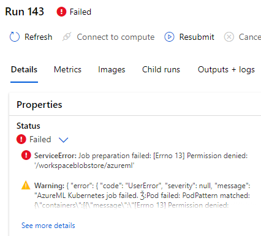
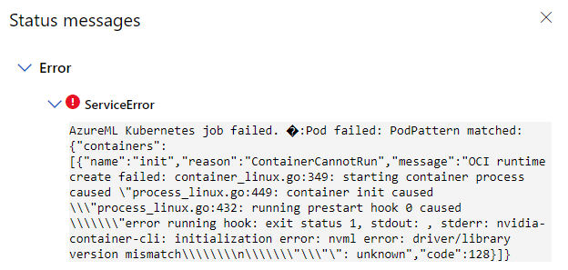

# Job is pending for a long time

## Check the resource capacity of the nodes:

``` azure cli
kubectl get nodes -o json | jq '.items[]|{name: .metadata.name, capacity: .status.capacity, allocatable: .status.allocatable}'
```

Here is a sample output

``` azure cli
{
  "name": "aks-nodepool1-36994511-vmss000000",
  "capacity": {
    "attachable-volumes-azure-disk": "24",
    "cpu": "6",
    "ephemeral-storage": "129900528Ki",
    "github.com/fuse": "1k",
    "hugepages-1Gi": "0",
    "hugepages-2Mi": "0",
    "memory": "57584828Ki",
    "nvidia.com/gpu": "1",
    "pods": "110"
  },
  "allocatable": {
    "attachable-volumes-azure-disk": "24",
    "cpu": "5840m",
    "ephemeral-storage": "119716326407",
    "github.com/fuse": "1k",
    "hugepages-1Gi": "0",
    "hugepages-2Mi": "0",
    "memory": "51573948Ki",
    "nvidia.com/gpu": "1",
    "pods": "110"
  }
}
```

## Insufficient github.com/fuse

Check whether k8s-host-device-plugin-daemonset is installed properly.

``` azure cli
kubectl get ds -A | grep k8s-host-device-plugin-daemonset
```

## Insufficient nvidia.com/gpu

Check whether nvidia-device-plugin-daemonset is installed properly. For more details, please refer to [k8s-device-plugin](https://github.com/NVIDIA/k8s-device-plugin)

``` azure cli
kubectl get ds -A | grep nvidia-device-plugin-daemonset
```

## The "ps-0" pod is stuck in pending status

``` azure cli
kubectl get pods | grep ps-0
```

Please try using another instance-type of lower resource requested.

## blobfuse fails to mount

Make sure the [blobfuse-flexvolume-installer](https://github.com/Azure/kubernetes-volume-drivers/tree/master/flexvolume#config-kubelet-service-to-enable-flexvolume-driver) daemonset is installed properly

## no volume plugin matched

``` error message
Warning  FailedMount xxx  kubelet  xxxx: failed to get Plugin from volumeSpec for volume "f38a008f5870bd913f36e68c12dc1827-blobfuse-0" err=no volume plugin matched
```

This error message indicates that the flexvol is not installed properly.

Try changing the installation path for the volume plugin

``` azure cli
az k8s-extension create  -g <resource group> -c <cluster> --cluster-type connectedClusters  --extension-type Microsoft.AzureML.Kubernetes -n trainingcompute --release-train stable --config enableTraining=true  --configuration-settings volumePluginDir=/usr/libexec/kubernetes/kubelet-plugins/volume/exec/
```

# Job is in failed status

## OOM Error (Out of Memory)

Please try adjusting the batch size of the training job or using an instance-type with higher memory limit. For tensorflow jobs, unlike other distributed jobs set the memory limits of ps pod hard coded with 2048Mi, the memory limit of ps pods are the same as the worker nodes'.

## Permission Denied under '/workspaceblobstore/azureml'



Please upgrade the blobfuse on the kubernetes nodes to 1.3.6 or above.

``` azure cli
az k8s-extension create  -g <resource group> -c <cluster> --cluster-type connectedClusters  --extension-type Microsoft.AzureML.Kubernetes -n trainingcompute --release-train stable --config enableTraining=true  blobfuseSysctlInstall.enabled=true
```

## stderr: nvidia-container-cli: initialization error: nvml error: driver/library version mismatch



1. Try restarting the problematic node.

2. Check whether [nvml driver library version mismatch](https://stackoverflow.com/questions/43022843/nvidia-nvml-driver-library-version-mismatch)


## Job failed with blobfuse using SasToken

It may be due to an outdated CRD of the aml-operator, please update the CRD in the cluster. 


