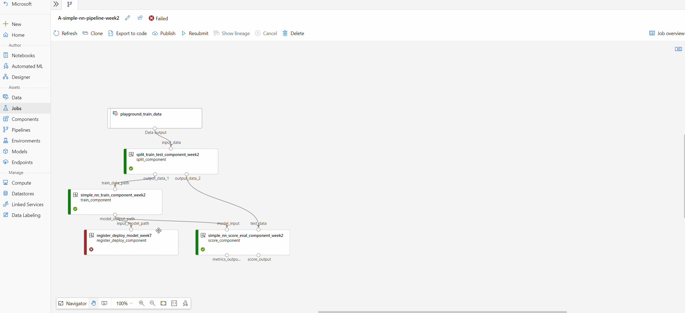

# How to use pipeline UI to debug Azure Machine Learning pipeline failures

After submitting a pipeline, you'll see a link to the pipeline job in your Azure Machine Learning workspace. The link lands you in the pipeline job page in Azure Machine Learning studio, in which you can check result and debug your pipeline job. 

This article introduces how to use the pipeline job page to debug machine learning pipeline failures.

> [!IMPORTANT]
> Items marked (preview) in this article are currently in public preview.
> The preview version is provided without a service level agreement, and it's not recommended for production workloads. Certain features might not be supported or might have constrained capabilities.
> For more information, see [Supplemental Terms of Use for Microsoft Azure Previews](https://azure.microsoft.com/support/legal/preview-supplemental-terms/).

## Using outline to quickly find a node

In pipeline job detail page, there's an outline left to the canvas, which shows the overall structure of your pipeline job. Hovering on any row, you can select the "Locate" button to locate that node in the canvas.

:::image type="content" source="./media/how-to-debug-pipeline-failure/outline.png" alt-text="Screenshot showing outline and locate in the canvas." lightbox= "./media/how-to-debug-pipeline-failure/outline.png":::

You can filter failed or completed nodes, and filter by only components or dataset for further search. The left pane shows the matched nodes with more information including status, duration, and created time.

:::image type="content" source="./media/how-to-debug-pipeline-failure/quick-filter.png" alt-text="Screenshot showing the quick filter by in outline > search." lightbox= "./media/how-to-debug-pipeline-failure/quick-filter.png":::

You can also sort the filtered nodes.

:::image type="content" source="./media/how-to-debug-pipeline-failure/sort.png" alt-text="Screenshot of sorting search result in outline > search." lightbox= "./media/how-to-debug-pipeline-failure/sort.png":::

## Check logs and outputs of component

If your pipeline fails or gets stuck on a node, first view the logs.

1. You can select the specific node and open the right pane.

1. Select **Outputs+logs** tab and you can explore all the outputs and logs of this node.

    The **user_logs folder** contains information about user code generated logs. This folder is open by default, and the **std_log.txt** log is selected. The **std_log.txt** is where your code's logs (for example, print statements) show up.

    The **system_logs folder** contains logs generated by Azure Machine Learning. Learn more about [View and download diagnostic logs](how-to-log-view-metrics.md#view-and-download-diagnostic-logs).

    

    If you don't see those folders, this is due to the compute run time update isn't released to the compute cluster yet, and you can look at **70_driver_log.txt** under **azureml-logs** folder first.

## Compare different pipelines to debug failure or other unexpected issues (preview)

Pipeline comparison identifies the differences (including topology, component properties, and job properties) between multiple jobs. For example you can compare a successful pipeline and a failed pipeline, which helps you find what modifications make your pipeline fail.

Two major scenarios where you can use pipeline comparison to help with debugging:

- Debug your failed pipeline job by comparing it to a completed one.
- Debug your failed node in a pipeline by comparing it to a similar completed one.

To enable this feature:

1. Navigate to Azure Machine Learning studio UI.
2. Select **Manage preview features** (megaphone icon) among the icons on the top right side of the screen.
3. In **Managed preview feature** panel, toggle on **Compare pipeline jobs to debug failures or unexpected issues** feature.

:::image type="content" source="./media/how-to-debug-pipeline-failure/enable-preview.png" alt-text="Screenshot of manage preview features toggled on." lightbox= "./media/how-to-debug-pipeline-failure/enable-preview.png":::

### How to debug your failed pipeline job by comparing it to a completed one

During iterative model development, you may have a baseline pipeline, and then do some modifications such as changing a parameter, dataset or compute resource, etc. If your new pipeline failed, you can use pipeline comparison to identify what has changed by comparing it to the baseline pipeline, which could help with figuring out why it failed.

#### Compare a pipeline with its parent

The first thing you should check when debugging is to locate the failed node and check the logs.

For example, you may get an error message showing that your pipeline failed due to out-of-memory. If your pipeline is cloned from a completed parent pipeline, you can use pipeline comparison to see what has changed.

1. Select **Show lineage**.
1. Select the link under "Cloned From". This will open a new browser tab with the parent pipeline.

      :::image type="content" source="./media/how-to-debug-pipeline-failure/cloned-from.png" alt-text="Screenshot showing the cloned from link, with the previous step, the lineage button highlighted." lightbox= "./media/how-to-debug-pipeline-failure/cloned-from.png":::

1. Select **Add to compare** on the failed pipeline and the parent pipeline. This adds them in the comparison candidate list.

      :::image type="content" source="./media/how-to-debug-pipeline-failure/comparison-list.png" alt-text="Screenshot showing the comparison list with a parent and child pipeline added." lightbox= "./media/how-to-debug-pipeline-failure/comparison-list.png":::

### Compare topology

Once the two pipelines are added to the comparison list, you have two options: **Compare detail** and **Compare graph**. **Compare graph** allows you to compare pipeline topology.

**Compare graph** shows you the graph topology changes between pipeline A and B. The special nodes in pipeline A are highlighted in red and marked with "A only". The special nodes in pipeline B are in green and marked with "B only". The shared nodes are in gray. If there are differences on the shared nodes, what has been changed is shown on the top of node.

There are three categories of changes with summaries viewable in the detail page, parameter change, input source, pipeline component. When the pipeline component is changed this means that there's a topology change inside or an inner node parameter change, you can select the folder icon on the pipeline component node to dig down into the details. Other changes can be detected by viewing the colored nodes in the compare graph.

   :::image type="content" source="./media/how-to-debug-pipeline-failure/parameter-changed.png" alt-text="Screenshot showing the parameter changed and the component information tab." lightbox= "./media/how-to-debug-pipeline-failure/parameter-changed.png":::

### Compare pipeline meta info and properties

If you investigate the dataset difference and find that data or topology doesn't seem to be the root cause of failure, you can also check the pipeline details like pipeline parameter, output or run settings.

**Compare graph** is used to compare pipeline topology, **Compare detail** is used to compare pipeline properties link meta info or settings.

To access the detail comparison, go to the comparison list, select **Compare details** or select **Show compare details** on the pipeline comparison page.

You'll see *Pipeline properties* and *Run properties*.

- Pipeline properties include pipeline parameters, run and output setting, etc.
- Run properties include job status, submit time and duration, etc.

The following screenshot shows an example of using the detail comparison, where the default compute setting might have been the reason for failure.

:::image type="content" source="./media/how-to-debug-pipeline-failure/compute.png" alt-text="Screenshot showing the comparison overview of the default compute." lightbox= "./media/how-to-debug-pipeline-failure/compute.png":::

To quickly check the topology comparison, select the pipeline name and select **Compare graph**.

:::image type="content" source="./media/how-to-debug-pipeline-failure/compare-graph.png" alt-text="Screenshot of detail comparison with compare graph highlighted." lightbox= "./media/how-to-debug-pipeline-failure/compare-graph.png":::

### How to debug your failed node in a pipeline by comparing to similar completed node

If you only updated node properties and changed nothing in the pipeline, then you can debug the node by comparing it with the jobs that are submitted from the same component.

#### Find the job to compare with

1. Find a successful job to compare with by viewing all runs submitted from the same component.
    1. Right select the failed node and select *View Jobs*. This gives you a list of all the jobs.
  
        :::image type="content" source="./media/how-to-debug-pipeline-failure/view-jobs.png" alt-text="Screenshot that shows a failed node with view jobs highlighted." lightbox= "./media/how-to-debug-pipeline-failure/view-jobs.png":::

    1. Choose a completed job as a comparison target.
1. After you found a failed and completed job to compare with, add the two jobs to the comparison candidate list.
    1. For the failed node, right select and select *Add to compare*.
    1. For the completed job, go to its parent pipeline and located the completed job. Then select *Add to compare*.
1. Once the two jobs are in the comparison list, select **Compare detail** to show the differences.

### Share the comparison results

To share your comparison results select **Share** and copying the link. For example, you might find out that the dataset difference might of lead to the failure but you aren't a dataset specialist, you can share the comparison result with a data engineer on your team.

:::image type="content" source="./media/how-to-debug-pipeline-failure/share.png" alt-text="Screenshot showing the share button and the link you should copy." lightbox= "./media/how-to-debug-pipeline-failure/share.png":::

## Next steps

In this article, you learned how to debug pipeline failures. To learn more about how you can use the pipeline, see the following articles:

- [How to build pipeline using python sdk v2](./how-to-create-component-pipeline-python.md)
- [How to build pipeline using python CLI v2](./how-to-create-component-pipelines-cli.md)
- [What is machine learning component](./concept-component.md)