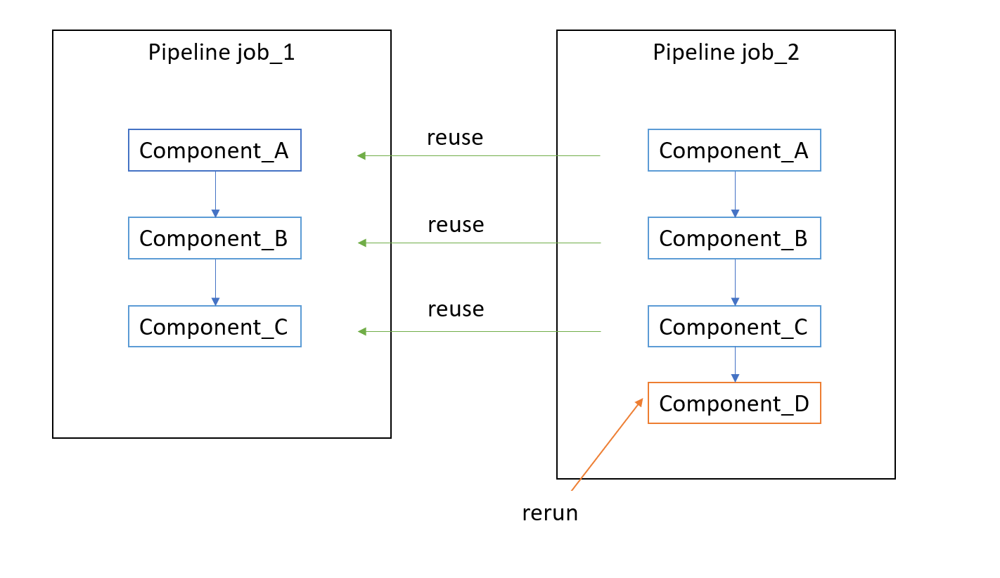
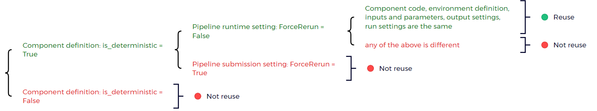
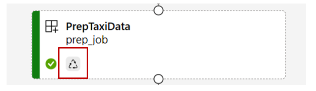
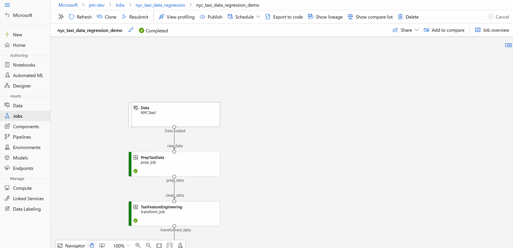
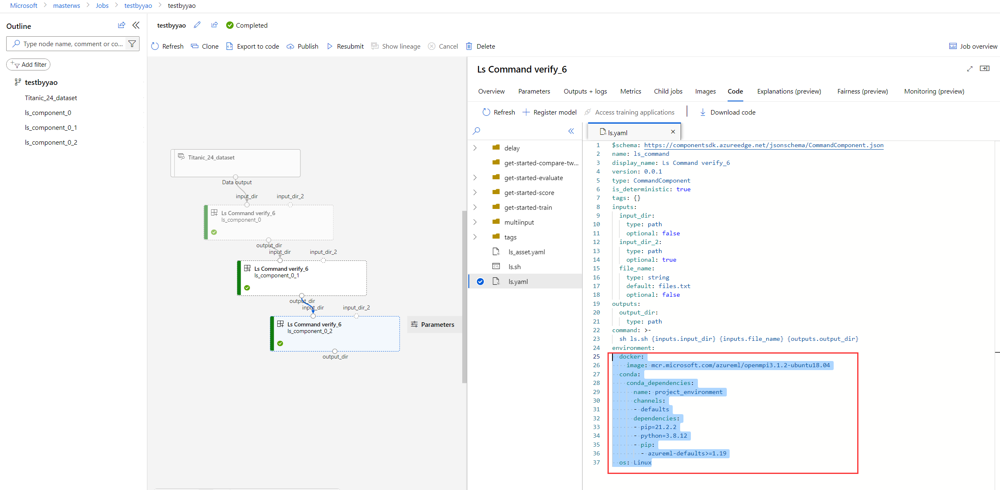
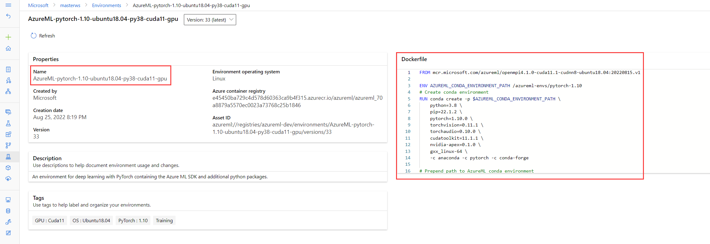

# How to debug pipeline reuse issues?

In this article, we will explain what is reuse in Azure Machine Learning pipeline, how does reuse work, and provide component by component guidance to debug resue issues. 

## What is reuse in Azure Machine Learning pipeline?

Building models with Azure Machine Learning pipeline is an iteractive process. Data scientist usually start with a base piepline, then try different machine learning algorithms or do hyperparameters tuning to improve the model metrics. During the process, many pipeline jobs will be submiited. And those pipeline jobs usually only have small change compare to previous job. Reuse is the pipeline capability to automaticlly caculate which component's result is unchanged and resue the output from previous job when it meet the criteria.  It will tremendously save the time and cost during the pipeline development phase. 

:::image type="content" source="./media/how-to-debug-pipeline-reuse/reuse-demo.png" alt-text="Screenshot showing the idea of reuse.":::

In above screenshot's example, the data scientist first submits `job_1`, then adds `Component_D` to the pipeline and submits `job_2`. When executing pipeline job_2, the pipeline service will detect the output for `Component_A`, `Component_B` and `Component_C` remain unchanged. So it will not run the first three component again. Instead it will reuse the output from job_1 and only run `Component_D` in `job_2`.  
 

## How does resue work?

Azure Machine Learning pipeline has holistic logic to cacluate whether a component's output can be resued. Beblow diagram exlains the resue cateria. 

If a component meets the reuse criteria, pipeline service will skip execution for it, copy original components's status, display orignial component's output/logs/metrcis for the resued component. In pipeline UI, the resued component will show a little recycle icon to indicate this component has been reused.  

:::image type="content" source="./media/how-to-debug-pipeline-reuse/recycle-icon.png" alt-text="Screenshot showing recycle icon.":::

>[!Note]
> If a component meet resue cerieria, pipeline service will assume the output of the orinal job exists within 30 days. The pipeline service will not check whether the original output has been deleted if the original output is created less than 30 days. If the original output is deleted, the resued piepline job will fail. For such cases, please rerun the component to generate output. You can rerun a component by braking any of the reuse cateria, for example set `ForceRerun=True` for the pipeline or changing any input of the component.   

## How to debug resue issues?  

If resue is not working as expected in your pipeline. You can follow below steps to debug.

### Step 1: Check if pipeline setting ForceRerun=True

If the pipeline setting `ForceRerun=True`, all child jobs of the pipeline will rerun. 

>[!Note]
> All child jobs of the force rerun pipeline cannot be reused by other jobs. So make sure you check the *ForceRerun* value both for the job you expect to reuse and the original job you wish to reuse from. 

Below screenshot shows how to check the `ForceResun` setting in pipeline UI. Go to pipeline overview.

[to-do: add screenshot for job overview]

### Step 2: Check if component definition is_deterministic = True

Right click on a component and select **View defination**

:::image type="content" source="./media/how-to-debug-pipeline-reuse/view-defination.png" alt-text="Screenshot showing view component defination.":::

`is_deterministic = True` means this component will procduce the same output for the same input data. If it's set to `False`, the component will always rerun.   

### Step 3: Check if there is any code change by comparing "ContentSnapshotId"

If you have 2 jobs, you expected the second job to reuse the first job, but it didn't. You can compare the component snapshot in the two jobs. If the snapshot id changes, it means there is some component code content change which leads to rerun.

Double click a component to open it's  right panel -> Open **Raw JSON** under Overview tab -> Search for snapshotid in the raw JSON.

### Step 4: Check if there is any environment change

If you are using inline environment, compare the environemnt defianation in component YAML. 

If you are using named environment, compare environment name and defination.

You can copy paste env definition of the 2 jobs, then compare them using local editor like VSCode or Notepad++.

The environment can also be compared in graph comparison feature. We will cover this in next step. 

### Step 5: Check if there is any other change of the inputs, parameters, output settings, run settings by graph comparison

You can compare the input data, parameters, output settings, run settings of the 2 jobs by adding jobs to compare. Learn how to enable and use the graph compare feature [here](./how-to-use-pipeline-ui#compare-different-pipelines-to-debug-failure-or-other-unexpected-issues-preview)

### Step 6: Connect Microsoft for support

If you follow the steps above, and you still can't find the root cause of unexpected rerun, you can file a support case to Microsoft to get help. 

