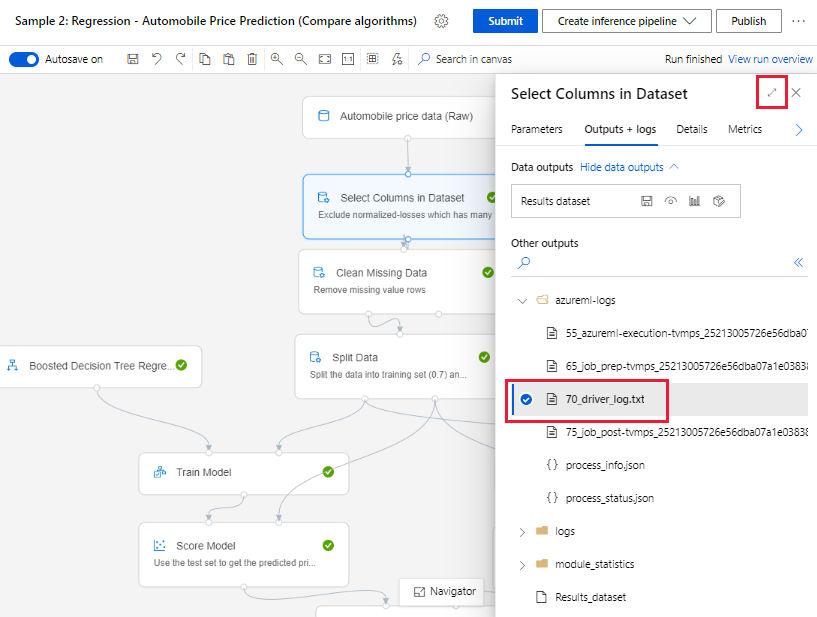

# Troubleshooting machine learning pipelines

In this article, you learn how to troubleshoot when you get errors running a [machine learning pipeline](concept-ml-pipelines.md) in the [Azure Machine Learning SDK](/python/api/overview/azure/ml/intro) and [Azure Machine Learning designer](./concept-designer.md). 

## Troubleshooting tips

The following table contains common problems during pipeline development, with potential solutions.

| Problem | Possible solution |
|--|--|
| Unable to pass data to `PipelineData` directory | Ensure you have created a directory in the script that corresponds to where your pipeline expects the step output data. In most cases, an input argument will define the output directory, and then you create the directory explicitly. Use `os.makedirs(args.output_dir, exist_ok=True)` to create the output directory. See the [tutorial](tutorial-pipeline-batch-scoring-classification.md#write-a-scoring-script) for a scoring script example that shows this design pattern. |
| Dependency bugs | If you see dependency errors in your remote pipeline that did not occur when locally testing, confirm your remote environment dependencies and versions match those in your test environment. (See [Environment building, caching, and reuse](./concept-environments.md#environment-building-caching-and-reuse)|
| Ambiguous errors with compute targets | Try deleting and re-creating compute targets. Re-creating compute targets is quick and can solve some transient issues. |
| Pipeline not reusing steps | Step reuse is enabled by default, but ensure you haven't disabled it in a pipeline step. If reuse is disabled, the `allow_reuse` parameter in the step will be set to `False`. |
| Pipeline is rerunning unnecessarily | To ensure that steps only rerun when their underlying data or scripts change, decouple your source-code directories for each step. If you use the same source directory for multiple steps, you may experience unnecessary reruns. Use the `source_directory` parameter on a pipeline step object to point to your isolated directory for that step, and ensure you aren't using the same `source_directory` path for multiple steps. |
| Step slowing down over training epochs or other looping behavior | Try switching any file writes, including logging, from `as_mount()` to `as_upload()`. The **mount** mode uses a remote virtualized filesystem and uploads the entire file each time it is appended to. |
| Compute target takes a long time to start | Docker images for compute targets are loaded from Azure Container Registry (ACR). By default, Azure Machine Learning creates an ACR that uses the *basic* service tier. Changing the ACR for your workspace to standard or premium tier may reduce the time it takes to build and load images. For more information, see [Azure Container Registry service tiers](../container-registry/container-registry-skus.md). |

### Authentication errors

If you perform a management operation on a compute target from a remote job, you will receive one of the following errors: 

```json
{"code":"Unauthorized","statusCode":401,"message":"Unauthorized","details":[{"code":"InvalidOrExpiredToken","message":"The request token was either invalid or expired. Please try again with a valid token."}]}
```

```json
{"error":{"code":"AuthenticationFailed","message":"Authentication failed."}}
```

For example, you will receive an error if you try to create or attach a compute target from an ML Pipeline that is submitted for remote execution.
## Troubleshooting `ParallelRunStep` 

The script for a `ParallelRunStep` *must contain* two functions:
- `init()`: Use this function for any costly or common preparation for later inference. For example, use it to load the model into a global object. This function will be called only once at beginning of process.
-  `run(mini_batch)`: The function will run for each `mini_batch` instance.
    -  `mini_batch`: `ParallelRunStep` will invoke run method and pass either a list or pandas `DataFrame` as an argument to the method. Each entry in mini_batch will be a file path if input is a `FileDataset` or a pandas `DataFrame` if input is a `TabularDataset`.
    -  `response`: run() method should return a pandas `DataFrame` or an array. For append_row output_action, these returned elements are appended into the common output file. For summary_only, the contents of the elements are ignored. For all output actions, each returned output element indicates one successful run of input element in the input mini-batch. Make sure that enough data is included in run result to map input to run output result. Run output will be written in output file and not guaranteed to be in order, you should use some key in the output to map it to input.

```python
%%writefile digit_identification.py
# Snippets from a sample script.
# Refer to the accompanying digit_identification.py
# (https://github.com/Azure/MachineLearningNotebooks/tree/master/how-to-use-azureml/machine-learning-pipelines/parallel-run)
# for the implementation script.

import os
import numpy as np
import tensorflow as tf
from PIL import Image
from azureml.core import Model


def init():
    global g_tf_sess

    # Pull down the model from the workspace
    model_path = Model.get_model_path("mnist")

    # Construct a graph to execute
    tf.reset_default_graph()
    saver = tf.train.import_meta_graph(os.path.join(model_path, 'mnist-tf.model.meta'))
    g_tf_sess = tf.Session()
    saver.restore(g_tf_sess, os.path.join(model_path, 'mnist-tf.model'))


def run(mini_batch):
    print(f'run method start: {__file__}, run({mini_batch})')
    resultList = []
    in_tensor = g_tf_sess.graph.get_tensor_by_name("network/X:0")
    output = g_tf_sess.graph.get_tensor_by_name("network/output/MatMul:0")

    for image in mini_batch:
        # Prepare each image
        data = Image.open(image)
        np_im = np.array(data).reshape((1, 784))
        # Perform inference
        inference_result = output.eval(feed_dict={in_tensor: np_im}, session=g_tf_sess)
        # Find the best probability, and add it to the result list
        best_result = np.argmax(inference_result)
        resultList.append("{}: {}".format(os.path.basename(image), best_result))

    return resultList
```

If you have another file or folder in the same directory as your inference script, you can reference it by finding the current working directory.

```python
script_dir = os.path.realpath(os.path.join(__file__, '..',))
file_path = os.path.join(script_dir, "<file_name>")
```

### Parameters for ParallelRunConfig

`ParallelRunConfig` is the major configuration for `ParallelRunStep` instance within the Azure Machine Learning pipeline. You use it to wrap your script and configure necessary parameters, including all of the following entries:
- `entry_script`: A user script as a local file path that will be run in parallel on multiple nodes. If `source_directory` is present, use a relative path. Otherwise, use any path that's accessible on the machine.
- `mini_batch_size`: The size of the mini-batch passed to a single `run()` call. (optional; the default value is `10` files for `FileDataset` and `1MB` for `TabularDataset`.)
    - For `FileDataset`, it's the number of files with a minimum value of `1`. You can combine multiple files into one mini-batch.
    - For `TabularDataset`, it's the size of data. Example values are `1024`, `1024KB`, `10MB`, and `1GB`. The recommended value is `1MB`. The mini-batch from `TabularDataset` will never cross file boundaries. For example, if you have .csv files with various sizes, the smallest file is 100 KB and the largest is 10 MB. If you set `mini_batch_size = 1MB`, then files with a size smaller than 1 MB will be treated as one mini-batch. Files with a size larger than 1 MB will be split into multiple mini-batches.
- `error_threshold`: The number of record failures for `TabularDataset` and file failures for `FileDataset` that should be ignored during processing. If the error count for the entire input goes above this value, the job will be aborted. The error threshold is for the entire input and not for individual mini-batch sent to the `run()` method. The range is `[-1, int.max]`. The `-1` part indicates ignoring all failures during processing.
- `output_action`: One of the following values indicates how the output will be organized:
    - `summary_only`: The user script will store the output. `ParallelRunStep` will use the output only for the error threshold calculation.
    - `append_row`: For all inputs, only one file will be created in the output folder to append all outputs separated by line.
- `append_row_file_name`: To customize the output file name for append_row output_action (optional; default value is `parallel_run_step.txt`).
- `source_directory`: Paths to folders that contain all files to execute on the compute target (optional).
- `compute_target`: Only `AmlCompute` is supported.
- `node_count`: The number of compute nodes to be used for running the user script.
- `process_count_per_node`: The number of processes per node. Best practice is to set to the number of GPU or CPU one node has (optional; default value is `1`).
- `environment`: The Python environment definition. You can configure it to use an existing Python environment or to set up a temporary environment. The definition is also responsible for setting the required application dependencies (optional).
- `logging_level`: Log verbosity. Values in increasing verbosity are: `WARNING`, `INFO`, and `DEBUG`. (optional; the default value is `INFO`)
- `run_invocation_timeout`: The `run()` method invocation timeout in seconds. (optional; default value is `60`)
- `run_max_try`: Maximum try count of `run()` for a mini-batch. A `run()` is failed if an exception is thrown, or nothing is returned when `run_invocation_timeout` is reached (optional; default value is `3`). 

You can specify `mini_batch_size`, `node_count`, `process_count_per_node`, `logging_level`, `run_invocation_timeout`, and `run_max_try` as `PipelineParameter`, so that when you resubmit a pipeline run, you can fine-tune the parameter values. In this example, you use `PipelineParameter` for `mini_batch_size` and `Process_count_per_node` and you will change these values when resubmit a run later. 

### Parameters for creating the ParallelRunStep

Create the ParallelRunStep by using the script, environment configuration, and parameters. Specify the compute target that you already attached to your workspace as the target of execution for your inference script. Use `ParallelRunStep` to create the batch inference pipeline step, which takes all the following parameters:
- `name`: The name of the step, with the following naming restrictions: unique, 3-32 characters, and regex ^\[a-z\]([-a-z0-9]*[a-z0-9])?$.
- `parallel_run_config`: A `ParallelRunConfig` object, as defined earlier.
- `inputs`: One or more single-typed Azure Machine Learning datasets to be partitioned for parallel processing.
- `side_inputs`: One or more reference data or datasets used as side inputs without need to be partitioned.
- `output`: An `OutputFileDatasetConfig` object that corresponds to the output directory.
- `arguments`: A list of arguments passed to the user script. Use unknown_args to retrieve them in your entry script (optional).
- `allow_reuse`: Whether the step should reuse previous results when run with the same settings/inputs. If this parameter is `False`, a new run will always be generated for this step during pipeline execution. (optional; the default value is `True`.)

```python
from azureml.pipeline.steps import ParallelRunStep

parallelrun_step = ParallelRunStep(
    name="predict-digits-mnist",
    parallel_run_config=parallel_run_config,
    inputs=[input_mnist_ds_consumption],
    output=output_dir,
    allow_reuse=True
)
```

## Debugging techniques

There are three major techniques for debugging pipelines: 

* Debug individual pipeline steps on your local computer
* Use logging and Application Insights to isolate and diagnose the source of the problem
* Attach a remote debugger to a pipeline running in Azure

### Debug scripts locally

One of the most common failures in a pipeline is that the domain script does not run as intended, or contains runtime errors in the remote compute context that are difficult to debug.

Pipelines themselves cannot be run locally, but running the scripts in isolation on your local machine allows you to debug faster because you don't have to wait for the compute and environment build process. Some development work is required to do this:

* If your data is in a cloud datastore, you will need to download data and make it available to your script. Using a small sample of your data is a good way to cut down on runtime and quickly get feedback on script behavior
* If you are attempting to simulate an intermediate pipeline step, you may need to manually build the object types that the particular script is expecting from the prior step
* You will also need to define your own environment, and replicate the dependencies defined in your remote compute environment

Once you have a script setup to run on your local environment, it is much easier to do debugging tasks like:

* Attaching a custom debug configuration
* Pausing execution and inspecting object-state
* Catching type or logical errors that won't be exposed until runtime

> [!TIP] 
> Once you can verify that your script is running as expected, a good next step is running the script in a single-step pipeline before 
> attempting to run it in a pipeline with multiple steps.

## Configure, write to, and review pipeline logs

Testing scripts locally is a great way to debug major code fragments and complex logic before you start building a pipeline, but at some point you will likely need to debug scripts during the actual pipeline run itself, especially when diagnosing behavior that occurs during the interaction between pipeline steps. We recommend liberal use of `print()` statements in your step scripts so that you can see object state and expected values during remote execution, similar to how you would debug JavaScript code.

### Logging options and behavior

The table below provides information for different debug options for pipelines. It isn't an exhaustive list, as other options exist besides just the Azure Machine Learning, Python, and OpenCensus ones shown here.

| Library                    | Type   | Example                                                          | Destination                                  | Resources                                                                                                                                                                                                                                                                                                                    |
|----------------------------|--------|------------------------------------------------------------------|----------------------------------------------|------------------------------------------------------------------------------------------------------------------------------------------------------------------------------------------------------------------------------------------------------------------------------------------------------------------------------|
| Azure Machine Learning SDK | Metric | `run.log(name, val)`                                             | Azure Machine Learning Portal UI             | [How to track experiments](how-to-log-view-metrics.md)<br>[azureml.core.Run class](/python/api/azureml-core/azureml.core.run%28class%29)                                                                                                                                                 |
| Python printing/logging    | Log    | `print(val)`<br>`logging.info(message)`                          | Driver logs, Azure Machine Learning designer | [How to track experiments](how-to-log-view-metrics.md)<br><br>[Python logging](https://docs.python.org/2/library/logging.html)                                                                                                                                                                       |
| OpenCensus Python          | Log    | `logger.addHandler(AzureLogHandler())`<br>`logging.log(message)` | Application Insights - traces                | [Debug pipelines in Application Insights](./how-to-log-pipelines-application-insights.md)<br><br>[OpenCensus Azure Monitor Exporters](https://github.com/census-instrumentation/opencensus-python/tree/master/contrib/opencensus-ext-azure)<br>[Python logging cookbook](https://docs.python.org/3/howto/logging-cookbook.html) |

#### Logging options example

```python
import logging

from azureml.core.run import Run
from opencensus.ext.azure.log_exporter import AzureLogHandler

run = Run.get_context()

# Azure ML Scalar value logging
run.log("scalar_value", 0.95)

# Python print statement
print("I am a python print statement, I will be sent to the driver logs.")

# Initialize python logger
logger = logging.getLogger(__name__)
logger.setLevel(args.log_level)

# Plain python logging statements
logger.debug("I am a plain debug statement, I will be sent to the driver logs.")
logger.info("I am a plain info statement, I will be sent to the driver logs.")

handler = AzureLogHandler(connection_string='<connection string>')
logger.addHandler(handler)

# Python logging with OpenCensus AzureLogHandler
logger.warning("I am an OpenCensus warning statement, find me in Application Insights!")
logger.error("I am an OpenCensus error statement with custom dimensions", {'step_id': run.id})
``` 

## Azure Machine Learning designer

For pipelines created in the designer, you can find the **70_driver_log** file in either the authoring page, or in the pipeline run detail page.

### Enable logging for real-time endpoints

In order to troubleshoot and debug real-time endpoints in the designer, you must enable Application Insight logging using the SDK. Logging lets you troubleshoot and debug model deployment and usage issues. For more information, see [Logging for deployed models](./how-to-enable-app-insights.md). 

### Get logs from the authoring page

When you submit a pipeline run and stay in the authoring page, you can find the log files generated for each module as each module finishes running.

1. Select a module that has finished running in the authoring canvas.
1. In the right pane of the module, go to the  **Outputs + logs** tab.
1. Expand the right pane, and select the **70_driver_log.txt** to view the file in browser. You can also download logs locally.

    

### Get logs from pipeline runs

You can also find the log files for specific runs in the pipeline run detail page, which can be found in either the **Pipelines** or **Experiments** section of the studio.

1. Select a pipeline run created in the designer.

    

1. Select a module in the preview pane.
1. In the right pane of the module, go to the  **Outputs + logs** tab.
1. Expand the right pane to view the **70_driver_log.txt** file in browser, or select the file to download the logs locally.

> [!IMPORTANT]
> To update a pipeline from the pipeline run details page, you must **clone** the pipeline run to a new pipeline draft. A pipeline run is a snapshot of the pipeline. It's similar to a log file, and cannot be altered. 

## Application Insights
For more information on using the OpenCensus Python library in this manner, see this guide: [Debug and troubleshoot machine learning pipelines in Application Insights](./how-to-log-pipelines-application-insights.md)

## Interactive debugging with Visual Studio Code

In some cases, you may need to interactively debug the Python code used in your ML pipeline. By using Visual Studio Code (VS Code) and debugpy, you can attach to the code as it runs in the training environment. For more information, visit the [interactive debugging in VS Code guide](how-to-debug-visual-studio-code.md#debug-and-troubleshoot-machine-learning-pipelines).

## Next steps

* For a complete tutorial using `ParallelRunStep`, see [Tutorial: Build an Azure Machine Learning pipeline for batch scoring](tutorial-pipeline-batch-scoring-classification.md).

* For a complete example showing automated machine learning in ML pipelines, see [Use automated ML in an Azure Machine Learning pipeline in Python](how-to-use-automlstep-in-pipelines.md).

* See the SDK reference for help with the [azureml-pipelines-core](/python/api/azureml-pipeline-core/) package and the [azureml-pipelines-steps](/python/api/azureml-pipeline-steps/) package.

* See the list of [designer exceptions and error codes](algorithm-module-reference/designer-error-codes.md).