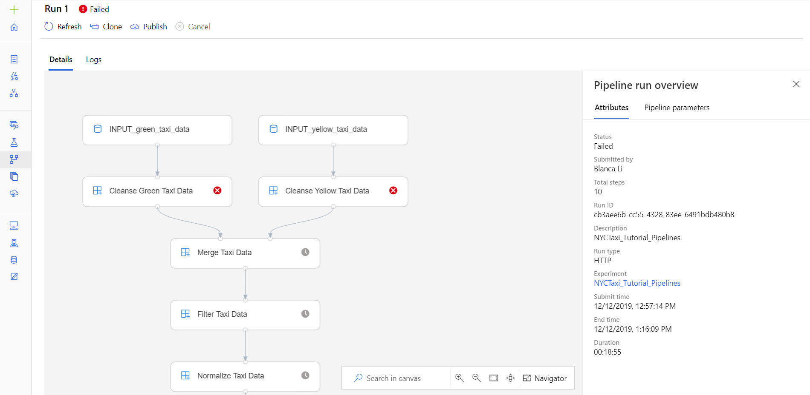
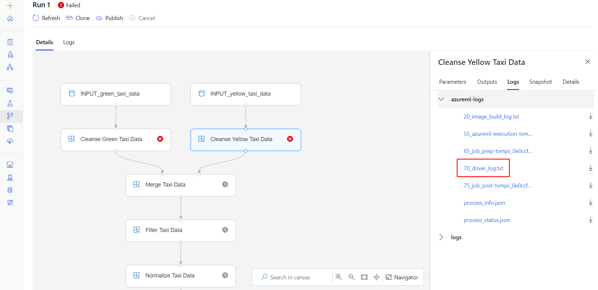
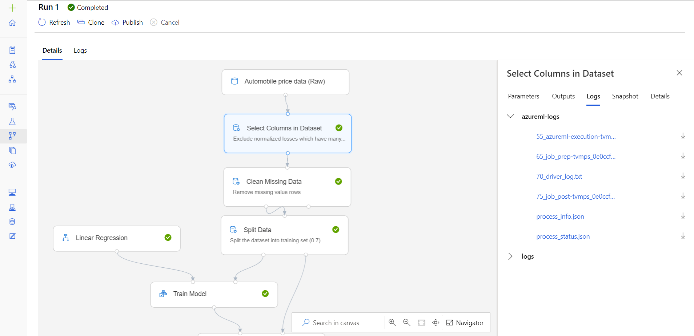

# Debug and troubleshoot machine learning pipelines
[!INCLUDE [applies-to-skus](../../includes/aml-applies-to-basic-enterprise-sku.md)]

In this article, you learn how to debug and troubleshoot [machine learning pipelines](concept-ml-pipelines.md) in the [Azure Machine Learning SDK](https://docs.microsoft.com/python/api/overview/azure/ml/intro?view=azure-ml-py) and [Azure Machine Learning designer (preview)](https://docs.microsoft.com/azure/machine-learning/concept-designer).

## Debug and troubleshoot in the Azure Machine Learning SDK
The following sections provide an overview of common pitfalls when building pipelines, and different strategies for debugging your code that's running in a pipeline. Use the following tips when you're having trouble getting a pipeline to run as expected. 
### Testing scripts locally

One of the most common failures in a pipeline is that an attached script (data cleansing script, scoring script, etc.) is not running as intended, or contains runtime errors in the remote compute context that are difficult to debug in your workspace in the Azure Machine Learning studio. 

Pipelines themselves cannot be run locally, but running the scripts in isolation on your local machine allows you to debug faster because you don’t have to wait for the compute and environment build process. Some development work is required to do this:

* If your data is in a cloud datastore, you will need to download data and make it available to your script. Using a small sample of your data is a good way to cut down on runtime and quickly get feedback on script behavior
* If you are attempting to simulate an intermediate pipeline step, you may need to manually build the object types that the particular script is expecting from the prior step
* You will also need to define your own environment, and replicate the dependencies defined in your remote compute environment

Once you have a script setup to run on your local environment, it is much easier to do debugging tasks like:

* Attaching a custom debug configuration
* Pausing execution and inspecting object-state
* Catching type or logical errors that won't be exposed until runtime

> [!TIP] 
> Once you can verify that your script is running as expected, a good next step is running the script in a single-step pipeline before 
> attempting to run it in a pipeline with multiple steps.

### Debugging scripts from remote context

Testing scripts locally is a great way to debug major code fragments and complex logic before you start building a pipeline, but at some point you will likely need to debug scripts during the actual pipeline run itself, especially when diagnosing behavior that occurs during the interaction between pipeline steps. We recommend liberal use of `print()` statements in your step scripts so that you can see object state and expected values during remote execution, similar to how you would debug JavaScript code.

The log file `70_driver_log.txt` contains: 

* All printed statements during your script's execution
* The stack trace for the script 

To find this and other log files in the portal, first click on the pipeline run in your workspace.

Navigate to the pipeline run detail page.

Click on the module for the specific step. Navigate to the **Logs** tab. Other logs include information about your environment image build process and step preparation scripts.

> [!TIP]
> Runs for *published pipelines* can be found in the **Endpoints** tab in your workspace. 
> Runs for *non-published pipelines* can be found in **Experiments** or **Pipelines**.

### Troubleshooting tips

The following table contains common problems during pipeline development, with potential solutions.

| Problem | Possible solution |
|--|--|
| Unable to pass data to `PipelineData` directory | Ensure you have created a directory in the script that corresponds to where your pipeline expects the step output data. In most cases, an input argument will define the output directory, and then you create the directory explicitly. Use `os.makedirs(args.output_dir, exist_ok=True)` to create the output directory. See the [tutorial](tutorial-pipeline-batch-scoring-classification.md#write-a-scoring-script) for a scoring script example that shows this design pattern. |
| Dependency bugs | If you have developed and tested scripts locally but find dependency issues when running on a remote compute in the pipeline, ensure your compute environment dependencies and versions match your test environment. |
| Ambiguous errors with compute targets | Deleting and re-creating compute targets can solve certain issues with compute targets. |
| Pipeline not reusing steps | Step reuse is enabled by default, but ensure you haven't disabled it in a pipeline step. If reuse is disabled, the `allow_reuse` parameter in the step will be set to `False`. |
| Pipeline is rerunning unnecessarily | To ensure that steps only rerun when their underlying data or scripts change, decouple your directories for each step. If you use the same source directory for multiple steps, you may experience unnecessary reruns. Use the `source_directory` parameter on a pipeline step object to point to your isolated directory for that step, and ensure you aren't using the same `source_directory` path for multiple steps. |

## Debug and troubleshoot in Azure Machine Learning designer (preview)

This section provides an overview of how to troubleshoot  pipelines in the designer.
For pipelines created in the designer, you can find the **log files** on either the authoring page, or in the pipeline run detail page.

### Access logs from the authoring page

When you submit a pipeline run and stay in the authoring page, you can find the log files generated for each module.

1. Select any module in the authoring canvas.
1. In the properties pane, go to the  **Logs** tab.
1. Select the log file `70_driver_log.txt`

    

### Access logs from pipeline runs

You can also find the log files of specific runs in the pipeline run detail page in either the **Pipelines** or **Experiments** sections.

1. Select a pipeline run created in the designer.
    
1. Select any module in the preview pane.
1. In the properties pane, go to the **Logs** tab.
1. Select the log file `70_driver_log.txt`

## Next steps

* See the SDK reference for help with the [azureml-pipelines-core](https://docs.microsoft.com/python/api/azureml-pipeline-core/?view=azure-ml-py) package and the [azureml-pipelines-steps](https://docs.microsoft.com/python/api/azureml-pipeline-steps/?view=azure-ml-py) package.

* See the list of [designer exceptions and error codes](algorithm-module-reference/designer-error-codes.md).
