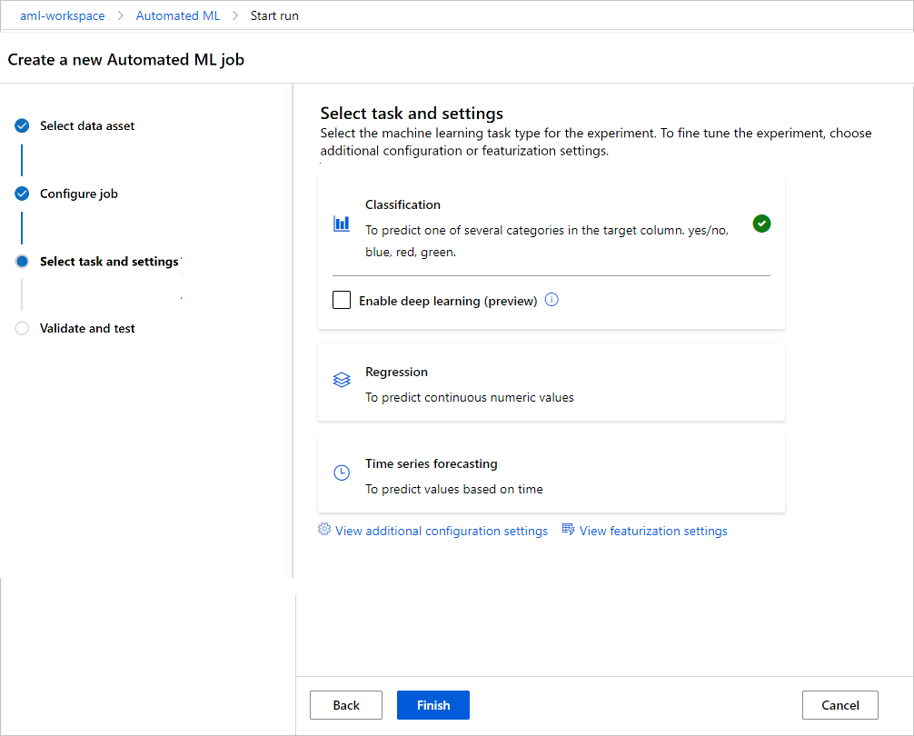

# How to define a machine learning task 
[!INCLUDE [applies-to-skus](../../includes/aml-applies-to-basic-enterprise-sku.md)]

In this article, you learn the supported machine learning tasks and how to define them for an automated machine learning (automated ML) experiment run.


## <a name="What is a machine learning task?"></a> What is a machine learning task?

A machine learning task represents the type of problem being solved by creating a predictive model. Automated ML supports three different types of tasks including classification, regression, and time series forecasting.

Task type| Description| Example
----|----|----
Classification | Task for predicting the category of a particular row in a dataset. | Fraud detection on a credit card. The target column would be **Fraud Detected** with categories of *True* or *False*. In this case, we are classifying each row in the data as either true or false.
Regression | Task for predicting a continuous quantity output. | Automobile cost based on its features, the target column would be **price**.
Forecasting |Task for making informed estimates in determining the direction of future trends.| Forecasting energy demand for them next 48 hours. The target column would be **demand** and the predicted values would be used to show patterns in the energy demand.

Automated ML supports the following algorithms during the automation and tuning process. As a user, there is no need for you to specify the algorithm.

Classification | Regression | Time Series Forecasting
-- |-- |--
[Logistic Regression](https://scikit-learn.org/stable/modules/linear_model.html#logistic-regression)| [Elastic Net](https://scikit-learn.org/stable/modules/linear_model.html#elastic-net)| [Elastic Net](https://scikit-learn.org/stable/modules/linear_model.html#elastic-net)
[Light GBM](https://lightgbm.readthedocs.io/en/latest/index.html)|[Light GBM](https://lightgbm.readthedocs.io/en/latest/index.html)|[Light GBM](https://lightgbm.readthedocs.io/en/latest/index.html)
[Gradient Boosting](https://scikit-learn.org/stable/modules/ensemble.html#classification)|[Gradient Boosting](https://scikit-learn.org/stable/modules/ensemble.html#regression)|[Gradient Boosting](https://scikit-learn.org/stable/modules/ensemble.html#regression)
[Decision Tree](https://scikit-learn.org/stable/modules/tree.html#decision-trees)|[Decision Tree](https://scikit-learn.org/stable/modules/tree.html#regression)|[Decision Tree](https://scikit-learn.org/stable/modules/tree.html#regression)
[K Nearest Neighbors](https://scikit-learn.org/stable/modules/neighbors.html#nearest-neighbors-regression)|[K Nearest Neighbors](https://scikit-learn.org/stable/modules/neighbors.html#nearest-neighbors-regression)|[K Nearest Neighbors](https://scikit-learn.org/stable/modules/neighbors.html#nearest-neighbors-regression)
[Linear SVC](https://scikit-learn.org/stable/modules/svm.html#classification)|[LARS Lasso](https://scikit-learn.org/stable/modules/linear_model.html#lars-lasso)|[LARS Lasso](https://scikit-learn.org/stable/modules/linear_model.html#lars-lasso)
[C-Support Vector Classification (SVC)](https://scikit-learn.org/stable/modules/svm.html#classification)|[Stochastic Gradient Descent (SGD)](https://scikit-learn.org/stable/modules/sgd.html#regression)|[Stochastic Gradient Descent (SGD)](https://scikit-learn.org/stable/modules/sgd.html#regression)
[Random Forest](https://scikit-learn.org/stable/modules/ensemble.html#random-forests)|[Random Forest](https://scikit-learn.org/stable/modules/ensemble.html#random-forests)|[Random Forest](https://scikit-learn.org/stable/modules/ensemble.html#random-forests)
[Extremely Randomized Trees](https://scikit-learn.org/stable/modules/ensemble.html#extremely-randomized-trees)|[Extremely Randomized Trees](https://scikit-learn.org/stable/modules/ensemble.html#extremely-randomized-trees)|[Extremely Randomized Trees](https://scikit-learn.org/stable/modules/ensemble.html#extremely-randomized-trees)
[Xgboost](https://xgboost.readthedocs.io/en/latest/parameter.html)|[Xgboost](https://xgboost.readthedocs.io/en/latest/parameter.html)| [Xgboost](https://xgboost.readthedocs.io/en/latest/parameter.html)
[DNN Classifier](https://www.tensorflow.org/api_docs/python/tf/estimator/DNNClassifier)|[DNN Regressor](https://www.tensorflow.org/api_docs/python/tf/estimator/DNNRegressor) | [DNN Regressor](https://www.tensorflow.org/api_docs/python/tf/estimator/DNNRegressor)|
[DNN Linear Classifier](https://www.tensorflow.org/api_docs/python/tf/estimator/LinearClassifier)|[Linear Regressor](https://www.tensorflow.org/api_docs/python/tf/estimator/LinearRegressor)|[Linear Regressor](https://www.tensorflow.org/api_docs/python/tf/estimator/LinearRegressor)
[Naive Bayes](https://scikit-learn.org/stable/modules/naive_bayes.html#bernoulli-naive-bayes)||
[Stochastic Gradient Descent (SGD)](https://scikit-learn.org/stable/modules/sgd.html#sgd)||


### Set the task type
You can set the task type for your automated ML experiments with the SDK or the Azure Machine Learning studio.

Use the `task` parameter in the `AutoMLConfig` constructor to specify your experiment type.

```python
from azureml.train.automl import AutoMLConfig

# task can be one of classification, regression, forecasting
automl_config = AutoMLConfig(task="classification")
```

You can set the task as part of your automated ML experiment run creation in the Azure Machine Learning studio. 

[!INCLUDE [applies-to-skus](../../includes/aml-applies-to-enterprise-sku-inline.md)]




## Next steps

+ Learn more about [automated ml](concept-automated-ml.md) in Azure Machine Learning.
+ Learn more about [auto-training a time-series forecast model](how-to-auto-train-forecast.md) in Azure Machine Learning
+ Try the [Automated Machine Learning Classification](https://github.com/Azure/MachineLearningNotebooks/blob/master/how-to-use-azureml/automated-machine-learning/classification-credit-card-fraud/auto-ml-classification-credit-card-fraud.ipynb) tutorial.
+ Try the [Automated Machine Learning Regression](https://github.com/Azure/MachineLearningNotebooks/blob/master/how-to-use-azureml/automated-machine-learning/regression-explanation-featurization/auto-ml-regression-explanation-featurization.ipynb) sample notebook.

