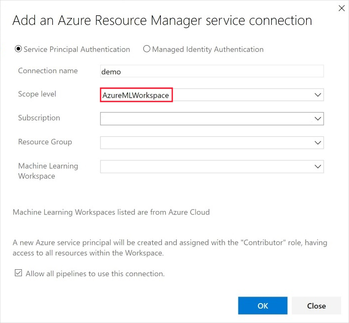
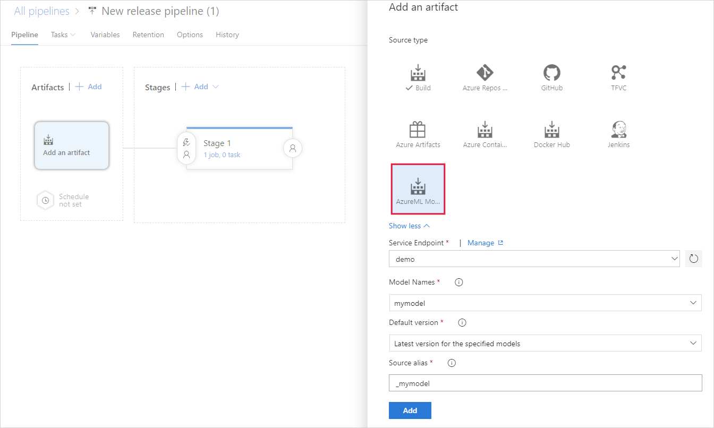

# Deploy models with Azure Machine Learning
[!INCLUDE [applies-to-skus](../../includes/aml-applies-to-basic-enterprise-sku.md)]

Learn how to deploy your machine learning model as a web service in the Azure cloud or to Azure IoT Edge devices.

The workflow is similar no matter [where you deploy](#target) your model:

1. Register the model.
1. Prepare to deploy. (Specify assets, usage, compute target.)
1. Deploy the model to the compute target.
1. Test the deployed model, also called a web service.

For more information on the concepts involved in the deployment workflow, see [Manage, deploy, and monitor models with Azure Machine Learning](concept-model-management-and-deployment.md).

## Prerequisites

- An Azure Machine Learning workspace. For more information, see [Create an Azure Machine Learning workspace](how-to-manage-workspace.md).

- A model. If you don't have a trained model, you can use the model and dependency files provided in [this tutorial](https://aka.ms/azml-deploy-cloud).

- The [Azure CLI extension for the Machine Learning service](reference-azure-machine-learning-cli.md), the [Azure Machine Learning SDK for Python](https://docs.microsoft.com/python/api/overview/azure/ml/intro?view=azure-ml-py), or the [Azure Machine Learning Visual Studio Code extension](tutorial-setup-vscode-extension.md).

## Connect to your workspace

The following code shows how to connect to an Azure Machine Learning workspace by using information cached to the local development environment:

+ **Using the SDK**

   ```python
   from azureml.core import Workspace
   ws = Workspace.from_config(path=".file-path/ws_config.json")
   ```

  For more information on using the SDK to connect to a workspace, see the [Azure Machine Learning SDK for Python](https://docs.microsoft.com/python/api/overview/azure/ml/intro?view=azure-ml-py#workspace) documentation.

+ **Using the CLI**

   When using the CLI, use the `-w` or `--workspace-name` parameter to specify the workspace for the command.

+ **Using Visual Studio Code**

   When you use Visual Studio Code, you select the workspace by using a graphical interface. For more information, see [Deploy and manage models](tutorial-train-deploy-image-classification-model-vscode.md#deploy-the-model) in the Visual Studio Code extension documentation.

## <a id="registermodel"></a> Register your model

A registered model is a logical container for one or more files that make up your model. For example, if you have a model that's stored in multiple files, you can register them as a single model in the workspace. After you register the files, you can then download or deploy the registered model and receive all the files that you registered.

> [!TIP]
> When you register a model, you provide the path of either a cloud location (from a training run) or a local directory. This path is just to locate the files for upload as part of the registration process. It doesn't need to match the path used in the entry script. For more information, see [Locate model files in your entry script](#load-model-files-in-your-entry-script).

Machine learning models are registered in your Azure Machine Learning workspace. The model can come from Azure Machine Learning or from somewhere else. When registering a model, you can optionally provide metadata about the model. The `tags` and `properties` dictionaries that you apply to a model registration can then be used to filter models.

The following examples demonstrate how to register a model.

### Register a model from an experiment run

The code snippets in this section demonstrate how to register a model from a training run:

> [!IMPORTANT]
> To use these snippets, you need to have previously performed a training run and you need to have access to the `Run` object (SDK example) or the run ID value (CLI example). For more information on training models, see [Set up compute targets for model training](how-to-set-up-training-targets.md).

+ **Using the SDK**

  When you use the SDK to train a model, you can receive either a [Run](https://docs.microsoft.com/python/api/azureml-core/azureml.core.run.run?view=azure-ml-py) object or an [AutoMLRun](/python/api/azureml-train-automl-client/azureml.train.automl.run.automlrun) object, depending on how you trained the model. Each object can be used to register a model created by an experiment run.

  + Register a model from an `azureml.core.Run` object:
 
    ```python
    model = run.register_model(model_name='sklearn_mnist',
                               tags={'area': 'mnist'},
                               model_path='outputs/sklearn_mnist_model.pkl')
    print(model.name, model.id, model.version, sep='\t')
    ```

    The `model_path` parameter refers to the cloud location of the model. In this example, the path of a single file is used. To include multiple files in the model registration, set `model_path` to the path of a folder that contains the files. For more information, see the [Run.register_model](https://docs.microsoft.com/python/api/azureml-core/azureml.core.run.run?view=azure-ml-py#register-model-model-name--model-path-none--tags-none--properties-none--model-framework-none--model-framework-version-none--description-none--datasets-none--sample-input-dataset-none--sample-output-dataset-none--resource-configuration-none----kwargs-) documentation.

  + Register a model from an `azureml.train.automl.run.AutoMLRun` object:

    ```python
        description = 'My AutoML Model'
        model = run.register_model(description = description,
                                   tags={'area': 'mnist'})

        print(run.model_id)
    ```

    In this example, the `metric` and `iteration` parameters aren't specified, so the iteration with the best primary metric will be registered. The `model_id` value returned from the run is used instead of a model name.

    For more information, see the [AutoMLRun.register_model](/python/api/azureml-train-automl-client/azureml.train.automl.run.automlrun#register-model-model-name-none--description-none--tags-none--iteration-none--metric-none-) documentation.

+ **Using the CLI**

  ```azurecli-interactive
  az ml model register -n sklearn_mnist  --asset-path outputs/sklearn_mnist_model.pkl  --experiment-name myexperiment --run-id myrunid --tag area=mnist
  ```

  [!INCLUDE [install extension](../../includes/machine-learning-service-install-extension.md)]

  The `--asset-path` parameter refers to the cloud location of the model. In this example, the path of a single file is used. To include multiple files in the model registration, set `--asset-path` to the path of a folder that contains the files.

+ **Using Visual Studio Code**

  Register models using any model files or folders by using the [Visual Studio Code](tutorial-train-deploy-image-classification-model-vscode.md#deploy-the-model) extension.

### Register a model from a local file

You can register a model by providing the local path of the model. You can provide the path of either a folder or a single file. You can use this method to register models trained with Azure Machine Learning and then downloaded. You can also use this method to register models trained outside of Azure Machine Learning.

[!INCLUDE [trusted models](../../includes/machine-learning-service-trusted-model.md)]

+ **Using the SDK and ONNX**

    ```python
    import os
    import urllib.request
    from azureml.core.model import Model
    # Download model
    onnx_model_url = "https://www.cntk.ai/OnnxModels/mnist/opset_7/mnist.tar.gz"
    urllib.request.urlretrieve(onnx_model_url, filename="mnist.tar.gz")
    os.system('tar xvzf mnist.tar.gz')
    # Register model
    model = Model.register(workspace = ws,
                            model_path ="mnist/model.onnx",
                            model_name = "onnx_mnist",
                            tags = {"onnx": "demo"},
                            description = "MNIST image classification CNN from ONNX Model Zoo",)
    ```

  To include multiple files in the model registration, set `model_path` to the path of a folder that contains the files.

+ **Using the CLI**

  ```azurecli-interactive
  az ml model register -n onnx_mnist -p mnist/model.onnx
  ```

  To include multiple files in the model registration, set `-p` to the path of a folder that contains the files.

**Time estimate**: Approximately 10 seconds.

For more information, see the documentation for the [Model class](https://docs.microsoft.com/python/api/azureml-core/azureml.core.model.model?view=azure-ml-py).

For more information on working with models trained outside Azure Machine Learning, see [How to deploy an existing model](how-to-deploy-existing-model.md).

<a name="target"></a>

## Single versus multi-model endpoints
Azure ML supports deploying single or multiple models behind a single endpoint.

Multi-model endpoints use a shared container to host multiple models. This helps to reduce overhead costs, improves utilization, and enables you to chain modules together into ensembles. Models you specify in your deployment script are mounted and made available on the disk of the serving container - you can load them into memory on demand and score based on the specific model being requested at scoring time.

For an E2E example, which shows how to use multiple models behind a single containerized endpoint, see [this example](https://github.com/Azure/MachineLearningNotebooks/tree/master/how-to-use-azureml/deployment/deploy-multi-model)

## Prepare to deploy

To deploy the model as a service, you need the following components:

* **Define inference environment**. This environment encapsulates the dependencies required to run your model for inference.
* **Define scoring code**. This script accepts requests, scores the requests by using the model, and returns the results.
* **Define inference configuration**. The inference configuration specifies the environment configuration, entry script, and other components needed to run the model as a service.

Once you have the necessary components, you can profile the service that will be created as a result of deploying your model to understand its CPU and memory requirements.

### 1. Define inference environment

An inference configuration describes how to set up the web-service containing your model. It's used later, when you deploy the model.

Inference configuration uses Azure Machine Learning environments to define the software dependencies needed for your deployment. Environments allow you to create, manage, and reuse the software dependencies required for training and deployment. You can create an environment from custom dependency files or use one of the curated Azure Machine Learning environments. The following YAML is an example of a Conda dependencies file for inference. Note that you must indicate azureml-defaults with verion >= 1.0.45 as a pip dependency, because it contains the functionality needed to host the model as a web service. If you want to use automatic schema generation, your entry script must also import the `inference-schema` packages.

```YAML
name: project_environment
dependencies:
  - python=3.6.2
  - scikit-learn=0.20.0
  - pip:
      # You must list azureml-defaults as a pip dependency
    - azureml-defaults>=1.0.45
    - inference-schema[numpy-support]
```

> [!IMPORTANT]
> If your dependency is available through both Conda and pip (from PyPi), Microsoft recommends using the Conda version, as Conda packages typically come with pre-built binaries that make installation more reliable.
>
> For more information, see [Understanding Conda and Pip](https://www.anaconda.com/understanding-conda-and-pip/).
>
> To check if your dependency is available through Conda, use the `conda search <package-name>` command, or use the package indexes at [https://anaconda.org/anaconda/repo](https://anaconda.org/anaconda/repo) and [https://anaconda.org/conda-forge/repo](https://anaconda.org/conda-forge/repo).

You can use the dependencies file to create an environment object and save it to your workspace for future use:

```python
from azureml.core.environment import Environment
myenv = Environment.from_conda_specification(name = 'myenv',
                                             file_path = 'path-to-conda-specification-file'
myenv.register(workspace=ws)
```

### <a id="script"></a> 2. Define scoring code

The entry script receives data submitted to a deployed web service and passes it to the model. It then takes the response returned by the model and returns that to the client. *The script is specific to your model*. It must understand the data that the model expects and returns.

The script contains two functions that load and run the model:

* `init()`: Typically, this function loads the model into a global object. This function is run only once, when the Docker container for your web service is started.

* `run(input_data)`: This function uses the model to predict a value based on the input data. Inputs and outputs of the run typically use JSON for serialization and deserialization. You can also work with raw binary data. You can transform the data before sending it to the model or before returning it to the client.

#### Load model files in your entry script

There are two ways to locate models in your entry script:
* `AZUREML_MODEL_DIR`: An environment variable containing the path to the model location.
* `Model.get_model_path`: An API that returns the path to model file using the registered model name.

##### AZUREML_MODEL_DIR

AZUREML_MODEL_DIR is an environment variable created during service deployment. You can use this environment variable to find the location of the deployed model(s).

The following table describes the value of AZUREML_MODEL_DIR depending on the number of models deployed:

| Deployment | Environment variable value |
| ----- | ----- |
| Single model | The path to the folder containing the model. |
| Multiple models | The path to the folder containing all models. Models are located by name and version in this folder (`$MODEL_NAME/$VERSION`) |

During model registration and deployment, Models are placed in the AZUREML_MODEL_DIR path, and their original filenames are preserved.

To get the path to a model file in your entry script, combine the environment variable with the file path you're looking for.

**Single model example**
```python
# Example when the model is a file
model_path = os.path.join(os.getenv('AZUREML_MODEL_DIR'), 'sklearn_regression_model.pkl')

# Example when the model is a folder containing a file
file_path = os.path.join(os.getenv('AZUREML_MODEL_DIR'), 'my_model_folder', 'sklearn_regression_model.pkl')
```

**Multiple model example**

In this scenario, two models are registered with the workspace:

* `my_first_model`: Contains one file (`my_first_model.pkl`) and there is only one version (`1`).
* `my_second_model`: Contains one file (`my_second_model.pkl`) and there are two versions; `1` and `2`.

When the service was deployed, both models are provided in the deploy operation:

```python
first_model = Model(ws, name="my_first_model", version=1)
second_model = Model(ws, name="my_second_model", version=2)
service = Model.deploy(ws, "myservice", [first_model, second_model], inference_config, deployment_config)
```

In the Docker image that hosts the service, the `AZUREML_MODEL_DIR` environment variable contains the directory where the models are located.
In this directory, each of the models is located in a directory path of `MODEL_NAME/VERSION`. Where `MODEL_NAME` is the name of the registered model, and `VERSION` is the version of the model. The files that make up the registered model are stored in these directories.

In this example, the paths would be `$AZUREML_MODEL_DIR/my_first_model/1/my_first_model.pkl` and `$AZUREML_MODEL_DIR/my_second_model/2/my_second_model.pkl`.


```python
# Example when the model is a file, and the deployment contains multiple models
first_model_name = 'my_first_model'
first_model_version = '1'
first_model_path = os.path.join(os.getenv('AZUREML_MODEL_DIR'), first_model_name, first_model_version, 'my_first_model.pkl')
second_model_name = 'my_second_model'
second_model_version = '2'
second_model_path = os.path.join(os.getenv('AZUREML_MODEL_DIR'), second_model_name, second_model_version, 'my_second_model.pkl')
```

##### get_model_path

When you register a model, you provide a model name that's used for managing the model in the registry. You use this name with the [Model.get_model_path()](https://docs.microsoft.com/python/api/azureml-core/azureml.core.model.model?view=azure-ml-py#get-model-path-model-name--version-none---workspace-none-) method to retrieve the path of the model file or files on the local file system. If you register a folder or a collection of files, this API returns the path of the directory that contains those files.

When you register a model, you give it a name. The name corresponds to where the model is placed, either locally or during service deployment.

#### (Optional) Define model web service schema

To automatically generate a schema for your web service, provide a sample of the input and/or output in the constructor for one of the defined type objects. The type and sample are used to automatically create the schema. Azure Machine Learning then creates an [OpenAPI](https://swagger.io/docs/specification/about/) (Swagger) specification for the web service during deployment.

These types are currently supported:

* `pandas`
* `numpy`
* `pyspark`
* Standard Python object

To use schema generation, include the open-source `inference-schema` package in your dependencies file. For more information on this package, see [https://github.com/Azure/InferenceSchema](https://github.com/Azure/InferenceSchema). Define the input and output sample formats in the `input_sample` and `output_sample` variables, which represent the request and response formats for the web service. Use these samples in the input and output function decorators on the `run()` function. The following scikit-learn example uses schema generation.

##### Example entry script

The following example demonstrates how to accept and return JSON data:

```python
#Example: scikit-learn and Swagger
import json
import numpy as np
import os
from sklearn.externals import joblib
from sklearn.linear_model import Ridge

from inference_schema.schema_decorators import input_schema, output_schema
from inference_schema.parameter_types.numpy_parameter_type import NumpyParameterType


def init():
    global model
    # AZUREML_MODEL_DIR is an environment variable created during deployment. Join this path with the filename of the model file.
    # It holds the path to the directory that contains the deployed model (./azureml-models/$MODEL_NAME/$VERSION).
    # If there are multiple models, this value is the path to the directory containing all deployed models (./azureml-models).
    # Alternatively: model_path = Model.get_model_path('sklearn_mnist')
    model_path = os.path.join(os.getenv('AZUREML_MODEL_DIR'), 'sklearn_mnist_model.pkl')
    # Deserialize the model file back into a sklearn model
    model = joblib.load(model_path)


input_sample = np.array([[10, 9, 8, 7, 6, 5, 4, 3, 2, 1]])
output_sample = np.array([3726.995])


@input_schema('data', NumpyParameterType(input_sample))
@output_schema(NumpyParameterType(output_sample))
def run(data):
    try:
        result = model.predict(data)
        # You can return any data type, as long as it is JSON serializable.
        return result.tolist()
    except Exception as e:
        error = str(e)
        return error
```

##### Power BI compatible endpoint 

The following example demonstrates how to define the input data as a `<key: value>` dictionary by using a DataFrame. This method is supported for consuming the deployed web service from Power BI. ([Learn more about how to consume the web service from Power BI](https://docs.microsoft.com/power-bi/service-machine-learning-integration).)

```python
import json
import pickle
import numpy as np
import pandas as pd
import azureml.train.automl
from sklearn.externals import joblib
from azureml.core.model import Model

from inference_schema.schema_decorators import input_schema, output_schema
from inference_schema.parameter_types.numpy_parameter_type import NumpyParameterType
from inference_schema.parameter_types.pandas_parameter_type import PandasParameterType


def init():
    global model
    # Replace filename if needed.
    model_path = os.path.join(os.getenv('AZUREML_MODEL_DIR'), 'model_file.pkl')
    # Deserialize the model file back into a sklearn model.
    model = joblib.load(model_path)


input_sample = pd.DataFrame(data=[{
    # This is a decimal type sample. Use the data type that reflects this column in your data.
    "input_name_1": 5.1,
    # This is a string type sample. Use the data type that reflects this column in your data.
    "input_name_2": "value2",
    # This is an integer type sample. Use the data type that reflects this column in your data.
    "input_name_3": 3
}])

# This is an integer type sample. Use the data type that reflects the expected result.
output_sample = np.array([0])

# To indicate that we support a variable length of data input,
# set enforce_shape=False
@input_schema('data', PandasParameterType(input_sample, enforce_shape=False))
@output_schema(NumpyParameterType(output_sample))
def run(data):
    try:
        result = model.predict(data)
        # You can return any data type, as long as it is JSON serializable.
        return result.tolist()
    except Exception as e:
        error = str(e)
        return error
```

For more examples, see the following scripts:

* [PyTorch](https://github.com/Azure/MachineLearningNotebooks/tree/master/how-to-use-azureml/ml-frameworks/pytorch)
* [TensorFlow](https://github.com/Azure/MachineLearningNotebooks/tree/master/how-to-use-azureml/ml-frameworks/tensorflow)
* [Keras](https://github.com/Azure/MachineLearningNotebooks/tree/master/how-to-use-azureml/training-with-deep-learning/train-hyperparameter-tune-deploy-with-keras)
* [AutoML](https://github.com/Azure/MachineLearningNotebooks/tree/master/how-to-use-azureml/automated-machine-learning/classification-bank-marketing-all-features)
* [ONNX](https://github.com/Azure/MachineLearningNotebooks/blob/master/how-to-use-azureml/deployment/onnx/)
* [Binary Data](#binary)
* [CORS](#cors)

### <a id="script"></a> 3. Define inference configuration
    
The following example demonstrates loading an environment from your workspace and then using it with the inference configuration:

```python
from azureml.core.environment import Environment
from azureml.core.model import InferenceConfig


myenv = Environment.get(workspace=ws, name='myenv', version='1')
inference_config = InferenceConfig(entry_script='path-to-score.py',
                                   environment=myenv)
```

For more information on environments, see [Create and manage environments for training and deployment](how-to-use-environments.md).

For more information on inference configuration, see the [InferenceConfig](https://docs.microsoft.com/python/api/azureml-core/azureml.core.model.inferenceconfig?view=azure-ml-py) class documentation.

For information on using a custom Docker image with an inference configuration, see [How to deploy a model using a custom Docker image](how-to-deploy-custom-docker-image.md).

#### CLI example of InferenceConfig

[!INCLUDE [inference config](../../includes/machine-learning-service-inference-config.md)]

The following command demonstrates how to deploy a model by using the CLI:

```azurecli-interactive
az ml model deploy -n myservice -m mymodel:1 --ic inferenceconfig.json
```

In this example, the configuration specifies the following settings:

* That the model requires Python.
* The [entry script](#script), which is used to handle web requests sent to the deployed service.
* The Conda file that describes the Python packages needed for inference.

For information on using a custom Docker image with an inference configuration, see [How to deploy a model using a custom Docker image](how-to-deploy-custom-docker-image.md).

### <a id="profilemodel"></a> 4. (Optional) Profile your model to determine resource utilization

Once you have registered your model and prepared the other components necessary for its deployment, you can determine the CPU and memory the deployed service will need. Profiling tests the service that runs your model and returns information such as the CPU usage, memory usage, and response latency. It also provides a recommendation for the CPU and memory based on resource usage.

In order to profile your model, you will need:
* A registered model.
* An inference configuration based on your entry script and inference environment definition.
* A single column tabular dataset, where each row contains a string representing sample request data.

> [!IMPORTANT]
> At this point we only support profiling of services that expect their request data to be a string, for example: string serialized json, text, string serialized image, etc. The content of each row of the dataset (string) will be put into the body of the HTTP request and sent to the service encapsulating the model for scoring.

Below is an example of how you can construct an input dataset to profile a service that expects its incoming request data to contain serialized json. In this case, we created a dataset based one hundred instances of the same request data content. In real world scenarios we suggest that you use larger datasets containing various inputs, especially if your model resource usage/behavior is input dependent.

```python
import json
from azureml.core import Datastore
from azureml.core.dataset import Dataset
from azureml.data import dataset_type_definitions

input_json = {'data': [[1, 2, 3, 4, 5, 6, 7, 8, 9, 10],
                       [10, 9, 8, 7, 6, 5, 4, 3, 2, 1]]}
# create a string that can be utf-8 encoded and
# put in the body of the request
serialized_input_json = json.dumps(input_json)
dataset_content = []
for i in range(100):
    dataset_content.append(serialized_input_json)
dataset_content = '\n'.join(dataset_content)
file_name = 'sample_request_data.txt'
f = open(file_name, 'w')
f.write(dataset_content)
f.close()

# upload the txt file created above to the Datastore and create a dataset from it
data_store = Datastore.get_default(ws)
data_store.upload_files(['./' + file_name], target_path='sample_request_data')
datastore_path = [(data_store, 'sample_request_data' +'/' + file_name)]
sample_request_data = Dataset.Tabular.from_delimited_files(
    datastore_path, separator='\n',
    infer_column_types=True,
    header=dataset_type_definitions.PromoteHeadersBehavior.NO_HEADERS)
sample_request_data = sample_request_data.register(workspace=ws,
                                                   name='sample_request_data',
                                                   create_new_version=True)
```

Once you have the dataset containing sample request data ready, create an inference configuration. Inference configuration is based on the score.py and the environment definition. The following example demonstrates how to create the inference configuration and run profiling:

```python
from azureml.core.model import InferenceConfig, Model
from azureml.core.dataset import Dataset


model = Model(ws, id=model_id)
inference_config = InferenceConfig(entry_script='path-to-score.py',
                                   environment=myenv)
input_dataset = Dataset.get_by_name(workspace=ws, name='sample_request_data')
profile = Model.profile(ws,
            'unique_name',
            [model],
            inference_config,
            input_dataset=input_dataset)

profile.wait_for_completion(True)

# see the result
details = profile.get_details()
```

The following command demonstrates how to profile a model by using the CLI:

```azurecli-interactive
az ml model profile -g <resource-group-name> -w <workspace-name> --inference-config-file <path-to-inf-config.json> -m <model-id> --idi <input-dataset-id> -n <unique-name>
```

> [!TIP]
> To persist the information returned by profiling, use tags or properties for the model. Using tags or properties stores the data with the model in the model registry. The following examples demonstrate adding a new tag containing the `requestedCpu` and `requestedMemoryInGb` information:
>
> ```python
> model.add_tags({'requestedCpu': details['requestedCpu'],
>                 'requestedMemoryInGb': details['requestedMemoryInGb']})
> ```
>
> ```azurecli-interactive
> az ml model profile -g <resource-group-name> -w <workspace-name> --i <model-id> --add-tag requestedCpu=1 --add-tag requestedMemoryInGb=0.5
> ```

## Deploy to target

Deployment uses the inference configuration deployment configuration to deploy the models. The deployment process is similar regardless of the compute target. Deploying to AKS is slightly different because you must provide a reference to the AKS cluster.

### Choose a compute target

You can use the following compute targets, or compute resources, to host your web service deployment:

[!INCLUDE [aml-compute-target-deploy](../../includes/aml-compute-target-deploy.md)]

### Define your deployment configuration

Before deploying your model, you must define the deployment configuration. *The deployment configuration is specific to the compute target that will host the web service.* For example, when you deploy a model locally, you must specify the port where the service accepts requests. The deployment configuration isn't part of your entry script. It's used to define the characteristics of the compute target that will host the model and entry script.

You might also need to create the compute resource, if, for example, you don't already have an Azure Kubernetes Service (AKS) instance associated with your workspace.

The following table provides an example of creating a deployment configuration for each compute target:

| Compute target | Deployment configuration example |
| ----- | ----- |
| Local | `deployment_config = LocalWebservice.deploy_configuration(port=8890)` |
| Azure Container Instances | `deployment_config = AciWebservice.deploy_configuration(cpu_cores = 1, memory_gb = 1)` |
| Azure Kubernetes Service | `deployment_config = AksWebservice.deploy_configuration(cpu_cores = 1, memory_gb = 1)` |

The classes for local, Azure Container Instances, and AKS web services can be imported from `azureml.core.webservice`:

```python
from azureml.core.webservice import AciWebservice, AksWebservice, LocalWebservice
```

### Securing deployments with TLS

For more information on how to secure a web service deployment, see [Enable TLS and deploy](how-to-secure-web-service.md#enable).

### <a id="local"></a> Local deployment

To deploy a model locally, you need to have Docker installed on your local machine.

#### Using the SDK

```python
from azureml.core.webservice import LocalWebservice, Webservice

deployment_config = LocalWebservice.deploy_configuration(port=8890)
service = Model.deploy(ws, "myservice", [model], inference_config, deployment_config)
service.wait_for_deployment(show_output = True)
print(service.state)
```

For more information, see the documentation for [LocalWebservice](https://docs.microsoft.com/python/api/azureml-core/azureml.core.webservice.local.localwebservice?view=azure-ml-py), [Model.deploy()](https://docs.microsoft.com/python/api/azureml-core/azureml.core.model.model?view=azure-ml-py#deploy-workspace--name--models--inference-config-none--deployment-config-none--deployment-target-none--overwrite-false-), and [Webservice](https://docs.microsoft.com/python/api/azureml-core/azureml.core.webservice.webservice?view=azure-ml-py).

#### Using the CLI

To deploy a model by using the CLI, use the following command. Replace `mymodel:1` with the name and version of the registered model:

```azurecli-interactive
az ml model deploy -m mymodel:1 --ic inferenceconfig.json --dc deploymentconfig.json
```

[!INCLUDE [aml-local-deploy-config](../../includes/machine-learning-service-local-deploy-config.md)]

For more information, see the [az ml model deploy](https://docs.microsoft.com/cli/azure/ext/azure-cli-ml/ml/model?view=azure-cli-latest#ext-azure-cli-ml-az-ml-model-deploy) documentation.

### Understanding service state

During model deployment, you may see the service state change while it fully deploys.

The following table describes the different service states:

| Webservice state | Description | Final state?
| ----- | ----- | ----- |
| Transitioning | The service is in the process of deployment. | No |
| Unhealthy | The service has deployed but is currently unreachable.  | No |
| Unschedulable | The service cannot be deployed at this time due to lack of resources. | No |
| Failed | The service has failed to deploy due to an error or crash. | Yes |
| Healthy | The service is healthy and the endpoint is available. | Yes |

### <a id="notebookvm"></a> Compute instance web service (dev/test)

See [Deploy a model to Azure Machine Learning compute instance](how-to-deploy-local-container-notebook-vm.md).

### <a id="aci"></a> Azure Container Instances (dev/test)

See [Deploy to Azure Container Instances](how-to-deploy-azure-container-instance.md).

### <a id="aks"></a>Azure Kubernetes Service (dev/test and production)

See [Deploy to Azure Kubernetes Service](how-to-deploy-azure-kubernetes-service.md).

### A/B Testing (controlled rollout)
See [Controlled rollout of ML models](how-to-deploy-azure-kubernetes-service.md#deploy-models-to-aks-using-controlled-rollout-preview) for more information.

## Consume web services

Every deployed web service provides a REST endpoint, so you can create client applications in any programming language.
If you've enabled key-based authentication for your service, you need to provide a service key as a token in your request header.
If you've enabled token-based authentication for your service, you need to provide an Azure Machine Learning JSON Web Token (JWT) as a bearer token in your request header. 

The primary difference is that **keys are static and can be regenerated manually**, and **tokens need to be refreshed upon expiration**. Key-based auth is supported for Azure Container Instance and Azure Kubernetes Service deployed web-services, and token-based auth is **only** available for Azure Kubernetes Service deployments. See the [how-to](how-to-setup-authentication.md#web-service-authentication) on authentication for more information and specific code samples.

> [!TIP]
> You can retrieve the schema JSON document after you deploy the service. Use the [swagger_uri property](https://docs.microsoft.com/python/api/azureml-core/azureml.core.webservice.local.localwebservice?view=azure-ml-py#swagger-uri) from the deployed web service (for example, `service.swagger_uri`) to get the URI to the local web service's Swagger file.

### Request-response consumption

Here's an example of how to invoke your service in Python:
```python
import requests
import json

headers = {'Content-Type': 'application/json'}

if service.auth_enabled:
    headers['Authorization'] = 'Bearer '+service.get_keys()[0]
elif service.token_auth_enabled:
    headers['Authorization'] = 'Bearer '+service.get_token()[0]

print(headers)

test_sample = json.dumps({'data': [
    [1, 2, 3, 4, 5, 6, 7, 8, 9, 10],
    [10, 9, 8, 7, 6, 5, 4, 3, 2, 1]
]})

response = requests.post(
    service.scoring_uri, data=test_sample, headers=headers)
print(response.status_code)
print(response.elapsed)
print(response.json())
```

For more information, see [Create client applications to consume web services](how-to-consume-web-service.md).

### Web service schema (OpenAPI specification)

If you used automatic schema generation with your deployment, you can get the address of the OpenAPI specification for the service by using the [swagger_uri property](https://docs.microsoft.com/python/api/azureml-core/azureml.core.webservice.local.localwebservice?view=azure-ml-py#swagger-uri). (For example, `print(service.swagger_uri)`.) Use a GET request or open the URI in a browser to retrieve the specification.

The following JSON document is an example of a schema (OpenAPI specification) generated for a deployment:

```json
{
    "swagger": "2.0",
    "info": {
        "title": "myservice",
        "description": "API specification for Azure Machine Learning myservice",
        "version": "1.0"
    },
    "schemes": [
        "https"
    ],
    "consumes": [
        "application/json"
    ],
    "produces": [
        "application/json"
    ],
    "securityDefinitions": {
        "Bearer": {
            "type": "apiKey",
            "name": "Authorization",
            "in": "header",
            "description": "For example: Bearer abc123"
        }
    },
    "paths": {
        "/": {
            "get": {
                "operationId": "ServiceHealthCheck",
                "description": "Simple health check endpoint to ensure the service is up at any given point.",
                "responses": {
                    "200": {
                        "description": "If service is up and running, this response will be returned with the content 'Healthy'",
                        "schema": {
                            "type": "string"
                        },
                        "examples": {
                            "application/json": "Healthy"
                        }
                    },
                    "default": {
                        "description": "The service failed to execute due to an error.",
                        "schema": {
                            "$ref": "#/definitions/ErrorResponse"
                        }
                    }
                }
            }
        },
        "/score": {
            "post": {
                "operationId": "RunMLService",
                "description": "Run web service's model and get the prediction output",
                "security": [
                    {
                        "Bearer": []
                    }
                ],
                "parameters": [
                    {
                        "name": "serviceInputPayload",
                        "in": "body",
                        "description": "The input payload for executing the real-time machine learning service.",
                        "schema": {
                            "$ref": "#/definitions/ServiceInput"
                        }
                    }
                ],
                "responses": {
                    "200": {
                        "description": "The service processed the input correctly and provided a result prediction, if applicable.",
                        "schema": {
                            "$ref": "#/definitions/ServiceOutput"
                        }
                    },
                    "default": {
                        "description": "The service failed to execute due to an error.",
                        "schema": {
                            "$ref": "#/definitions/ErrorResponse"
                        }
                    }
                }
            }
        }
    },
    "definitions": {
        "ServiceInput": {
            "type": "object",
            "properties": {
                "data": {
                    "type": "array",
                    "items": {
                        "type": "array",
                        "items": {
                            "type": "integer",
                            "format": "int64"
                        }
                    }
                }
            },
            "example": {
                "data": [
                    [ 10, 9, 8, 7, 6, 5, 4, 3, 2, 1 ]
                ]
            }
        },
        "ServiceOutput": {
            "type": "array",
            "items": {
                "type": "number",
                "format": "double"
            },
            "example": [
                3726.995
            ]
        },
        "ErrorResponse": {
            "type": "object",
            "properties": {
                "status_code": {
                    "type": "integer",
                    "format": "int32"
                },
                "message": {
                    "type": "string"
                }
            }
        }
    }
}
```

For more information, see [OpenAPI specification](https://swagger.io/specification/).

For a utility that can create client libraries from the specification, see [swagger-codegen](https://github.com/swagger-api/swagger-codegen).

### <a id="azuremlcompute"></a> Batch inference
Azure Machine Learning Compute targets are created and managed by Azure Machine Learning. They can be used for batch prediction from Azure Machine Learning pipelines.

For a walkthrough of batch inference with Azure Machine Learning Compute, see [How to run batch predictions](tutorial-pipeline-batch-scoring-classification.md).

### <a id="iotedge"></a> IoT Edge inference
Support for deploying to the edge is in preview. For more information, see [Deploy Azure Machine Learning as an IoT Edge module](https://docs.microsoft.com/azure/iot-edge/tutorial-deploy-machine-learning).


## <a id="update"></a> Update web services

[!INCLUDE [aml-update-web-service](../../includes/machine-learning-update-web-service.md)]

## Continuously deploy models

You can continuously deploy models by using the Machine Learning extension for [Azure DevOps](https://azure.microsoft.com/services/devops/). You can use the Machine Learning extension for Azure DevOps to trigger a deployment pipeline when a new machine learning model is registered in an Azure Machine Learning workspace.

1. Sign up for [Azure Pipelines](https://docs.microsoft.com/azure/devops/pipelines/get-started/pipelines-sign-up?view=azure-devops), which makes continuous integration and delivery of your application to any platform or cloud possible. (Note that Azure Pipelines isn't the same as [Machine Learning pipelines](concept-ml-pipelines.md#compare).)

1. [Create an Azure DevOps project.](https://docs.microsoft.com/azure/devops/organizations/projects/create-project?view=azure-devops)

1. Install the [Machine Learning extension for Azure Pipelines](https://marketplace.visualstudio.com/items?itemName=ms-air-aiagility.vss-services-azureml&targetId=6756afbe-7032-4a36-9cb6-2771710cadc2&utm_source=vstsproduct&utm_medium=ExtHubManageList).

1. Use service connections to set up a service principal connection to your Azure Machine Learning workspace so you can access your artifacts. Go to project settings, select **Service connections**, and then select **Azure Resource Manager**:

    [](media/how-to-deploy-and-where/view-service-connection-expanded.png)

1. In the **Scope level** list, select **AzureMLWorkspace**, and then enter the rest of the values:

    

1. To continuously deploy your machine learning model by using Azure Pipelines, under pipelines, select **release**. Add a new artifact, and then select the **AzureML Model** artifact and the service connection that you created earlier. Select the model and version to trigger a deployment:

    [](media/how-to-deploy-and-where/enable-modeltrigger-artifact-expanded.png)

1. Enable the model trigger on your model artifact. When you turn on the trigger, every time the specified version (that is, the newest version) of that model is registered in your workspace, an Azure DevOps release pipeline is triggered.

    [](media/how-to-deploy-and-where/set-modeltrigger-expanded.png)

For more sample projects and examples, see these sample repos in GitHub:

* [Microsoft/MLOps](https://github.com/Microsoft/MLOps)
* [Microsoft/MLOpsPython](https://github.com/microsoft/MLOpsPython)

## Download a model
If you want to download your model to use it in your own execution environment, you can do so with the following SDK / CLI commands:

SDK:
```python
model_path = Model(ws,'mymodel').download()
```

CLI:
```azurecli-interactive
az ml model download --model-id mymodel:1 --target-dir model_folder
```

## (Preview) No-code model deployment

No-code model deployment is currently in preview and supports the following machine learning frameworks:

### Tensorflow SavedModel format
Tensorflow models need to be registered in **SavedModel format** to work with no-code model deployment.

Please see [this link](https://www.tensorflow.org/guide/saved_model) for information on how to create a SavedModel.

```python
from azureml.core import Model

model = Model.register(workspace=ws,
                       model_name='flowers',                        # Name of the registered model in your workspace.
                       model_path='./flowers_model',                # Local Tensorflow SavedModel folder to upload and register as a model.
                       model_framework=Model.Framework.TENSORFLOW,  # Framework used to create the model.
                       model_framework_version='1.14.0',            # Version of Tensorflow used to create the model.
                       description='Flowers model')

service_name = 'tensorflow-flower-service'
service = Model.deploy(ws, service_name, [model])
```

### ONNX models

ONNX model registration and deployment is supported for any ONNX inference graph. Preprocess and postprocess steps are not currently supported.

Here is an example of how to register and deploy an MNIST ONNX model:

```python
from azureml.core import Model

model = Model.register(workspace=ws,
                       model_name='mnist-sample',                  # Name of the registered model in your workspace.
                       model_path='mnist-model.onnx',              # Local ONNX model to upload and register as a model.
                       model_framework=Model.Framework.ONNX ,      # Framework used to create the model.
                       model_framework_version='1.3',              # Version of ONNX used to create the model.
                       description='Onnx MNIST model')

service_name = 'onnx-mnist-service'
service = Model.deploy(ws, service_name, [model])
```

If you're using Pytorch, [
Exporting models from PyTorch to ONNX](https://github.com/onnx/tutorials/blob/master/tutorials/PytorchOnnxExport.ipynb) has the details on conversion and limitations. 

### Scikit-learn models

No code model deployment is supported for all built-in scikit-learn model types.

Here is an example of how to register and deploy a sklearn model with no extra code:

```python
from azureml.core import Model
from azureml.core.resource_configuration import ResourceConfiguration

model = Model.register(workspace=ws,
                       model_name='my-sklearn-model',                # Name of the registered model in your workspace.
                       model_path='./sklearn_regression_model.pkl',  # Local file to upload and register as a model.
                       model_framework=Model.Framework.SCIKITLEARN,  # Framework used to create the model.
                       model_framework_version='0.19.1',             # Version of scikit-learn used to create the model.
                       resource_configuration=ResourceConfiguration(cpu=1, memory_in_gb=0.5),
                       description='Ridge regression model to predict diabetes progression.',
                       tags={'area': 'diabetes', 'type': 'regression'})
                       
service_name = 'my-sklearn-service'
service = Model.deploy(ws, service_name, [model])
```

NOTE: Models which support predict_proba will use that method by default. To override this to use predict you can modify the POST body as below:
```python
import json


input_payload = json.dumps({
    'data': [
        [ 0.03807591,  0.05068012,  0.06169621, 0.02187235, -0.0442235,
         -0.03482076, -0.04340085, -0.00259226, 0.01990842, -0.01764613]
    ],
    'method': 'predict'  # If you have a classification model, the default behavior is to run 'predict_proba'.
})

output = service.run(input_payload)

print(output)
```

NOTE: These dependencies are included in the prebuilt scikit-learn inference container:

```yaml
    - dill
    - azureml-defaults
    - inference-schema[numpy-support]
    - scikit-learn
    - numpy
    - joblib
    - pandas
    - scipy
    - sklearn_pandas
```

## Package models

In some cases, you might want to create a Docker image without deploying the model (if, for example, you plan to [deploy to Azure App Service](how-to-deploy-app-service.md)). Or you might want to download the image and run it on a local Docker installation. You might even want to download the files used to build the image, inspect them, modify them, and build the image manually.

Model packaging enables you to do these things. It packages all the assets needed to host a model as a web service and allows you to download either a fully built Docker image or the files needed to build one. There are two ways to use model packaging:

**Download a packaged model:** Download a Docker image that contains the model and other files needed to host it as a web service.

**Generate a Dockerfile:** Download the Dockerfile, model, entry script, and other assets needed to build a Docker image. You can then inspect the files or make changes before you build the image locally.

Both packages can be used to get a local Docker image.

> [!TIP]
> Creating a package is similar to deploying a model. You use a registered model and an inference configuration.

> [!IMPORTANT]
> To download a fully built image or build an image locally, you need to have [Docker](https://www.docker.com) installed in your development environment.

### Download a packaged model

The following example builds an image, which is registered in the Azure container registry for your workspace:

```python
package = Model.package(ws, [model], inference_config)
package.wait_for_creation(show_output=True)
```

After you create a package, you can use `package.pull()` to pull the image to your local Docker environment. The output of this command will display the name of the image. For example: 

`Status: Downloaded newer image for myworkspacef78fd10.azurecr.io/package:20190822181338`. 

After you download the model, use the `docker images` command to list the local images:

```text
REPOSITORY                               TAG                 IMAGE ID            CREATED             SIZE
myworkspacef78fd10.azurecr.io/package    20190822181338      7ff48015d5bd        4 minutes ago       1.43 GB
```

To start a local container based on this image, use the following command to start a named container from the shell or command line. Replace the `<imageid>` value with the image ID returned by the `docker images` command.

```bash
docker run -p 6789:5001 --name mycontainer <imageid>
```

This command starts the latest version of the image named `myimage`. It maps local port 6789 to the port in the container on which the web service is listening (5001). It also assigns the name `mycontainer` to the container, which makes the container easier to stop. After the container is started, you can submit requests to `http://localhost:6789/score`.

### Generate a Dockerfile and dependencies

The following example shows how to download the Dockerfile, model, and other assets needed to build an image locally. The `generate_dockerfile=True` parameter indicates that you want the files, not a fully built image.

```python
package = Model.package(ws, [model], inference_config, generate_dockerfile=True)
package.wait_for_creation(show_output=True)
# Download the package.
package.save("./imagefiles")
# Get the Azure container registry that the model/Dockerfile uses.
acr=package.get_container_registry()
print("Address:", acr.address)
print("Username:", acr.username)
print("Password:", acr.password)
```

This code downloads the files needed to build the image to the `imagefiles` directory. The Dockerfile included in the saved files references a base image stored in an Azure container registry. When you build the image on your local Docker installation, you need to use the address, user name, and password to authenticate to the registry. Use the following steps to build the image by using a local Docker installation:

1. From a shell or command-line session, use the following command to authenticate Docker with the Azure container registry. Replace `<address>`, `<username>`, and `<password>` with the values retrieved by `package.get_container_registry()`.

    ```bash
    docker login <address> -u <username> -p <password>
    ```

2. To build the image, use the following command. Replace `<imagefiles>` with the path of the directory where `package.save()` saved the files.

    ```bash
    docker build --tag myimage <imagefiles>
    ```

    This command sets the image name to `myimage`.

To verify that the image is built, use the `docker images` command. You should see the `myimage` image in the list:

```text
REPOSITORY      TAG                 IMAGE ID            CREATED             SIZE
<none>          <none>              2d5ee0bf3b3b        49 seconds ago      1.43 GB
myimage         latest              739f22498d64        3 minutes ago       1.43 GB
```

To start a new container based on this image, use the following command:

```bash
docker run -p 6789:5001 --name mycontainer myimage:latest
```

This command starts the latest version of the image named `myimage`. It maps local port 6789 to the port in the container on which the web service is listening (5001). It also assigns the name `mycontainer` to the container, which makes the container easier to stop. After the container is started, you can submit requests to `http://localhost:6789/score`.

### Example client to test the local container

The following code is an example of a Python client that can be used with the container:

```python
import requests
import json

# URL for the web service.
scoring_uri = 'http://localhost:6789/score'

# Two sets of data to score, so we get two results back.
data = {"data":
        [
            [ 1,2,3,4,5,6,7,8,9,10 ],
            [ 10,9,8,7,6,5,4,3,2,1 ]
        ]
        }
# Convert to JSON string.
input_data = json.dumps(data)

# Set the content type.
headers = {'Content-Type': 'application/json'}

# Make the request and display the response.
resp = requests.post(scoring_uri, input_data, headers=headers)
print(resp.text)
```

For example clients in other programming languages, see [Consume models deployed as web services](how-to-consume-web-service.md).

### Stop the Docker container

To stop the container, use the following command from a different shell or command line:

```bash
docker kill mycontainer
```

## Clean up resources

To delete a deployed web service, use `service.delete()`.
To delete a registered model, use `model.delete()`.

For more information, see the documentation for [WebService.delete()](https://docs.microsoft.com/python/api/azureml-core/azureml.core.webservice(class)?view=azure-ml-py#delete--) and [Model.delete()](https://docs.microsoft.com/python/api/azureml-core/azureml.core.model.model?view=azure-ml-py#delete--).

<a id="advanced-entry-script"></a>
## Advanced entry script authoring

<a id="binary"></a>

### Binary data

If your model accepts binary data, like an image, you must modify the `score.py` file used for your deployment to accept raw HTTP requests. To accept raw data, use the `AMLRequest` class in your entry script and add the `@rawhttp` decorator to the `run()` function.

Here's an example of a `score.py` that accepts binary data:

```python
from azureml.contrib.services.aml_request import AMLRequest, rawhttp
from azureml.contrib.services.aml_response import AMLResponse


def init():
    print("This is init()")


@rawhttp
def run(request):
    print("This is run()")
    print("Request: [{0}]".format(request))
    if request.method == 'GET':
        # For this example, just return the URL for GETs.
        respBody = str.encode(request.full_path)
        return AMLResponse(respBody, 200)
    elif request.method == 'POST':
        reqBody = request.get_data(False)
        # For a real-world solution, you would load the data from reqBody
        # and send it to the model. Then return the response.

        # For demonstration purposes, this example just returns the posted data as the response.
        return AMLResponse(reqBody, 200)
    else:
        return AMLResponse("bad request", 500)
```

> [!IMPORTANT]
> The `AMLRequest` class is in the `azureml.contrib` namespace. Entities in this namespace change frequently as we work to improve the service. Anything in this namespace should be considered a preview that's not fully supported by Microsoft.
>
> If you need to test this in your local development environment, you can install the components by using the following command:
>
> ```shell
> pip install azureml-contrib-services
> ```

The `AMLRequest` class only allows you to access the raw posted data in the score.py, there is no client-side component. From a client, you post data as normal. For example, the following Python code reads an image file and posts the data:

```python
import requests
# Load image data
data = open('example.jpg', 'rb').read()
# Post raw data to scoring URI
res = request.post(url='<scoring-uri>', data=data, headers={'Content-Type': 'application/octet-stream'})
```

<a id="cors"></a>

### Cross-origin resource sharing (CORS)

Cross-origin resource sharing is a way to allow resources on a webpage to be requested from another domain. CORS works via HTTP headers sent with the client request and returned with the service response. For more information on CORS and valid headers, see [Cross-origin resource sharing](https://en.wikipedia.org/wiki/Cross-origin_resource_sharing) in Wikipedia.

To configure your model deployment to support CORS, use the `AMLResponse` class in your entry script. This class allows you to set the headers on the response object.

The following example sets the `Access-Control-Allow-Origin` header for the response from the entry script:

```python
from azureml.contrib.services.aml_request import AMLRequest, rawhttp
from azureml.contrib.services.aml_response import AMLResponse

def init():
    print("This is init()")

@rawhttp
def run(request):
    print("This is run()")
    print("Request: [{0}]".format(request))
    if request.method == 'GET':
        # For this example, just return the URL for GETs.
        respBody = str.encode(request.full_path)
        return AMLResponse(respBody, 200)
    elif request.method == 'POST':
        reqBody = request.get_data(False)
        # For a real-world solution, you would load the data from reqBody
        # and send it to the model. Then return the response.

        # For demonstration purposes, this example
        # adds a header and returns the request body.
        resp = AMLResponse(reqBody, 200)
        resp.headers['Access-Control-Allow-Origin'] = "http://www.example.com"
        return resp
    else:
        return AMLResponse("bad request", 500)
```

> [!IMPORTANT]
> The `AMLResponse` class is in the `azureml.contrib` namespace. Entities in this namespace change frequently as we work to improve the service. Anything in this namespace should be considered a preview that's not fully supported by Microsoft.
>
> If you need to test this in your local development environment, you can install the components by using the following command:
>
> ```shell
> pip install azureml-contrib-services
> ```


> [!WARNING]
> Azure Machine Learning will route only POST and GET requests to the containers running the scoring service. This can cause errors due to browsers using OPTIONS requests to pre-flight CORS requests.
> 

## Next steps

* [How to deploy a model using a custom Docker image](how-to-deploy-custom-docker-image.md)
* [Deployment troubleshooting](how-to-troubleshoot-deployment.md)
* [Use TLS to secure a web service through Azure Machine Learning](how-to-secure-web-service.md)
* [Consume an Azure Machine Learning model deployed as a web service](how-to-consume-web-service.md)
* [Monitor your Azure Machine Learning models with Application Insights](how-to-enable-app-insights.md)
* [Collect data for models in production](how-to-enable-data-collection.md)
* [Create event alerts and triggers for model deployments](how-to-use-event-grid.md)

