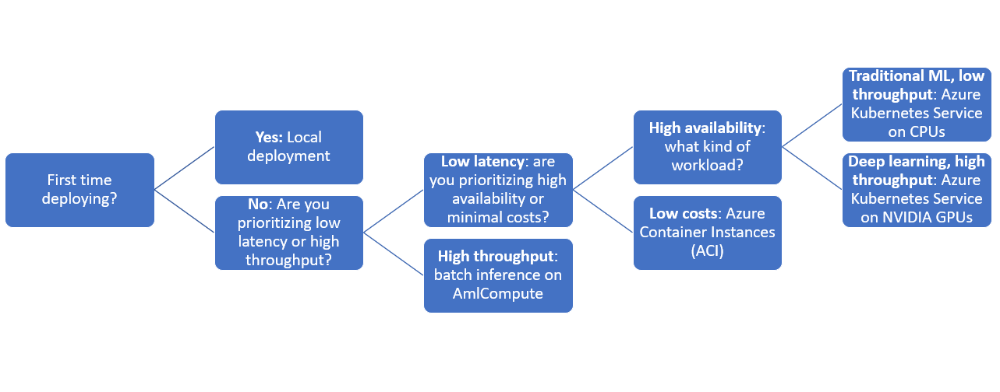

# Deploy machine learning models to Azure

Learn how to deploy your machine learning or deep learning model as a web service in the Azure cloud.

The workflow is similar no matter where you deploy your model:

1. Register the model
1. Prepare an entry script
1. Prepare an inference configuration
1. Deploy the model locally to ensure everything works
1. Choose a compute target.
1. Re-deploy the model to the cloud
1. Test the resulting web service.

For more information on the concepts involved in the machine learning deployment workflow, see [Manage, deploy, and monitor models with Azure Machine Learning](concept-model-management-and-deployment.md).

## Prerequisites

# [Azure CLI](#tab/azcli)

- An Azure Machine Learning workspace. For more information, see [Create an Azure Machine Learning workspace](how-to-manage-workspace.md).
- A model. If you don't have a trained model, you can use the model and dependency files provided in [this tutorial](https://aka.ms/azml-deploy-cloud).
- The [Azure Command Line Interface (CLI) extension for the Machine Learning service](reference-azure-machine-learning-cli.md).
- A machine that can run Docker, such as a [compute instance](how-to-create-manage-compute-instance.md).

# [Python](#tab/python)

- An Azure Machine Learning workspace. For more information, see [Create an Azure Machine Learning workspace](how-to-manage-workspace.md).
- A model. If you don't have a trained model, you can use the model and dependency files provided in [this tutorial](https://aka.ms/azml-deploy-cloud).
- The [Azure Machine Learning software development kit (SDK) for Python](/python/api/overview/azure/ml/intro).
- A machine that can run Docker, such as a [compute instance](how-to-create-manage-compute-instance.md).
---

## Connect to your workspace

# [Azure CLI](#tab/azcli)

Do

```azurecli-interactive
az login
az account set -s <my subscription>
az ml workspace list --resource-group=<my resource group>
```

to see the workspaces you have access to.

# [Python](#tab/python)

```python
from azureml.core import Workspace
ws = Workspace(subscription_id="<subscription_id>",
               resource_group="<resource_group>",
               workspace_name="<workspace_name>")
```

For more information on using the SDK to connect to a workspace, see the [Azure Machine Learning SDK for Python](/python/api/overview/azure/ml/intro#workspace) documentation.


---

## <a id="registermodel"></a> Register your model

A typical situation for a deployed machine learning service is that you need the following components:
	
 + resources representing the specific model that you want deployed (for example: a pytorch model file)
 + code that you will be running in th service, that executes the model on a given input

Azure Machine Learnings allows you to separate the deployment into two separate components, so that you can keep the same code, but merely update the model. We define the mechanism by which you upload a model _separately_ from your code as "registering the model".

When you register a model, we upload the model to the cloud (in your workspace's default storage account) and then mount it to the same compute where your webservice is running.

The following examples demonstrate how to register a model.

[!INCLUDE [trusted models](../../includes/machine-learning-service-trusted-model.md)]

# [Azure CLI](#tab/azcli)

### Register a model from a local file

```azurecli-interactive
wget https://aka.ms/bidaf-9-model -o model.onnx
az ml model register -n bidaf_onnx -p ./model.onnx
```

Set `-p` to the path of a folder or a file that you want to register.

For more information on `az ml model register`, consult the [reference documentation](/cli/azure/ext/azure-cli-ml/ml/model).

### Register a model from an Azure ML training run

```azurecli-interactive
az ml model register -bidaf_onnx  --asset-path outputs/model.onnx  --experiment-name myexperiment --run-id myrunid --tag area=qna
```

[!INCLUDE [install extension](../../includes/machine-learning-service-install-extension.md)]

The `--asset-path` parameter refers to the cloud location of the model. In this example, the path of a single file is used. To include multiple files in the model registration, set `--asset-path` to the path of a folder that contains the files.

For more information on `az ml model register`, consult the [reference documentation](/cli/azure/ml/model).

# [Python](#tab/python)

### Register a model from a local file

You can register a model by providing the local path of the model. You can provide the path of either a folder or a single file on your local machine.

```python

import urllib.request
from azureml.core.model import Model
# Download model
urllib.request.urlretrieve("https://aka.ms/bidaf-9-model", 'model.onnx')

# Register model
model = Model.register(ws, model_name='bidaf_onnx', model_path='./model.onnx')
```

To include multiple files in the model registration, set `model_path` to the path of a folder that contains the files.

For more information, see the documentation for the [Model class](/python/api/azureml-core/azureml.core.model.model).


### Register a model from an Azure ML training run

  When you use the SDK to train a model, you can receive either a [Run](/python/api/azureml-core/azureml.core.run.run) object or an [AutoMLRun](/python/api/azureml-train-automl-client/azureml.train.automl.run.automlrun) object, depending on how you trained the model. Each object can be used to register a model created by an experiment run.

  + Register a model from an `azureml.core.Run` object:
 
    ```python
    model = run.register_model(model_name='bidaf_onnx',
                               tags={'area': 'qna'},
                               model_path='outputs/model.onnx')
    print(model.name, model.id, model.version, sep='\t')
    ```

    The `model_path` parameter refers to the cloud location of the model. In this example, the path of a single file is used. To include multiple files in the model registration, set `model_path` to the path of a folder that contains the files. For more information, see the [Run.register_model](/python/api/azureml-core/azureml.core.run.run#register-model-model-name--model-path-none--tags-none--properties-none--model-framework-none--model-framework-version-none--description-none--datasets-none--sample-input-dataset-none--sample-output-dataset-none--resource-configuration-none----kwargs-) documentation.

  + Register a model from an `azureml.train.automl.run.AutoMLRun` object:

    ```python
        description = 'My AutoML Model'
        model = run.register_model(description = description,
                                   tags={'area': 'qna'})

        print(run.model_id)
    ```

    In this example, the `metric` and `iteration` parameters aren't specified, so the iteration with the best primary metric will be registered. The `model_id` value returned from the run is used instead of a model name.

    For more information, see the [AutoMLRun.register_model](/python/api/azureml-train-automl-client/azureml.train.automl.run.automlrun#register-model-model-name-none--description-none--tags-none--iteration-none--metric-none-) documentation.

    To deploy a registered model from an `AutoMLRun`, we recommend doing so via the [one-click deploy button in Azure Machine learning studio](how-to-use-automated-ml-for-ml-models.md#deploy-your-model). 

---

## Define a dummy entry script

[!INCLUDE [write entry script](../../includes/machine-learning-dummy-entry-script.md)]


## Define an inference configuration

An inference configuration describes the Docker container and files to use when initializing your web service. All of the files within your source directory, including subdirectories, will be zipped up and uploaded to the cloud when you deploy your web service.

The inference configuration below specifies that the machine learning deployment will use the file `echo_score.py` in the `./source_dir` directory to process incoming requests and that it will use the Docker image with the Python packages specified in the `project_environment` environment.

You can use any [Azure Machine Learning curated environment](./resource-curated-environments.md) as the base Docker image when creating your project environment. We will install the required dependencies on top and store the resulting Docker image into the repository that is associated with your workspace.

# [Azure CLI](#tab/azcli)

A minimal inference configuration can be written as:

```json
{
    "entryScript": "echo_score.py",
    "sourceDirectory": "./source_dir",
    "environment": {
        "docker": {
            "arguments": [],
            "baseDockerfile": null,
            "baseImage": "mcr.microsoft.com/azureml/base:intelmpi2018.3-ubuntu16.04",
            "enabled": false,
            "sharedVolumes": true,
            "shmSize": null
        },
        "environmentVariables": {
            "EXAMPLE_ENV_VAR": "EXAMPLE_VALUE"
        },
        "name": "my-deploy-env",
        "python": {
            "baseCondaEnvironment": null,
            "condaDependencies": {
                "channels": [],
                "dependencies": [
                    "python=3.6.2",
                    {
                        "pip": [
                            "azureml-defaults"
                        ]
                    }
                ],
                "name": "project_environment"
            },
            "condaDependenciesFile": null,
            "interpreterPath": "python",
            "userManagedDependencies": false
        },
        "version": "1"
    }
}
```

Save this file with the name `inferenceconfig.json`.


[See this article](./reference-azure-machine-learning-cli.md#inference-configuration-schema) for a more thorough discussion of inference configurations. 

# [Python](#tab/python)

The following example demonstrates how to create a minimal environment with no pip dependencies, using the dummy scoring script you defined above.

```python
from azureml.core import Environment
from azureml.core.model import InferenceConfig

env = Environment(name='project_environment')
inf_config = InferenceConfig(environment=env, source_directory='./source_dir', entry_script='./echo_score.py')
```

For more information on environments, see [Create and manage environments for training and deployment](how-to-use-environments.md).

For more information on inference configuration, see the [InferenceConfig](/python/api/azureml-core/azureml.core.model.inferenceconfig) class documentation.

---


## Define a deployment configuration

A deployment configuration specifies the amount of memory and cores to reserve for your webservice will require in order to run, as well as configuration details of the underlying webservice. For example, a deployment configuration lets you specify that your service needs 2 gigabytes of memory, 2 CPU cores, 1 GPU core, and that you want to enable autoscaling.

The options available for a deployment configuration differ depending on the compute target you choose. In a local deployment, all you can specify is which port your webservice will be served on.

# [Azure CLI](#tab/azcli)

[!INCLUDE [aml-local-deploy-config](../../includes/machine-learning-service-local-deploy-config.md)]

For more information, see [this reference](./reference-azure-machine-learning-cli.md#deployment-configuration-schema).

# [Python](#tab/python)

To create a local deployment configuration, do the following:

```python
from azureml.core.webservice import LocalWebservice

deploy_config = LocalWebservice.deploy_configuration(port=6789)
```

---

## Deploy your machine learning model

You are now ready to deploy your model. 

[!INCLUDE [aml-deploy-service](../../includes/machine-learning-deploy-service.md)]


## Call into your model

Let's check that your echo model deployed successfully. You should be able to do a simple liveness request, as well as a scoring request:

# [Azure CLI](#tab/azcli)

```azurecli-interactive
curl -v http://localhost:32267
curl -v -X POST -H "content-type:application/json" -d '{"query": "What color is the fox", "context": "The quick brown fox jumped over the lazy dog."}' http://localhost:32267/score
```

# [Python](#tab/python)

```python
import requests

uri = service.scoring_uri
requests.get('http://localhost:6789')
headers = {'Content-Type': 'application/json'}
data = {"query": "What color is the fox", "context": "The quick brown fox jumped over the lazy dog."}
data = json.dumps(data)
response = requests.post(uri, data=data, headers=headers)
print(response.json())
```

---

## Define an entry script

Now it's time to actually load your model. First, modify your entry script:

```python
import json
import numpy as np
import os
import onnxruntime
from nltk import word_tokenize
import nltk

def init():
    nltk.download('punkt')
    global sess
    sess = onnxruntime.InferenceSession(os.path.join(os.getenv('AZUREML_MODEL_DIR'), 'model.onnx'))

def run(request):
    print(request)
    text = json.loads(request)
    qw, qc = preprocess(text['query'])
    cw, cc = preprocess(text['context'])

    # Run inference
    test = sess.run(None, {'query_word': qw, 'query_char': qc, 'context_word': cw, 'context_char': cc})
    start = np.asscalar(test[0])
    end = np.asscalar(test[1])
    ans = [w for w in cw[start:end+1].reshape(-1)]
    print(ans)
    return ans

def preprocess(word):
    tokens = word_tokenize(word)

    # split into lower-case word tokens, in numpy array with shape of (seq, 1)
    words = np.asarray([w.lower() for w in tokens]).reshape(-1, 1)

    # split words into chars, in numpy array with shape of (seq, 1, 1, 16)
    chars = [[c for c in t][:16] for t in tokens]
    chars = [cs+['']*(16-len(cs)) for cs in chars]
    chars = np.asarray(chars).reshape(-1, 1, 1, 16)
    return words, chars
```
Save this file as `score.py` inside of `source_dir`.

Notice the use of the `AZUREML_MODEL_DIR` environment variable to locate your registered model. Now that you've added some pip packages, you also need to update your inference configuration to add in those additional packages:

# [Azure CLI](#tab/azcli)


```json
{
    "entryScript": "score.py",
    "sourceDirectory": "./source_dir",
    "environment": {
        "docker": {
            "arguments": [],
            "baseDockerfile": null,
            "baseImage": "mcr.microsoft.com/azureml/base:intelmpi2018.3-ubuntu16.04",
            "enabled": false,
            "sharedVolumes": true,
            "shmSize": null
        },
        "environmentVariables": {
            "EXAMPLE_ENV_VAR": "EXAMPLE_VALUE"
        },
        "name": "my-deploy-env",
        "python": {
            "baseCondaEnvironment": null,
            "condaDependencies": {
                "channels": [],
                "dependencies": [
                    "python=3.6.2",
                    {
                        "pip": [
                            "azureml-defaults",
                            "nltk",
                            "numpy",
                            "onnxruntime"
                        ]
                    }
                ],
                "name": "project_environment"
            },
            "condaDependenciesFile": null,
            "interpreterPath": "python",
            "userManagedDependencies": false
        },
        "version": "2"
    }
}
```

# [Python](#tab/python)

```python
env = Environment(name='myenv')
python_packages = ['nltk', 'numpy', 'onnxruntime']
for package in python_packages:
    env.python.conda_dependencies.add_pip_package(package)

inf_config = InferenceConfig(environment=env, source_directory='./source_dir', entry_script='./score.py')
```

For more information, see the documentation for [LocalWebservice](/python/api/azureml-core/azureml.core.webservice.local.localwebservice), [Model.deploy()](/python/api/azureml-core/azureml.core.model.model#deploy-workspace--name--models--inference-config-none--deployment-config-none--deployment-target-none--overwrite-false-), and [Webservice](/python/api/azureml-core/azureml.core.webservice.webservice).

---

## Deploy again and call your service

Deploy your service again:

[!INCLUDE [aml-deploy-service](../../includes/machine-learning-deploy-service.md)]

Then ensure you can send a post request to the service:

# [Azure CLI](#tab/azcli)

```bash
curl -v -X POST -H "content-type:application/json" -d '{"query": "What color is the fox", "context": "The quick brown fox jumped over the lazy dog."}' http://localhost:32267/score
```

# [Python](#tab/python)

```python
import requests

uri = service.scoring_uri

headers = {'Content-Type': 'application/json'}
data = {"query": "What color is the fox", "context": "The quick brown fox jumped over the lazy dog."}
data = json.dumps(data)
response = requests.post(uri, data=data, headers=headers)
print(response.json())
```

---

## Choose a compute target

Refer to the below diagram when choosing a compute target.

[](././media/how-to-deploy-and-where/how-to-choose-target.png#lightbox)

[!INCLUDE [aml-deploy-target](../../includes/aml-compute-target-deploy.md)]

## Re-deploy to cloud

Once you've confirmed your service works locally and chosen a remote compute target, you are ready to deploy to the cloud. 

Change your deploy configuration to correspond to the compute target you've chosen, in this case Azure Container Instances:

# [Azure CLI](#tab/azcli)

The options available for a deployment configuration differ depending on the compute target you choose.

```json
{
    "computeType": "aci",
    "containerResourceRequirements":
    {
        "cpu": 0.5,
        "memoryInGB": 1.0
    },
    "authEnabled": true,
    "sslEnabled": false,
    "appInsightsEnabled": false
}

```
Save this file as `deploymentconfig.json`.

For more information, see [this reference](./reference-azure-machine-learning-cli.md#deployment-configuration-schema).

# [Python](#tab/python)


```python
from azureml.core.webservice import AciWebservice

deployment_config = AciWebservice.deploy_configuration(cpu_cores = 0.5, memory_gb = 1)
```

---

Deploy your service again:

[!INCLUDE [aml-deploy-service](../../includes/machine-learning-deploy-service.md)]

## Call your remote webservice

When you deploy remotely, you may have key authentication enabled. The example below shows how to get your service key with Python in order to make an inference request.

```python
import requests
import json
from azureml.core import Webservice

service = Webservice(workspace=ws, name='myservice')
scoring_uri = service.scoring_uri

# If the service is authenticated, set the key or token
primary_key, _ = service.get_keys()

# Set the appropriate headers
headers = {'Content-Type': 'application/json'}
headers['Authorization'] = f'Bearer {key}'

# Make the request and display the response and logs
data = {"query": "What color is the fox", "context": "The quick brown fox jumped over the lazy dog."}
data = json.dumps(data)
resp = requests.post(scoring_uri, data=data, headers=headers)
print(resp.text)
print(service.get_logs())
```

See the article on [client applications to consume web services](how-to-consume-web-service.md) for more example clients in other languages.

### Understanding service state

During model deployment, you may see the service state change while it fully deploys.

The following table describes the different service states:

| Webservice state | Description | Final state?
| ----- | ----- | ----- |
| Transitioning | The service is in the process of deployment. | No |
| Unhealthy | The service has deployed but is currently unreachable.  | No |
| Unschedulable | The service cannot be deployed at this time due to lack of resources. | No |
| Failed | The service has failed to deploy due to an error or crash. | Yes |
| Healthy | The service is healthy and the endpoint is available. | Yes |

> [!TIP]
> When deploying, Docker images for compute targets are built and loaded from Azure Container Registry (ACR). By default, Azure Machine Learning creates an ACR that uses the *basic* service tier. Changing the ACR for your workspace to standard or premium tier may reduce the time it takes to build and deploy images to your compute targets. For more information, see [Azure Container Registry service tiers](../container-registry/container-registry-skus.md).

> [!NOTE]
> If you are deploying a model to Azure Kubernetes Service (AKS), we advise you enable [Azure Monitor](../azure-monitor/containers/container-insights-enable-existing-clusters.md) for that cluster. This will help you understand overall cluster health and resource usage. You might also find the following resources useful:
>
> * [Check for Resource Health events impacting your AKS cluster](../aks/aks-resource-health.md)
> * [Azure Kubernetes Service Diagnostics](../aks/concepts-diagnostics.md)
>
> If you are trying to deploy a model to an unhealthy or overloaded cluster, it is expected to experience issues. If you need help troubleshooting AKS cluster problems please contact AKS Support.

## Delete resources

# [Azure CLI](#tab/azcli)

To delete a deployed webservice, use `az ml service delete <name of webservice>`.

To delete a registered model from your workspace, use `az ml model delete <model id>`

Read more about [deleting a webservice](/cli/azure/ml/service#az_ml_service_delete) and [deleting a model](/cli/azure/ml/model#az_ml_model_delete).

# [Python](#tab/python)

To delete a deployed web service, use `service.delete()`.
To delete a registered model, use `model.delete()`.

For more information, see the documentation for [WebService.delete()](/python/api/azureml-core/azureml.core.webservice%28class%29#delete--) and [Model.delete()](/python/api/azureml-core/azureml.core.model.model#delete--).

---

## Next steps

* [Troubleshoot a failed deployment](how-to-troubleshoot-deployment.md)
* [Update web service](how-to-deploy-update-web-service.md)
* [One click deployment for automated ML runs in the Azure Machine Learning studio](how-to-use-automated-ml-for-ml-models.md#deploy-your-model)
* [Use TLS to secure a web service through Azure Machine Learning](how-to-secure-web-service.md)
* [Monitor your Azure Machine Learning models with Application Insights](how-to-enable-app-insights.md)
* [Create event alerts and triggers for model deployments](how-to-use-event-grid.md)