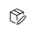
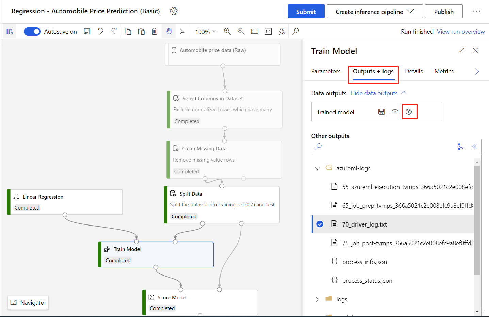
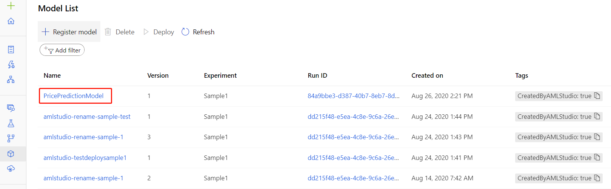
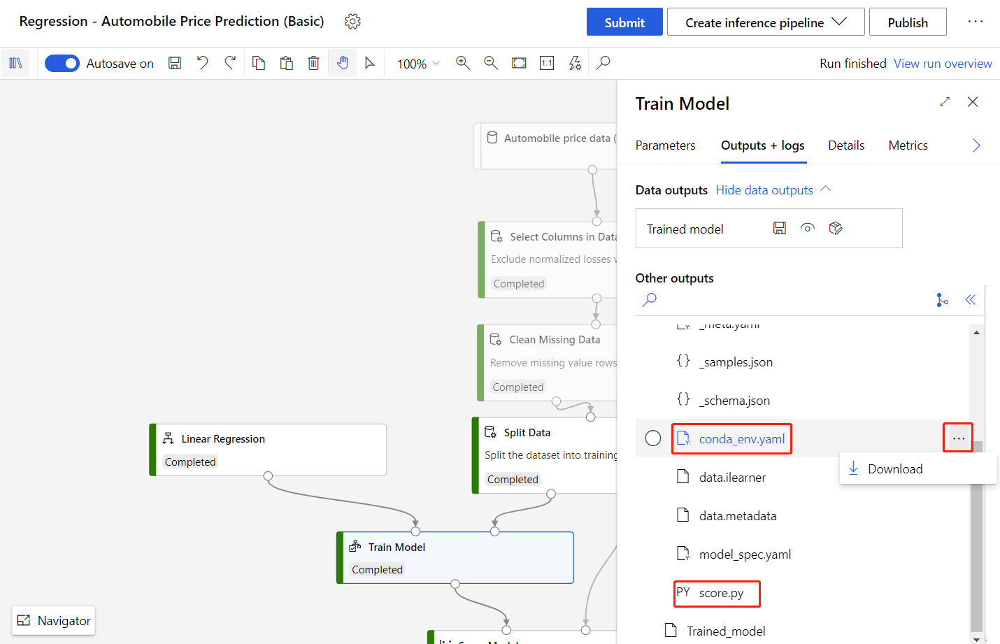
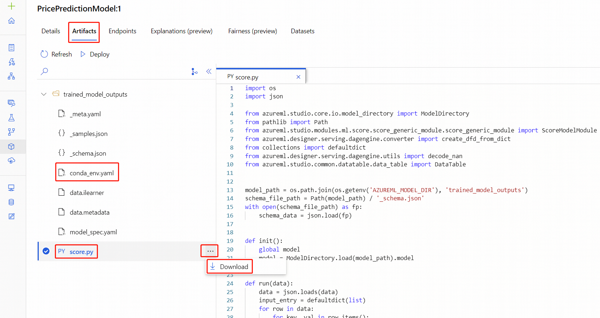

# Use the studio to deploy models trained in the designer

In this article, you learn how to deploy a designer model as a real-time endpoint in Azure Machine Learning studio.

Once registered or downloaded, you can use designer trained models just like any other model. Exported models can be deployed in use cases such as internet of things (IoT) and local deployments.

Deployment in the studio consists of the following steps:

1. Register the trained model.
1. Download the entry script and conda dependencies file for the model.
1. (Optional) Configure the entry script.
1. Deploy the model to a compute target.

You can also deploy models directly in the designer to skip model registration and file download steps. This can be useful for rapid deployment. For more information see, [Deploy a model with the designer](tutorial-designer-automobile-price-deploy.md).

Models trained in the designer can also be deployed through the SDK or command-line interface (CLI). For more information, see [Deploy your existing model with Azure Machine Learning](how-to-deploy-and-where.md).

## Prerequisites

* [An Azure Machine Learning workspace](how-to-manage-workspace.md)

* A completed training pipeline containing one of following modules:
    - [Train Model module](./algorithm-module-reference/train-model.md)
    - [Train Anomaly Detection Model module](./algorithm-module-reference/train-anomaly-detection-model.md)
    - [Train Clustering Model module](./algorithm-module-reference/train-clustering-model.md)
    - [Train Pytorch Model module](./algorithm-module-reference/train-pytorch-model.md)
    - [Train SVD Recommender module](./algorithm-module-reference/train-svd-recommender.md)
    - [Train Vowpal Wabbit Model module](./algorithm-module-reference/train-vowpal-wabbit-model.md)
    - [Train Wide & Deep Model module](./algorithm-module-reference/train-wide-and-deep-recommender.md)

## Register the model

After the training pipeline completes, register the trained model to your Azure Machine Learning workspace to access the model in other projects.

1. Select the [Train Model module](./algorithm-module-reference/train-model.md).
1. Select the **Outputs + logs** tab in the right pane.
1. Select the **Register Model** icon .

    

1. Enter a name for your model, then select **Save**.

After registering your model, you can find it in the **Models** asset page in the studio.
    


## Download the entry script file and conda dependencies file

You need the following files to deploy a model in Azure Machine Learning studio:

- **Entry script file** - loads the trained model, processes input data from requests, does real-time inferences, and returns the result. The designer automatically generates a `score.py` entry script file when the **Train Model** module completes.

- **Conda dependencies file** - specifies which pip and conda packages your webservice depends on. The designer automatically creates a `conda_env.yaml` file when the **Train Model** module completes.

You can download these two files in the right pane of the **Train Model** module:

1. Select the **Train Model** module.
1. In the **Outputs + logs** tab, select the folder `trained_model_outputs`.
1. Download the `conda_env.yaml` file and `score.py` file.

    

Alternatively, you can download the files from the **Models** asset page after registering your model:

1. Navigate to the **Models** asset page.
1. Select the model you want to deploy.
1. Select the **Artifacts** tab.
1. Select the `trained_model_outputs` folder.
1. Download the `conda_env.yaml` file and `score.py` file.  

    

> [!NOTE]
> The `score.py` file provides nearly the same functionality as the **Score Model** modules. However, some modules like [Score SVD Recommender](./algorithm-module-reference/score-svd-recommender.md), [Score Wide and Deep Recommender](./algorithm-module-reference/score-wide-and-deep-recommender.md), and [Score Vowpal Wabbit Model](./algorithm-module-reference/score-vowpal-wabbit-model.md) have parameters for different scoring modes. You can also change those parameters in the entry script.
>
>For more information on setting parameters in the `score.py` file, see the section, [Configure the entry script](#configure-the-entry-script).

## Deploy the model

After downloading the necessary files, you're ready to deploy the model.

1. In the **Models** asset page, select the registered model.
1. Select the **Deploy** button.
1. In the configuration menu, enter the following information:

    - Input a name for the endpoint.
    - Select to deploy the model to [Azure Kubernetes Service](how-to-deploy-azure-kubernetes-service.md) or [Azure Container Instance](how-to-deploy-azure-container-instance.md).
    - Upload the `score.py` for the **Entry script file**.
    - Upload the `conda_env.yml` for the **Conda dependencies file**. 

    >[!TIP]
    > In **Advanced** setting, you can set CPU/Memory capacity and other parameters for deployment. These settings are important for certain models such as PyTorch models, which consume considerable amount of memery (about 4 GB).

1. Select **Deploy** to deploy your model as a real-time endpoint.

    

## Consume the real-time endpoint

After deployment succeeds, you can find the real-time endpoint in the **Endpoints** asset page. Once there, you will find a REST endpoint, which clients can use to submit requests to the real-time endpoint. 

> [!NOTE]
> The designer also generates a sample data json file for testing, you can download `_samples.json` in the **trained_model_outputs** folder.

Use the following code sample to consume a real-time endpoint.

```python

import json
from pathlib import Path
from azureml.core.workspace import Workspace, Webservice
 
service_name = 'YOUR_SERVICE_NAME'
ws = Workspace.get(
    name='WORKSPACE_NAME',
    subscription_id='SUBSCRIPTION_ID',
    resource_group='RESOURCEGROUP_NAME'
)
service = Webservice(ws, service_name)
sample_file_path = '_samples.json'
 
with open(sample_file_path, 'r') as f:
    sample_data = json.load(f)
score_result = service.run(json.dumps(sample_data))
print(f'Inference result = {score_result}')
```

### Consume computer vision related real-time endpoints

When consuming computer vision related real-time endpoints, you need to convert images to bytes, since web service only accepts string as input. Following is the sample code:

```python
import base64
import json
from copy import deepcopy
from pathlib import Path
from azureml.studio.core.io.image_directory import (IMG_EXTS, image_from_file, image_to_bytes)
from azureml.studio.core.io.transformation_directory import ImageTransformationDirectory

# image path
image_path = Path('YOUR_IMAGE_FILE_PATH')

# provide the same parameter setting as in the training pipeline. Just an example here.
image_transform = [
    # format: (op, args). {} means using default parameter values of torchvision.transforms.
    # See https://pytorch.org/docs/stable/torchvision/transforms.html
    ('Resize', 256),
    ('CenterCrop', 224),
    # ('Pad', 0),
    # ('ColorJitter', {}),
    # ('Grayscale', {}),
    # ('RandomResizedCrop', 256),
    # ('RandomCrop', 224),
    # ('RandomHorizontalFlip', {}),
    # ('RandomVerticalFlip', {}),
    # ('RandomRotation', 0),
    # ('RandomAffine', 0),
    # ('RandomGrayscale', {}),
    # ('RandomPerspective', {}),
]
transform = ImageTransformationDirectory.create(transforms=image_transform).torch_transform

# download _samples.json file under Outputs+logs tab in the right pane of Train Pytorch Model module
sample_file_path = '_samples.json'
with open(sample_file_path, 'r') as f:
    sample_data = json.load(f)

# use first sample item as the default value
default_data = sample_data[0]
data_list = []
for p in image_path.iterdir():
    if p.suffix.lower() in IMG_EXTS:
        data = deepcopy(default_data)
        # convert image to bytes
        data['image'] = base64.b64encode(image_to_bytes(transform(image_from_file(p)))).decode()
        data_list.append(data)

# use data.json as input of consuming the endpoint
data_file_path = 'data.json'
with open(data_file_path, 'w') as f:
    json.dump(data_list, f)
```

## Configure the entry script

Some modules in the designer like [Score SVD Recommender](./algorithm-module-reference/score-svd-recommender.md), [Score Wide and Deep Recommender](./algorithm-module-reference/score-wide-and-deep-recommender.md), and [Score Vowpal Wabbit Model](./algorithm-module-reference/score-vowpal-wabbit-model.md) have parameters for different scoring modes. 

In this section, you learn how to update these parameters in the entry script file too.

The following example updates the default behavior for a trained **Wide & Deep recommender** model. By default, the `score.py` file tells the web service to predict ratings between users and items. 

You can modify the entry script file to make item recommendations, and return recommended items by changing the `recommender_prediction_kind` parameter.


```python
import os
import json
from pathlib import Path
from collections import defaultdict
from azureml.studio.core.io.model_directory import ModelDirectory
from azureml.designer.modules.recommendation.dnn.wide_and_deep.score. \
    score_wide_and_deep_recommender import ScoreWideAndDeepRecommenderModule
from azureml.designer.serving.dagengine.utils import decode_nan
from azureml.designer.serving.dagengine.converter import create_dfd_from_dict

model_path = os.path.join(os.getenv('AZUREML_MODEL_DIR'), 'trained_model_outputs')
schema_file_path = Path(model_path) / '_schema.json'
with open(schema_file_path) as fp:
    schema_data = json.load(fp)


def init():
    global model
    model = ModelDirectory.load(load_from_dir=model_path)


def run(data):
    data = json.loads(data)
    input_entry = defaultdict(list)
    for row in data:
        for key, val in row.items():
            input_entry[key].append(decode_nan(val))

    data_frame_directory = create_dfd_from_dict(input_entry, schema_data)

    # The parameter names can be inferred from Score Wide and Deep Recommender module parameters:
    # convert the letters to lower cases and replace whitespaces to underscores.
    score_params = dict(
        trained_wide_and_deep_recommendation_model=model,
        dataset_to_score=data_frame_directory,
        training_data=None,
        user_features=None,
        item_features=None,
        ################### Note #################
        # Set 'Recommender prediction kind' parameter to enable item recommendation model
        recommender_prediction_kind='Item Recommendation',
        recommended_item_selection='From All Items',
        maximum_number_of_items_to_recommend_to_a_user=5,
        whether_to_return_the_predicted_ratings_of_the_items_along_with_the_labels='True')
    result_dfd, = ScoreWideAndDeepRecommenderModule().run(**score_params)
    result_df = result_dfd.data
    return json.dumps(result_df.to_dict("list"))
```

For **Wide & Deep recommender** and **Vowpal Wabbit** models, you can configure the scoring mode parameter using the following methods:

- The parameter names are the lowercase and underscore combinations of parameter names for [Score Vowpal Wabbit Model](./algorithm-module-reference/score-vowpal-wabbit-model.md) and [Score Wide and Deep Recommender](./algorithm-module-reference/score-wide-and-deep-recommender.md);
- Mode type parameter values are strings of the corresponding option names. Take **Recommender prediction kind** in the above codes as example, the value can be `'Rating Prediction'`or `'Item Recommendation'`. Other values are not allowed.

For **SVD recommender** trained model, the parameter names and values maybe less obvious, and you can look up the tables below to decide how to set parameters.

| Parameter name in [Score SVD Recommender](./algorithm-module-reference/score-svd-recommender.md)                           | Parameter name in the entry script file |
| ------------------------------------------------------------ | --------------------------------------- |
| Recommender prediction kind                                  | prediction_kind                         |
| Recommended item selection                                   | recommended_item_selection              |
| Minimum size of the recommendation pool for a single user    | min_recommendation_pool_size            |
| Maximum number of items to recommend to a user               | max_recommended_item_count              |
| Whether to return the predicted ratings of the items along with the labels | return_ratings                          |

The following code shows you how to set parameters for an SVD recommender, which uses all six parameters to recommend rated items with predicted ratings attached.

```python
score_params = dict(
        learner=model,
        test_data=DataTable.from_dfd(data_frame_directory),
        training_data=None,
        # RecommenderPredictionKind has 2 members, 'RatingPrediction' and 'ItemRecommendation'. You
        # can specify prediction_kind parameter with one of them.
        prediction_kind=RecommenderPredictionKind.ItemRecommendation,
        # RecommendedItemSelection has 3 members, 'FromAllItems', 'FromRatedItems', 'FromUndatedItems'.
        # You can specify recommended_item_selection parameter with one of them.
        recommended_item_selection=RecommendedItemSelection.FromRatedItems,
        min_recommendation_pool_size=1,
        max_recommended_item_count=3,
        return_ratings=True,
    )
```


## Next steps

* [Train a model in the designer](tutorial-designer-automobile-price-train-score.md)
* [Deploy models with Azure Machine Learning SDK](how-to-deploy-and-where.md)
* [Troubleshoot a failed deployment](how-to-troubleshoot-deployment.md)
* [Deploy to Azure Kubernetes Service](how-to-deploy-azure-kubernetes-service.md)
* [Create client applications to consume web services](how-to-consume-web-service.md)
* [Update web service](how-to-deploy-update-web-service.md)
