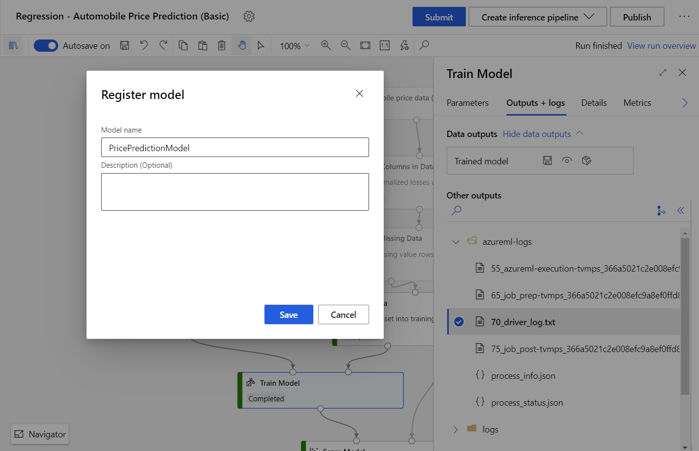

# Deploy trained models from the designer
[!INCLUDE [applies-to-skus](../../includes/aml-applies-to-basic-enterprise-sku.md)]

In this article, you'll learn how to deploy your trained model from the designer as a real-time endpoint in the Azure Machine Learning studio.

The workflow consists of following steps:

1. Register the trained model in the completed pipeline run.
1. Download entry script file and conda dependencies file for the trained model.
1. Deploy the model to the compute target.

For more information on the concepts involved in the deployment workflow, see [Manage, deploy, and monitor models with Azure Machine Learning](concept-model-management-and-deployment.md).

The trained models in the designer can also be deployed through SDK or CLI, see [Deploy your existing model with Azure Machine Learning](how-to-deploy-existing-model.md)

## Prerequisites

* [An Azure Machine Learning workspace](how-to-manage-workspace.md)

* A completed training pipeline containing a [Train Model module](./algorithm-module-reference/train-model.md).

## Register your model

After the training pipeline completes, select the [Train Model module](./algorithm-module-reference/train-model.md), select the **Outputs+logs** tab in the right pane, and click on the **Register Model icon** .

Type the name of model in the pop-up window, and click save.

Then you can find your registered model in the **Models** asset page.

## Download entry script file and conda dependencies file

The following files are necessary for deploy a model in Azure Machine Learning:

- An entry script file, accepts requests, scores the requests by using the model, and returns the results.

- A conda dependencies file, specifies which pip and conda packages your webservice depends on.

You can download these two files in the right pane of the **Train Model** module. In the **Outputs+logs** tab, find the folder `trained_model_outputs`, download the `conda_env.yaml` file and `score.py` file.

Or you can go to the **Models** asset page, click the model you want to deploy, select **Artifacts** tab, and you will find the `trained_model_outputs` as well. Download the `conda_env.yaml` file and `score.py` file.  

## Deploy your model

You are now ready to deploy your model in the **Models** asset page. Select the registered model from the designer, and click the **Deploy** button. 

A configuration window for deployment will show up. Following information are necessary for deployment:

- Input the name of the endpoint.
- Select to deploy the model to [Azure Kubernetes Service](how-to-deploy-azure-kubernetes-service.md) or [Azure Container Instance](how-to-deploy-azure-container-instance.md).
- Upload the `score.py` for the **Entry Script file**, and `conda_env.yml` for the **Conda dependencies file**. 

Then you can click on the **Deploy** button to deploy your model as a real-time endpoint.

## Consume the real-time endpoint

After deployment succeeds, you can find the real-time endpoint in **Endpoints** asset page, where provides a REST endpoint. This REST endpoint can be used by clients to submit requests to the real-time endpoint. 

For more information on how to consume a real-time endpoint, see [Create a client](how-to-consume-web-service.md).

## Next steps

* [Train a model in the designer](tutorial-designer-automobile-price-train-score.md)
* [Troubleshoot a failed deployment](how-to-troubleshoot-deployment.md)
* [Deploy to Azure Kubernetes Service](how-to-deploy-azure-kubernetes-service.md)
* [Create client applications to consume web services](how-to-consume-web-service.md)
* [Update web service](how-to-deploy-update-web-service.md)
* [How to deploy a model using a custom Docker image](how-to-deploy-custom-docker-image.md)
* [Use TLS to secure a web service through Azure Machine Learning](how-to-secure-web-service.md)
* [Monitor your Azure Machine Learning models with Application Insights](how-to-enable-app-insights.md)
* [Collect data for models in production](how-to-enable-data-collection.md)
* [Create event alerts and triggers for model deployments](how-to-use-event-grid.md)

