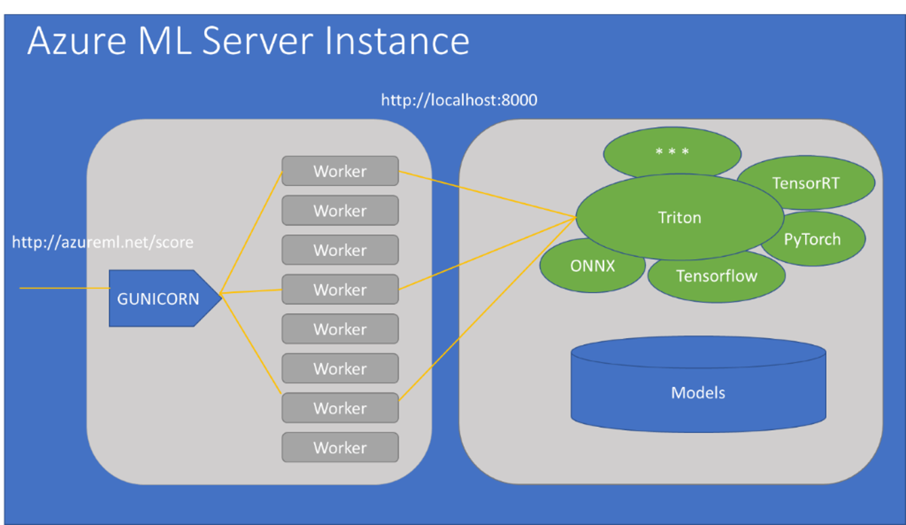

# (Preview) High-performance serving with Triton Inference Server

Model deployment in Azure Machine Learning with Triton for high performance inferencing is currently in preview. This article shows how to use Triton for your own models and provides links to [runnable sample notebooks and CLI commands](https://aka.ms/triton-aml-sample).

The benefits of using Triton include better utilization of Graphical Processing Units (GPUs) and more cost-effective inferencing.

Please note this Triton Public Preview release is subject to the [Supplemental Terms of Use for Microsoft Azure Previews](https://azure.microsoft.com/support/legal/preview-supplemental-terms/).

## Architectural overview

Before attempting to use Triton for your own model, it's important to understand what's happening behind the scenes. Consider the below architectural diagram.



When you deploy Triton as part of an AML deployment with an entry script, we spin up multiple Gunicorn workers to field multiple concurrent incoming requests. These Gunicorn workers forward requests on to the Triton server, which batches those requests to maximize your GPU utilization.

So the rough steps involved in getting Triton working for your own model are:

1. Ensure Triton is able to serve your model
1. Ensure you can send requests to your Triton-deployed model
1. Incorporate your Triton-specific code into your AML deployment

Let's go through these steps in detail.

## (Optional) Define a config file

The model configuration file tells the Triton Inference Server how many inputs to expects and of what dimensions those inputs will be. See the [NVIDIA documentation](https://docs.nvidia.com/deeplearning/triton-inference-server/user-guide/docs/model_configuration.html) for examples and a more in-depth discussion. 

> [!TIP]
> We pass in `--strict-model-config=false` when starting the Triton Inference Server on your behalf, which as explained [here](https://docs.nvidia.com/deeplearning/triton-inference-server/user-guide/docs/model_configuration.html#generated-model-configuration), means you do not need to provide a config.pbtxt file for ONNX or TensorFlow models.

## Structure your directory correctly

Azure Machine Learning assumes you have registered a directory structure as below:

```bash
triton
    - model_1
        - model_version
            - model_file
            - config_file
    - model_2
        ...

```

> [!IMPORTANT]
> Your directory must have a subdirectory called `triton`, under which reside valid [Triton Model Repositories](https://docs.nvidia.com/deeplearning/triton-inference-server/user-guide/docs/model_repository.html) otherwise Azure Machine Learning will not know which models you intend to run with Triton.

## Register your model

High-performance serving with Triton only works for models that have been registered with Azure Machine Learning, either with [the CLI command](https://docs.microsoft.com/cli/azure/ext/azure-cli-ml/ml/model?view=azure-cli-latest#ext_azure_cli_ml_az_ml_model_register&preserve-view=true) or [the SDK command](https://docs.microsoft.com/python/api/azureml-core/azureml.core.model(class)?view=azure-ml-py#register-workspace--model-path--model-name--tags-none--properties-none--description-none--datasets-none--model-framework-none--model-framework-version-none--child-paths-none--sample-input-dataset-none--sample-output-dataset-none--resource-configuration-none-&preserve-view=true)

Sample code below:

# [Azure CLI](#tab/azcli)

```bash
az ml model register --model-path='../models' --name='bidaf_onnx' --model-framework='Multi' --model-framework-version='20.07-py3' --workspace-name='<my_workspace>'
```

# [Python](#tab/python)

```python
from azureml.core.model import Model

model = Model.register(
    model_path=os.path.join("..", "models"),
    model_name="bidaf_onnx",
    tags={'area': "Natural language processing", 'type': "Question answering"},
    description="Question answering model from ONNX model zoo",
    model_framework=Model.Framework.MULTI,
    model_framework_version='20.07-py3',  # version of Triton Inference Server to use
    workspace=ws
```
---

## Use No-code deployment to ensure Triton can serve your model

This step is primarily about ensuring your [Triton model repository](https://docs.nvidia.com/deeplearning/triton-inference-server/user-guide/docs/model_repository.html) is structured correctly and that your [Model Configuration](https://docs.nvidia.com/deeplearning/triton-inference-server/user-guide/docs/model_configuration.html#section-model-configuration) is written correctly.

The simplest way to ensure that Triton can serve your model is by using [No-code deployment](./how-to-deploy-no-code-deployment.md). When you deploy with `Model.Framework.MULTI`, we attempt to deploy any models in the `triton` subdirectory of your registered model with Triton. Using code like the below, you can tell Azure Machine Learning to attempt to serve models with Triton on your local machine.

# [Azure CLI](#tab/azcli)

> [!TIP]
> For help in writing a deployment configuration, [see this document](./reference-azure-machine-learning-cli.md#deployment-configuration-schema)

```bash
az ml model register --model-path='../models' --name='bidaf_onnx' --model-framework='Multi' --model-framework-version='20.07-py3' --workspace-name='<my_workspace>'
az ml model deploy -n triton-bidaf-onnx -m bidaf_onnx:1 --dc deploymentconfig.json
```

# [Python](#tab/python)

```python
from azureml.core.webservice import LocalWebservice


local_config = LocalWebservice.deploy_configuration(
    port=6789
)

local_service = Model.deploy(
    workspace=ws,
    name="densenet_local",
    models=[model]
    deployment_config=local_config,
    overwrite=True)

local_service.wait_for_deployment(show_output = True)
print(local_service.state)

```

---

## Ensure you are able to call into your model

Whether you intend to add pre- and post-processing logic to the server (next step) or simply to use the model you deployed in the prior step, you need to know how to call into your deployed model.

See example Triton clients in the [NVIDIA documentation](https://docs.nvidia.com/deeplearning/triton-inference-server/user-guide/docs/client_example.html). You will probably find the [Python samples at the Triton GitHub](https://github.com/triton-inference-server/server/tree/master/src/clients/python/examples) to be most helpful when using Triton in Azure Machine Learning.

At a minimum, you should ensure you can query the service health endpoint:

```bash
!curl -L -v -i {service_endpoint}v2/health/ready
```

>[!TIP]
> You can get the service endpoint by using `az ml service show` if in the CLI or `service.scoring_uri` if in the Python SDK.

## (Optional) Add Python pre- and post-processing into your AML deployment

You've now ensured that your models run in the Triton server and that you can call into them correctly. The last step is to modify your scoring file function so that it dispatches calls to the Triton server.

The two main steps are to initialize a Triton HTTP client in your `init()` method and to call into that client during invocation of your `run()` function.

### Initialize the Triton Client

Include code like the below in your score.py file. Triton in Azure Machine Learning expects to be addressed on localhost, port 8000.

> [!TIP]
> The `tritonhttpclient` pip package is included in the curated `AzureML-Triton` environment, so there's no need to specify it as a pip dependency.

```python
import tritonhttpclient

def init():
    global triton_client
    triton_client = tritonhttpclient.InferenceServerClient(url"localhost:8000")
```

### Modify your scoring script to call into Triton

> [!TIP]
> You can dynamically request the metadata of models that have been loaded with Triton by using the `.get_model_metadata` method of the Triton client. See the [sample notebook](https://aka.ms/triton-aml-sample) for an example of its use.

```python

input = tritonhttpclient.InferInput(input_name, data.shape, datatype)
input.set_data_from_numpy(data, binary_data=binary_data)

output = tritonhttpclient.InferRequestedOutput(
         output_name, binary_data=binary_data, class_count=class_count)

# Run inference
res = triton_client.infer(model_name,
                          [input]
                          request_id='0',
                          outputs=[output])

```

## (Optional) Re-deploy with an Inference Configuration

If you are using Python pre- and post-processing, you will need to redeploy your webservice with an inference configuration, taking care to specify the `AzureML-Triton` [curated environment](./resource-curated-environments.md).

Sample code:

# [Azure CLI](#tab/azcli)

> [!TIP] 
> The code below assumes you cloned the AzureML-Triton curated environment into another environment called My-Triton, see [the docs](https://docs.microsoft.com/python/api/azureml-core/azureml.core.environment.environment?view=azure-ml-py&preserve-view=true#clone-new-name-) for how to do this.

For help in creating an inference configuration, see [this reference](./reference-azure-machine-learning-cli.md#inference-configuration-schema)

```bash

az ml model deploy -n triton-densenet-onnx -m densenet_onnx:1 \
--ic inference-config.json -e My-Triton --dc deploymentconfig.json \
--overwrite --compute-target=aks-gpu
```

# [Python](#tab/python)

```python
from azureml.core.webservice import LocalWebservice
from azureml.core import Environment
from azureml.core.model import InferenceConfig


local_service_name = "triton-bidaf-onnx"
env = Environment.get(ws, "AzureML-Triton").clone("My-Triton")

for pip_package in ["nltk"]:
    env.python.conda_dependencies.add_pip_package(pip_package)

inference_config = InferenceConfig(
    entry_script="score_bidaf.py",  # This entry script is where we dispatch a call to the Triton server
    source_directory=os.path.join("..", "scripts"),
    environment=env
)

local_config = LocalWebservice.deploy_configuration(
    port=6789
)

local_service = Model.deploy(
    workspace=ws,
    name=local_service_name,
    models=[model],
    inference_config=inference_config,
    deployment_config=local_config,
    overwrite=True)

local_service.wait_for_deployment(show_output = True)
print(local_service.state)

```

---

## Conclusion

That's it! In this article, you have seen how to deploy your own model with Azure Machine Learning and the Triton Inference Server. You started by deploying the model directly to Triton with no-code deployment and then saw how to add server-side pre- and post-processing in Python. Together, Azure Machine Learning and Triton give you high-performance inferencing and more cost-effective utilization of GPUs during inference.

## Next steps

* [See end-to-end samples of Triton in Azure Machine Learning](https://aka.ms/aml-triton-sample)
* Check out [Triton client examples](https://github.com/triton-inference-server/server/tree/master/src/clients/python/examples)
* Read the Triton Inference Server [documentation](https://docs.nvidia.com/deeplearning/triton-inference-server/user-guide/docs/index.html)
* [Troubleshoot a failed deployment](how-to-troubleshoot-deployment.md)
* [Deploy to Azure Kubernetes Service](how-to-deploy-azure-kubernetes-service.md)
* [Update web service](how-to-deploy-update-web-service.md)
* [Collect data for models in production](how-to-enable-data-collection.md)
