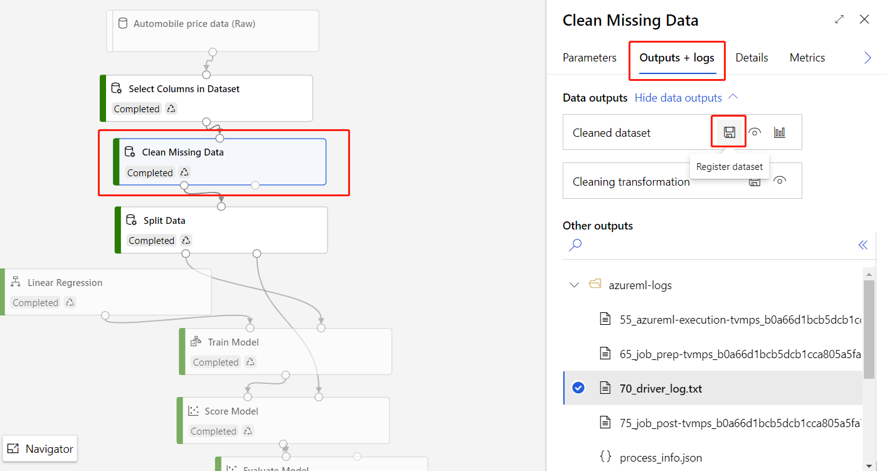
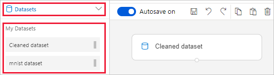

# Import data into Azure Machine Learning designer (preview)

In this article, you learn how to import your own data in the designer to create custom solutions. There are two ways you can import data into the designer: 

* **Azure Machine Learning datasets** - Register [datasets](concept-data.md#datasets) in Azure Machine Learning to enable advanced features that help you manage your data.
* **Import Data module** - Use the [Import Data](algorithm-module-reference/import-data.md) module to directly access data from online datasources.

## Use Azure Machine Learning datasets

We recommend that you use [datasets](concept-data.md#datasets) to import data into the designer. When you register a dataset, you can take full advantage of advanced data features like [versioning and tracking](how-to-version-track-datasets.md) and [data monitoring](how-to-monitor-datasets.md).

### Register a dataset

You can register existing datasets [programatically with the SDK](how-to-create-register-datasets.md#use-the-sdk) or [visually in Azure Machine Learning studio](how-to-create-register-datasets.md#use-the-ui).

You can also register the output for any designer module as a dataset.

1. Select the module that outputs the data you want to register.

1. In the properties pane, select **Outputs** > **Register dataset**.

    

### Use a dataset

Your registered datasets can be found in the module palette, under **Datasets** > **My Datasets**. To use a dataset, drag and drop it onto the pipeline canvas. Then, connect the output port of the dataset to other modules in the palette.

> [!NOTE]
> The designer currently only supports processing [tabular datasets](how-to-create-register-datasets.md#dataset-types). If you want to use [file datasets](how-to-create-register-datasets.md#dataset-types), use the Azure Machine Learning SDK available for Python and R.

## Import data using the Import Data module

While we recommend that you use datasets to import data, you can also use the [Import Data](algorithm-module-reference/import-data.md) module. The Import Data module skips registering your dataset in Azure Machine Learning and imports data directly from a [datastore](concept-data.md#datastores) or HTTP URL.

For detailed information on how to use the Import Data module, see the [Import Data reference page](algorithm-module-reference/import-data.md).

> [!NOTE]
> If your dataset has too many columns, you may encounter the following error: "Validation failed due to size limitation". To avoid this, [register the dataset in the Datasets interface](how-to-create-register-datasets.md#use-the-ui).

## Supported sources

This section lists the data sources supported by the designer. Data comes into the designer from either a datastore or from [tabular dataset](how-to-create-register-datasets.md#dataset-types).

### Datastore sources
For a list of supported datastore sources, see [Access data in Azure storage services](how-to-access-data.md#supported-data-storage-service-types).

### Tabular dataset sources

The designer supports tabular datasets created from the following sources:
 * Delimited files
 * JSON files
 * Parquet files
 * SQL queries

## Data types

The designer internally recognizes the following data types:

* String
* Integer
* Decimal
* Boolean
* Date

The designer uses an internal data type to pass data between modules. You can explicitly convert your data into data table format using the [Convert to Dataset](algorithm-module-reference/convert-to-dataset.md) module. Any module that accepts formats other than the internal format will convert the data silently before passing it to the next module.

## Data constraints

Modules in the designer are limited by the size of the compute target. For larger datasets, you should use a larger Azure Machine Learning compute resource. For more information on Azure Machine Learning compute, see [What are compute targets in Azure Machine Learning?](concept-compute-target.md#azure-machine-learning-compute-managed)

## Access data in a virtual network

If your workspace is in a virtual network, you must perform additional configuration steps to  visualize data in the designer. For more information on how to use datastores and datasets in a virtual network, see [Network isolation during training & inference with private virtual networks](how-to-enable-virtual-network.md#machine-learning-studio).

## Next steps

Learn the basics of the designer with [Tutorial: Predict automobile price with the designer](tutorial-designer-automobile-price-train-score.md).
