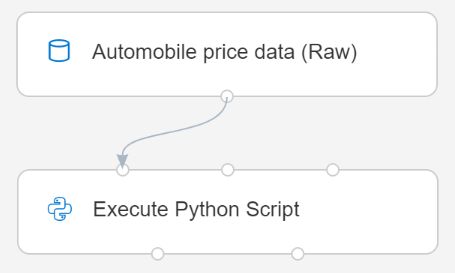
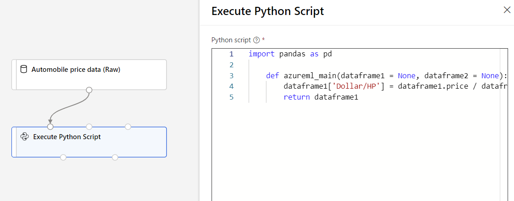

# Run Python code in Azure Machine Learning designer

In this article, you learn how to use the [Execute Python Script](algorithm-module-reference/execute-python-script.md) module to add custom logic to  Azure Machine Learning designer. In the following how-to, you use the Pandas library to do simple feature engineering.

You can use the in-built code editor to quickly add simple Python logic. If you want to add more complex code or upload additional Python libraries, you should use the zip file method.

The default execution environment uses the Anacondas distribution of Python. For a complete list of pre-installed packages, see the [Execute Python Script module reference](algorithm-module-reference/execute-python-script.md) page.


[!INCLUDE [machine-learning-missing-ui](../../includes/machine-learning-missing-ui.md)]

## Execute Python written in the designer

### Add the Execute Python Script module

1. Find the **Execute Python Script** module in the designer palette. It can be found in the **Python Language** section.

1. Drag and drop the module onto the pipeline canvas.

### Connect input datasets

This article uses the sample dataset, **Automobile price data (Raw)**. 

1. Drag and drop your dataset to the pipeline canvas.

1. Connect the output port of the dataset to the top-left input port of the **Execute Python Script** module. The designer exposes the input as a parameter to the entry point script.
    
    The right input port is reserved for zipped python libraries.

    
        

1. Take note of which input port you use. The designer assigns the left input port to the variable `dataset1` and the middle input port to `dataset2`. 

Input modules are optional since you can generate or import data directly in the **Execute Python Script** module.

### Write your Python code

The designer provides an initial entry point script for you to edit and enter your own Python code. 

In this example, you use Pandas to combine two columns found in the automobile dataset, **Price** and **Horsepower**, to create a new column, **Dollars per horsepower**. This column represents how much you pay for each horsepower, which could be a useful feature to decide if a car is a good deal for the money. 

1. Select the **Execute Python Script** module.

1. In the pane that appears to the right of the canvas, select the **Python script** text box.

1. Copy and paste the following code into the text box.

    ```python
    import pandas as pd
    
    def azureml_main(dataframe1 = None, dataframe2 = None):
        dataframe1['Dollar/HP'] = dataframe1.price / dataframe1.horsepower
        return dataframe1
    ```
    Your pipeline should look the following image:
    
    

    The entry point script must contain the function `azureml_main`. There are two function parameters that map to the two input ports for the **Execute Python Script** module.

    The return value must be a Pandas Dataframe. You can return up to two dataframes as module outputs.
    
1. Submit the pipeline.

Now, you have a dataset with the new feature **Dollars/HP**, which could be useful in training a car recommender. This is an example of feature extraction and dimensionality reduction. 

## Next steps

Learn how to [import your own data](how-to-designer-import-data.md) in Azure Machine Learning designer.
