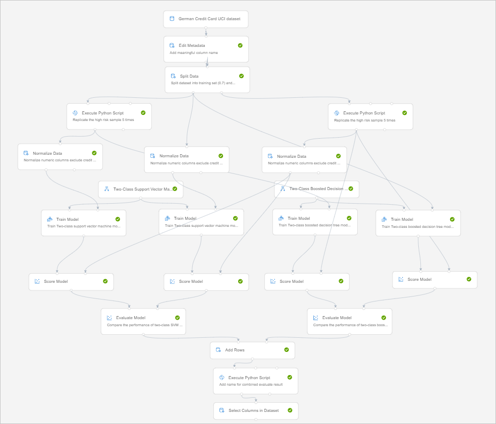
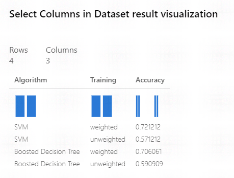

# Build a classifier & use Python scripts to predict credit risk using Azure Machine Learning designer

**Designer sample 4**

[!INCLUDE [applies-to-skus](../../includes/aml-applies-to-enterprise-sku.md)]

This article shows you how to build a complex machine learning pipeline using the designer. You'll learn how to implement custom logic using Python scripts and compare multiple models to choose the best option.

This sample trains a classifier to predict credit risk using credit application information such as credit history, age, and number of credit cards. However, you can apply the concepts in this article to tackle your own machine learning problems.

Here's the completed graph for this pipeline:

[](./media/how-to-designer-sample-classification-credit-risk-cost-sensitive/graph.png#lightbox)

## Prerequisites

[!INCLUDE [aml-ui-prereq](../../includes/aml-ui-prereq.md)]

4. Click sample 4 to open it.

## Data

This sample uses the German Credit Card dataset from the UC Irvine repository. It contains 1,000 samples with 20 features and one label. Each sample represents a person. The 20 features include numerical and categorical features. For more information about the dataset, see the [UCI website](https://archive.ics.uci.edu/ml/datasets/Statlog+%28German+Credit+Data%29). The last column is the label, which denotes the credit risk and has only two possible values: high credit risk = 2, and low credit risk = 1.

## Pipeline summary

In this pipeline, you compare two different approaches for generating models to solve this problem:

- Training with the original dataset.
- Training with a replicated dataset.

With both approaches, you evaluate the models by using the test dataset with replication to ensure that results are aligned with the cost function. Test two classifiers with both approaches: **Two-Class Support Vector Machine** and **Two-Class Boosted Decision Tree**.

The cost of misclassifying a low-risk example as high is 1, and the cost of misclassifying a high-risk example as low is 5. We use an **Execute Python Script** module to account for this misclassification cost.

Here's the graph of the pipeline:

[](./media/how-to-designer-sample-classification-credit-risk-cost-sensitive/graph.png#lightbox)

## Data processing

Start by using the **Metadata Editor** module to add column names to replace the default column names with more meaningful names, obtained from the dataset description on the UCI site. Provide the new column names as comma-separated values in the **New column** name field of the **Metadata Editor**.

Next, generate the training and test sets used to develop the risk prediction model. Split the original dataset into training and test sets of the same size by using the **Split Data** module. To create sets of equal size, set the **Fraction of rows in the first output dataset** option to 0.7.

### Generate the new dataset

Because the cost of underestimating risk is high, set the cost of misclassification like this:

- For high-risk cases misclassified as low risk: 5
- For low-risk cases misclassified as high risk: 1

To reflect this cost function, generate a new dataset. In the new dataset, each high-risk example is replicated five times, but the number of low-risk examples doesn't change. Split the data into training and test datasets before replication to prevent the same row from being in both sets.

To replicate the high-risk data, put this Python code into an **Execute Python Script** module:

```Python
import pandas as pd

def azureml_main(dataframe1 = None, dataframe2 = None):

    df_label_1 = dataframe1[dataframe1.iloc[:, 20] == 1]
    df_label_2 = dataframe1[dataframe1.iloc[:, 20] == 2]

    result = df_label_1.append([df_label_2] * 5, ignore_index=True)
    return result,
```

The **Execute Python Script** module replicates both the training and test datasets.

### Feature engineering

The **Two-Class Support Vector Machine** algorithm requires normalized data. So use the **Normalize Data** module to normalize the ranges of all numeric features with a `tanh` transformation. A `tanh` transformation converts all numeric features to values within a range of 0 and 1 while preserving the overall distribution of values.

The **Two-Class Support Vector Machine** module handles string features, converting them to categorical features and then to binary features with a value of zero or one. So you don't need to normalize these features.

## Models

Because you applied two classifiers, **Two-Class Support Vector Machine** (SVM) and **Two-Class Boosted Decision Tree**, and two datasets, you generate a total of four models:

- SVM trained with original data.
- SVM trained with replicated data.
- Boosted Decision Tree trained with original data.
- Boosted Decision Tree trained with replicated data.

This sample uses the standard data science workflow to create, train, and test the models:

1. Initialize the learning algorithms, using **Two-Class Support Vector Machine** and **Two-Class Boosted Decision Tree**.
1. Use **Train Model** to apply the algorithm to the data and create the actual model.
1. Use **Score Model** to produce scores by using the test examples.

The following diagram shows a portion of this pipeline, in which the original and replicated training sets are used to train two different SVM models. **Train Model** is connected to the training set, and **Score Model** is connected to the test set.


In the evaluation stage of the pipeline, you compute the accuracy of each of the four models. For this pipeline, use **Evaluate Model** to compare examples that have the same misclassification cost.

The **Evaluate Model** module can compute the performance metrics for as many as two scored models. So you can use one instance of **Evaluate Model** to evaluate the two SVM models and another instance of **Evaluate Model** to evaluate the two Boosted Decision Tree models.

Notice that the replicated test dataset is used as the input for **Score Model**. In other words, the final accuracy scores include the cost for getting the labels wrong.

## Combine multiple results

The **Evaluate Model** module produces a table with a single row that contains various metrics. To create a single set of accuracy results, we first use **Add Rows** to combine the results into a single table. We then use the following Python script in the **Execute Python Script** module to add the model name and training approach for each row in the table of results:

```Python
import pandas as pd

def azureml_main(dataframe1 = None, dataframe2 = None):

    new_cols = pd.DataFrame(
            columns=["Algorithm","Training"],
            data=[
                ["SVM", "weighted"],
                ["SVM", "unweighted"],
                ["Boosted Decision Tree","weighted"],
                ["Boosted Decision Tree","unweighted"]
            ])

    result = pd.concat([new_cols, dataframe1], axis=1)
    return result,
```

## Results

To view the results of the pipeline, you can right-click the Visualize output of the last **Select Columns in Dataset** module.



The first column lists the machine learning algorithm used to generate the model.

The second column indicates the type of the training set.

The third column contains the cost-sensitive accuracy value.

From these results, you can see that the best accuracy is provided by the model that was created with **Two-Class Support Vector Machine** and trained on the replicated training dataset.

## Clean up resources

[!INCLUDE [aml-ui-cleanup](../../includes/aml-ui-cleanup.md)]

## Next steps

Explore the other samples available for the designer:

- [Sample 1 - Regression: Predict an automobile's price](how-to-designer-sample-regression-automobile-price-basic.md)
- [Sample 2 - Regression: Compare algorithms for automobile price prediction](how-to-designer-sample-regression-automobile-price-compare-algorithms.md)
- [Sample 3 - Classification with feature selection: Income Prediction](how-to-designer-sample-classification-predict-income.md)
- [Sample 5 - Classification: Predict churn](how-to-designer-sample-classification-churn.md)
- [Sample 6 - Classification: Predict flight delays](how-to-designer-sample-classification-flight-delay.md)
- [Sample 7 - Text Classification: Wikipedia SP 500 Dataset](how-to-designer-sample-text-classification.md)
