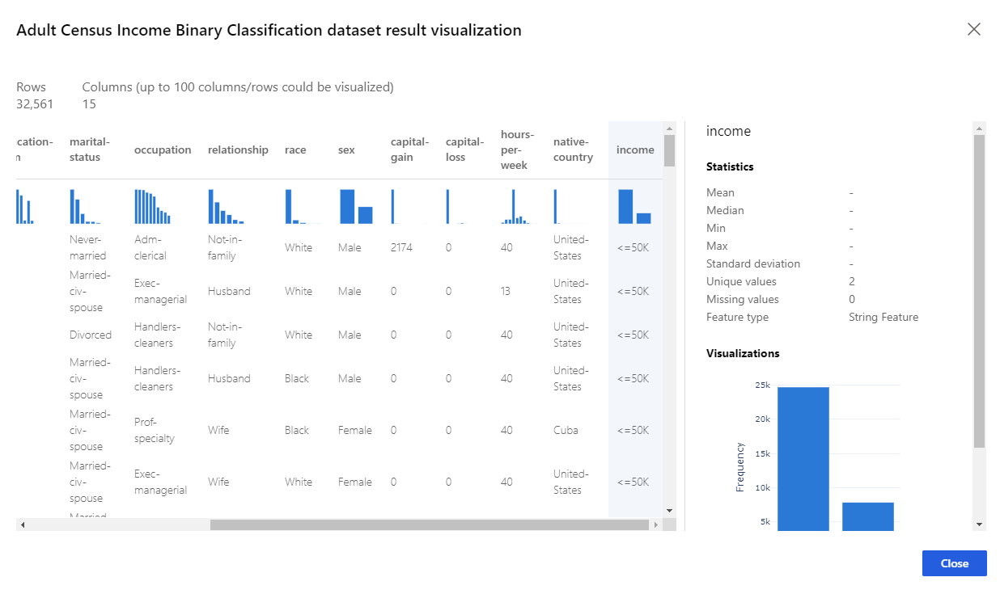
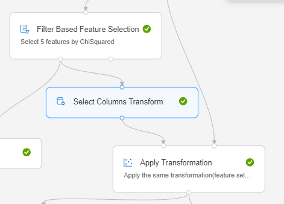
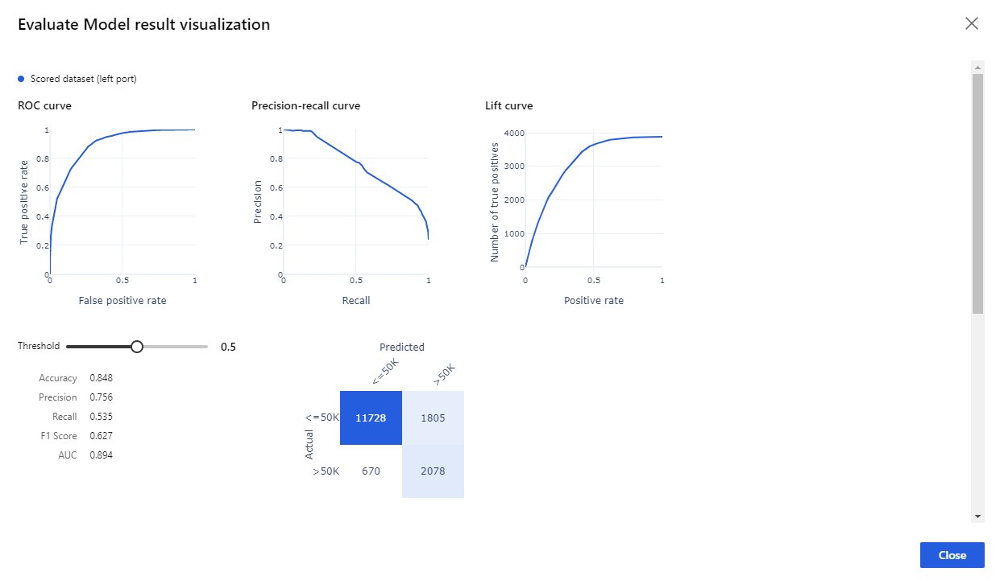

# Build a classifier & use feature selection to predict income with Azure Machine Learning designer

**Designer sample 3**

[!INCLUDE [applies-to-skus](../../includes/aml-applies-to-enterprise-sku.md)]

Learn how to build a machine learning classifier without writing a single line of code using the designer. This sample trains a **two-class boosted decision tree** to predict adult census income (>=50K or <=50K).

Because the question is answering "Which one?" this is called a classification problem. However, you can apply the same fundamental process to tackle any type of machine learning problem - regression, classification, clustering, and so on.

Here's the final pipeline graph for this sample:

## Prerequisites

[!INCLUDE [aml-ui-prereq](../../includes/aml-ui-prereq.md)]

4. Click the sample 3 to open it.

## Data

The dataset contains 14 features and one label column. There are multiple types of features, including numerical and categorical. The following diagram shows an excerpt from the dataset:

## Pipeline summary

Follow these steps to create the pipeline:

1. Drag the Adult Census Income Binary dataset module into the pipeline canvas.
1. Add a **Split Data** module to create the training and test sets. Set the fraction of rows in the first output dataset to 0.7. This setting specifies that 70% of the data will be output to the left port of the module and the rest to the right port. We use the left dataset for training and the right one for testing.
1. Add the **Filter Based Feature Selection** module to select 5 features by PearsonCorreclation. 
1. Add a **Two-Class Boosted Decision Tree** module to initialize a boosted decision tree classifier.
1. Add a **Train Model** module. Connect the classifier from the previous step to the left input port of the **Train Model**. Connect the filtered dataset from Filter Based Feature Selection module as training dataset.  The **Train Model** will train the classifier.
1. Add Select Columns Transformation and Apply Transformation module to apply the same transformation (filtered based feature selection) to test dataset.

1. Add **Score Model** module and connect the **Train Model** module to it. Then add the test set (the output of Apply Transformation module which apply feature selection to test set too) to the **Score Model**. The **Score Model** will make the predictions. You can select its output port to see the predictions and the positive class probabilities.

    This pipeline has two score modules, the one on the right has excluded label column before make the prediction. This is prepared to deploy a real-time endpoint, because the web service input will expect only features not label. 

1. Add an **Evaluate Model** module and connect the scored dataset to its left input port. To see the evaluation results, select the output port of the **Evaluate Model** module and select **Visualize**.

## Results

In the evaluation results, you can see that the curves like ROC, Precision-recall and confusion metrics. 

## Clean up resources

[!INCLUDE [aml-ui-cleanup](../../includes/aml-ui-cleanup.md)]

## Next steps

Explore the other samples available for the designer:

- [Sample 1 - Regression: Predict an automobile's price](how-to-designer-sample-regression-automobile-price-basic.md)
- [Sample 2 - Regression: Compare algorithms for automobile price prediction](how-to-designer-sample-regression-automobile-price-compare-algorithms.md)
- [Sample 4 - Classification: Predict credit risk (cost sensitive)](how-to-designer-sample-classification-credit-risk-cost-sensitive.md)
- [Sample 5 - Classification: Predict churn](how-to-designer-sample-classification-churn.md)
- [Sample 6 - Classification: Predict flight delays](how-to-designer-sample-classification-flight-delay.md)
- [Sample 7 - Text Classification: Wikipedia SP 500 Dataset](how-to-designer-sample-text-classification.md)
