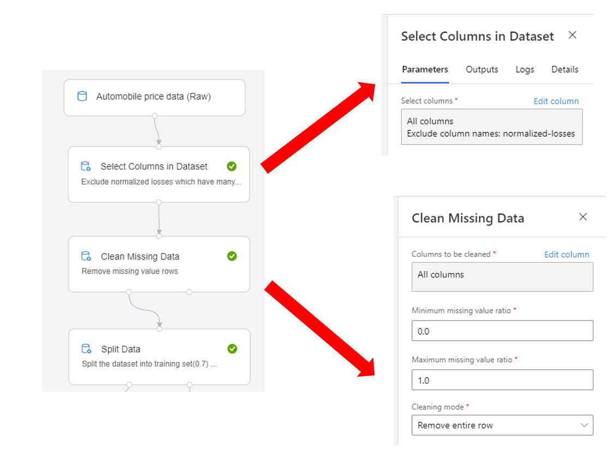
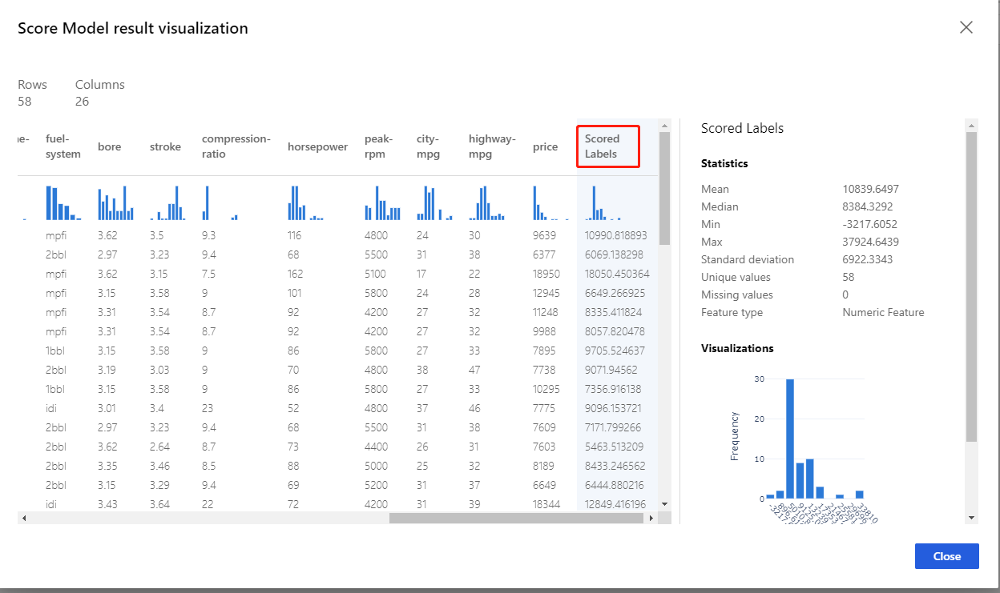
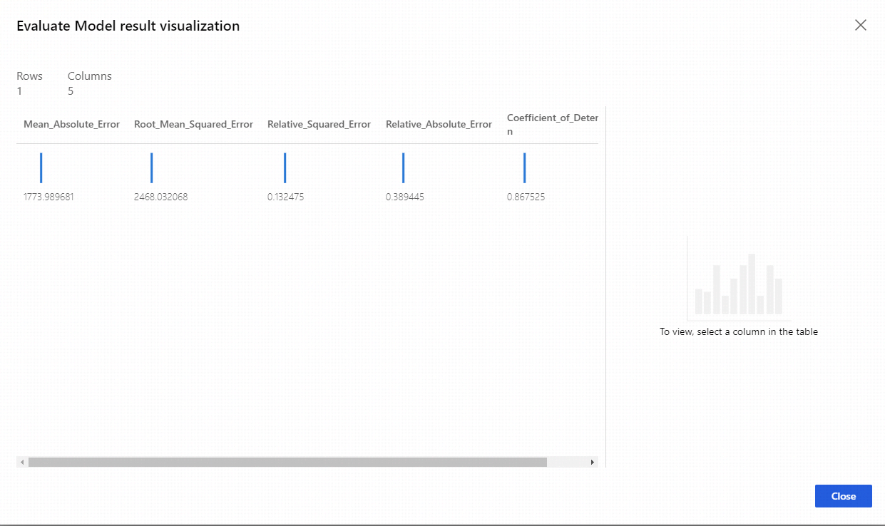

# Use regression to predict car prices with Azure Machine Learning designer

**Designer (preview) sample 1**

[!INCLUDE [applies-to-skus](../../includes/aml-applies-to-enterprise-sku.md)]

Learn how to build a machine learning regression model without writing a single line of code using the designer (preview).

This pipeline trains a **linear regressor** to predict a car's price based on technical features such as make, model, horsepower, and size. Because you're trying to answer the question "How much?" this is called a regression problem. However, you can apply the same fundamental steps in this example to tackle any type of machine learning problem whether it be regression, classification, clustering, and so on.

The fundamental steps of a training machine learning model are:

1. Get the data
1. Pre-process the data
1. Train the model
1. Evaluate the model

Here's the final, completed graph of the pipeline. This article provides the rationale for all the modules so you can make similar decisions on your own.

## Prerequisites

[!INCLUDE [aml-ui-prereq](../../includes/aml-ui-prereq.md)]

4. Click the sample 1 to open it。

## Get the data

This sample uses the **Automobile price data (Raw)** dataset, which is from the UCI Machine Learning Repository. The dataset contains 26 columns that contain information about automobiles, including make, model, price, vehicle features (like the number of cylinders), MPG, and an insurance risk score. The goal of this sample is to predict the price of the car.

## Pre-process the data

The main data preparation tasks include data cleaning, integration, transformation, reduction, and discretization or quantization. In the designer, you can find modules to perform these operations and other data pre-processing tasks in the **Data Transformation** group in the left panel.

Use the **Select Columns in Dataset** module to exclude normalized-losses that have many missing values. Then use **Clean Missing Data** to remove the rows that have missing values. This helps to create a clean set of training data.

## Train the model

Machine learning problems vary. Common machine learning tasks include classification, clustering, regression, and recommender systems, each of which might require a different algorithm. Your choice of algorithm often depends on the requirements of the use case. After you pick an algorithm, you need to tune its parameters to train a more accurate model. You then need to evaluate all models based on metrics like accuracy, intelligibility, and efficiency.

Since the goal of this sample is to predict automobile prices, and because the label column (price) contains real numbers, a regression model is a good choice. Considering that the number of features is relatively small (less than 100) and these features aren't sparse, the decision boundary is likely to be nonlinear. So we use **Decision Forest Regression** for this pipeline.

Use the **Split Data** module to randomly divide the input data so that the training dataset contains 70% of the original data and the testing dataset contains 30% of the original data.

## Test, evaluate, and compare

Split the dataset and use different datasets to train and test the model to make the evaluation of the model more objective.

After the model is trained, you can use the **Score Model** and **Evaluate Model** modules to generate predicted results and evaluate the models.

**Score Model** generates predictions for the test dataset by using the trained model. To check the result, select the output port of **Score Model** and then select **Visualize**.

Pass the scores to the **Evaluate Model** module to generate evaluation metrics. To check the result, select the output port of the **Evaluate Model** and then select **Visualize**.

## Clean up resources

[!INCLUDE [aml-ui-cleanup](../../includes/aml-ui-cleanup.md)]

## Next steps

Explore the other samples available for the designer:

- [Sample 2 - Regression: Compare algorithms for automobile price prediction](how-to-designer-sample-regression-automobile-price-compare-algorithms.md)
- [Sample 3 - Classification with feature selection: Income Prediction](how-to-designer-sample-classification-predict-income.md)
- [Sample 4 - Classification: Predict credit risk (cost sensitive)](how-to-designer-sample-classification-credit-risk-cost-sensitive.md)
- [Sample 5 - Classification: Predict churn](how-to-designer-sample-classification-churn.md)
- [Sample 6 - Classification: Predict flight delays](how-to-designer-sample-classification-flight-delay.md)
- [Sample 7 - Text Classification: Wikipedia SP 500 Dataset](how-to-designer-sample-text-classification.md)