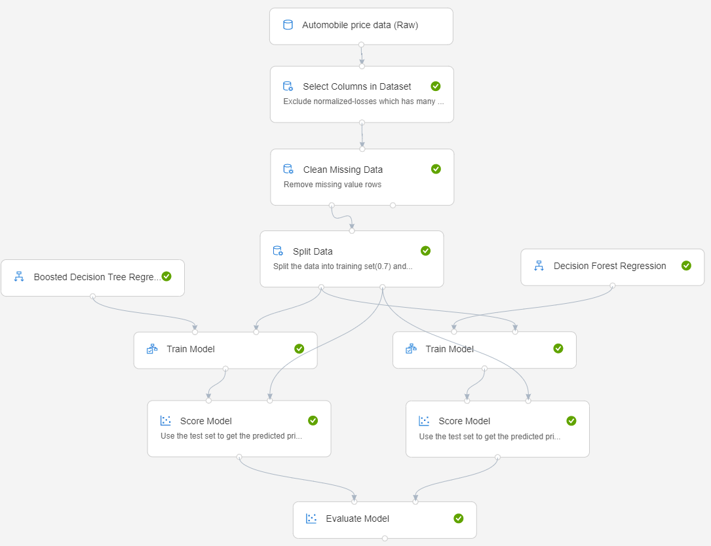
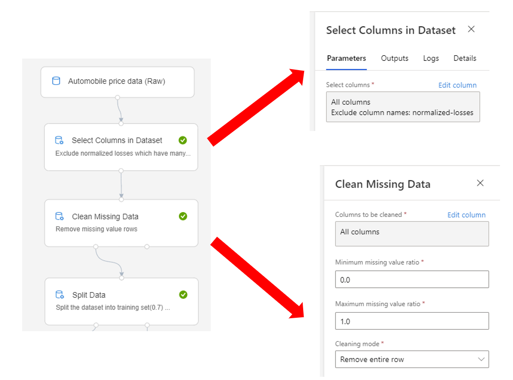
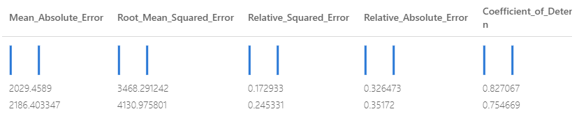

# Train & compare multiple regression models to predict car prices with Azure Machine Learning designer

**Designer sample 2**

[!INCLUDE [applies-to-skus](../../includes/aml-applies-to-enterprise-sku.md)]

Learn how to build a  machine learning pipeline without writing a single line of code using the designer. This sample trains and compares multiple regression models to predict a car's price based on its technical features. We'll provide the rationale for the choices made in this pipeline so you can tackle your own machine learning problems.

If you're just getting started with machine learning, take a look at the [basic version](how-to-designer-sample-regression-automobile-price-basic.md) of this pipeline.

Here's the completed graph for this pipeline:

## Prerequisites

[!INCLUDE [aml-ui-prereq](../../includes/aml-ui-prereq.md)]

4. Click sample 2 to open it. 

## Pipeline summary

Use following steps to build the machine learning pipeline:

1. Get the data.
1. Pre-process the data.
1. Train the model.
1. Test, evaluate, and compare the models.

## Get the data

This sample uses the **Automobile price data (Raw)** dataset, which is from the UCI Machine Learning Repository. This dataset contains 26 columns that contain information about automobiles, including make, model, price, vehicle features (like the number of cylinders), MPG, and an insurance risk score.

## Pre-process the data

The main data preparation tasks include data cleaning, integration, transformation, reduction, and discretization or quantization. In the designer, you can find modules to perform these operations and other data pre-processing tasks in the **Data Transformation** group in the left panel.

Use the **Select Columns in Dataset** module to exclude normalized-losses that have many missing values. We then use **Clean Missing Data** to remove the rows that have missing values. This helps to create a clean set of training data.

## Train the model

Machine learning problems vary. Common machine learning tasks include classification, clustering, regression, and recommender systems, each of which might require a different algorithm. Your choice of algorithm often depends on the requirements of the use case. After you pick an algorithm, you need to tune its parameters to train a more accurate model. You then need to evaluate all models based on metrics like accuracy, intelligibility, and efficiency.

Because the goal of this pipeline is to predict automobile prices, and because the label column (price) contains real numbers, a regression model is a good choice. Considering that the number of features is relatively small (less than 100) and these features aren't sparse, the decision boundary is likely to be nonlinear.

To compare the performance of different algorithms, we use two nonlinear algorithms, **Boosted Decision Tree Regression** and **Decision Forest Regression**, to build models. Both algorithms have parameters that you can change, but this sample uses the default values for this pipeline.

Use the **Split Data** module to randomly divide the input data so that the training dataset contains 70% of the original data and the testing dataset contains 30% of the original data.

## Test, evaluate, and compare the models

You use two different sets of randomly chosen data to train and then test the model, as described in the previous section. Split the dataset and use different datasets to train and test the model to make the evaluation of the model more objective.

After the model is trained, use the **Score Model** and **Evaluate Model** modules to generate predicted results and evaluate the models. **Score Model** generates predictions for the test dataset by using the trained model. Then pass the scores to **Evaluate Model** to generate evaluation metrics.

Here are the results:

These results show that the model built with **Boosted Decision Tree Regression** has a lower root mean squared error than the model built on **Decision Forest Regression**.

## Clean up resources

[!INCLUDE [aml-ui-cleanup](../../includes/aml-ui-cleanup.md)]

## Next steps

Explore the other samples available for the designer:

- [Sample 1 - Regression: Predict an automobile's price](how-to-designer-sample-regression-automobile-price-basic.md)
- [Sample 3 - Classification with feature selection: Income Prediction](how-to-designer-sample-classification-predict-income.md)
- [Sample 4 - Classification: Predict credit risk (cost sensitive)](how-to-designer-sample-classification-credit-risk-cost-sensitive.md)
- [Sample 5 - Classification: Predict churn](how-to-designer-sample-classification-churn.md)
- [Sample 6 - Classification: Predict flight delays](how-to-designer-sample-classification-flight-delay.md)
- [Sample 7 - Text Classification: Wikipedia SP 500 Dataset](how-to-designer-sample-text-classification.md)
