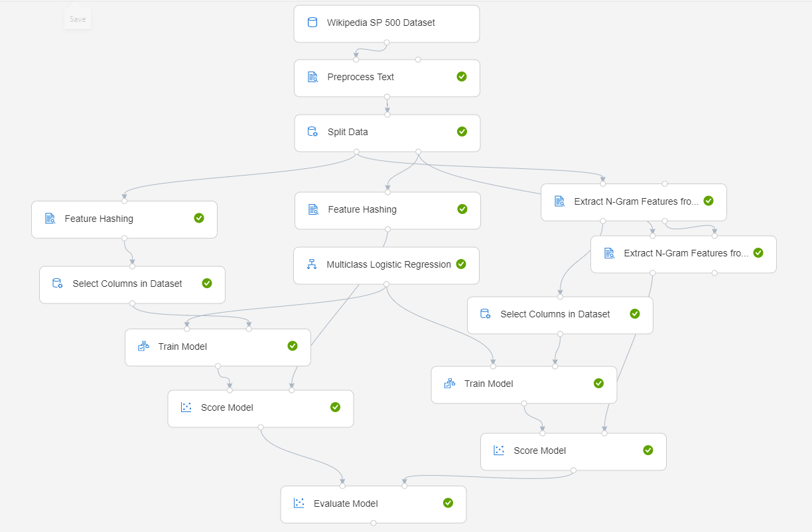

# Build a classifier to predict company category using Azure Machine Learning designer.

**Designer (preview) sample 7**

[!INCLUDE [applies-to-skus](../../includes/aml-applies-to-enterprise-sku.md)]

This sample demonstrates how to use text analytics modules to build a text classification pipeline in Azure Machine Learning designer (preview).

The goal of text classification is to assign some piece of text to one or more predefined classes or categories. The piece of text could be a document, news article, search query, email, tweet, support tickets, customer feedback, user product review etc. Applications of text classification include categorizing newspaper articles and news wire contents into topics, organizing web pages into hierarchical categories, filtering spam email, sentiment analysis, predicting user intent from search queries, routing support tickets, and analyzing customer feedback. 

This pipeline trains a **multiclass logistic regression classifier** to predict the company category with **Wikipedia SP 500 dataset derived from Wikipedia**.  

The fundamental steps of a training machine learning model with text data are:

1. Get the data

1. Pre-process the text data

1. Feature Engineering

   Convert text feature into the numerical feature with feature extracting module such as feature hashing, extract n-gram feature from the text data.

1. Train the model

1. Score dataset

1. Evaluate the model

Here's the final, completed graph of the pipeline we'll be working on. We'll provide the rationale for all the modules so you can make similar decisions on your own.

## Data

In this pipeline, we use the **Wikipedia SP 500** dataset. The dataset is derived from Wikipedia (https://www.wikipedia.org/) based on articles of each S&P 500 company. Before uploading to Azure Machine Learning designer, the dataset was processed as follows:

- Extract text content for each specific company
- Remove wiki formatting
- Remove non-alphanumeric characters
- Convert all text to lowercase
- Known company categories were added

Articles could not be found for some companies, so the number of records is less than 500.

## Pre-process the text data

We use the **Preprocess Text** module to preprocess the text data, including detect the sentences, tokenize sentences and so on. You would found all supported options in the [**Preprocess Text**](algorithm-module-reference/preprocess-text.md) article. 
After pre-processing tex data, we use the **Split Data** module to randomly divide the input data so that the training dataset contains 50% of the original data and the testing dataset contains 50% of the original data.

## Feature Engineering
In this sample, we will use two methods performing feature engineering.

### Feature Hashing
We used the [**Feature Hashing**](algorithm-module-reference/feature-hashing.md) module to convert the plain text of the articles to integers and used the integer values as input features to the model. 

The **Feature Hashing** module can be used to convert variable-length text documents to equal-length numeric feature vectors, using the 32-bit murmurhash v3 hashing method provided by the Vowpal Wabbit library. The objective of using feature hashing is dimensionality reduction; also feature hashing makes the lookup of feature weights faster at classification time because it uses hash value comparison instead of string comparison.

In the sample pipeline, we set the number of hashing bits to 14 and set the number of n-grams to 2. With these settings, the hash table can hold 2^14 entries, in which each hashing feature represents one or more n-gram features and its value represents the occurrence frequency of that n-gram in the text instance. For many problems, a hash table of this size is more than adequate, but in some cases, more space might be needed to avoid collisions. Evaluate the performance of your machine learning solution using different number of bits. 

### Extract N-Gram Feature from Text

An n-gram is a contiguous sequence of n terms from a given sequence of text. An n-gram of size 1 is referred to as a unigram; an n-gram of size 2 is a bigram; an n-gram of size 3 is a trigram. N-grams of larger sizes are sometimes referred to by the value of n, for instance, "four-gram", "five-gram", and so on.

We used [**Extract N-Gram Feature from Text**](algorithm-module-reference/extract-n-gram-features-from-text.md)module as another solution for feature engineering. This module first extracts the set of n-grams, in addition to the n-grams, the number of documents where each n-gram appears in the text is counted(DF). In this sample, TF-IDF metric is used to calculate feature values. Then, it converts unstructured text data into equal-length numeric feature vectors where each feature represents the TF-IDF of an n-gram in a text instance.

After converting text data into numeric feature vectors, A **Select Column** module is used to remove the text data from the dataset. 

## Train the model

Your choice of algorithm often depends on the requirements of the use case. 
Because the goal of this pipeline is to predict the category of company, a multi-class classifier model is a good choice. Considering that the number of features is large and these features are sparse, we use **Multiclass Logistic Regression** model for this pipeline.

## Test, evaluate, and compare

 We split the dataset and use different datasets to train and test the model to make the evaluation of the model more objective.

After the model is trained, we would use the **Score Model** and **Evaluate Model** modules to generate predicted results and evaluate the models. However, before using the **Score Model** module, performing feature engineering as what we have done during training is required. 

For **Feature Hashing** module, it is easy to perform feature engineer on scoring flow as training flow. Use **Feature Hashing** module directly to process the input text data.

For **Extract N-Gram Feature from Text** module, we would connect the **Result Vocabulary output** from the training dataflow to the **Input Vocabulary** on the scoring dataflow, and set the **Vocabulary mode** parameter to **ReadOnly**.

After finishing the engineering step, **Score Model** could be used to generate predictions for the test dataset by using the trained model. To check the result, select the output port of **Score Model** and then select **Visualize**.

We then pass the scores to the **Evaluate Model** module to generate evaluation metrics. **Evaluate Model** has two input ports, so that we could evaluate and compare scored datasets that are generated with different methods. In this sample, we compare the performance of the result generated with feature hashing method and n-gram method.
To check the result, select the output port of the **Evaluate Model** and then select **Visualize**.

## Clean up resources

[!INCLUDE [aml-ui-cleanup](../../includes/aml-ui-cleanup.md)]

## Next steps

Explore the other samples available for the designer:
- [Sample 1 - Regression: Predict an automobile's price](how-to-designer-sample-regression-automobile-price-basic.md)
- [Sample 2 - Regression: Compare algorithms for automobile price prediction](how-to-designer-sample-regression-automobile-price-compare-algorithms.md)
- [Sample 3 - Classification with feature selection: Income Prediction](how-to-designer-sample-classification-predict-income.md)
- [Sample 4 - Classification: Predict credit risk (cost sensitive)](how-to-designer-sample-classification-credit-risk-cost-sensitive.md)
- [Sample 5 - Classification: Predict churn](how-to-designer-sample-classification-churn.md)
- [Sample 6 - Classification: Predict flight delays](how-to-designer-sample-classification-flight-delay.md)
