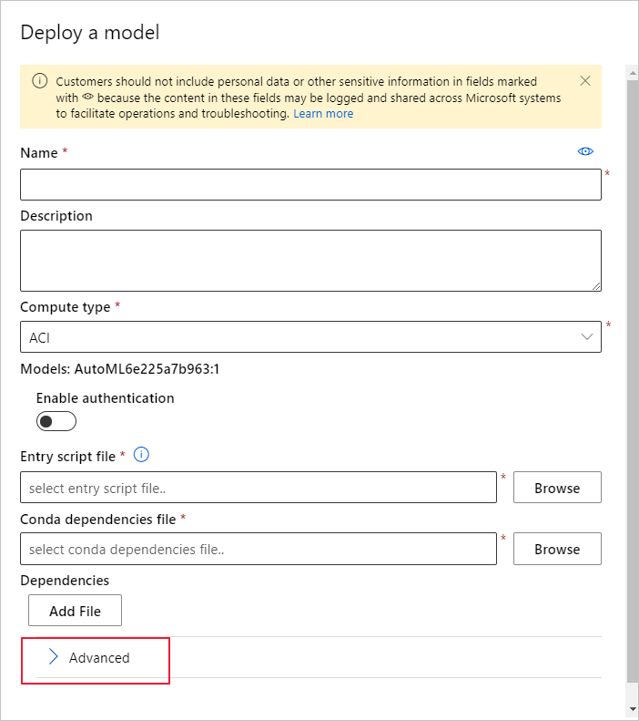
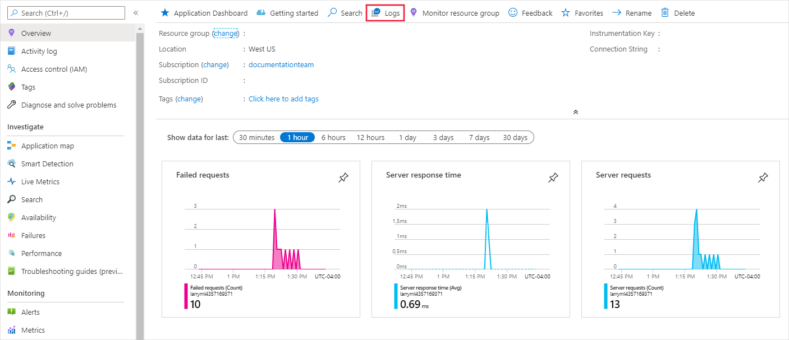
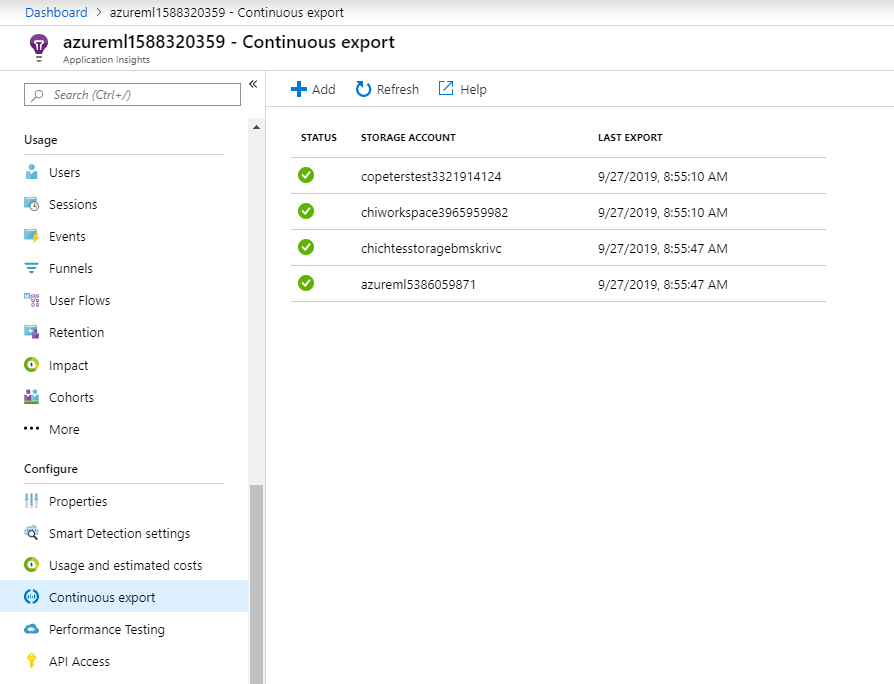

# Monitor and collect data from ML web service endpoints
[!INCLUDE [applies-to-skus](../../includes/aml-applies-to-basic-enterprise-sku.md)]

In this article, you learn how to collect data from and monitor models deployed to web service endpoints in Azure Kubernetes Service (AKS) or Azure Container Instances (ACI) by enabling Azure Application Insights via 
* [Azure Machine Learning Python SDK](#python)
* [Azure Machine Learning studio](#studio) at https://ml.azure.com

In addition to collecting an endpoint's output data and response, you can monitor:

* Request rates, response times, and failure rates
* Dependency rates, response times, and failure rates
* Exceptions

[Learn more about Azure Application Insights](../azure-monitor/app/app-insights-overview.md). 


## Prerequisites

* If you don't have an Azure subscription, create a free account before you begin. Try the [free or paid version of Azure Machine Learning](https://aka.ms/AMLFree) today

* An Azure Machine Learning workspace, a local directory that contains your scripts, and the Azure Machine Learning SDK for Python installed. To learn how to get these prerequisites, see [How to configure a development environment](how-to-configure-environment.md)

* A trained machine learning model to be deployed to Azure Kubernetes Service (AKS) or Azure Container Instance (ACI). If you don't have one, see the [Train image classification model](tutorial-train-models-with-aml.md) tutorial

## Web service metadata and response data

> [!IMPORTANT]
> Azure Application Insights only logs payloads of up to 64kb. If this limit is reached then you may see errors such as out of memory, or no information may be logged.

To log information for a request to the web service, add `print` statements to your score.py file. Each `print` statement results in one entry in the trace table in Application Insights, under the message `STDOUT`. The contents of the `print` statement will be contained under `customDimensions` and then `Contents` in the trace table. If you print a JSON string, it produces a hierarchical data structure in the trace output under `Contents`.

You can query Azure Application Insights directly to access this data, or set up a [continuous export](https://docs.microsoft.com/azure/azure-monitor/app/export-telemetry) to a storage account for longer retention or further processing. Model data can then be used in the Azure Machine Learning to set up labeling, retraining, explainability, data analysis, or other use. 

<a name="python"></a>

## Use Python SDK to configure 

### Update a deployed service

1. Identify the service in your workspace. The value for `ws` is the name of your workspace

    ```python
    from azureml.core.webservice import Webservice
    aks_service= Webservice(ws, "my-service-name")
    ```
2. Update your service and enable Azure Application Insights

    ```python
    aks_service.update(enable_app_insights=True)
    ```

### Log custom traces in your service

If you want to log custom traces, follow the standard deployment process for AKS or ACI in the [How to deploy and where](how-to-deploy-and-where.md) document. Then use the following steps:

1. To send data to Application Insights during inference, update the scoring file by adding print statements. To log more complex information, such as the request data and the response, us a JSON structure. The following example score.py file logs the time the model is initialized, the input and output during inference, and the time any errors occur:

    > [!IMPORTANT]
    > Azure Application Insights only logs payloads of up to 64kb. If this limit is reached, you may see errors such as out of memory, or no information may be logged. If the data you want to log is larger 64kb, you should instead store it to blob storage using the information in [Collect Data for models in production](how-to-enable-data-collection.md).
    
    ```python
    import pickle
    import json
    import numpy 
    from sklearn.externals import joblib
    from sklearn.linear_model import Ridge
    from azureml.core.model import Model
    import time

    def init():
        global model
        #Print statement for appinsights custom traces:
        print ("model initialized" + time.strftime("%H:%M:%S"))
        
        # note here "sklearn_regression_model.pkl" is the name of the model registered under the workspace
        # this call should return the path to the model.pkl file on the local disk.
        model_path = Model.get_model_path(model_name = 'sklearn_regression_model.pkl')
        
        # deserialize the model file back into a sklearn model
        model = joblib.load(model_path)
    

    # note you can pass in multiple rows for scoring
    def run(raw_data):
        try:
            data = json.loads(raw_data)['data']
            data = numpy.array(data)
            result = model.predict(data)
            # Log the input and output data to appinsights:
            info = {
                "input": raw_data,
                "output": result.tolist()
                }
            print(json.dumps(info))
            # you can return any datatype as long as it is JSON-serializable
            return result.tolist()
        except Exception as e:
            error = str(e)
            print (error + time.strftime("%H:%M:%S"))
            return error
    ```

2. Update the service configuration
    
    ```python
    config = Webservice.deploy_configuration(enable_app_insights=True)
    ```

3. Build an image and deploy it on [AKS or ACI](how-to-deploy-and-where.md).

### Disable tracking in Python

To disable Azure Application Insights, use the following code:

```python 
## replace <service_name> with the name of the web service
<service_name>.update(enable_app_insights=False)
```

<a name="studio"></a>

## Use Azure Machine Learning studio to configure

You can also enable Azure Application Insights from Azure Machine Learning studio when you're ready to deploy your model with these steps.

1. Sign in to your workspace at https://ml.azure.com/
1. Go to **Models** and select which model you want to deploy
1. Select  **+Deploy**
1. Populate the **Deploy model** form
1. Expand the **Advanced** menu

    
1. Select **Enable Application Insights diagnostics and data collection**

    
## Evaluate data
Your service's data is stored in your Azure Application Insights account, within the same resource group as Azure Machine Learning.
To view it:

1. Go to your Azure Machine Learning workspace in the [Azure portal](https://ms.portal.azure.com/) and click on the Application Insights link

    [](././media/how-to-enable-app-insights/AppInsightsLoc.png#lightbox)

1. From the **Overview** tab or the __Monitoring__ section in the list on the left, select __Logs__.

    [](./media/how-to-enable-app-insights/overview.png#lightbox)

1. To view information logged from the score.py file, look at the __traces__ table. The following query searches for logs where the __input__ value was logged:

    ```kusto
    traces
    | where customDimensions contains "input"
    | limit 10
    ```

   [](././media/how-to-enable-app-insights/model-data-trace.png#lightbox)

To learn more about how to use Azure Application Insights, see [What is Application Insights?](../azure-monitor/app/app-insights-overview.md).

## Export data for further processing and longer retention

>[!Important]
> Azure Application Insights only supports exports to blob storage. Additional limits of this export capability are listed in [Export telemetry from App Insights](https://docs.microsoft.com/azure/azure-monitor/app/export-telemetry#continuous-export-advanced-storage-configuration).

You can use Azure Application Insights' [continuous export](https://docs.microsoft.com/azure/azure-monitor/app/export-telemetry) to send messages to a supported storage account, where a longer retention can be set. The data is stored in JSON format and can be easily parsed to extract model data. 

Azure Data Factory, Azure ML Pipelines, or other data processing tools can be used to transform the data as needed. When you have transformed the data, you can then register it with the Azure Machine Learning workspace as a dataset. To do so, see [How to create and register datasets](how-to-create-register-datasets.md).

   [](././media/how-to-enable-app-insights/continuous-export-setup.png)


## Example notebook

The [enable-app-insights-in-production-service.ipynb](https://github.com/Azure/MachineLearningNotebooks/blob/master/how-to-use-azureml/deployment/enable-app-insights-in-production-service/enable-app-insights-in-production-service.ipynb) notebook demonstrates concepts in this article. 
 
[!INCLUDE [aml-clone-in-azure-notebook](../../includes/aml-clone-for-examples.md)]

## Next steps

* See [how to deploy a model to an Azure Kubernetes Service cluster](https://docs.microsoft.com/azure/machine-learning/how-to-deploy-azure-kubernetes-service) or [how to deploy a model to Azure Container Instances](https://docs.microsoft.com/azure/machine-learning/how-to-deploy-azure-container-instance) to deploy your models to web service endpoints, and enable Azure Application Insights to leverage data collection and endpoint monitoring
* See [MLOps: Manage, deploy, and monitor models with Azure Machine Learning](https://docs.microsoft.com/azure/machine-learning/concept-model-management-and-deployment) to learn more about leveraging data collected from models in production. Such data can help to continually improve your machine learning process
