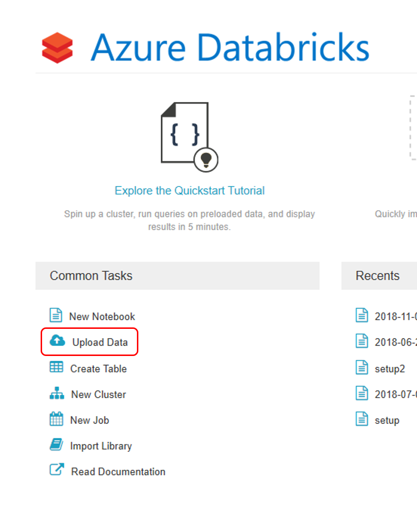

# Collect data for models in production

[!INCLUDE [applies-to-skus](../../includes/aml-applies-to-basic-enterprise-sku.md)]

This article shows how to collect input model data from Azure Machine Learning. It also shows how to deploy the input data into an Azure Kubernetes Service (AKS) cluster and store the output data in Azure Blob storage.

Once collection is enabled, the data you collect helps you:

* [Monitor data drifts](how-to-monitor-data-drift.md) as production data enters your model.

* Make better decisions about when to retrain or optimize your model.

* Retrain your model with the collected data.

## What is collected and where it goes

The following data can be collected:

* Model input data from web services deployed in an AKS cluster. Voice audio, images, and video are *not* collected.
  
* Model predictions using production input data.

>[!NOTE]
> Preaggregation and precalculations on this data are not currently part of the collection service.

The output is saved in Blob storage. Because the data is added to Blob storage, you can choose your favorite tool to run the analysis.

The path to the output data in the blob follows this syntax:

```
/modeldata/<subscriptionid>/<resourcegroup>/<workspace>/<webservice>/<model>/<version>/<designation>/<year>/<month>/<day>/data.csv
# example: /modeldata/1a2b3c4d-5e6f-7g8h-9i10-j11k12l13m14/myresourcegrp/myWorkspace/aks-w-collv9/best_model/10/inputs/2018/12/31/data.csv
```

>[!NOTE]
> In versions of the Azure Machine Learning SDK for Python earlier than version 0.1.0a16, the `designation` argument is named `identifier`. If you developed your code with an earlier version, you need to update it accordingly.

## Prerequisites

- If you don't have an Azure subscription, create a
 [free account](https://aka.ms/AMLFree) before you begin.

- A AzureMachine Learning workspace, a local directory containing your scripts, and the Azure Machine Learning SDK for Python must be installed. To learn how to install them, see [How to configure a development environment](how-to-configure-environment.md).

- You need a trained machine-learning model to be deployed to AKS. If you don't have a model, see the [Train image classification model](tutorial-train-models-with-aml.md) tutorial.

- You need an AKS cluster. For information on how to create one and deploy to it, see [How to deploy and where](how-to-deploy-and-where.md).

- [Set up your environment](how-to-configure-environment.md) and install the [Azure Machine Learning Monitoring SDK](https://aka.ms/aml-monitoring-sdk).

## Enable data collection

You can enable data collection regardless of the model you deploy through Azure Machine Learning or other tools.

To enable data collection, you need to:

1. Open the scoring file.

1. Add the [following code](https://aka.ms/aml-monitoring-sdk) at the top of the file:

   ```python 
   from azureml.monitoring import ModelDataCollector
   ```

1. Declare your data collection variables in your `init` function:

    ```python
    global inputs_dc, prediction_dc
    inputs_dc = ModelDataCollector("best_model", designation="inputs", feature_names=["feat1", "feat2", "feat3". "feat4", "feat5", "feat6"])
    prediction_dc = ModelDataCollector("best_model", designation="predictions", feature_names=["prediction1", "prediction2"])
    ```

    *CorrelationId* is an optional parameter. You don't need to use it if your model doesn't require it. Use of *CorrelationId* does help you more easily map with other data, such as *LoanNumber* or *CustomerId*.
    
    The *Identifier* parameter is later used for building the folder structure in your blob. You can use it to differentiate raw data from processed data.

1. Add the following lines of code to the `run(input_df)` function:

    ```python
    data = np.array(data)
    result = model.predict(data)
    inputs_dc.collect(data) #this call is saving our input data into Azure Blob
    prediction_dc.collect(result) #this call is saving our input data into Azure Blob
    ```

1. Data collection is *not* automatically set to **true** when you deploy a service in AKS. Update your configuration file, as in the following example:

    ```python
    aks_config = AksWebservice.deploy_configuration(collect_model_data=True)
    ```

    You can also enable Application Insights for service monitoring by changing this configuration:

    ```python
    aks_config = AksWebservice.deploy_configuration(collect_model_data=True, enable_app_insights=True)
    ```

1. To create a new image and deploy the machine learning model, see [How to deploy and where](how-to-deploy-and-where.md).

If you already have a service with the dependencies installed in your environment file and scoring file, enable data collection by following these steps:

1. Go to [Azure Machine Learning](https://ml.azure.com).

1. Open your workspace.

1. Select **Deployments** > **Select service** > **Edit**.

   

1. In **Advanced Settings**, select **Enable Application Insights diagnostics and data collection**.

1. Select **Update** to apply the changes.

## Disable data collection

You can stop collecting data at any time. Use Python code or Azure Machine Learning to disable data collection.

### Option 1 - Disable data collection in Azure Machine Learning

1. Sign in to [Azure Machine Learning](https://ml.azure.com).

1. Open your workspace.

1. Select **Deployments** > **Select service** > **Edit**.

   [](./././media/how-to-enable-data-collection/EditService.PNG#lightbox)

1. In **Advanced Settings**, clear **Enable Application Insights diagnostics and data collection**.

1. Select **Update** to apply the change.

You can also access these settings in your workspace in [Azure Machine Learning](https://ml.azure.com).

### Option 2 - Use Python to disable data collection

  ```python 
  ## replace <service_name> with the name of the web service
  <service_name>.update(collect_model_data=False)
  ```

## Validate and analyze your data

You can choose a tool of your preference to analyze the data collected in your Blob storage.

### Quickly access your blob data

1. Sign in to [Azure Machine Learning](https://ml.azure.com).

1. Open your workspace.

1. Select **Storage**.

    [](././media/how-to-enable-data-collection/StorageLocation.png#lightbox)

1. Follow the path to the blob's output data with this syntax:

   ```
   /modeldata/<subscriptionid>/<resourcegroup>/<workspace>/<webservice>/<model>/<version>/<designation>/<year>/<month>/<day>/data.csv
   # example: /modeldata/1a2b3c4d-5e6f-7g8h-9i10-j11k12l13m14/myresourcegrp/myWorkspace/aks-w-collv9/best_model/10/inputs/2018/12/31/data.csv
   ```

### Analyze model data using Power BI

1. Download and open [Power BI Desktop](https://www.powerbi.com).

1. Select **Get Data** and select [**Azure Blob Storage**](https://docs.microsoft.com/power-bi/desktop-data-sources).

    [](././media/how-to-enable-data-collection/PBIBlob.png#lightbox)

1. Add your storage account name and enter your storage key. You can find this information by selecting **Settings** > **Access keys** in your blob.

1. Select the **model data** container and select **Edit**.

    [](././media/how-to-enable-data-collection/pbiNavigator.png#lightbox)

1. In the query editor, click under the **Name** column and add your storage account.

1. Enter your model path into the filter. If you want to look only into files from a specific year or month, just expand the filter path. For example, to look only into March data, use this filter path:

   /modeldata/\<subscriptionid>/\<resourcegroupname>/\<workspacename>/\<webservicename>/\<modelname>/\<modelversion>/\<designation>/\<year>/3

1. Filter the data that is relevant to you based on **Name** values. If you stored predictions and inputs, you need to create a query for each.

1. Select the downward double arrows next to the **Content** column heading to combine the files.

    [](././media/how-to-enable-data-collection/pbiContent.png#lightbox)

1. Select **OK**. The data preloads.

    [](././media/how-to-enable-data-collection/pbiCombine.png#lightbox)

1. Select **Close and Apply**.

1. If you added inputs and predictions, your tables are automatically ordered by **RequestId** values.

1. Start building your custom reports on your model data.

### Analyze model data using Azure Databricks

1. Create an [Azure Databricks workspace](https://docs.microsoft.com/azure/azure-databricks/quickstart-create-databricks-workspace-portal).

1. Go to your Databricks workspace.

1. In your Databricks workspace, select **Upload Data**.

    [](././media/how-to-enable-data-collection/dbupload.png#lightbox)

1. Select **Create New Table** and select **Other Data Sources** > **Azure Blob Storage** > **Create Table in Notebook**.

    [](././media/how-to-enable-data-collection/dbtable.PNG#lightbox)

1. Update the location of your data. Here is an example:

    ```
    file_location = "wasbs://mycontainer@storageaccountname.blob.core.windows.net/modeldata/1a2b3c4d-5e6f-7g8h-9i10-j11k12l13m14/myresourcegrp/myWorkspace/aks-w-collv9/best_model/10/inputs/2018/*/*/data.csv" 
    file_type = "csv"
    ```

    [](././media/how-to-enable-data-collection/dbsetup.png#lightbox)

1. Follow the steps on the template to view and analyze your data.
