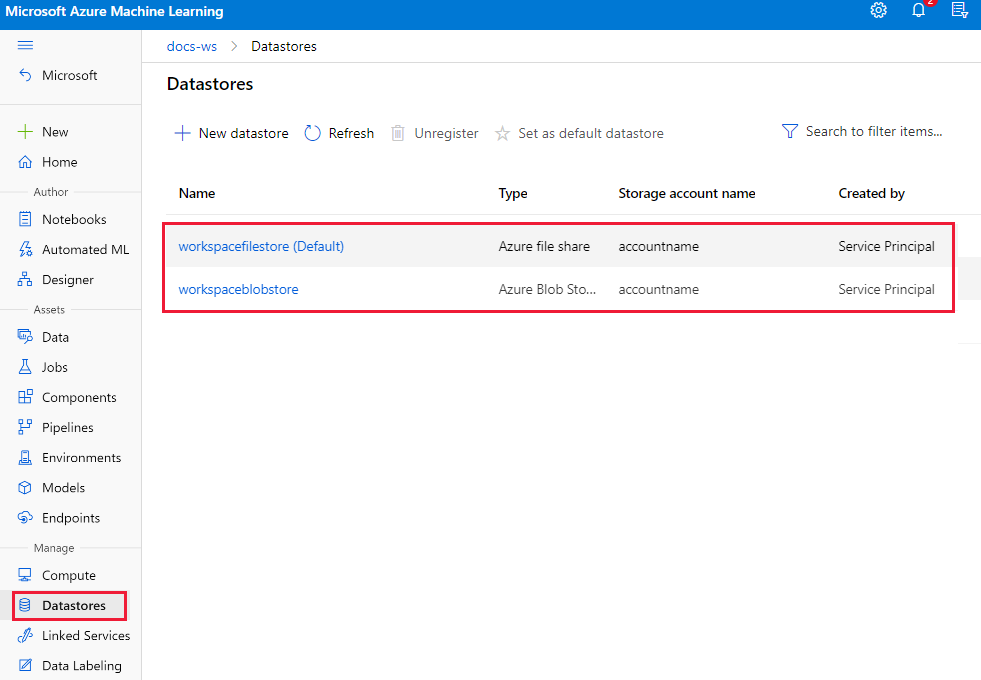

# Use Azure Machine Learning studio in an Azure virtual network

[!INCLUDE [managed network](includes/managed-vnet-note.md)]

In this article, you learn how to use Azure Machine Learning studio in a virtual network. The studio includes features like AutoML, the designer, and data labeling. 

Some of the studio's features are disabled by default in a virtual network. To re-enable these features, you must enable managed identity for storage accounts you intend to use in the studio. 

The following operations are disabled by default in a virtual network:

* Preview data in the studio.
* Visualize data in the designer.
* Deploy a model in the designer.
* Submit an AutoML experiment.
* Start a labeling project.

The studio supports reading data from the following datastore types in a virtual network:

* Azure Storage Account (blob & file)
* Azure Data Lake Storage Gen1
* Azure Data Lake Storage Gen2
* Azure SQL Database

In this article, you learn how to:

> [!div class="checklist"]
> - Give the studio access to data stored inside of a virtual network.
> - Access the studio from a resource inside of a virtual network.
> - Understand how the studio impacts storage security.

> [!TIP]
> This article is part of a series on securing an Azure Machine Learning workflow. See the other articles in this series:
>
:::moniker range="azureml-api-2"
> * [Virtual network overview](how-to-network-security-overview.md)
> * [Secure the workspace resources](how-to-secure-workspace-vnet.md)
> * [Secure the training environment](how-to-secure-training-vnet.md)
> * [Secure the inference environment](how-to-secure-inferencing-vnet.md)
> * [Use custom DNS](how-to-custom-dns.md)
> * [Use a firewall](how-to-access-azureml-behind-firewall.md)
:::moniker-end
:::moniker range="azureml-api-1"
> * [Virtual network overview](how-to-network-security-overview.md)
> * [Secure the workspace resources](./v1/how-to-secure-workspace-vnet.md)
> * [Secure the training environment](./v1/how-to-secure-training-vnet.md)
> * [Secure the inference environment](./v1/how-to-secure-inferencing-vnet.md)
> * [Use custom DNS](how-to-custom-dns.md)
> * [Use a firewall](how-to-access-azureml-behind-firewall.md)
:::moniker-end
>
> For a tutorial on creating a secure workspace, see [Tutorial: Create a secure workspace](tutorial-create-secure-workspace.md) or [Tutorial: Create a secure workspace using a template](tutorial-create-secure-workspace-template.md).

## Prerequisites

+ Read the [Network security overview](how-to-network-security-overview.md) to understand common virtual network scenarios and architecture.

+ A pre-existing virtual network and subnet to use.

:::moniker range="azureml-api-2"
+ An existing [Azure Machine Learning workspace with a private endpoint](how-to-secure-workspace-vnet.md#secure-the-workspace-with-private-endpoint).

+ An existing [Azure storage account added your virtual network](how-to-secure-workspace-vnet.md#secure-azure-storage-accounts).
:::moniker-end
:::moniker range="azureml-api-1"
+ An existing [Azure Machine Learning workspace with a private endpoint](how-to-secure-workspace-vnet.md#secure-the-workspace-with-private-endpoint).

+ An existing [Azure storage account added your virtual network](how-to-secure-workspace-vnet.md#secure-azure-storage-accounts).
:::moniker-end

## Limitations

### Azure Storage Account

* When the storage account is in the VNet, there are extra validation requirements when using studio:

    * If the storage account uses a __service endpoint__, the workspace private endpoint and storage service endpoint must be in the same subnet of the VNet.
    * If the storage account uses a __private endpoint__, the workspace private endpoint and storage private endpoint must be in the same VNet. In this case, they can be in different subnets.

### Designer sample pipeline

There's a known issue where user can't run sample pipeline in Designer homepage. This problem occurs because the sample dataset used in the sample pipeline is an Azure Global dataset. It can't be accessed from a virtual network environment.

To resolve this issue, use a public workspace to run the sample pipeline. Or replace the sample dataset with your own dataset in the workspace within a virtual network.

## Datastore: Azure Storage Account

Use the following steps to enable access to data stored in Azure Blob and File storage:

> [!TIP]
> The first step is not required for the default storage account for the workspace. All other steps are required for *any* storage account behind the VNet and used by the workspace, including the default storage account.

1. **If the storage account is the *default* storage for your workspace, skip this step**. If it isn't the default, __Grant the workspace managed identity the 'Storage Blob Data Reader' role__ for the Azure storage account so that it can read data from blob storage.

    For more information, see the [Blob Data Reader](../role-based-access-control/built-in-roles.md#storage-blob-data-reader) built-in role.

1. __Grant the workspace managed identity the 'Reader' role for storage private endpoints__. If your storage service uses a __private endpoint__, grant the workspace's managed identity __Reader__ access to the private endpoint. The workspace's managed identity in Azure AD has the same name as your Azure Machine Learning workspace. A private endpoint is necessary for both __blob and file__ storage types. 

    > [!TIP]
    > Your storage account may have multiple private endpoints. For example, one storage account may have separate private endpoint for blob, file, and dfs (Azure Data Lake Storage Gen2). Add the managed identity to all these endpoints.

    For more information, see the [Reader](../role-based-access-control/built-in-roles.md#reader) built-in role.

   
1. __Enable managed identity authentication for default storage accounts__. Each Azure Machine Learning workspace has two default storage accounts, a default blob storage account and a default file store account. Both are defined when you create your workspace. You can also set new defaults in the __Datastore__ management page.

    

    The following table describes why managed identity authentication is used for your workspace default storage accounts.

    |Storage account  | Notes  |
    |---------|---------|
    |Workspace default blob storage| Stores model assets from the designer. Enable managed identity authentication on this storage account to deploy models in the designer. If managed identity authentication is disabled, the user's identity is used to access data stored in the blob.     You can visualize and run a designer pipeline if it uses a non-default datastore that has been configured to use managed identity. However, if you try to deploy a trained model without managed identity enabled on the default datastore, deployment fails regardless of any other datastores in use.|
    |Workspace default file store| Stores AutoML experiment assets. Enable managed identity authentication on this storage account to submit AutoML experiments. |

1. __Configure datastores to use managed identity authentication__. After you add an Azure storage account to your virtual network with either a [service endpoint](how-to-secure-workspace-vnet.md?tabs=se#secure-azure-storage-accounts) or [private endpoint](how-to-secure-workspace-vnet.md?tabs=pe#secure-azure-storage-accounts), you must configure your datastore to use [managed identity](../active-directory/managed-identities-azure-resources/overview.md) authentication. Doing so lets the studio access data in your storage account.

    Azure Machine Learning uses [datastore](concept-data.md#datastore) to connect to storage accounts. When creating a new datastore, use the following steps to configure a datastore to use managed identity authentication:

    1. In the studio, select __Datastores__.

    1. To update an existing datastore, select the datastore and select __Update credentials__.

        To create a new datastore, select __+ New datastore__.

    1. In the datastore settings, select __Yes__ for  __Use workspace managed identity for data preview and profiling in Azure Machine Learning studio__.

        

    1. In the __Networking__ settings for the __Azure Storage Account__, add the Microsoft.MachineLearningService/workspaces __Resource type__, and set the __Instance name__ to the workspace. 

    These steps add the workspace's managed identity as a __Reader__ to the new storage service using Azure RBAC. __Reader__ access allows the workspace to view the resource, but not make changes.

## Datastore: Azure Data Lake Storage Gen1

When using Azure Data Lake Storage Gen1 as a datastore, you can only use POSIX-style access control lists. You can assign the workspace's managed identity access to resources just like any other security principal. For more information, see [Access control in Azure Data Lake Storage Gen1](../data-lake-store/data-lake-store-access-control.md).

## Datastore: Azure Data Lake Storage Gen2

When using Azure Data Lake Storage Gen2 as a datastore, you can use both Azure RBAC and POSIX-style access control lists (ACLs) to control data access inside of a virtual network.

__To use Azure RBAC__, follow the steps in the [Datastore: Azure Storage Account](#datastore-azure-storage-account) section of this article. Data Lake Storage Gen2 is based on Azure Storage, so the same steps apply when using Azure RBAC.

__To use ACLs__, the workspace's managed identity can be assigned access just like any other security principal. For more information, see [Access control lists on files and directories](../storage/blobs/data-lake-storage-access-control.md#access-control-lists-on-files-and-directories).

## Datastore: Azure SQL Database

To access data stored in an Azure SQL Database with a managed identity, you must create a SQL contained user that maps to the managed identity. For more information on creating a user from an external provider, see [Create contained users mapped to Azure AD identities](/azure/azure-sql/database/authentication-aad-configure#create-contained-users-mapped-to-azure-ad-identities).

After you create a SQL contained user, grant permissions to it by using the [GRANT T-SQL command](/sql/t-sql/statements/grant-object-permissions-transact-sql).

## Intermediate component output

When using the Azure Machine Learning designer intermediate component output, you can specify the output location for any component in the designer. Use this output to store intermediate datasets in separate location for security, logging, or auditing purposes. To specify output, use the following steps:

1. Select the component whose output you'd like to specify.
1. In the component settings pane that appears to the right, select __Output settings__.
1. Specify the datastore you want to use for each component output.

Make sure that you have access to the intermediate storage accounts in your virtual network. Otherwise, the pipeline fails.

[Enable managed identity authentication](#enable-managed-identity) for intermediate storage accounts to visualize output data.
## Access the studio from a resource inside the VNet

If you're accessing the studio from a resource inside of a virtual network (for example, a compute instance or virtual machine), you must allow outbound traffic from the virtual network to the studio. 

For example, if you're using network security groups (NSG) to restrict outbound traffic, add a rule to a __service tag__ destination of __AzureFrontDoor.Frontend__.

## Firewall settings

Some storage services, such as Azure Storage Account, have firewall settings that apply to the public endpoint for that specific service instance. Usually this setting allows you to allow/disallow access from specific IP addresses from the public internet. __This is not supported__ when using Azure Machine Learning studio. It's supported when using the Azure Machine Learning SDK or CLI.

> [!TIP]
> Azure Machine Learning studio is supported when using the Azure Firewall service. For more information, see [Use your workspace behind a firewall](how-to-access-azureml-behind-firewall.md).
## Next steps

This article is part of a series on securing an Azure Machine Learning workflow. See the other articles in this series:

:::moniker range="azureml-api-2"
* [Virtual network overview](how-to-network-security-overview.md)
* [Secure the workspace resources](how-to-secure-workspace-vnet.md)
* [Secure the training environment](how-to-secure-training-vnet.md)
* [Secure the inference environment](how-to-secure-inferencing-vnet.md)
* [Use custom DNS](how-to-custom-dns.md)
* [Use a firewall](how-to-access-azureml-behind-firewall.md)
:::moniker-end
:::moniker range="azureml-api-1"
* [Virtual network overview](how-to-network-security-overview.md)
* [Secure the workspace resources](./v1/how-to-secure-workspace-vnet.md)
* [Secure the training environment](./v1/how-to-secure-training-vnet.md)
* [Secure the inference environment](./v1/how-to-secure-inferencing-vnet.md)
* [Use custom DNS](how-to-custom-dns.md)
* [Use a firewall](how-to-access-azureml-behind-firewall.md)
:::moniker-end

