# Secure your machine learning lifecycles with private virtual networks
[!INCLUDE [applies-to-skus](../../includes/aml-applies-to-basic-enterprise-sku.md)]

In this article, you'll learn how to isolate experimentation/training jobs and inference/scoring jobs in Azure Machine Learning within an Azure Virtual Network (vnet). You'll also learn about some *advanced security settings*, information that isn't necessary for basic or experimental use cases.

> [!WARNING]
> If your underlying storage is in a virtual network, users will not be able to use Azure Machine Learning's studio web experience, including:
> - drag-n-drop designer
> - UI for automated machine learning
> - UI for data labeling
> - UI for data sets
> - Notebooks
> 
> If you try, you will receive a message similar to the following error: `__Error: Unable to profile this dataset. This might be because your data is stored behind a virtual network or your data does not support profile.__`

## What is a VNET?

A **virtual network** acts as a security boundary, isolating your Azure resources from the public internet. You can also join an Azure virtual network to your on-premises network. By joining networks, you can securely train your models and access your deployed models for inference.

Azure Machine Learning relies on other Azure services for compute resources, also known as [compute targets](concept-compute-target.md), to train and deploy models. The targets can be created within a virtual network. For example, you can use Azure Machine Learning compute to train a model and then deploy the model to Azure Kubernetes Service (AKS). 


## Prerequisites

+ An Azure Machine Learning [workspace](how-to-manage-workspace.md).

+ General working knowledge of both the [Azure Virtual Network service](https://docs.microsoft.com/azure/virtual-network/virtual-networks-overview) and [IP networking](https://docs.microsoft.com/azure/virtual-network/virtual-network-ip-addresses-overview-arm).

+ A pre-existing virtual network and subnet to use with your compute resources.

## Private endpoints

You can also [enable Azure Private Link](how-to-configure-private-link.md) to connect to your workspace using a private endpoint. The private endpoint is a set of private IP addresses within your virtual network. [Learn how to set up this private endpoint.](how-to-configure-private-link.md)


> [!TIP]
> You can combine virtual network and Private Link together to protect communication between your workspace and other Azure resources. However, some combinations require an Enterprise edition workspace. Use the following table to understand what scenarios require Enterprise edition:
>
> | Scenario | Enterprise</br>edition | Basic</br>edition |
> | ----- |:-----:|:-----:| 
> | No virtual network or Private Link | ✔ | ✔ |
> | Workspace without Private Link. Other resources (except Azure Container Registry) in a virtual network | ✔ | ✔ |
> | Workspace without Private Link. Other resources with Private Link | ✔ | |
> | Workspace with Private Link. Other resources (except Azure Container Registry) in a virtual network | ✔ | ✔ |
> | Workspace and any other resource with Private Link | ✔ | |
> | Workspace with Private Link. Other resources without Private Link or virtual network | ✔ | ✔ |
> | Azure Container Registry in a virtual network | ✔ | |
> | Customer Managed Keys for workspace | ✔ | |
> 

> [!WARNING]
> Azure Machine Learning compute instances preview is not supported in a workspace where Private Link is enabled.
> 
> Azure Machine Learning does not support using an Azure Kubernetes Service that has private link enabled. Instead, you can use Azure Kubernetes Service in a virtual network. For more information, see [Secure Azure ML experimentation and inference jobs within an Azure Virtual Network](how-to-enable-virtual-network.md).


<a id="amlcompute"></a>

## <a name="compute-instance"></a>Compute clusters & instances 

To use either a [managed Azure Machine Learning **compute target**](concept-compute-target.md#azure-machine-learning-compute-managed) or an [Azure Machine Learning compute **instance**](concept-compute-instance.md) in a virtual network, the following network requirements must be met:

> [!div class="checklist"]
> * The virtual network must be in the same subscription and region as the Azure Machine Learning workspace.
> * The subnet that's specified for the compute instance or cluster must have enough unassigned IP addresses to accommodate the number of VMs that are targeted. If the subnet doesn't have enough unassigned IP addresses, a compute cluster will be partially allocated.
> * Check to see whether your security policies or locks on the virtual network's subscription or resource group restrict permissions to manage the virtual network. If you plan to secure the virtual network by restricting traffic, leave some ports open for the compute service. For more information, see the [Required ports](#mlcports) section.
> * If you're going to put multiple compute instances or clusters in one virtual network, you might need to request a quota increase for one or more of your resources.
> * If the Azure Storage Account(s) for the workspace are also secured in a virtual network, they must be in the same virtual network as the Azure Machine Learning compute instance or cluster. 
> * For compute instance Jupyter functionality to work, ensure that web socket communication is not disabled.

> [!TIP]
> The Machine Learning compute instance or cluster automatically allocates additional networking resources __in the resource group that contains the virtual network__. For each compute instance or cluster, the service allocates the following resources:
> 
> * One network security group
> * One public IP address
> * One load balancer
> 
> In the case of clusters these resources are deleted (and recreated) every time the cluster scales down to 0 nodes, however for an instance the resources are held onto till the instance is completely deleted (stopping does not remove the resources). 
> These resources are limited by the subscription's [resource quotas](https://docs.microsoft.com/azure/azure-resource-manager/management/azure-subscription-service-limits).


### <a id="mlcports"></a> Required ports

Machine Learning Compute currently uses the Azure Batch service to provision VMs in the specified virtual network. The subnet must allow inbound communication from the Batch service. You use this communication to schedule runs on the Machine Learning Compute nodes and to communicate with Azure Storage and other resources. The Batch service adds network security groups (NSGs) at the level of network interfaces (NICs) that are attached to VMs. These NSGs automatically configure inbound and outbound rules to allow the following traffic:

- Inbound TCP traffic on ports 29876 and 29877 from a __Service Tag__ of __BatchNodeManagement__.

    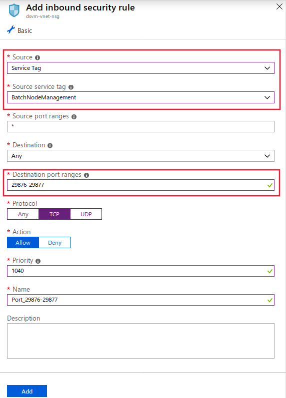

- (Optional) Inbound TCP traffic on port 22 to permit remote access. Use this port only if you want to connect by using SSH on the public IP.

- Outbound traffic on any port to the virtual network.

- Outbound traffic on any port to the internet.

- For compute instance inbound TCP traffic on port 44224 from a __Service Tag__ of __AzureMachineLearning__.

Exercise caution if you modify or add inbound or outbound rules in Batch-configured NSGs. If an NSG blocks communication to the compute nodes, the compute service sets the state of the compute nodes to unusable.

You don't need to specify NSGs at the subnet level, because the Azure Batch service configures its own NSGs. However, if the specified subnet has associated NSGs or a firewall, configure the inbound and outbound security rules as mentioned earlier.

The NSG rule configuration in the Azure portal is shown in the following images:

:::image type="content" source="./media/how-to-enable-virtual-network/amlcompute-virtual-network-inbound.png" alt-text="The inbound NSG rules for Machine Learning Compute" border="true":::


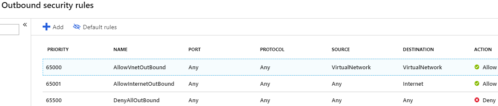

### <a id="limiting-outbound-from-vnet"></a> Limit outbound connectivity from the virtual network

If you don't want to use the default outbound rules and you do want to limit the outbound access of your virtual network, use the following steps:

- Deny outbound internet connection by using the NSG rules.

- For a __compute instance__ or a __compute cluster__, limit outbound traffic to the following items:
   - Azure Storage, by using __Service Tag__ of __Storage.RegionName__. Where `{RegionName}` is the name of an Azure region.
   - Azure Container Registry, by using __Service Tag__ of __AzureContainerRegistry.RegionName__. Where `{RegionName}` is the name of an Azure region.
   - Azure Machine Learning, by using __Service Tag__ of __AzureMachineLearning__
   - Azure Resource Manager, by using __Service Tag__ of __AzureResourceManager__
   - Azure Active Directory, by using __Service Tag__ of __AzureActiveDirectory__

The NSG rule configuration in the Azure portal is shown in the following image:

[](./media/how-to-enable-virtual-network/limited-outbound-nsg-exp.png#lightbox)

> [!NOTE]
> If you plan on using default Docker images provided by Microsoft, and enabling user managed dependencies, you must also use a __Service Tag__ of __MicrosoftContainerRegistry.Region_Name__ (For example, MicrosoftContainerRegistry.EastUS).
>
> This configuration is needed when you have code similar to the following snippets as part of your training scripts:
>
> __RunConfig training__
> ```python
> # create a new runconfig object
> run_config = RunConfiguration()
> 
> # configure Docker 
> run_config.environment.docker.enabled = True
> # For GPU, use DEFAULT_GPU_IMAGE
> run_config.environment.docker.base_image = DEFAULT_CPU_IMAGE 
> run_config.environment.python.user_managed_dependencies = True
> ```
>
> __Estimator training__
> ```python
> est = Estimator(source_directory='.',
>                 script_params=script_params,
>                 compute_target='local',
>                 entry_script='dummy_train.py',
>                 user_managed=True)
> run = exp.submit(est)
> ```

### User-defined routes for forced tunneling

If you're using forced tunneling with the Machine Learning Compute, add [user-defined routes (UDRs)](https://docs.microsoft.com/azure/virtual-network/virtual-networks-udr-overview) to the subnet that contains the compute resource.

* Establish a UDR for each IP address that's used by the Azure Batch service in the region where your resources exist. These UDRs enable the Batch service to communicate with compute nodes for task scheduling. Also add the IP address for the Azure Machine Learning service where the resources exist, as this is required for access to Compute Instances. To get a list of IP addresses of the Batch service and Azure Machine Learning service, use one of the following methods:

    * Download the [Azure IP Ranges and Service Tags](https://www.microsoft.com/download/details.aspx?id=56519) and search the file for `BatchNodeManagement.<region>` and `AzureMachineLearning.<region>`, where `<region>` is your Azure region.

    * Use the [Azure CLI](https://docs.microsoft.com/cli/azure/install-azure-cli?view=azure-cli-latest) to download the information. The following example downloads the IP address information and filters out the information for the East US 2 region:

        ```azurecli-interactive
        az network list-service-tags -l "East US 2" --query "values[?starts_with(id, 'Batch')] | [?properties.region=='eastus2']"
        az network list-service-tags -l "East US 2" --query "values[?starts_with(id, 'AzureMachineLearning')] | [?properties.region=='eastus2']"
        ```

* Outbound traffic to Azure Storage must not be blocked by your on-premises network appliance. Specifically, the URLs are in the form `<account>.table.core.windows.net`, `<account>.queue.core.windows.net`, and `<account>.blob.core.windows.net`.

When you add the UDRs, define the route for each related Batch IP address prefix and set __Next hop type__ to __Internet__. The following image shows an example of this UDR in the Azure portal:

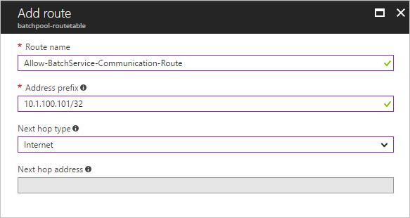

For more information, see [Create an Azure Batch pool in a virtual network](../batch/batch-virtual-network.md#user-defined-routes-for-forced-tunneling).

### Create a compute cluster in a virtual network

To create a Machine Learning Compute cluster, use the following steps:

1. Sign in to [Azure Machine Learning studio](https://ml.azure.com/), and then select your subscription and workspace.

1. Select __Compute__ on the left.

1. Select __Training clusters__ from the center, and then select __+__.

1. In the __New Training Cluster__ dialog, expand the __Advanced settings__ section.

1. To configure this compute resource to use a virtual network, perform the following actions in the __Configure virtual network__ section:

    1. In the __Resource group__ drop-down list, select the resource group that contains the virtual network.
    1. In the __Virtual network__ drop-down list, select the virtual network that contains the subnet.
    1. In the __Subnet__ drop-down list, select the subnet to use.

   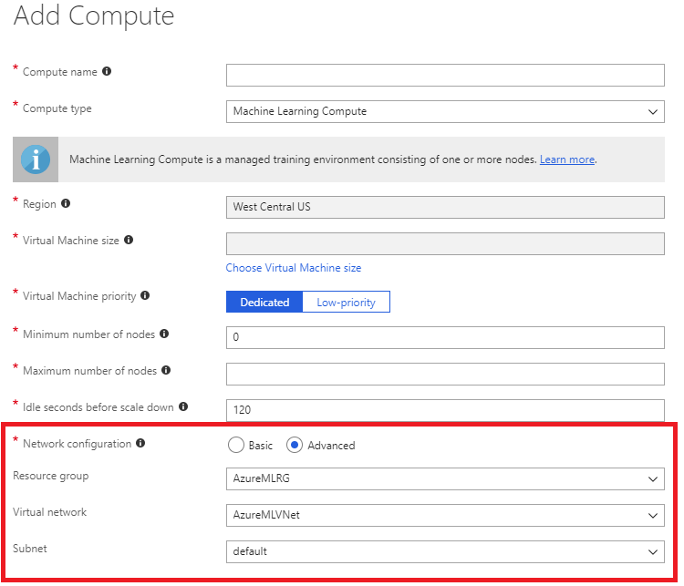

You can also create a Machine Learning Compute cluster by using the Azure Machine Learning SDK. The following code creates a new Machine Learning Compute cluster in the `default` subnet of a virtual network named `mynetwork`:

```python
from azureml.core.compute import ComputeTarget, AmlCompute
from azureml.core.compute_target import ComputeTargetException

# The Azure virtual network name, subnet, and resource group
vnet_name = 'mynetwork'
subnet_name = 'default'
vnet_resourcegroup_name = 'mygroup'

# Choose a name for your CPU cluster
cpu_cluster_name = "cpucluster"

# Verify that cluster does not exist already
try:
    cpu_cluster = ComputeTarget(workspace=ws, name=cpu_cluster_name)
    print("Found existing cpucluster")
except ComputeTargetException:
    print("Creating new cpucluster")

    # Specify the configuration for the new cluster
    compute_config = AmlCompute.provisioning_configuration(vm_size="STANDARD_D2_V2",
                                                           min_nodes=0,
                                                           max_nodes=4,
                                                           vnet_resourcegroup_name=vnet_resourcegroup_name,
                                                           vnet_name=vnet_name,
                                                           subnet_name=subnet_name)

    # Create the cluster with the specified name and configuration
    cpu_cluster = ComputeTarget.create(ws, cpu_cluster_name, compute_config)

    # Wait for the cluster to be completed, show the output log
    cpu_cluster.wait_for_completion(show_output=True)
```

When the creation process finishes, you train your model by using the cluster in an experiment. For more information, see [Select and use a compute target for training](how-to-set-up-training-targets.md).

## Use a storage account for your workspace

To use an Azure storage account for the workspace in a virtual network, use the following steps:

1. Create a compute resource (for example, a Machine Learning compute instance or cluster) behind a virtual network, or attach a compute resource to the workspace (for example, an HDInsight cluster, virtual machine, or Azure Kubernetes Service cluster). The compute resource can be for experimentation or model deployment.

   For more information, see the [Use a Machine Learning compute](#amlcompute), [Use a virtual machine or HDInsight cluster](#vmorhdi), and [Use Azure Kubernetes Service](#aksvnet) sections in this article.

1. In the Azure portal, go to the storage that's attached to your workspace.

   [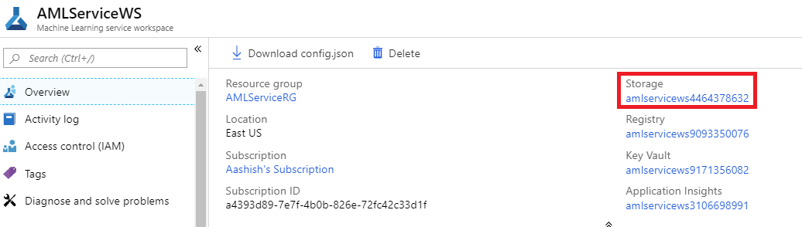](./media/how-to-enable-virtual-network/workspace-storage.png#lightbox)

1. On the **Azure Storage** page, select __Firewalls and virtual networks__.

   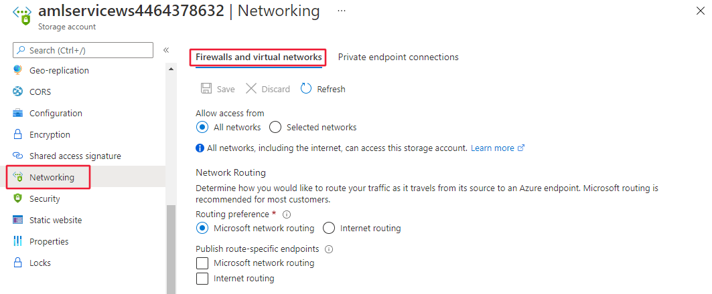

1. On the __Firewalls and virtual networks__ page, do the following actions:
    - Select __Selected networks__.
    - Under __Virtual networks__, select the __Add existing virtual network__ link. This action adds the virtual network where your compute  resides (see step 1).

        > [!IMPORTANT]
        > The storage account must be in the same virtual network and subnet as the compute instances or clusters used for training or inference.

    - Select the __Allow trusted Microsoft services to access this storage account__ check box.

    > [!IMPORTANT]
    > When working with the Azure Machine Learning SDK, your development environment must be able to connect to the Azure Storage Account. When the storage account is inside a virtual network, the firewall must allow access from the development environment's IP address.
    >
    > To enable access to the storage account, visit the __Firewalls and virtual networks__ for the storage account *from a web browser on the development client*. Then use the __Add your client IP address__ check box to add the client's IP address to the __ADDRESS RANGE__. You can also use the __ADDRESS RANGE__ field to manually enter the IP address of the development environment. Once the IP address for the client has been added, it can access the storage account using the SDK.

   [](./media/how-to-enable-virtual-network/storage-firewalls-and-virtual-networks-page.png#lightbox)

> [!IMPORTANT]
> You can place the both the _default storage account_ for Azure Machine Learning, or _non-default storage accounts_ in a virtual network.
>
> The default storage account is
> automatically provisioned when you create a workspace.
>
> For non-default storage accounts, the `storage_account` parameter in the [`Workspace.create()` function](https://docs.microsoft.com/python/api/azureml-core/azureml.core.workspace(class)?view=azure-ml-py#create-name--auth-none--subscription-id-none--resource-group-none--location-none--create-resource-group-true--sku--basic---friendly-name-none--storage-account-none--key-vault-none--app-insights-none--container-registry-none--cmk-keyvault-none--resource-cmk-uri-none--hbi-workspace-false--default-cpu-compute-target-none--default-gpu-compute-target-none--exist-ok-false--show-output-true-) allows you to specify a custom storage account by Azure resource ID.


<a id="aksvnet"></a>

## Azure Kubernetes Service

To add Azure Kubernetes Service (AKS) in a virtual network to your workspace, use the following steps:

> [!IMPORTANT]
> Before you begin the following procedure, follow the prerequisites in the [Configure advanced networking in Azure Kubernetes Service (AKS)](https://docs.microsoft.com/azure/aks/configure-azure-cni#prerequisites) how-to and plan the IP addressing for your cluster.
>
> The AKS instance and the Azure virtual network must be in the same region. If you secure the Azure Storage Account(s) used by the workspace in a virtual network, they must be in the same virtual network as the AKS instance.

> [!WARNING]
> Azure Machine Learning does not support using an Azure Kubernetes Service that has private link enabled.

1. Sign in to [Azure Machine Learning studio](https://ml.azure.com/), and then select your subscription and workspace.

1. Select __Compute__ on the left.

1. Select __Inference clusters__ from the center, and then select __+__.

1. In the __New Inference Cluster__ dialog, select __Advanced__ under __Network configuration__.

1. To configure this compute resource to use a virtual network, perform the following actions:

    1. In the __Resource group__ drop-down list, select the resource group that contains the virtual network.
    1. In the __Virtual network__ drop-down list, select the virtual network that contains the subnet.
    1. In the __Subnet__ drop-down list, select the subnet.
    1. In the __Kubernetes Service address range__ box, enter the Kubernetes service address range. This address range uses a Classless Inter-Domain Routing (CIDR) notation IP range to define the IP addresses that are available for the cluster. It must not overlap with any subnet IP ranges (for example, 10.0.0.0/16).
    1. In the __Kubernetes DNS service IP address__ box, enter the Kubernetes DNS service IP address. This IP address is assigned to the Kubernetes DNS service. It must be within the Kubernetes service address range (for example, 10.0.0.10).
    1. In the __Docker bridge address__ box, enter the Docker bridge address. This IP address is assigned to Docker Bridge. It must not be in any subnet IP ranges, or the Kubernetes service address range (for example, 172.17.0.1/16).

   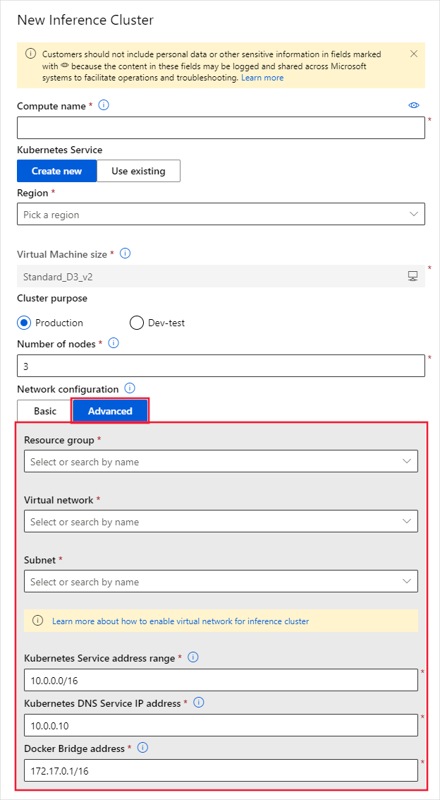

1. Make sure that the NSG group that controls the virtual network has an inbound security rule enabled for the scoring endpoint so that it can be called from outside the virtual network.
   > [!IMPORTANT]
   > Keep the default outbound rules for the NSG. For more information, see the default security rules in [Security groups](https://docs.microsoft.com/azure/virtual-network/security-overview#default-security-rules).

   [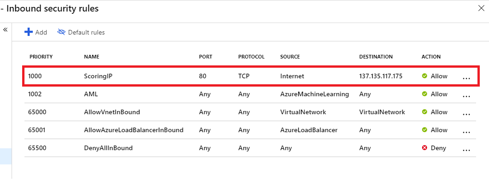](./media/how-to-enable-virtual-network/aks-vnet-inbound-nsg-scoring.png#lightbox)

You can also use the Azure Machine Learning SDK to add Azure Kubernetes Service in a virtual network. If you already have an AKS cluster in a virtual network, attach it to the workspace as described in [How to deploy to AKS](how-to-deploy-and-where.md). The following code creates a new AKS instance in the `default` subnet of a virtual network named `mynetwork`:

```python
from azureml.core.compute import ComputeTarget, AksCompute

# Create the compute configuration and set virtual network information
config = AksCompute.provisioning_configuration(location="eastus2")
config.vnet_resourcegroup_name = "mygroup"
config.vnet_name = "mynetwork"
config.subnet_name = "default"
config.service_cidr = "10.0.0.0/16"
config.dns_service_ip = "10.0.0.10"
config.docker_bridge_cidr = "172.17.0.1/16"

# Create the compute target
aks_target = ComputeTarget.create(workspace=ws,
                                  name="myaks",
                                  provisioning_configuration=config)
```

When the creation process is completed, you can run inference, or model scoring, on an AKS cluster behind a virtual network. For more information, see [How to deploy to AKS](how-to-deploy-and-where.md).

### Use private IPs with Azure Kubernetes Service

By default, a public IP address is assigned to AKS deployments. When using AKS inside a virtual network, you can use a private IP address instead. Private IP addresses are only accessible from inside the virtual network or joined networks.

A private IP address is enabled by configuring AKS to use an _internal load balancer_. 

> [!IMPORTANT]
> You cannot enable private IP when creating the Azure Kubernetes Service cluster. It must be enabled as an update to an existing cluster.

The following code snippet demonstrates how to **create a new AKS cluster**, and then update it to use a private IP/internal load balancer:

```python
import azureml.core
from azureml.core.compute.aks import AksUpdateConfiguration
from azureml.core.compute import AksCompute, ComputeTarget

# Verify that cluster does not exist already
try:
    aks_target = AksCompute(workspace=ws, name=aks_cluster_name)
    print("Found existing aks cluster")

except:
    print("Creating new aks cluster")

    # Subnet to use for AKS
    subnet_name = "default"
    # Create AKS configuration
    prov_config = AksCompute.provisioning_configuration(location = "eastus2")
    # Set info for existing virtual network to create the cluster in
    prov_config.vnet_resourcegroup_name = "myvnetresourcegroup"
    prov_config.vnet_name = "myvnetname"
    prov_config.service_cidr = "10.0.0.0/16"
    prov_config.dns_service_ip = "10.0.0.10"
    prov_config.subnet_name = subnet_name
    prov_config.docker_bridge_cidr = "172.17.0.1/16"

    # Create compute target
    aks_target = ComputeTarget.create(workspace = ws, name = "myaks", provisioning_configuration = prov_config)
    # Wait for the operation to complete
    aks_target.wait_for_completion(show_output = True)
    
    # Update AKS configuration to use an internal load balancer
    update_config = AksUpdateConfiguration(None, "InternalLoadBalancer", subnet_name)
    aks_target.update(update_config)
    # Wait for the operation to complete
    aks_target.wait_for_completion(show_output = True)
```

__Azure CLI__

```azurecli-interactive
az rest --method put --uri https://management.azure.com/subscriptions/<subscription-id>/resourceGroups/<resource-group>/providers/Microsoft.MachineLearningServices/workspaces/<workspace>/computes/<compute>?api-version=2018-11-19 --body @body.json
```

The contents of the `body.json` file referenced by the command are similar to the following JSON document:

```json
{ 
    "location": "<region>", 
    "properties": { 
        "resourceId": "/subscriptions/<subscription-id>/resourcegroups/<resource-group>/providers/Microsoft.ContainerService/managedClusters/<aks-resource-name>", 
        "computeType": "AKS", 
        "provisioningState": "Succeeded", 
        "properties": { 
            "loadBalancerType": "InternalLoadBalancer", 
            "agentCount": <agent-count>, 
            "agentVmSize": "vm-size", 
            "clusterFqdn": "<cluster-fqdn>" 
        } 
    } 
} 
```

> [!NOTE]
> Currently, you cannot configure the load balancer when performing an __attach__ operation on an existing cluster. You must first attach the cluster, and then perform an update operation to change the load balancer.

For more information on using the internal load balancer with AKS, see [Use internal load balancer with Azure Kubernetes Service](/azure/aks/internal-lb).

## Use Azure Container Instances (ACI)

Azure Container Instances are dynamically created when deploying a model. To enable Azure Machine Learning to create ACI inside the virtual network, you must enable __subnet delegation__ for the subnet used by the deployment.

To use ACI in a virtual network to your workspace, use the following steps:

1. To enable subnet delegation on your virtual network, use the information in the [Add or remove a subnet delegation](../virtual-network/manage-subnet-delegation.md) article. You can enable delegation when creating a virtual network, or add it to an existing network.

    > [!IMPORTANT]
    > When enabling delegation, use `Microsoft.ContainerInstance/containerGroups` as the __Delegate subnet to service__ value.

2. Deploy the model using [AciWebservice.deploy_configuration()](https://docs.microsoft.com/python/api/azureml-core/azureml.core.webservice.aci.aciwebservice?view=azure-ml-py#deploy-configuration-cpu-cores-none--memory-gb-none--tags-none--properties-none--description-none--location-none--auth-enabled-none--ssl-enabled-none--enable-app-insights-none--ssl-cert-pem-file-none--ssl-key-pem-file-none--ssl-cname-none--dns-name-label-none--primary-key-none--secondary-key-none--collect-model-data-none--cmk-vault-base-url-none--cmk-key-name-none--cmk-key-version-none--vnet-name-none--subnet-name-none-), use the `vnet_name` and `subnet_name` parameters. Set these parameters to the virtual network name and subnet where you enabled delegation.

## Azure Firewall

For information on using Azure Machine Learning with Azure Firewall, see [Use Azure Machine Learning workspace behind Azure Firewall](how-to-access-azureml-behind-firewall.md).

## Azure Container Registry

> [!IMPORTANT]
> Azure Container Registry (ACR) can be put inside a virtual network, however you must meet the following prerequisites:
>
> * Your Azure Machine Learning workspace must be Enterprise edition. For information on upgrading, see [Upgrade to Enterprise edition](how-to-manage-workspace.md#upgrade).
> * Your Azure Container Registry must be Premium version . For more information on upgrading, see [Changing SKUs](/azure/container-registry/container-registry-skus#changing-skus).
> * Your Azure Container Registry must be in the same virtual network and subnet as the storage account and compute targets used for training or inference.
> * Your Azure Machine Learning workspace must contain an [Azure Machine Learning compute cluster](how-to-set-up-training-targets.md#amlcompute).
>
>     When ACR is behind a virtual network, Azure Machine Learning cannot use it to directly build Docker images. Instead, the compute cluster is used to build the images.

1. To find the name of the Azure Container Registry for your workspace, use one of the following methods:

    __Azure portal__

    From the overview section of your workspace, the __Registry__ value links to the Azure Container Registry.

    :::image type="content" source="./media/how-to-enable-virtual-network/azure-machine-learning-container-registry.png" alt-text="Azure Container Registry for the workspace" border="true":::

    __Azure CLI__

    If you have [installed the Machine Learning extension for Azure CLI](reference-azure-machine-learning-cli.md), you can use the `az ml workspace show` command to show the workspace information.

    ```azurecli-interactive
    az ml workspace show -w yourworkspacename -g resourcegroupname --query 'containerRegistry'
    ```

    This command returns a value similar to `"/subscriptions/{GUID}/resourceGroups/{resourcegroupname}/providers/Microsoft.ContainerRegistry/registries/{ACRname}"`. The last part of the string is the name of the Azure Container Registry for the workspace.

1. To limit access to your virtual network, use the steps in [Configure network access for registry](../container-registry/container-registry-vnet.md#configure-network-access-for-registry). When adding the virtual network, select the virtual network and subnet for your Azure Machine Learning resources.

1. Use the Azure Machine Learning Python SDK to configure a compute cluster to build docker images. The following code snippet demonstrates how to do this:

    ```python
    from azureml.core import Workspace
    # Load workspace from an existing config file
    ws = Workspace.from_config()
    # Update the workspace to use an existing compute cluster
    ws.update(image_build_compute = 'mycomputecluster')
    ```

    > [!IMPORTANT]
    > Your storage account, compute cluster, and Azure Container Registry must all be in the same subnet of the virtual network.
    
    For more information, see the [update()](https://docs.microsoft.com/python/api/azureml-core/azureml.core.workspace.workspace?view=azure-ml-py#update-friendly-name-none--description-none--tags-none--image-build-compute-none--enable-data-actions-none-) method reference.

1. You must apply the following Azure Resource Manager template. This template enables your workspace to communicate with ACR.

    ```json
    {
    "$schema": "https://schema.management.azure.com/schemas/2015-01-01/deploymentTemplate.json#",
    "contentVersion": "1.0.0.0",
    "parameters": {
        "keyVaultArmId": {
        "type": "string"
        },
        "workspaceName": {
        "type": "string"
        },
        "containerRegistryArmId": {
        "type": "string"
        },
        "applicationInsightsArmId": {
        "type": "string"
        },
        "storageAccountArmId": {
        "type": "string"
        },
        "location": {
        "type": "string"
        }
    },
    "resources": [
        {
        "type": "Microsoft.MachineLearningServices/workspaces",
        "apiVersion": "2019-11-01",
        "name": "[parameters('workspaceName')]",
        "location": "[parameters('location')]",
        "identity": {
            "type": "SystemAssigned"
        },
        "sku": {
            "tier": "enterprise",
            "name": "enterprise"
        },
        "properties": {
            "sharedPrivateLinkResources":
    [{"Name":"Acr","Properties":{"PrivateLinkResourceId":"[concat(parameters('containerRegistryArmId'), '/privateLinkResources/registry')]","GroupId":"registry","RequestMessage":"Approve","Status":"Pending"}}],
            "keyVault": "[parameters('keyVaultArmId')]",
            "containerRegistry": "[parameters('containerRegistryArmId')]",
            "applicationInsights": "[parameters('applicationInsightsArmId')]",
            "storageAccount": "[parameters('storageAccountArmId')]"
        }
        }
    ]
    }
    ```
    
## Azure Data Lake Storage

Azure Data Lake Storage Gen 2 is a set of capabilities for big data analytics, built on Azure Blob storage. It can be used to store data used to train models with Azure Machine Learning. 

To use Data Lake Storage Gen 2 inside the virtual network of your Azure Machine Learning workspace, use the following steps:

1. Create an Azure Data Lake Storage gen 2 account. For more information, see [Create an Azure Data Lake Storage Gen2 storage account](../storage/blobs/data-lake-storage-quickstart-create-account.md).

1. Use the steps 2-4 in the previous section, [Use a storage account for your workspace](#use-a-storage-account-for-your-workspace), to put the account in the virtual network.

When using Azure Machine Learning with Data Lake Storage Gen 2 inside a virtual network, use the following guidance:

* If you use the __SDK to create a dataset__, and the system running the code __is not in the virtual network__, use the `validate=False` parameter. This parameter skips validation, which fails if the system is not in the same virtual network as the storage account. For more information, see the [from_files()](https://docs.microsoft.com/python/api/azureml-core/azureml.data.dataset_factory.filedatasetfactory?view=azure-ml-py#from-files-path--validate-true-) method.

* When using Azure Machine Learning Compute Instance or compute cluster to train a model using the dataset, it must be in the same virtual network as the storage account.

## Key vault instance 

The key vault instance that's associated with the workspace is used by Azure Machine Learning to store the following credentials:
* The associated storage account connection string
* Passwords to Azure Container Repository instances
* Connection strings to data stores

To use Azure Machine Learning experimentation capabilities with Azure Key Vault behind a virtual network, use the following steps:

1. Go to the key vault that's associated with the workspace.

   [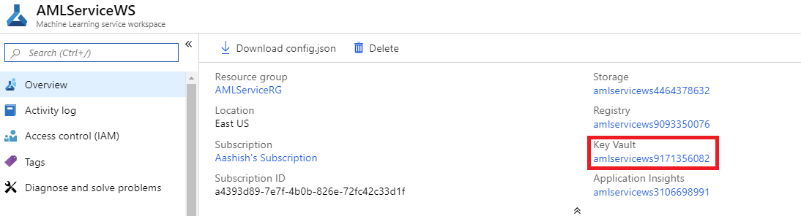](./media/how-to-enable-virtual-network/workspace-key-vault.png#lightbox)

1. On the **Key Vault** page, in the left pane, select __Firewalls and virtual networks__.

   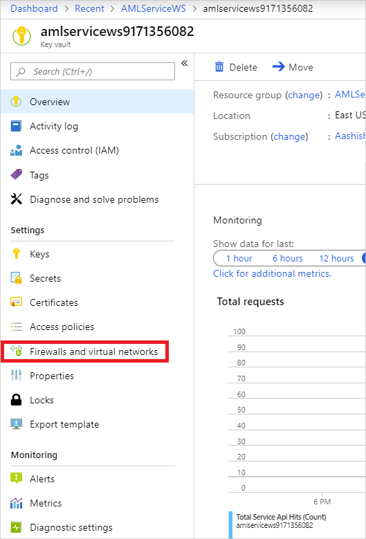

1. On the __Firewalls and virtual networks__ page, do the following actions:
    - Under __Allow access from__, select __Selected networks__.
    - Under __Virtual networks__, select __Add existing virtual networks__ to add the virtual network where your experimentation compute resides.
    - Under __Allow trusted Microsoft services to bypass this firewall__, select __Yes__.

   [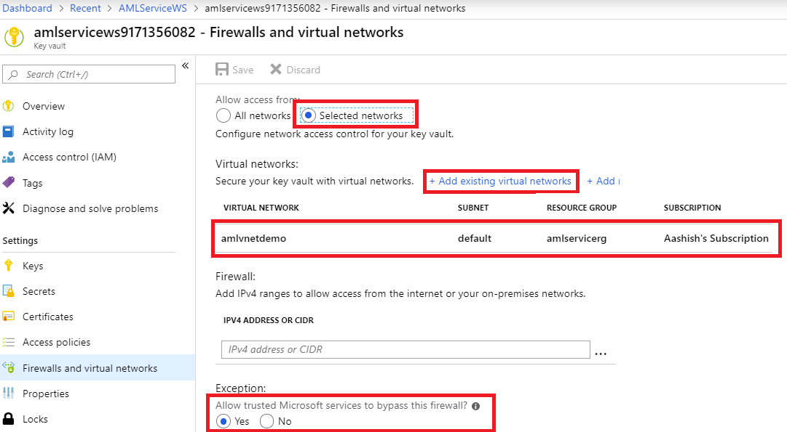](./media/how-to-enable-virtual-network/key-vault-firewalls-and-virtual-networks-page.png#lightbox)


## Azure Databricks

To use Azure Databricks in a virtual network with your workspace, the following requirements must be met:

> [!div class="checklist"]
> * The virtual network must be in the same subscription and region as the Azure Machine Learning workspace.
> * If the Azure Storage Account(s) for the workspace are also secured in a virtual network, they must be in the same virtual network as the Azure Databricks cluster.
> * In addition to the __databricks-private__ and __databricks-public__ subnets used by Azure Databricks, the __default__ subnet created for the virtual network is also required.

For specific information on using Azure Databricks with a virtual network, see [Deploy Azure Databricks in your Azure Virtual Network](https://docs.azuredatabricks.net/administration-guide/cloud-configurations/azure/vnet-inject.html).

<a id="vmorhdi"></a>

## Virtual machine or HDInsight cluster

> [!IMPORTANT]
> Azure Machine Learning supports only virtual machines that are running Ubuntu.

To use a virtual machine or Azure HDInsight cluster in a virtual network with your workspace, use the following steps:

1. Create a VM or HDInsight cluster by using the Azure portal or the Azure CLI, and put the cluster in an Azure virtual network. For more information, see the following articles:
    * [Create and manage Azure virtual networks for Linux VMs](https://docs.microsoft.com/azure/virtual-machines/linux/tutorial-virtual-network)

    * [Extend HDInsight using an Azure virtual network](https://docs.microsoft.com/azure/hdinsight/hdinsight-extend-hadoop-virtual-network)

1. To allow Azure Machine Learning to communicate with the SSH port on the VM or cluster, configure a source entry for the network security group. The SSH port is usually port 22. To allow traffic from this source, do the following actions:

    * In the __Source__ drop-down list, select __Service Tag__.

    * In the __Source service tag__ drop-down list, select __AzureMachineLearning__.

    * In the __Source port ranges__ drop-down list, select __*__.

    * In the __Destination__ drop-down list, select __Any__.

    * In the __Destination port ranges__ drop-down list, select __22__.

    * Under __Protocol__, select __Any__.

    * Under __Action__, select __Allow__.

   

    Keep the default outbound rules for the network security group. For more information, see the default security rules in [Security groups](https://docs.microsoft.com/azure/virtual-network/security-overview#default-security-rules).

    If you don't want to use the default outbound rules and you do want to limit the outbound access of your virtual network, see the [Limit outbound connectivity from the virtual network](#limiting-outbound-from-vnet) section.

1. Attach the VM or HDInsight cluster to your Azure Machine Learning workspace. For more information, see [Set up compute targets for model training](how-to-set-up-training-targets.md).


## Next steps

* [Set up training environments](how-to-set-up-training-targets.md)
* [Set up private endpoints](how-to-configure-private-link.md)
* [Where to deploy models](how-to-deploy-and-where.md)
* [Use TLS to secure a web service through Azure Machine Learning](how-to-secure-web-service.md)
