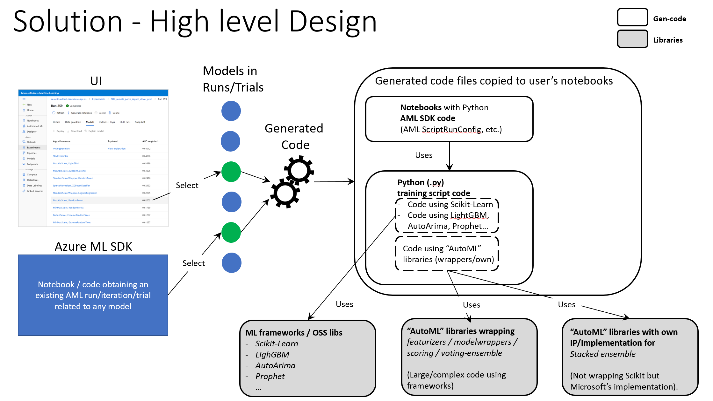
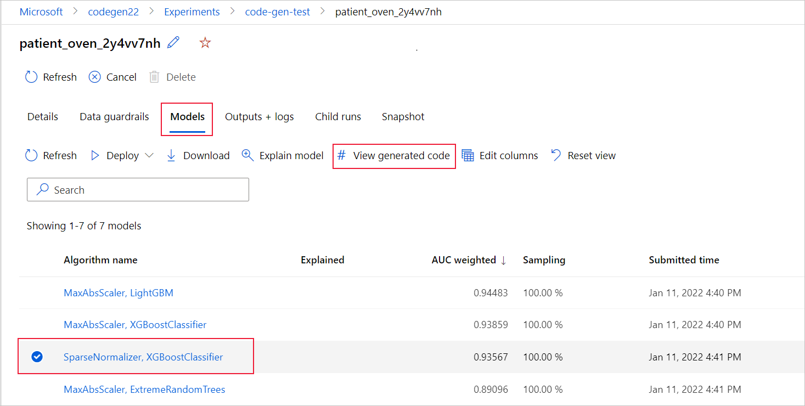
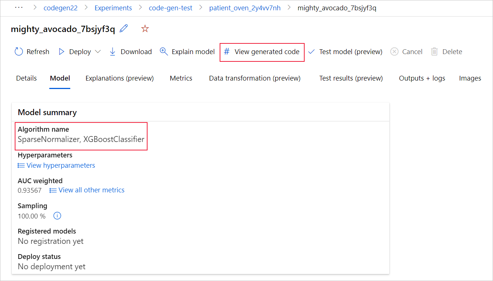

# Generate an AutoML model's training code (preview)

[!INCLUDE [preview disclaimer](../../includes/machine-learning-preview-generic-disclaimer.md)]

In this article, you learn how to generate the training code from any automated machine learning trained model. 

Code generation for automated ML trained models allows you to see the underlying data preprocessing, algorithm selection, featurization, hyperparameter tuning automated ML uses to train and develop the model for a specific run. You can select any automated ML trained model, recommended or child run, and generate the Python training code that created that specific model.

With the generated code you can, 

*  **Learn** what featurization process and hyperparameters the model algorithm uses.
* **Track/version/audit** trained models. Store versioned code to track what specific training code is used with the model that's to be deployed to production.
* **Customize** the training code by changing hyperparameters or applying your ML and algorithms skills/experience, and retrain a new model with your customized code.

You can generate the code for the following scenarios: 

- Model data pre-process (featurization and scaling)
- Classification models
- Regression models
- Time Series Forecasting models

> [!NOTE]
> Computer vision models and natural language processing based models do not currently support code generation. 

## Prerequisites

* An Azure Machine Learning workspace. To create the workspace, see [Create an Azure Machine Learning workspace](how-to-manage-workspace.md).

* This article assumes some familiarity with setting up an automated machine learning experiment. Follow the [tutorial](tutorial-auto-train-models.md) or [how-to](how-to-configure-auto-train.md) to see the main automated machine learning experiment design patterns.

* Automated ML code generation is only available for experiments run on remote Azure ML compute target. Code generation is not supported for local runs.

* Install the latest Azure Machine Learning Python SDK in a Conda environment. We recommend you create a new/clean Conda environment.

    * You can run your code via a Jupyter notebook in an Azure ML Compute Instance with the latest Azure ML SDK already installed. The compute instance comes with a ready-to-use Conda environment that is compatible with the automated ML code generation capability (preview).

    * Alternatively, you can create a new local Conda environment on your local machine and then install the latest Azure ML SDK. [How to install AutoML client SDK in Conda environment with the `automl` package](https://github.com/Azure/azureml-examples/tree/main/python-sdk/tutorials/automl-with-azureml#setup-using-a-local-conda-environment).

## Enable code generation for automated ML experiments

You can enable code generation for your automated ML experiments in your AutoMLConfig object. Before submitting your automated ML experiment, you need to set the `enable_code_generation=True` parameter. Confirm that you call `experiment.submit()` from a Conda environment that contains the latest Azure ML SDK with automated ML. This ensures that code generation is triggered properly for the experiments that are run on a remote compute target.

```python
config = AutoMLConfig( task="classification",
                       training_data=data,
                       label_column_name="label",
                       compute_target=compute_target,
                       enable_code_generation=True
                     )
```

When you enable code generation, automated ML generates the model's training code for each model trained and created for each training run. There are two main files with the generated code,

* **script.py** This is the model's training code, the interesting code you want to analyze with the featurization steps, specific algorithm used, and hyperparameters.

* **script_run_notebook.ipynb**: Notebook with boiler-plate code to run the model's training code (script.py) in AzureMLCompute through Azure ML SDK classes such as `ScriptRunConfig`. 



## Get generated code and model artifacts

After the automated ML training run completes, you can get the `script.py` and the `script_run_notebook.ipynb` files with the following code.

```python
remote_run.download_file("outputs/generated_code/script.py", "script.py")
remote_run.download_file("outputs/generated_code/script_run_notebook.ipynb", "script_run_notebook.ipynb")
```

You also have the option to view the generated code through the Azure Machine Learning studio UI. To do so, you can select the **View generated code** button on the **Models** tab on the automated ML experiments parent run page. This button redirects to the Notebooks portal extension, where you can view and run the generated code.



You can also access to the model's generated code from the top of the child run page.




## script.py

The `script.py` file contains the core logic needed to train a model with the previously used hyperparameters. While intended to be executed in the context of an Azure ML script run, with some modifications it can also be run standalone.

The script can roughly be broken down into several different parts: data loading, data preparation, data featurization, preprocessor and model specification, and training.

### Data loading

The function `get_training_dataset()` loads the previously used dataset. It assumes that the script is run in an AzureML script run under the same workspace as the original experiment.

```python
def get_training_dataset():
    from azureml.core import Dataset, Workspace, Run
    
    ws = Run.get_context().experiment.workspace
    dataset = Dataset.get_by_id(workspace=ws, id='your_dataset_id')
    return dataset.to_pandas_dataframe()
```

When running as part of a script run, `Run.get_context().experiment.workspace` retrieves the correct workspace. However, if this script is run inside of a different workspace or run locally without using `ScriptRunConfig`, [you need to modify the script to specify the appropriate workspace explicitly](/python/api/azureml-core/azureml.core.workspace.workspace).

Once the workspace has been retrieved, the original dataset is retrieved by its ID. Another dataset can also be specified, either using [`get_by_id()`](/python/api/azureml-core/azureml.core.dataset.dataset#get-by-id-workspace--id-) if you know
its ID, or [`get_by_name()`](/python/api/azureml-core/azureml.core.dataset.dataset#get-by-name-workspace--name--version--latest--) if you know its name.

You can also opt to replace this entire function with your own data loading mechanism; the only constraints are that the return value must be a Pandas dataframe and that the data must have the same shape as in the original experiment.

### Data preparation

The function `prepare_data()` cleans the data, splits out the feature and sample weight columns and prepares the data for use in training.

```python
def prepare_data(dataframe):
    from azureml.automl.runtime import data_cleaning
    
    label_column_name = 'target'
    
    # extract the features, target and sample weight arrays
    y_train = dataframe[label_column_name].values
    X_train = dataframe.drop([label_column_name], axis=1)
    sample_weights = None
    X_train, y_train, sample_weights = data_cleaning._remove_nan_rows_in_X_y(X_train, y_train, sample_weights, is_timeseries=False, target_column=label_column_name)
    return X_train, y_train, sample_weights
```


At this point, the dataframe from the data loading step is passed in. The label column and sample weights, if originally specified, are extracted and rows containing `NaN` are dropped from the input data.

If additional data preparation is desired, it can be done in this step.

### Data featurization

The function `generate_data_transformation_config()` specifies the featurization step in the final scikit-learn pipeline. The featurizers used in the original experiment are reproduced here, along with their parameters.

For example, a possible data transformation that can happen in this function would be multiple columns could be transformed with an imputer like, `SimpleImputer()`, `StringCastTransformer()`, or `LabelEncoderTransformer()`. 

> [!NOTE] 
> Transformers are applied depending on each column, so if you have many columns in your dataset (i.e. 50 or 100 columns) you can end up with tens of blocks of code doing the column's data transformations, so the size of this function can be very significant depending on the number of columns in your dataset.

With a classification and regression tasks, featurizers are combined with the corresponding [`DataFrameMappers`](https://github.com/scikit-learn-contrib/sklearn-pandas) into [`TransformerAndMapper`](/python/api/azureml-automl-runtime/azureml.automl.runtime.featurization.transformer_and_mapper.transformerandmapper) objects. These combined objects are wrapped in the [`DataTransformer`](/python/api/azureml-automl-runtime/azureml.automl.runtime.featurization.data_transformer.datatransformer).

For time-series forecasting models, multiple time series-aware featurizers are collected into a scikit-learn pipeline, then wrapped in the [`TimeSeriesTransformer`](/python/api/azureml-automl-runtime/azureml.automl.runtime.featurizer.transformer.timeseries.timeseries_transformer.timeseriestransformer).

### Preprocessor specification

The function `generate_preprocessor_config()`, if present, specifies a preprocessing step to be done after featurization in the final scikit-learn pipeline.

Normally, this preprocessing step only consists of data standardization/normalization using [`sklearn.preprocessing`](https://scikit-learn.org/stable/modules/preprocessing.html).

Automatd ML only specifies a preprocessing step for non-ensemble classification and regression models.

Here's an example of a generated preprocessor code:

```python
def generate_preprocessor_config():
    from azureml.automl.runtime.shared.model_wrappers import StandardScalerWrapper
    
    preproc = StandardScalerWrapper(
        copy=True,
        with_mean=False,
        with_std=False
    )
    
    return preproc
```

### Algorithm and hyperparameters specification

This is probably the most interesting code for many ML professionals. 

The `generate_algorithm_config()` function specifies the actual algorithm and hyperparameters for training the model as the last stage of the final scikit-learn pipeline, as in the following example using an XGBoostClassifier algorithm with specific hyperparameters.

```python
def generate_algorithm_config():
    from azureml.automl.runtime.shared.model_wrappers import XGBoostClassifier
    from azureml.automl.runtime.shared.problem_info import ProblemInfo
    
    algorithm = XGBoostClassifier(
        random_state=0,
        n_jobs=-1,
        problem_info=ProblemInfo(
            gpu_training_param_dict={'processing_unit_type': 'cpu'}
        ),
        booster='gbtree',
        colsample_bytree=0.6,
        eta=0.1,
        gamma=10,
        max_depth=7,
        max_leaves=0,
        n_estimators=100,
        objective='reg:logistic',
        reg_alpha=0.20833333333333334,
        reg_lambda=2.0833333333333335,
        subsample=0.8,
        tree_method='auto'
    )
    
    return algorithm
```

In the case of ensemble models, `generate_preprocessor_config_N()` (if needed) and `generate_algorithm_config_N()` will be defined for each learner in the ensemble model,
where `N` represents the placement of each learner in the ensemble model's list. In addition, `generate_algorithm_config_meta()` will be defined in the case of
stack ensemble models for the meta learner.

### Training

Code generation emits `build_model_pipeline()` and `train_model()` for defining the scikit-learn pipeline and for calling `fit()` on it, respectively.

```python
def build_model_pipeline():
    from sklearn.pipeline import Pipeline
    
    pipeline = Pipeline(
        steps=[
               ('dt', generate_data_transformation_config()),
               ('preproc', generate_preprocessor_config()),
               ('model', generate_algorithm_config())
        ]
    )
    
    return pipeline
```

Here, the scikit-learn pipeline includes the featurization step, a preprocessor (if used) and then the algorithm/model.

For time-series forecasting models, the scikit-learn pipeline is wrapped in a `ForecastingPipelineWrapper`; the `ForecastingPipelineWrapper` has some additional logic
needed to properly handle time-series data depending on the algorithm used.

Once we have the Scikit-Learn pipeline, all that is left is to call `fit()` on it in order to train the model:

```python
def train_model(X, y, sample_weights):
    model_pipeline = build_model_pipeline()
    
    model = model_pipeline.fit(X, y)
    return model
```

The return value from `train_model()` is the model fitted/trained on the input data.

The code that runs all the previous functions is the following:

```python
def main():
    # The following code is for when running this code as part of an AzureML script run.
    from azureml.core import Run
    run = Run.get_context()
    
    df = get_training_dataset()
    X, y, sample_weights = prepare_data(df)
    model = train_model(X, y, sample_weights)
```

Once you have the trained model, you can use it for making predictions such as in the following code:

```python
y_pred = model.predict(X)
```

Finally, the model is serialized and saved as a `.pkl` file named "model.pkl":

```python
    joblib.dump(model, 'model.pkl')
    run.upload_file('outputs/model.pkl', 'model.pkl')
```

## script_run_notebook.ipynb

The `script_run_notebook.ipynb` notebook serves as an easy way to execute `script.py` on an Azure ML compute.

It is similar to the existing automated ML sample notebooks however, there are a couple of key differences as explained in the following sections.

### Environment

Typically the training environment for automated ML runs is automatically set by the SDK. However, when running a custom script run like the generated code, automated ML is no longer driving the process so the environment must be specified for the script run to succeed.

Code generation reuses the environment that was used in the original automated ML experiment, if possible; this guarantees that the training script run will not fail due to missing
dependencies and has the side benefit of not needing a Docker image rebuild step, which saves time and compute resources.

If you make changes to `script.py` that require additional dependencies, or you would like to use your own environment, you will need to update the `Create environment` cell in `script_run_notebook.ipynb` accordingly.

For additional documentation on AzureML environments, see [this page](/python/api/azureml-core/azureml.core.environment.environment).

### Submitting the experiment

Since the generated code is not driven by automated ML anymore, instead of creating an `AutoMLConfig` and then passing it to `experiment.submit()`, you need to create a [`ScriptRunConfig`](/python/api/azureml-core/azureml.core.scriptrunconfig) and provide the generated code (script.py) to it, like in the following example.

```python
from azureml.core import ScriptRunConfig

src = ScriptRunConfig(source_directory=project_folder, 
                      script='script.py', 
                      compute_target=cpu_cluster, 
                      environment=myenv,
                      docker_runtime_config=docker_config)
 
run = experiment.submit(config=src)
```

All of the parameters in the above snippet are regular dependencies needed to run `ScriptRunConfig`, such as compute, environment, etc. For further information on how to use ScriptRunConfig, read the article [Configure and submit training runs](how-to-set-up-training-targets.md).


### Downloading and loading the serialized trained model in memory

Once you have a trained model, you can save/serialize it to a `.pkl` file. It is possible that the model will not serialize/deserialize correctly using `pickle.dump()` and `pickle.load()` due to pickle limitations (for example, lambda functions cannot be serialized using pickle). Hence, `joblib.dump()` and `joblib.load()` should be used instead.

The following example is how you download and load in memory a model that was trained in AML compute with ScriptRunConfig. This code can run in the same notebook you used the Azure ML SDK ScriptRunConfig.

```python
import joblib

# Load the fitted model from the script run.

# Note that if training dependencies are not installed on the machine
# this notebook is being run from, this step can fail.
try:
    # Download the model from the run in the Workspace
    run.download_file("outputs/model.pkl", "model.pkl")

    # Load the model into memory
    model = joblib.load("model.pkl")

except ImportError:
    print('Required dependencies are missing; please run pip install azureml-automl-runtime.')
    raise

```

### Making predictions with the model in memory

Finally, you can load test data in a Pandas dataframe and use the model to make predictions, as in the following code.

```python
import os
import numpy as np
import pandas as pd

DATA_DIR = "."
filepath = os.path.join(DATA_DIR, 'porto_seguro_safe_driver_test_dataset.csv')

test_data_df = pd.read_csv(filepath)

print(test_data_df.shape)
test_data_df.head(5)

#test_data_df is a Pandas Dataframe with test data
y_predictions = model.predict(test_data_df)
```

In an Azure ML compute instance you should have all the automated ML dependencies, so you should be able to load the model and predict from any notebook in a compute instance recently created.

However, in order to load that model in a notebook in your custom local Conda environment, you need to have all the dependencies coming from the environment used when training (AutoML environment) installed.

## Next steps

* + Learn more about [how and where to deploy a model](how-to-deploy-and-where.md).
* See how to [enable interpretability features](how-to-machine-learning-interpretability-automl.md) specifically within automated ML experiments.