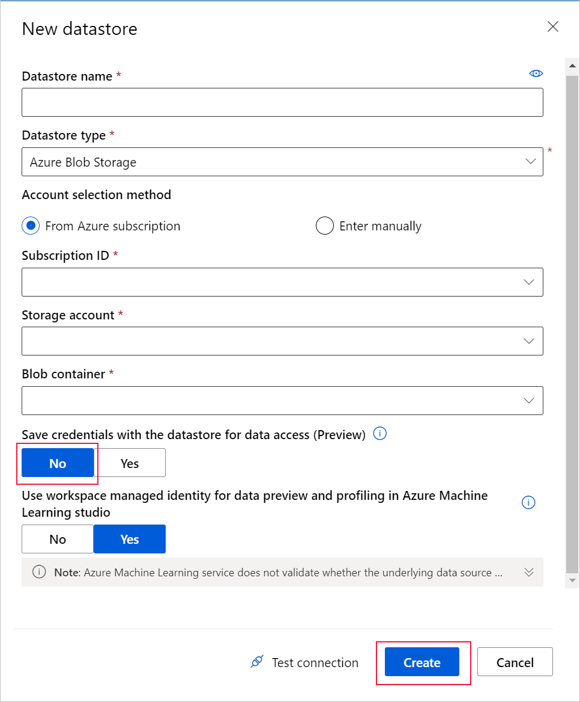

# Connect to storage with identity-based data access (preview)

>[!IMPORTANT]
> The functionalities presented in this article are in preview, and should be considered [experimental](/python/api/overview/azure/ml/?preserve-view=true&view=azure-ml-py#stable-vs-experimental) preview features that may change at any time.

In this article, learn how to connect to storage services on Azure with identity-based data access and Azure Machine Learning datastores.  

Typically, datastores use key-based data access to confirm that you have permission to access the storage service. They store connection information, like your subscription ID and token authorization, in your [Key Vault](https://azure.microsoft.com/services/key-vault/) that's associated with the workspace. When you create a datastore that uses identity-based data access, your [Azure Active Directory](../active-directory/fundamentals/active-directory-whatis.md) token is used to confirm that you have permission to access the storage service. In this scenario, no authentication credentials are saved, and only the storage account information is stored in the datastore. 

You can use the [Azure Machine Learning Python SDK](#python) or the [Azure Machine Learning studio](#studio) to create and register datastores with identity-based data access.

To create datastores that use key-based authentication, like with access keys or service principals, see [Connect to storage services on Azure](how-to-access-data.md).

## Identity-based data access in Azure Machine Learning

There are a couple areas to apply identity-based data access in Azure Machine Learning, especially if you are working with confidential data and need more granular data access management. 

1. Accessing storage services.
1. Training machine learning models with private data.

### Accessing storage services

You can connect to storage services via identity-based data access with Azure Machine Learning datastores or Azure Machine Learning datasets. 

Usually, datastores store authentication credentials to ensure you have permission to access the storage service. When these credentials are registered with datastores, any user with the workspace *Reader* role is able to retrieve them-- which can be a security concern for some organizations. [Learn more about the workspace *Reader* role](how-to-assign-roles.md#default-roles). 

When you use identity-based data access, Azure Machine Learning prompts you for your Azure Active Directory token for data access authentication, instead of storing your credentials in the datastore. 

The same behavior applies when you,
* [Create a dataset directly from storage urls](#use-data-in-storage). 

* Work with data interactively, via
    * Jupyter notebook on your local machine or [compute instance]().
    * Azure Machine Learning studio, which includes data profile and preview, automated machine learning, designer and data labeling projects. 

> [!NOTE]
> Credentials include: subscription ID, shared access signature (SAS) tokens, storage access keys and service principal information like, client ID and tenant ID.

### Model training on private data

Certain machine learning scenarios involve training models with confidential or private data. In such cases, data scientists need to execute training workflows without exposure to the confidential input data. In this scenario, a managed identity of the training compute is used for data access authentication. This way storage admins can grant **Storage Blob Data Reader** access to the compute, instead of the data scientists to ensure confidentiality. Learn how to [set up managed identity on compute](how-to-create-attach-compute-cluster.md#managed-identity).


## Prerequisites

- An Azure subscription. If you don't have an Azure subscription, create a free account before you begin. Try the [free or paid version of Azure Machine Learning](https://aka.ms/AMLFree).

- An Azure storage account with a supported storage type. The following storage types are supported in preview. 
    - [Azure Blob Storage](../storage/blobs/storage-blobs-overview.md)
    - [Azure Data Lake Gen 1](../data-lake-store/index.yml)
    - [Azure Data Lake Gen 2](../storage/blobs/data-lake-storage-introduction.md)

- The [Azure Machine Learning SDK for Python](/python/api/overview/azure/ml/intro?preserve-view=true&view=azure-ml-py), or access to [Azure Machine Learning studio](https://ml.azure.com/).

- An Azure Machine Learning workspace.
  
  Either [create an Azure Machine Learning workspace](how-to-manage-workspace.md) or use an existing one via the Python SDK. 

    Import the `Workspace` and `Datastore` class, and load your subscription information from the file `config.json` using the function `from_config()`. This looks for the JSON file in the current directory by default, but you can also specify a path parameter to point to the file using `from_config(path="your/file/path")`.

   ```Python
   import azureml.core
   from azureml.core import Workspace, Datastore
        
   ws = Workspace.from_config()
   ```

## Storage access permissions

To ensure you securely connect to your storage service on Azure, Azure Machine Learning requires that you have permission to access the corresponding data storage.

Identity-based data access only supports connections to the following storage services:

* Azure Blob Storage
* Azure Data Lake Generation 1
* Azure Data Lake Generation 2

To access these storage services you must have at minimum **Storage Blob Data Reader** access. Learn more about [Storage Blob Data Reader](../role-based-access-control/built-in-roles.md#storage-blob-data-reader). Only storage account owners can [change your access level via the Azure portal](/storage/common/storage-auth-aad-rbac-portal.md).

If you are training a model on a remote compute target, the compute identity must be granted with at least **Storage Blob Data Reader** role from the storage service. Learn how to [set up managed identity on compute](how-to-create-attach-compute-cluster.md#managed-identity).

## Work with virtual networks

By default, Azure Machine Learning  cannot communicate with a storage account that is behind a firewall or within a virtual network.

Storage accounts can be configured to allow access only from within specific virtual networks. When this is the case, additional restrictions and configurations are required to ensure data is not leaked outside of the network.  

**For Python SDK users**, to access your data via your training script on a compute target, the compute target needs to be inside the same virtual network and subnet of the storage.  

**For Azure Machine Learning studio users**, several features rely on being able to read data from a dataset; such as dataset previews, profiling and automated machine learning. For these features to work with storage behind virtual networks, use a [workspace managed identity in the studio](how-to-enable-studio-virtual-network.md) to allow Azure Machine Learning to access the storage account from outside the virtual network. 

Azure Machine Learning can receive requests from clients outside of the virtual network. To ensure that the entity requesting data from the service is safe, [set up Azure Private Link for your workspace](how-to-configure-private-link.md).

<a name="python"></a>
## Create and register datastores with the SDK

When you register a storage service on Azure as a datastore, you automatically create and register that datastore to a specific workspace. Review the [storage access permission](#storage-access-permissions) section for guidance on what type of permission is needed, and the [work with virtual network](#work-with-virtual-networks) section for details on how to connect to data storage behind virtual networks.

In the code examples in following sections, notice the absence of authentication parameters, like `sas_token`, `account_key`, `subscription_id` or service principal `client_id`. This omission, indicates that Azure Machine Learning is to use your Azure Active Directory token for data access authentication.

> [!NOTE]
> Datastore name should only consist of lowercase letters, digits and underscores. 

### Azure blob container

To register an Azure blob container as a datastore, use [`register_azure_blob_container()`](/python/api/azureml-core/azureml.core.datastore%28class%29?preserve-view=true&view=azure-ml-py#&preserve-view=trueregister-azure-blob-container-workspace--datastore-name--container-name--account-name--sas-token-none--account-key-none--protocol-none--endpoint-none--overwrite-false--create-if-not-exists-false--skip-validation-false--blob-cache-timeout-none--grant-workspace-access-false--subscription-id-none--resource-group-none-).

The following code creates and registers the `credentialless_blob`datastore to the `ws` workspace and assigns it to the variable, `blob_datastore`. This datastore accesses the `my_container_name` blob container on the `my-account-name` storage account.

```Python
# create blob datastore without credentials
blob_datastore = Datastore.register_azure_blob_container(workspace=ws,
                                                      datastore_name='credentialless_blob',
                                                      container_name='my_container_name',
                                                      account_name='my_account_name')
```

### Azure Data Lake Storage Generation 1

For an Azure Data Lake Storage Generation 1 (ADLS Gen 1) datastore, use [register_azure_data_lake()](/python/api/azureml-core/azureml.core.datastore.datastore?preserve-view=true&view=azure-ml-py#&preserve-view=trueregister-azure-data-lake-workspace--datastore-name--store-name--tenant-id-none--client-id-none--client-secret-none--resource-url-none--authority-url-none--subscription-id-none--resource-group-none--overwrite-false--grant-workspace-access-false-) to register a datastore that connects to an Azure DataLake Generation 1 storage.

The following code creates and registers the `credentialless_adls1` datastore to the `workspace` workspace and assigns it to the variable, `adls_dstore`. This datastore accesses the `adls_storage` Azure Data Lake Store storage account.

```Python
# create adls gen1 without credentials
adls_dstore = Datastore.register_azure_data_lake(workspace = workspace,
                                                 datastore_name='credentialless_adls1',
                                                 store_name='adls_storage')

```

### Azure Data Lake Storage Generation 2

For an Azure Data Lake Storage Generation 2 (ADLS Gen 2) datastore, use [register_azure_data_lake_gen2()](/python/api/azureml-core/azureml.core.datastore.datastore?preserve-view=true&view=azure-ml-py#&preserve-view=trueregister-azure-data-lake-gen2-workspace--datastore-name--filesystem--account-name--tenant-id--client-id--client-secret--resource-url-none--authority-url-none--protocol-none--endpoint-none--overwrite-false-) to register a datastore that connects to an Azure DataLake Gen 2 storage.

The following code creates and registers the `credentialless_adls2` datastore to the `ws` workspace and assigns it to the variable, `adls2_dstore`. This datastore accesses the file system `tabular` in the `myadls2` storage account.  

```python
# createn adls2 datastore without credentials
adls2_dstore = Datastore.register_azure_data_lake_gen2(workspace=ws, 
                                                       datastore_name='credentialless_adls2', 
                                                       filesystem='tabular', 
                                                       account_name='myadls2')
```

<a name="studio"></a>
## Create datastores with studio

For a low code experience, you can create datastores via the Azure Machine Learning studio.

Create a datastore with identity-based data access with the following steps.

1. Sign in to [Azure Machine Learning studio](https://ml.azure.com/).
1. Select **Datastores** on the left pane under **Manage**.
1. Select **+ New datastore**.
1. Provide a name for your new datastore.
1. Under **Datastore type**, select the type of storage you want to connect to.
    1. This preview functionality only supports connections to Azure Blobs and Azure Data Lake Storage Generations 1 and 2.
1. Provide your **Subscription ID**.
1. Enter the name of your storage account or data lake.
1. For **Save credentials with the datastore for data access (Preview)**, select **No**.
1. For **Use workspace managed identity for data preview and profiling in Azure Machine Learning studio**,
    1. If your particular scenario involves a virtual network, select **Yes**.
    1. Otherwise, select **No**
1. Select **Create**.

The following example demonstrates what the form looks like when you create an **Azure blob datastore**:



## Use data in storage
[Azure Machine Learning datasets](how-to-create-register-datasets.md) are the recommended way to interact with your data in storage with Azure Machine Learning. 

Datasets package your data into a lazily evaluated consumable object for machine learning tasks, like training. They also provide the ability to [download or mount](how-to-train-with-datasets.md#mount-vs-download) files of any format from Azure storage services like, Azure Blob storage and Azure Data Lakes, to a compute target.

To create datasets that use identity-based data access, you can 
*  Reference paths from datastores that also use identity-based data access. 
<br>In the following example, `blob_datastore` was previously created using identity-based data access.   

    ```python
    blob_dataset = Dataset.Tabular.from_delimited_files(blob_datastore,'test.csv') 
    ```

* Skip the datastore and create datasets directly from storage urls.

    ```python
    blob_dset = Dataset.File.from_files(‘https://myblob.blob.core.windows.net/may/keras-mnist-fashion/’)
    ```

## Next steps

* [Create an Azure machine learning dataset](how-to-create-register-datasets.md).
* [Train with datasets](how-to-train-with-datasets.md).
* [Create a datastore with key-based data access](how-to-access-data.md).