# Debug jobs and monitor training progress

Machine learning model training is usually an iterative process and requires significant experimentation. With the AzureML interactive job experience, data scientists can now use the AzureML Python SDKv2, AzureML CLIv2 or AzureML Studio to quickly access the container where their job is running to iterate on training scripts, monitor training progress or debug the job remotely like they usually do on their local machines. This is possible to do via different training applications including **JupyterLab, TensorBoard, VS Code** or by connecting via **SSH** directly into the job container.  

Note that interactive training is supported on **AzureML Compute Cluster** and **Azure Arc-enabled Kubernetes Cluster**.

## Pre-requisites
- [Get started with training on AzureML](./how-to-train-model.md) 
- To use **VS Code**, please [follow this guide](/how-to-setup-vs-code) to set-up the Azure Machine Learning & the Azure Machine Learning -- Remote extension.
- Make sure your job environment has the `openssh-server` and `ipykernel ~=6.0` packages installed (all AzureML curated training environments have these installed by default)
- Interactive jobs cannot be used on distributed training runs where the distribution type is anything other than Pytorch or Tensorflow (for example, MPI or custom)
  
   

## Interact with your job container

By specificing interactive applications at job creation, you can connect directly to the container on the compute node where your job is running. This allows you to test or debug your job in the exact same environment where it would run. You can also use VS Code to attach to the running process and debug as you would locally. 

### Get started with AzureML Studio
#### Enable during job submission
1. Create a new job from the left navigation pane in the studio portal.

  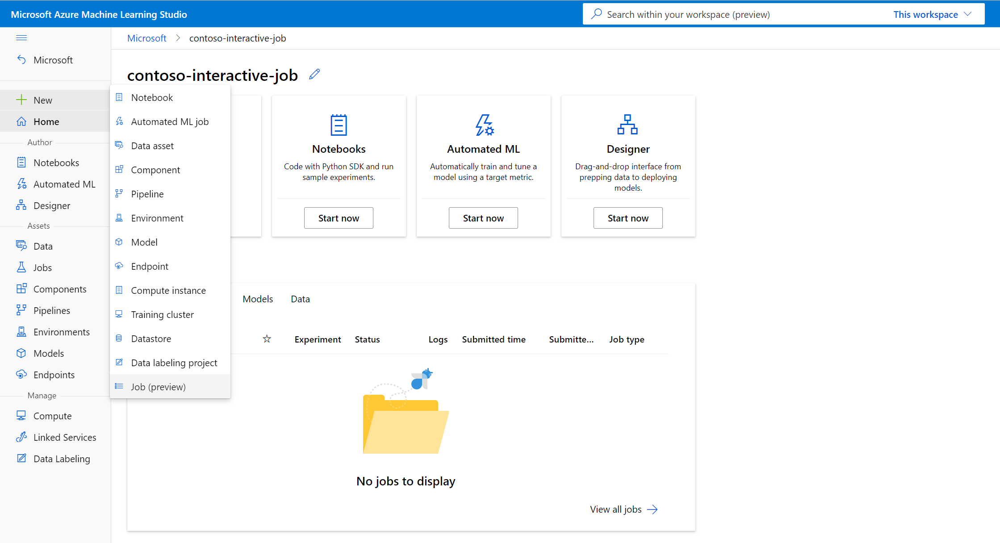 

2. Choose `Compute cluster` or `Attached compute` (Kubernetes) as the compute type, choose the compute target, and specify how many nodes you need in `Instance count`. 

  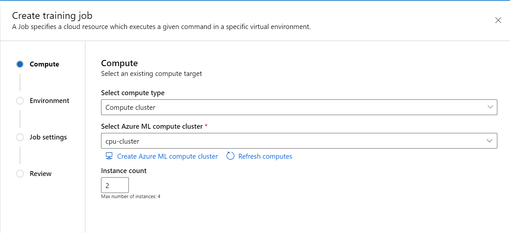 

3. Follow the wizard to choose the environment you want to start the job.

  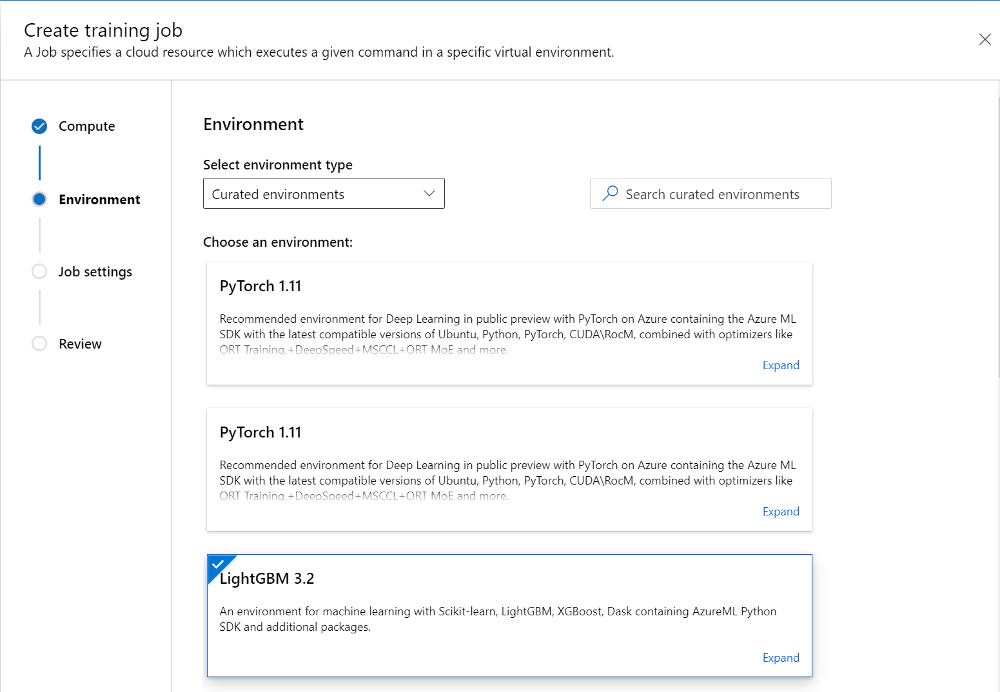 

4. In `Job settings` step, add your training code (and input/output data) and reference it in your command to make sure it's mounted to your job.

  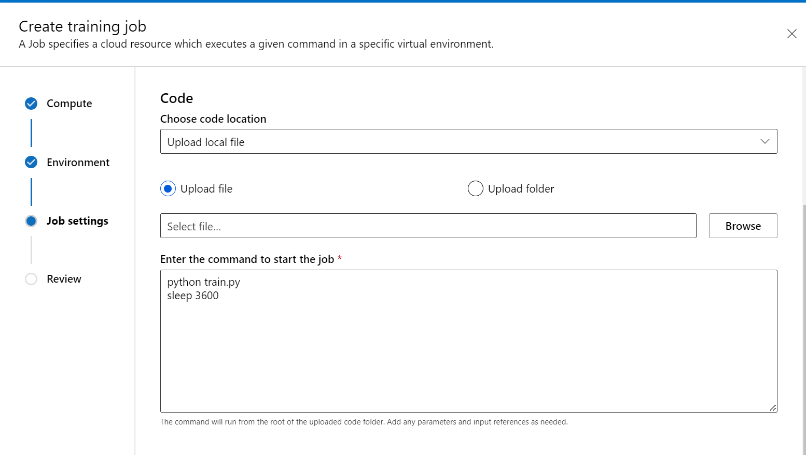 

  Note that you can put `sleep <specific time>` at the end of your command to speicify the amount of time you want to reserve the compute resource. The format follows: 
    * sleep 1s
    * sleep 1m
    * sleep 1h
    * sleep 1d

  You can also use the ```sleep infinity``` command that would keep the job alive indefinitely. 
    
  > [!NOTE]
  > If you use `sleep infinity`, you will need to manually [cancel the job](./how-to-interactive-jobs.md#end-job) to let go of the compute resource (and stop billing). 

5. Select the training applications you want to use to interact with the job.

  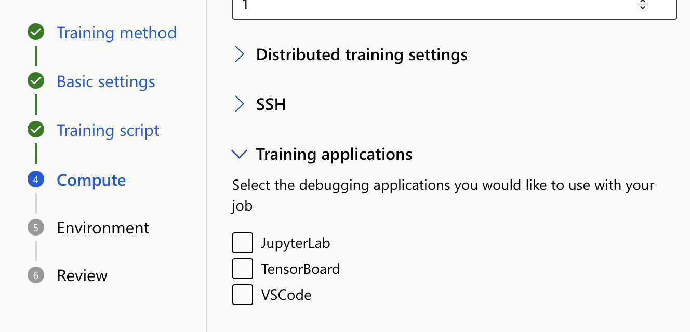 

6. Review and create the job.

#### Connect to endpoints
To interact with your running job, click the button **Debug and monitor** on the job details page. 

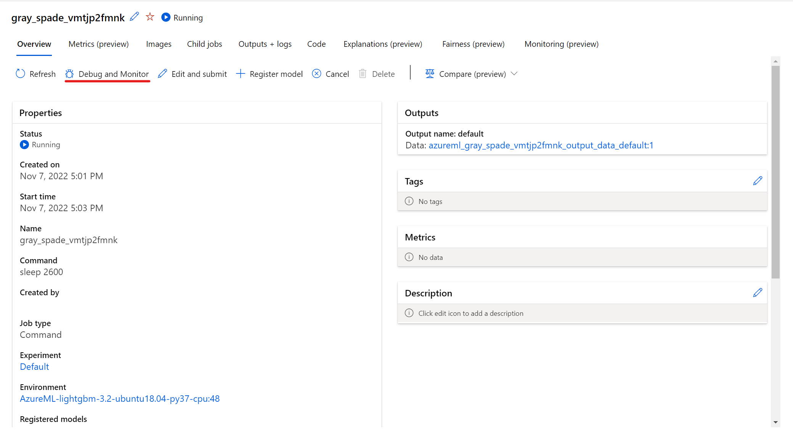

Clicking the applications in the panel opens a new tab for the applications. Please note that you can access the applications only when the applications is in **Running** status and only the **job owner** is authorized to access the applications. Note that if you are training on multiple nodes, you can pick the specific node you would like to interact with.

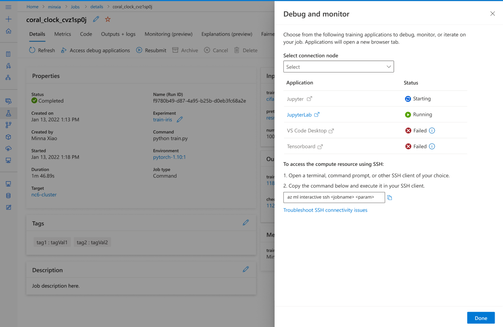

It might take a few minutes to start the job and the training applications specified during job creation.

### Get started with the AzureML SDKv2/CLIv2
#### Enable during job submission

# [Python SDK](#tab/python)
1. Define the interactive services you want to use for your job. Make sure to replace `your compute name` with your own value. If you want to use your own custom environment, follow the examples in [this tutorial](how-to-manage-environments-v2.md) to create a custom environment. 

Note that you have to import the `JobService` class from the `azure.ai.entities` package to configure interactive services via the SDKv2. 

    ```python
    command_job = command(...
        code="./src",  # local path where the code is stored
        command="python main.py", # you can add a command like "sleep 1h" to reserve the compute resource is reserved after the script finishes running
        environment="AzureML-tensorflow-2.7-ubuntu20.04-py38-cuda11-gpu@latest",
        compute="<name-of-compute>",
        services={
          "My_jupyterlab": JobService(
            job_service_type = "jupyter_lab"
          ),
          "My_vscode": JobService(
            job_service_type = "vs_code"
          ),
          "My_tensorboard": JobService(
            job_service_type = "tensorboard"
            logs = "logs/" # relative path of Tensorboard logs (same as in your training script)
          ),
          "My_ssh": JobService(
            job_service_type = "ssh",
            sshPublicKeys = "<add-public-key>"
          ),
        }
    )

    # submit the command
    returned_job = ml_client.jobs.create_or_update(command_job)
    ```

    The `services` section specifies the training applications you want to interact with.  

    Note that you can put `sleep <specific time>` at the end of your command to speicify the amount of time you want to reserve the compute resource. The format follows: 
    * sleep 1s
    * sleep 1m
    * sleep 1h
    * sleep 1d

    You can also use the `sleep infinity` command that would keep the job alive indefinitely. 
    
    > [!NOTE]
    > If you use `sleep infinity`, you will need to manually [cancel the job](./how-to-interactive-jobs.md#end-job) to let go of the compute resource (and stop billing). 

2. Submit your training job. For more details on how to train with the Python SDKv2, check out this [article](./how-to-train-model.md).

# [Azure CLI](#tab/azurecli)

1. Create a job yaml `job.yaml` with below sample content. Make sure to replace `your compute name` with your own value. If you want to use custom environment, follow the examples in [this tutorial](how-to-manage-environments-v2.md) to create a custom environment. 
    ```dotnetcli
    code: src 
    command: 
      python train.py 
      # you can add a command like "sleep 1h" to reserve the compute resource is reserved after the script finishes running.
    environment: azureml:AzureML-tensorflow-2.4-ubuntu18.04-py37-cuda11-gpu:41
    compute: azureml:<your compute name>
    services:
        my_vs_code:
          job_service_type: vs_code
        my_tensor_board:
          job_service_type: tensorboard
          properties:
            logDir: "logs/" # relative path of Tensorboard logs (same as in your training script)
        my_jupyter_lab:
          job_service_type: jupyter_lab
        my_ssh:
         job_service_type: ssh
         properties:
           sshPublicKeys: <paste the entire pub key content>
    ```
    The `services` section specifies the training applications you want to interact with.  

    Note that you can put `sleep <specific time>` at the end of the command to speicify the amount of time you want to reserve the compute resource. The format follows: 
    * sleep 1s
    * sleep 1m
    * sleep 1h
    * sleep 1d

    You can also use the `sleep infinity` command that would keep the job alive indefinitely. 
    
    > [!NOTE]
    > If you use `sleep infinity`, you will need to manually [cancel the job](./how-to-interactive-jobs.md#end-job) to let go of the compute resource (and stop billing). 

2. Run command `az ml job create --file <path to your job yaml file> --workspace-name <your workspace name> --resource-group <your resource group name> --subscription <sub-id> `to submit your training job. For more details on running a job via CLIv2, check out this [article](./how-to-train-model.md). 

---

#### Connect to endpoints

# [Python SDK](#tab/python)
- Once the job is submitted, you can use `ml_client.jobs.show_services("<job name>", <compute node index>)` to view the interactive service endpoints.
    
- To connect via SSH to the container where the job is running, run the command `az ml job connect-ssh --name <job-name> --node-index <compute node index> --private-key-file-path <path to private key>`. To set up the AzureML CLIv2, follow this [guide](./how-to-configure-cli?tabs=public). 
  
You can find the reference documentation for the SDKv2 [here](/sdk/azure/ml).

Please note that you can access the applications only when the applications is in **Running** status and only the **job owner** is authorized to access the applications. Note that if you are training on multiple nodes, you can pick the specific node you would like to interact with by passing in the node index.

# [Azure CLI](#tab/azurecli)
- When the job is **running**, Run the command `az ml job show-services --name <job name> --node-index <compute node index>` to get the URL to the applications. The endpoint URL will show under `services` in the output. 

- To connect via SSH to the container where the job is running, run the command `az ml job connect-ssh --name <job-name> --node-index <compute node index> --private-key-file-path <path to private key>`. 

You can find the reference documentation for these commands [here](/cli/azure/ml).

Please note that you can access the applications only when the applications is in **Running** status and only the **job owner** is authorized to access the applications. Note that if you are training on multiple nodes, you can pick the specific node you would like to interact with by passing in the node index.

---

### Interact with the applications
When you click on the endpoints to interact when your job, you are taken to the user container under your working directory, where you can access your code, inputs, outputs, and logs. If you run into any issues while connecting to the applications, the interactive capability and applications logs can be found from **system_logs->interactive_capability** under **Outputs + logs** tab.


- You can open a terminal from Jupyter Lab and start interacting within the job container. You can also directly iterate on your training script with Jupyter Lab. 

  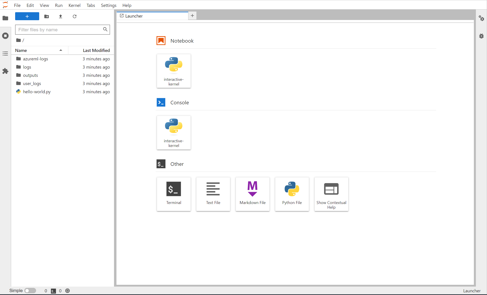

- You can also interact with the job container within VS Code. To attach a debugger to a job during job submission and pause execution, [navigate here](./how-to-interactive-jobs.md#attach-a-debugger-to-a-job).

   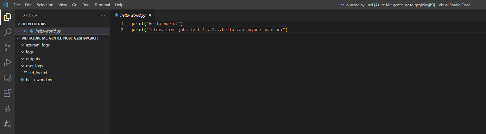

- If you have logged tensorflow events for your job, you can use TensorBoard to monitor the metrics when your job is running.

   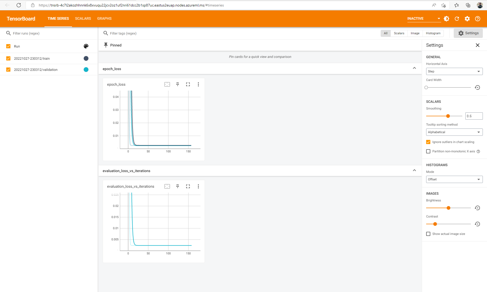

### End job
Once you are done with the interactive training, you can also go to the job details page to cancel the job. This will release the compute resource. Alternatively, use `az ml job cancel -n <your job name>` in the CLI or `ml_client.job.cancel("<job name>")` in the SDK. 

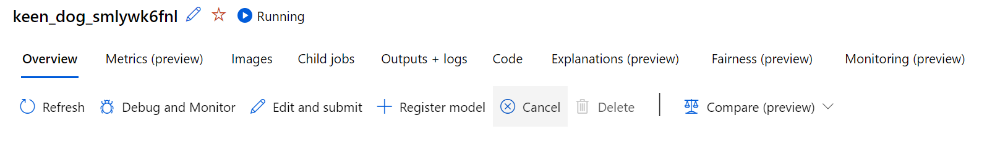

## Attach a debugger to a job
To submit a job with a debugger attached and the execution paused, you can use debugpy & VS Code. Note that you need to have `debugpy` installed in your job environment. 

1. During job submission (either through the UI, the CLIv2 or the SDKv2) use the debugpy command to run your python script. For example, the below screenshot shows a sample command that uses debugpy to attach the debugger for a tensorflow script.

   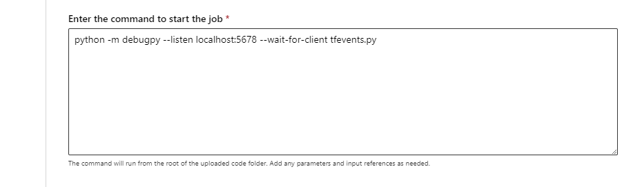

2. Once the job has been submitted, [click out to VS Code](./how-to-interactive-jobs.md#interact-with-the-applications), and click on the in-built debugger.

   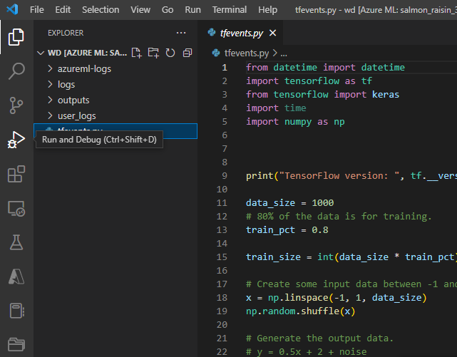

3. Use the "Remote Attach" debug configuration to attach to the submitted job and pass in the path and port you configured in your job submission command.

   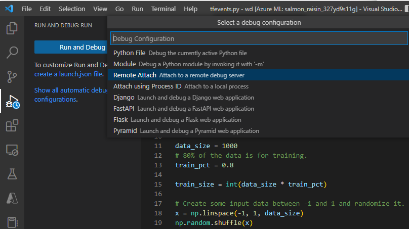

4. Set breakpoints and walk through your job execution as you would in your local debugging workflow. 

   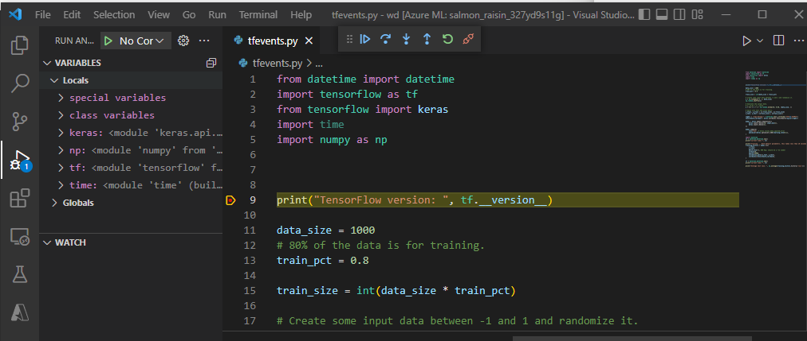


> [!NOTE]
> If you use debugpy to start your job, your job will **not** execute unless you attach the debugger in VS Code and execute the script. If this is not done, the compute will be reserved until the job timesout (default is ) or until the job is [cancelled](./how-to-interactive-jobs.md#end-job).

## Next steps

+ Learn more about [how and where to deploy a model](./how-to-deploy-managed-online-endpoints.md).
