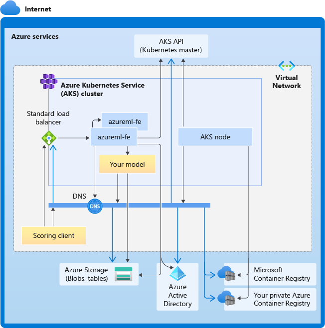

# Azure Machine Learning inference router and connectivity requirements

Azure Machine Learning inference router is a critical component for real-time inference with Kubernetes cluster. In this article, you can learn about:

  * What is Azure Machine Learning inference router
  * How autoscaling works
  * How to configure and meet inference request performance (# of requests per second and latency)
  * Connectivity requirements for AKS inferencing cluster

## What is Azure Machine Learning inference router

Azure Machine Learning inference router is the front-end component (`azureml-fe`) which is deployed on AKS or Arc Kubernetes cluster at Azure Machine Learning extension deployment time. It has following functions:
  
  * Routes incoming inference requests from cluster load balancer or ingress controller to corresponding model pods.
  * Load-balance all incoming inference requests with smart coordinated routing.
  * Manages model pods auto-scaling.
  * Fault-tolerant and failover capability, ensuring inference requests is always served for critical business application.

The following steps are how requests are processed by the front-end:

1. Client sends request to the load balancer.
1. Load balancer sends to one of the front-ends.
1. The front-end locates the service router (the front-end instance acting as coordinator) for the service.
1. The service router selects a back-end and returns it to the front-end.
1. The front-end forwards the request to the back-end.
1. After the request has been processed, the back-end sends a response to the front-end component.
1. The front-end propagates the response back to the client.
1. The front-end informs the service router that the back-end has finished processing and is available for other requests.

The following diagram illustrates this flow:

:::image type="content" source="./media/how-to-attach-kubernetes-to-workspace/request-handling-architecture.png" alt-text="Diagram illustrating the flow of requests between components.":::

As you can see from above diagram, by default 3 `azureml-fe` instances are created during Azure Machine Learning extension deployment, one instance acts as coordinating role, and the other instances serve incoming inference requests. The coordinating instance has all information about model pods and makes decision about which model pod to serve incoming request, while the serving `azureml-fe` instances are responsible for routing the request to selected model pod and propagate the response back to the original user.

## Autoscaling

Azure Machine Learning inference router handles autoscaling for all model deployments on the Kubernetes cluster. Since all inference requests go through it, it has the necessary data to automatically scale the deployed model(s).

> [!IMPORTANT]
> * **Do not enable Kubernetes Horizontal Pod Autoscaler (HPA) for model deployments**. Doing so would cause the two auto-scaling components to compete with each other. Azureml-fe is designed to auto-scale models deployed by Azure Machine Learning, where HPA would have to guess or approximate model utilization from a generic metric like CPU usage or a custom metric configuration.
> 
> * **Azureml-fe does not scale the number of nodes in an AKS cluster**, because this could lead to unexpected cost increases. Instead, **it scales the number of replicas for the model** within the physical cluster boundaries. If you need to scale the number of nodes within the cluster, you can manually scale the cluster or [configure the AKS cluster autoscaler](../aks/cluster-autoscaler.md).

Autoscaling can be controlled by `scale_settings` property in deployment YAML. The following example demonstrates how to enable autoscaling:

```yaml
# deployment yaml
# other properties skipped
scale_setting:
  type: target_utilization
  min_instances: 3
  max_instances: 15
  target_utilization_percentage: 70
  polling_interval: 10
# other deployment properties continue
```

The decision to scale up or down is based off of ``utilization of the current container replicas``. 

```
utilization_percentage = (The number of replicas that are busy processing a request + The number of requests queued in azureml-fe) / The total number of current replicas
```
If this number exceeds `target_utilization_percentage`, then more replicas are created. If it's lower, then replicas are reduced. By default, the target utilization is 70%.

Decisions to add replicas are eager and fast (around 1 second). Decisions to remove replicas are conservative (around 1 minute).

For example, if you want to deploy a model service and want to know many instances (pods/replicas) should be configured for target requests per second (RPS) and target response time. You can calculate the required replicas by using the following code:

```python
from math import ceil
# target requests per second
targetRps = 20
# time to process the request (in seconds)
reqTime = 10
# Maximum requests per container
maxReqPerContainer = 1
# target_utilization. 70% in this example
targetUtilization = .7

concurrentRequests = targetRps * reqTime / targetUtilization

# Number of container replicas
replicas = ceil(concurrentRequests / maxReqPerContainer)
```

### Performance of azureml-fe

The `azureml-fe` can reach 5K requests per second (QPS) with good latency, having an overhead not exceeding 3ms on average and 15ms at 99% percentile.


>[!Note]
>
>If you have RPS requirements higher than 10K, consider the following options:
>
>* Increase resource requests/limits for `azureml-fe` pods; by default it has 2 vCPU and 1.2G memory resource limit.
>* Increase the number of instances for `azureml-fe`. By default, Azure Machine Learning creates 3 or 1 `azureml-fe` instances per cluster.
>   * This instance count depends on your configuration of `inferenceRouterHA` of the [Azure Machine Learning entension](how-to-deploy-kubernetes-extension.md#review-azure-machine-learning-extension-configuration-settings).
>   * The increased instance count cannot be persisted, since it will be overwritten with your configured value once the extension is upgraded.
>* Reach out to Microsoft experts for help.

## Understand connectivity requirements for AKS inferencing cluster

AKS cluster is deployed with one of the following two network models:
* Kubenet networking - The network resources are typically created and configured as the AKS cluster is deployed.
* Azure Container Networking Interface (CNI) networking - The AKS cluster is connected to an existing virtual network resource and configurations.

For Kubenet networking, the network is created and configured properly for Azure Machine Learning service. For the CNI networking, you need to understand the connectivity requirements and ensure DNS resolution and outbound connectivity for AKS inferencing. For example, you may be using a firewall to block network traffic.

The following diagram shows the connectivity requirements for AKS inferencing. Black arrows represent actual communication, and blue arrows represent the domain names. You may need to add entries for these hosts to your firewall or to your custom DNS server.



For general AKS connectivity requirements, see [Control egress traffic for cluster nodes in Azure Kubernetes Service](../aks/limit-egress-traffic.md).

For accessing Azure Machine Learning services behind a firewall, see [Configure inbound and outbound network traffic](how-to-access-azureml-behind-firewall.md).

### Overall DNS resolution requirements

DNS resolution within an existing VNet is under your control. For example, a firewall or custom DNS server. The following hosts must be reachable:

| Host name | Used by |
| ----- | ----- |
| `<cluster>.hcp.<region>.azmk8s.io` | AKS API server |
| `mcr.microsoft.com` | Microsoft Container Registry (MCR) |
| `<ACR name>.azurecr.io` | Your Azure Container Registry (ACR) |
| `<account>.blob.core.windows.net` | Azure Storage Account (blob storage) |
| `api.azureml.ms` | Azure Active Directory (Azure AD) authentication |
| `ingest-vienna<region>.kusto.windows.net` | Kusto endpoint for uploading telemetry |

### Connectivity requirements in chronological order: from cluster creation to model deployment

Right after azureml-fe is deployed, it will attempt to start and this requires to:
* Resolve DNS for AKS API server
* Query AKS API server to discover other instances of itself (it's a multi-pod service)
* Connect to other instances of itself

Once azureml-fe is started, it requires the following connectivity to function properly:
* Connect to Azure Storage to download dynamic configuration
* Resolve DNS for Azure AD authentication server api.azureml.ms and communicate with it when the deployed service uses Azure AD authentication.
* Query AKS API server to discover deployed models
* Communicate to deployed model PODs

At model deployment time, for a successful model deployment AKS node should be able to: 
* Resolve DNS for customer's ACR
* Download images from customer's ACR
* Resolve DNS for Azure BLOBs where model is stored
* Download models from Azure BLOBs

After the model is deployed and service starts, azureml-fe will automatically discover it using AKS API, and will be ready to route request to it. It must be able to communicate to model PODs.
>[!Note]
>If the deployed model requires any connectivity (e.g. querying external database or other REST service, downloading a BLOB etc), then both DNS resolution and outbound communication for these services should be enabled.

## Next steps

- [Create and manage instance types](./how-to-manage-kubernetes-instance-types.md)
- [Secure AKS inferencing environment](./how-to-secure-kubernetes-inferencing-environment.md)

