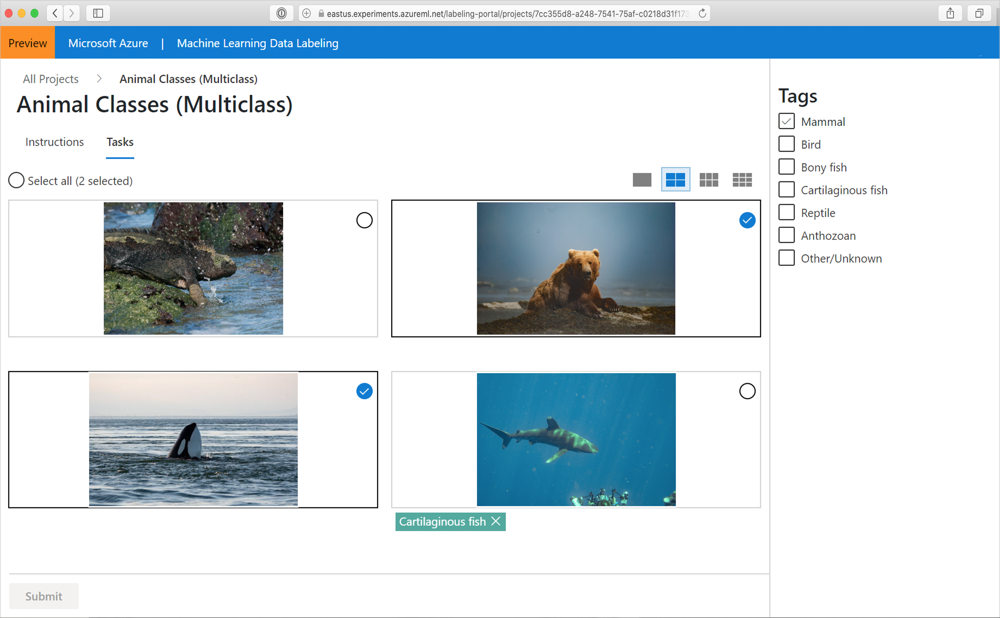
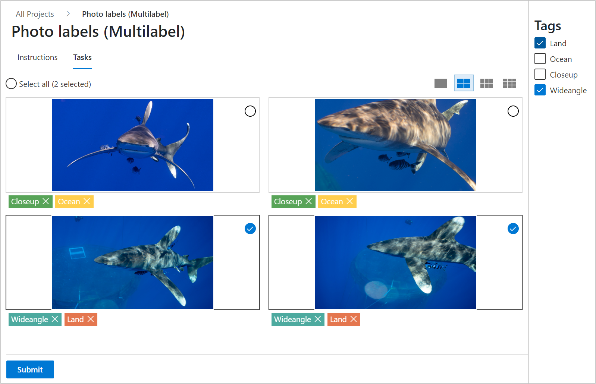
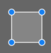
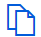
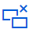

# Tag images in a labeling project 

After your project administrator [creates a data labeling project](./how-to-create-labeling-projects.md#create-a-data-labeling-project) in Azure Machine Learning, you can use the labeling tool to rapidly prepare data for a Machine Learning project. This article describes:

> [!div class="checklist"]
> * How to access your labeling projects
> * The labeling tools
> * How to use the tools for specific labeling tasks

## Prerequisites

* A [Microsoft account](https://account.microsoft.com/account) or an Azure Active Directory account for the organization and project
* Contributor level access to the workspace that contains the labeling project.

## Sign in to the workspace

1. Sign in to [Azure Machine Learning studio](https://ml.azure.com).

1. Select the subscription and the workspace that contains the labeling project.  Get this information from your project administrator.

1. Select **Data labeling** on the left-hand side to find the project.  

## Understand the labeling task

In the table of data labeling projects, select **Label link** for your project.

You see instructions that are specific to your project. They explain the type of data that you're facing, how you should make your decisions, and other relevant information. After you read this information, at the top of the page select **Tasks**.  Or at the bottom of the page, select **Start labeling**.

## Common features of the labeling task

In all image-labeling tasks, you choose an appropriate tag or tags from a set that's specified by the project administrator. You can select the first nine tags by using the number keys on your keyboard.  

In image-classification tasks, you can choose to view multiple images simultaneously. Use the icons above the image area to select the layout. 

To select all the displayed images simultaneously, use **Select all**. To select individual images, use the circular selection button in the upper-right corner of the image. You must select at least one image to apply a tag. If you select multiple images, any tag that you select will be applied to all the selected images.

Here we've chosen a two-by-two layout and are about to apply the tag "Mammal" to the images of the bear and orca. The image of the shark was already tagged as "Cartilaginous fish," and the iguana hasn't been tagged yet.

> [!Important] 
> Only switch layouts when you have a fresh page of unlabeled data. Switching layouts clears the page's in-progress tagging work.

Azure enables the **Submit** button when you've tagged all the images on the page. Select **Submit** to save your work.

After you submit tags for the data at hand, Azure refreshes the page with a new set of images from the work queue.

### Assisted machine learning

Machine learning algorithms may be triggered. If these algorithms are enabled in your project, you may see the following:

* After some amount of images have been labeled, you may see **Tasks clustered** at the top of your screen next to the project name.  This means that images are grouped together to present similar images on the same page.  If so, switch to one of the multiple image views to take advantage of the grouping.  

* At a later point, you may see **Tasks prelabeled** next to the project name.  Images will then appear with a suggested label that comes from a machine learning classification model. No machine learning model has 100% accuracy. While we only use images for which the model is confident, these images might still be incorrectly prelabeled.  When you see these labels, correct any wrong labels before submitting the page.  

* For object identification models, you may see bounding boxes and labels already present.  Correct any that are incorrect before submitting the page.

* For segmentation models, you may see polygons and labels already present.  Correct any that are incorrect before submitting the page. 

Especially early in a labeling project, the machine learning model may only be accurate enough to prelabel a small subset of images. Once these images are labeled, the labeling project will return to manual labeling to gather more data for the next round of model training. Over time, the model will become more confident about a higher proportion of images, resulting in more prelabel tasks later in the project.

## Tag images for multi-class classification

If your project is of type "Image Classification Multi-Class," you'll assign a single tag to the entire image. To review the directions at any time, go to the **Instructions** page and select **View detailed instructions**.

If you realize that you made a mistake after you assign a tag to an image, you can fix it. Select the "**X**" on the label that's displayed below the image to clear the tag. Or, select the image and choose another class. The newly selected value will replace the previously applied tag.

## Tag images for multi-label classification

If you're working on a project of type "Image Classification Multi-Label," you'll apply one *or more* tags to an image. To see the project-specific directions, select **Instructions** and go to **View detailed instructions**.

Select the image that you want to label and then select the tag. The tag is applied to all the selected images, and then the images are deselected. To apply more tags, you must reselect the images. The following animation shows multi-label tagging:

1. **Select all** is used to apply the "Ocean" tag.
1. A single image is selected and tagged "Closeup."
1. Three images are selected and tagged "Wide angle."

To correct a mistake, click the "**X**" to clear an individual tag or select the images and then select the tag, which clears the tag from all the selected images. This scenario is shown here. Clicking on "Land" will clear that tag from the two selected images.

Azure will only enable the **Submit** button after you've applied at least one tag to each image. Select **Submit** to save your work.

## Tag images and specify bounding boxes for object detection

If your project is of type "Object Identification (Bounding Boxes)," you'll specify one or more bounding boxes in the image and apply a tag to each box. Images can have multiple bounding boxes, each with a single tag. Use **View detailed instructions** to determine if multiple bounding boxes are used in your project.

1. Select a tag for the bounding box that you plan to create.
1. Select the **Rectangular box** tool  or select "R."
3. Click and drag diagonally across your target to create a rough bounding box. To adjust the bounding box, drag the edges or corners.

To delete a bounding box, click the X-shaped target that appears next to the bounding box after creation.

You can't change the tag of an existing bounding box. If you make a tag-assignment mistake, you have to delete the bounding box and create a new one with the correct tag.

By default, you can edit existing bounding boxes. The **Lock/unlock regions** tool  or "L" toggles that behavior. If regions are locked, you can only change the shape or location of a new bounding box.

Use the **Regions manipulation** tool  or "M" to adjust an existing bounding box. Drag the edges or corners to adjust the shape. Click in the interior to be able to drag the whole bounding box. If you can't edit a region, you've probably toggled the **Lock/unlock regions** tool.

Use the **Template-based box** tool  or "T" to create multiple bounding boxes of the same size. If the image has no bounding boxes and you activate template-based boxes, the tool will produce 50-by-50-pixel boxes. If you create a bounding box and then activate template-based boxes, any new bounding boxes will be the size of the last box that you created. Template-based boxes can be resized after placement. Resizing a template-based box only resizes that particular box.

To delete *all* bounding boxes in the current image, select the **Delete all regions** tool .

After you create the bounding boxes for an image, select **Submit** to save your work, or your work in progress won't be saved.

## Tag images and specify polygons for image segmentation 

If your project is of type "Instance Segmentation (Polygon)," you'll specify one or more polygons in the image and apply a tag to each polygon. Images can have multiple bounding polygons, each with a single tag. Use **View detailed instructions** to determine if multiple bounding polygons are used in your project.

1. Select a tag for the polygon that you plan to create.
1. Select the **Draw polygon region** tool  or select "P."
1. Click for each point in the polygon.  When you have completed the shape, double click to finish.

    :::image type="content" source="media/how-to-label-images/polygon.gif" alt-text="Create polygons for Cat and Dog":::

To delete a polygon, click the X-shaped target that appears next to the polygon after creation.

If you want to change the tag for a polygon, select the **Move region** tool, click on the polygon, and select the correct tag.

You can edit existing polygons. The **Lock/unlock regions** tool  or "L" toggles that behavior. If regions are locked, you can only change the shape or location of a new polygon.

Use the **Add or remove polygon points** tool  or "U" to adjust an existing polygon. Click on the polygon to add or remove a point. If you can't edit a region, you've probably toggled the **Lock/unlock regions** tool.

To delete *all* polygons in the current image, select the **Delete all regions** tool .

After you create the polygons for an image, select **Submit** to save your work, or your work in progress won't be saved.

## Finish up

When you submit a page of tagged data, Azure assigns new unlabeled data to you from a work queue. If there's no more unlabeled data available, you'll get a message noting this along with a link to the portal home page.

When you're done labeling, select your name in the upper-right corner of the labeling portal and then select **sign-out**. If you don't sign out, eventually Azure will "time you out" and assign your data to another labeler.

## Next steps

* Learn to [train image classification models in Azure](./tutorial-train-models-with-aml.md)

