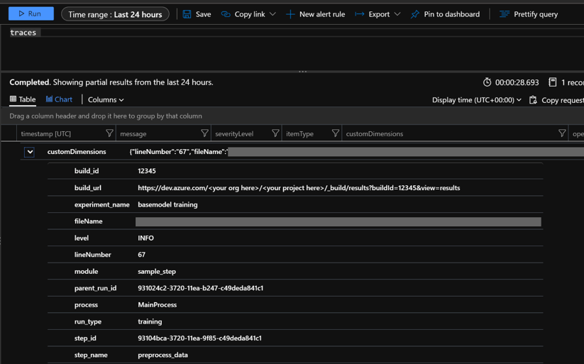

# Collect machine learning pipeline log files in Application Insights for alerts and debugging


The [OpenCensus](https://opencensus.io/quickstart/python/) python library can be used to route logs to Application Insights from your scripts. Aggregating logs from pipeline runs in one place allows you to build queries and diagnose issues. Using Application Insights will allow you to track logs over time and compare pipeline logs across runs.

Having your logs in once place will provide a history of exceptions and error messages. Since Application Insights integrates with Azure Alerts, you can also create alerts based on Application Insights queries.

## Prerequisites

* Follow the steps to create an [Azure Machine Learning](./how-to-manage-workspace.md) workspace and [create your first pipeline](./how-to-create-machine-learning-pipelines.md)
* [Configure your development environment](./how-to-configure-environment.md) to install the Azure Machine Learning SDK.
* Install the [OpenCensus Azure Monitor Exporter](https://pypi.org/project/opencensus-ext-azure/) package locally:
  ```python
  pip install opencensus-ext-azure
  ```
* Create an [Application Insights instance](../azure-monitor/app/opencensus-python.md) (this doc also contains information on getting the connection string for the resource)

## Getting Started

This section is an introduction specific to using OpenCensus from an Azure Machine Learning pipeline. For a detailed tutorial, see [OpenCensus Azure Monitor Exporters](https://github.com/census-instrumentation/opencensus-python/tree/master/contrib/opencensus-ext-azure)

Add a PythonScriptStep to your Azure ML Pipeline. Configure your [RunConfiguration](/python/api/azureml-core/azureml.core.runconfiguration) with the dependency on opencensus-ext-azure. Configure the `APPLICATIONINSIGHTS_CONNECTION_STRING` environment variable.

```python
from azureml.core.conda_dependencies import CondaDependencies
from azureml.core.runconfig import RunConfiguration
from azureml.pipeline.core import Pipeline
from azureml.pipeline.steps import PythonScriptStep

# Connecting to the workspace and compute target not shown

# Add pip dependency on OpenCensus
dependencies = CondaDependencies()
dependencies.add_pip_package("opencensus-ext-azure>=1.0.1")
run_config = RunConfiguration(conda_dependencies=dependencies)

# Add environment variable with Application Insights Connection String
# Replace the value with your own connection string
run_config.environment.environment_variables = {
    "APPLICATIONINSIGHTS_CONNECTION_STRING": 'InstrumentationKey=00000000-0000-0000-0000-000000000000'
}

# Configure step with runconfig
sample_step = PythonScriptStep(
        script_name="sample_step.py",
        compute_target=compute_target,
        runconfig=run_config
)

# Submit new pipeline run
pipeline = Pipeline(workspace=ws, steps=[sample_step])
pipeline.submit(experiment_name="Logging_Experiment")
```

Create a file called `sample_step.py`. Import the AzureLogHandler class to route logs to Application Insights. You'll also need to import the Python Logging library.

```python
from opencensus.ext.azure.log_exporter import AzureLogHandler
import logging
```

Next, add the AzureLogHandler to the python logger.

```python
logger = logging.getLogger(__name__)
logger.setLevel(logging.DEBUG)
logger.addHandler(logging.StreamHandler())

# Assumes the environment variable APPLICATIONINSIGHTS_CONNECTION_STRING is already set
logger.addHandler(AzureLogHandler())
logger.warning("I will be sent to Application Insights")
```

## Logging with Custom Dimensions
 
By default, logs forwarded to Application Insights won't have enough context to trace back to the run or experiment. To make the logs actionable for diagnosing issues, additional fields are needed. 

To add these fields, Custom Dimensions can be added to provide context to a log message. One example is when someone wants to view logs across multiple steps in the same pipeline run.

Custom Dimensions make up a dictionary of key-value (stored as string, string) pairs. The dictionary is then sent to Application Insights and displayed as a column in the query results. Its individual dimensions can be used as [query parameters](#additional-helpful-queries).

### Helpful Context to include

| Field                          | Reasoning/Example                                                                                                                                                                       |
|--------------------------------|-----------------------------------------------------------------------------------------------------------------------------------------------------------------------------------------|
| parent_run_id                  | Can query logs for ones with the same parent_run_id to see logs over time for all steps, instead of having to dive into each individual step                                        |
| step_id                        | Can query logs for ones with the same step_id to see where an issue occurred with a narrow scope to just the individual step                                                        |
| step_name                      | Can query logs to see step performance over time. Also helps to find a step_id for recent runs without diving into the portal UI                                          |
| experiment_name                | Can query across logs to see experiment performance over time. Also helps find a parent_run_id or step_id for recent runs without diving into the portal UI                   |
| run_url                 | Can provide a link directly back to the run for investigation. |

**Other helpful fields**

These fields may require additional code instrumentation, and aren't provided by the run context.

| Field                   | Reasoning/Example                                                                                                                                                                                                           |
|-------------------------|-----------------------------------------------------------------------------------------------------------------------------------------------------------------------------------------------------------------------------|
| build_url/build_version | If using CI/CD to deploy, this field can correlate logs to the code version that provided the step and pipeline logic. This link can further help to diagnose issues, or identify models with specific traits (log/metric values) |
| run_type                       | Can differentiate between different model types, or training vs. scoring runs |

### Creating a Custom Dimensions dictionary

```python
from azureml.core import Run

run = Run.get_context(allow_offline=False)

custom_dimensions = {
    "parent_run_id": run.parent.id,
    "step_id": run.id,
    "step_name": run.name,
    "experiment_name": run.experiment.name,
    "run_url": run.parent.get_portal_url(),
    "run_type": "training"
}

# Assumes AzureLogHandler was already registered above
logger.info("I will be sent to Application Insights with Custom Dimensions", extra= {"custom_dimensions":custom_dimensions})
```

## OpenCensus Python logging considerations

The OpenCensus AzureLogHandler is used to route Python logs to Application Insights. As a result, Python logging nuances should be considered. When a logger is created, it has a default log level and will show logs greater than or equal to that level. A good reference for using Python logging features is the [Logging Cookbook](https://docs.python.org/3/howto/logging-cookbook.html).

The `APPLICATIONINSIGHTS_CONNECTION_STRING` environment variable is needed for the OpenCensus library. We recommend setting this environment variable instead of passing it in as a pipeline parameter to avoid passing around plaintext connection strings.

## Querying logs in Application Insights

The logs routed to Application Insights will show up under 'traces' or 'exceptions'. Be sure to adjust your time window to include your pipeline run.



The result in Application Insights will show the log message and level, file path, and code line number. It will also show any custom dimensions included. In this image, the customDimensions dictionary shows the key/value pairs from the previous [code sample](#creating-a-custom-dimensions-dictionary).

### Additional helpful queries

Some of the queries below use 'customDimensions.Level'. These severity levels correspond to the level the Python log was originally sent with. For additional query information, see [Azure Monitor Log Queries](/azure/data-explorer/kusto/query/).

| Use case                                                               | Query                                                                                              |
|------------------------------------------------------------------------|----------------------------------------------------------------------------------------------------|
| Log results for specific custom dimension, for example 'parent_run_id' | <pre>traces \| <br>where customDimensions.parent_run_id == '931024c2-3720-11ea-b247-c49deda841c1</pre> |
| Log results for all training runs over the last 7 days                     | <pre>traces \| <br>where timestamp > ago(7d) <br>and customDimensions.run_type == 'training'</pre>           |
| Log results with severityLevel Error from the last 7 days              | <pre>traces \| <br>where timestamp > ago(7d) <br>and customDimensions.Level == 'ERROR'                     |
| Count of log results with severityLevel Error over the last 7 days     | <pre>traces \| <br>where timestamp > ago(7d) <br>and customDimensions.Level == 'ERROR' \| <br>summarize count()</pre> |

## Next Steps

Once you have logs in your Application Insights instance, they can be used to set [Azure Monitor alerts](../azure-monitor/alerts/alerts-overview.md#what-you-can-alert-on) based on query results.

You can also add results from queries to an [Azure Dashboard](../azure-monitor/app/tutorial-app-dashboards.md#add-logs-query) for additional insights.