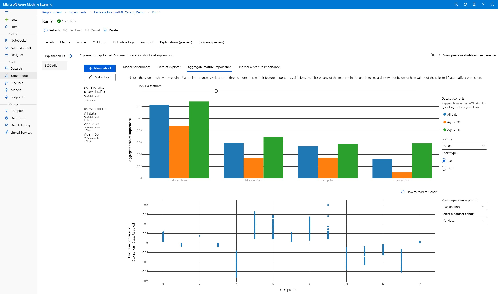

# Use the interpretability package to explain ML models & predictions in Python (preview)

In this how-to guide, you learn to use the interpretability package of the Azure Machine Learning Python SDK to perform the following tasks:


* Explain the entire model behavior or individual predictions on your personal machine locally.

* Enable interpretability techniques for engineered features.

* Explain the behavior for the entire model and individual predictions in Azure.

* Use a visualization dashboard to interact with your model explanations.

* Deploy a scoring explainer alongside your model to observe explanations during inferencing.


For more information on the supported interpretability techniques and machine learning models, see [Model interpretability in Azure Machine Learning](how-to-machine-learning-interpretability.md) and [sample notebooks](https://github.com/Azure/MachineLearningNotebooks/tree/master/how-to-use-azureml/explain-model).

## Generate feature importance value on your personal machine 
The following example shows how to use the interpretability package on your personal machine without contacting Azure services.

1. Install the `azureml-interpret` package.
    ```bash
    pip install azureml-interpret
    ```

2. Train a sample model in a local Jupyter Notebook.

    ```python
    # load breast cancer dataset, a well-known small dataset that comes with scikit-learn
    from sklearn.datasets import load_breast_cancer
    from sklearn import svm
    from sklearn.model_selection import train_test_split
    breast_cancer_data = load_breast_cancer()
    classes = breast_cancer_data.target_names.tolist()
    
    # split data into train and test
    from sklearn.model_selection import train_test_split
    x_train, x_test, y_train, y_test = train_test_split(breast_cancer_data.data,            
                                                        breast_cancer_data.target,  
                                                        test_size=0.2,
                                                        random_state=0)
    clf = svm.SVC(gamma=0.001, C=100., probability=True)
    model = clf.fit(x_train, y_train)
    ```

3. Call the explainer locally.
   * To initialize an explainer object, pass your model and some training data to the explainer's constructor.
   * To make your explanations and visualizations more informative, you can choose to pass in feature names and output class names if doing classification.

   The following code blocks show how to instantiate an explainer object with `TabularExplainer`, `MimicExplainer`, and `PFIExplainer` locally.
   * `TabularExplainer` calls one of the three SHAP explainers underneath (`TreeExplainer`, `DeepExplainer`, or `KernelExplainer`).
   * `TabularExplainer` automatically selects the most appropriate one for your use case, but you can call each of its three underlying explainers directly.

    ```python
    from interpret.ext.blackbox import TabularExplainer

    # "features" and "classes" fields are optional
    explainer = TabularExplainer(model, 
                                 x_train, 
                                 features=breast_cancer_data.feature_names, 
                                 classes=classes)
    ```

    or

    ```python

    from interpret.ext.blackbox import MimicExplainer
    
    # you can use one of the following four interpretable models as a global surrogate to the black box model
    
    from interpret.ext.glassbox import LGBMExplainableModel
    from interpret.ext.glassbox import LinearExplainableModel
    from interpret.ext.glassbox import SGDExplainableModel
    from interpret.ext.glassbox import DecisionTreeExplainableModel

    # "features" and "classes" fields are optional
    # augment_data is optional and if true, oversamples the initialization examples to improve surrogate model accuracy to fit original model.  Useful for high-dimensional data where the number of rows is less than the number of columns.
    # max_num_of_augmentations is optional and defines max number of times we can increase the input data size.
    # LGBMExplainableModel can be replaced with LinearExplainableModel, SGDExplainableModel, or DecisionTreeExplainableModel
    explainer = MimicExplainer(model, 
                               x_train, 
                               LGBMExplainableModel, 
                               augment_data=True, 
                               max_num_of_augmentations=10, 
                               features=breast_cancer_data.feature_names, 
                               classes=classes)
    ```

    or

    ```python
    from interpret.ext.blackbox import PFIExplainer

    # "features" and "classes" fields are optional
    explainer = PFIExplainer(model,
                             features=breast_cancer_data.feature_names, 
                             classes=classes)
    ```

### Explain the entire model behavior (global explanation) 

Refer to the following example to help you get the aggregate (global) feature importance values.

```python

# you can use the training data or the test data here, but test data would allow you to use Explanation Exploration
global_explanation = explainer.explain_global(x_test)

# if you used the PFIExplainer in the previous step, use the next line of code instead
# global_explanation = explainer.explain_global(x_train, true_labels=y_train)

# sorted feature importance values and feature names
sorted_global_importance_values = global_explanation.get_ranked_global_values()
sorted_global_importance_names = global_explanation.get_ranked_global_names()
dict(zip(sorted_global_importance_names, sorted_global_importance_values))

# alternatively, you can print out a dictionary that holds the top K feature names and values
global_explanation.get_feature_importance_dict()
```

### Explain an individual prediction (local explanation)
Get the individual feature importance values of different datapoints by calling explanations for an individual instance or a group of instances.
> [!NOTE]
> `PFIExplainer` does not support local explanations.

```python
# get explanation for the first data point in the test set
local_explanation = explainer.explain_local(x_test[0:5])

# sorted feature importance values and feature names
sorted_local_importance_names = local_explanation.get_ranked_local_names()
sorted_local_importance_values = local_explanation.get_ranked_local_values()
```

### Raw feature transformations

You can opt to get explanations in terms of raw, untransformed features rather than engineered features. For this option, you pass your feature transformation pipeline to the explainer in `train_explain.py`. Otherwise, the explainer provides explanations in terms of engineered features.

The format of supported transformations is the same as described in [sklearn-pandas](https://github.com/scikit-learn-contrib/sklearn-pandas). In general, any transformations are supported as long as they operate on a single column so that it's clear they're  one-to-many.

Get an explanation for raw features by using a `sklearn.compose.ColumnTransformer` or with a list of fitted transformer tuples. The following example  uses `sklearn.compose.ColumnTransformer`.

```python
from sklearn.compose import ColumnTransformer

numeric_transformer = Pipeline(steps=[
    ('imputer', SimpleImputer(strategy='median')),
    ('scaler', StandardScaler())])

categorical_transformer = Pipeline(steps=[
    ('imputer', SimpleImputer(strategy='constant', fill_value='missing')),
    ('onehot', OneHotEncoder(handle_unknown='ignore'))])

preprocessor = ColumnTransformer(
    transformers=[
        ('num', numeric_transformer, numeric_features),
        ('cat', categorical_transformer, categorical_features)])

# append classifier to preprocessing pipeline.
# now we have a full prediction pipeline.
clf = Pipeline(steps=[('preprocessor', preprocessor),
                      ('classifier', LogisticRegression(solver='lbfgs'))])


# clf.steps[-1][1] returns the trained classification model
# pass transformation as an input to create the explanation object
# "features" and "classes" fields are optional
tabular_explainer = TabularExplainer(clf.steps[-1][1],
                                     initialization_examples=x_train,
                                     features=dataset_feature_names,
                                     classes=dataset_classes,
                                     transformations=preprocessor)
```

In case you want to run the example with the list of fitted transformer tuples, use the following code:

```python
from sklearn.pipeline import Pipeline
from sklearn.impute import SimpleImputer
from sklearn.preprocessing import StandardScaler, OneHotEncoder
from sklearn.linear_model import LogisticRegression
from sklearn_pandas import DataFrameMapper

# assume that we have created two arrays, numerical and categorical, which holds the numerical and categorical feature names

numeric_transformations = [([f], Pipeline(steps=[('imputer', SimpleImputer(
    strategy='median')), ('scaler', StandardScaler())])) for f in numerical]

categorical_transformations = [([f], OneHotEncoder(
    handle_unknown='ignore', sparse=False)) for f in categorical]

transformations = numeric_transformations + categorical_transformations

# append model to preprocessing pipeline.
# now we have a full prediction pipeline.
clf = Pipeline(steps=[('preprocessor', DataFrameMapper(transformations)),
                      ('classifier', LogisticRegression(solver='lbfgs'))])

# clf.steps[-1][1] returns the trained classification model
# pass transformation as an input to create the explanation object
# "features" and "classes" fields are optional
tabular_explainer = TabularExplainer(clf.steps[-1][1],
                                     initialization_examples=x_train,
                                     features=dataset_feature_names,
                                     classes=dataset_classes,
                                     transformations=transformations)
```

## Generate feature importance values via remote runs

The following example shows how you can use the `ExplanationClient` class to enable model interpretability for remote runs. It is conceptually similar to the local process, except you:

* Use the `ExplanationClient` in the remote run to upload the interpretability context.
* Download the context later in a local environment.

1. Install the `azureml-interpret` package.
    ```bash
    pip install azureml-interpret
    ```
1. Create a training script in a local Jupyter Notebook. For example, `train_explain.py`.

    ```python
    from azureml.interpret import ExplanationClient
    from azureml.core.run import Run
    from interpret.ext.blackbox import TabularExplainer

    run = Run.get_context()
    client = ExplanationClient.from_run(run)

    # write code to get and split your data into train and test sets here
    # write code to train your model here 

    # explain predictions on your local machine
    # "features" and "classes" fields are optional
    explainer = TabularExplainer(model, 
                                 x_train, 
                                 features=feature_names, 
                                 classes=classes)

    # explain overall model predictions (global explanation)
    global_explanation = explainer.explain_global(x_test)
    
    # uploading global model explanation data for storage or visualization in webUX
    # the explanation can then be downloaded on any compute
    # multiple explanations can be uploaded
    client.upload_model_explanation(global_explanation, comment='global explanation: all features')
    # or you can only upload the explanation object with the top k feature info
    #client.upload_model_explanation(global_explanation, top_k=2, comment='global explanation: Only top 2 features')
    ```

1. Set up an Azure Machine Learning Compute as your compute target and submit your training run. See [Create and manage Azure Machine Learning compute clusters](how-to-create-attach-compute-cluster.md) for instructions. You might also find the [example notebooks](https://github.com/Azure/MachineLearningNotebooks/tree/master/how-to-use-azureml/explain-model/azure-integration/remote-explanation) helpful.

1. Download the explanation in your local Jupyter Notebook.

    ```python
    from azureml.interpret import ExplanationClient
    
    client = ExplanationClient.from_run(run)
    
    # get model explanation data
    explanation = client.download_model_explanation()
    # or only get the top k (e.g., 4) most important features with their importance values
    explanation = client.download_model_explanation(top_k=4)
    
    global_importance_values = explanation.get_ranked_global_values()
    global_importance_names = explanation.get_ranked_global_names()
    print('global importance values: {}'.format(global_importance_values))
    print('global importance names: {}'.format(global_importance_names))
    ```


## Visualizations

After you download the explanations in your local Jupyter Notebook, you can use the visualizations in the explanations dashboard to understand and interpret your model. To load the explanations dashboard widget in your Jupyter Notebook, use the following code:

```python
from interpret_community.widget import ExplanationDashboard

ExplanationDashboard(global_explanation, model, datasetX=x_test)
```

The visualizations support explanations on both engineered and raw features. Raw explanations are based on the features from the original dataset and engineered explanations are based on the features from the dataset with feature engineering applied.

When attempting to interpret a model with respect to the original dataset it is recommended to use raw explanations as each feature importance will correspond to a column from the original dataset. One scenario where engineered explanations might be useful is when examining the impact of individual categories from a categorical feature. If a one-hot encoding is applied to a categorical feature, then the resulting engineered explanations will include a different importance value per category, one per one-hot engineered feature. This can be useful when narrowing down which part of the dataset is most informative to the model.

> [!NOTE]
> Engineered and raw explanations are computed sequentially. First an engineered explanation is created based on the model and featurization pipeline. Then the raw explanation is created based on that engineered explanation by aggregating the importance of engineered features that came from the same raw feature.

### Create, edit and view dataset cohorts

The top ribbon shows the overall statistics on your model and data. You can slice and dice your data into dataset cohorts, or subgroups, to investigate or compare your model’s performance and explanations across these defined subgroups. By comparing your dataset statistics and explanations across those subgroups, you can get a sense of why possible errors are happening in one group versus another.

[](./media/how-to-machine-learning-interpretability-aml/dataset-cohorts.gif#lightbox)

### Understand entire model behavior (global explanation) 

The first three tabs of the explanation dashboard provide an overall analysis of the trained model along with its predictions and explanations.

#### Model performance
Evaluate the performance of your model by exploring the distribution of your prediction values and the values of your model performance metrics. You can further investigate your model by looking at a comparative analysis of its performance across different cohorts or subgroups of your dataset. Select filters along y-value and x-value to cut across different dimensions. View metrics such as accuracy, precision, recall, false positive rate (FPR) and false negative rate (FNR).

[](./media/how-to-machine-learning-interpretability-aml/model-performance.gif#lightbox)

#### Dataset explorer
Explore your dataset statistics by selecting different filters along the X, Y, and color axes to slice your data along different dimensions. Create dataset cohorts above to analyze dataset statistics with filters such as predicted outcome, dataset features and error groups. Use the gear icon in the upper right-hand corner of the graph to change graph types.

[](./media/how-to-machine-learning-interpretability-aml/dataset-explorer.gif#lightbox)

#### Aggregate feature importance
Explore the top-k important features that impact your overall model predictions (also known as global explanation). Use the slider to show descending feature importance values. Select up to three cohorts to see their feature importance values side by side. Click on any of the feature bars in the graph to see how values of the selected feature impact model prediction in the dependence plot below.

[](./media/how-to-machine-learning-interpretability-aml/aggregate-feature-importance.gif#lightbox)

### Understand individual predictions (local explanation) 

The fourth tab of the explanation tab lets you drill into an individual datapoint and their individual feature importances. You can load the individual feature importance plot for any data point by clicking on any of the individual data points in the main scatter plot or selecting a specific datapoint in the panel wizard on the right.

|Plot|Description|
|----|-----------|
|Individual feature importance|Shows the top-k important features for an individual prediction. Helps illustrate the local behavior of the underlying model on a specific data point.|
|What-If analysis|Allows changes to feature values of the selected real data point and observe resulting changes to prediction value by generating a hypothetical datapoint with the new feature values.|
|Individual Conditional Expectation (ICE)|Allows feature value changes from a minimum value to a maximum value. Helps illustrate how the data point's prediction changes when a feature changes.|

[](./media/how-to-machine-learning-interpretability-aml/individual-tab.gif#lightbox)

> [!NOTE]
> These are explanations based on many approximations and are not the "cause" of predictions. Without strict mathematical robustness of causal inference, we do not advise users to make real-life decisions based on the feature perturbations of the What-If tool. This tool is primarily for understanding your model and debugging.

### Visualization in Azure Machine Learning studio

If you complete the [remote interpretability](how-to-machine-learning-interpretability-aml.md#generate-feature-importance-values-via-remote-runs) steps (uploading generated explanations to Azure Machine Learning Run History), you can view the visualizations on the explanations dashboard in [Azure Machine Learning studio](https://ml.azure.com). This dashboard is a simpler version of the dashboard widget thats generated within your Jupyter notebook. What-If datapoint generation and ICE plots are disabled as there is no active compute in Azure Machine Learning studio that can perform their real time computations.

If the dataset, global, and local explanations are available, data populates all of the tabs. If only a global explanation is available, the Individual feature importance tab will be disabled.

Follow one of these paths to access the explanations dashboard in Azure Machine Learning studio:

* **Experiments** pane (Preview)
  1. Select **Experiments** in the left pane to see a list of experiments that you've run on Azure Machine Learning.
  1. Select a particular experiment to view all the runs in that experiment.
  1. Select a run, and then the **Explanations** tab to the explanation visualization dashboard.

   [](./media/how-to-machine-learning-interpretability-aml/model-explanation-dashboard-aml-studio.png#lightbox)

* **Models** pane
  1. If you registered your original model by following the steps in [Deploy models with Azure Machine Learning](./how-to-deploy-and-where.md), you can select **Models** in the left pane to view it.
  1. Select a model, and then the **Explanations** tab to view the explanations dashboard.

## Interpretability at inference time

You can deploy the explainer along with the original model and use it at inference time to provide the individual feature importance values (local explanation) for any new datapoint. We also offer lighter-weight scoring explainers to improve interpretability performance at inference time, which is currently supported only in Azure Machine Learning SDK. The process of deploying a lighter-weight scoring explainer is similar to deploying a model and includes the following steps:

1. Create an explanation object. For example, you can use `TabularExplainer`:

   ```python
    from interpret.ext.blackbox import TabularExplainer


   explainer = TabularExplainer(model, 
                                initialization_examples=x_train, 
                                features=dataset_feature_names, 
                                classes=dataset_classes, 
                                transformations=transformations)
   ```

1. Create a scoring explainer with the explanation object.

   ```python
   from azureml.interpret.scoring.scoring_explainer import KernelScoringExplainer, save

   # create a lightweight explainer at scoring time
   scoring_explainer = KernelScoringExplainer(explainer)

   # pickle scoring explainer
   # pickle scoring explainer locally
   OUTPUT_DIR = 'my_directory'
   save(scoring_explainer, directory=OUTPUT_DIR, exist_ok=True)
   ```

1. Configure and register an image that uses the scoring explainer model.

   ```python
   # register explainer model using the path from ScoringExplainer.save - could be done on remote compute
   # scoring_explainer.pkl is the filename on disk, while my_scoring_explainer.pkl will be the filename in cloud storage
   run.upload_file('my_scoring_explainer.pkl', os.path.join(OUTPUT_DIR, 'scoring_explainer.pkl'))
   
   scoring_explainer_model = run.register_model(model_name='my_scoring_explainer', 
                                                model_path='my_scoring_explainer.pkl')
   print(scoring_explainer_model.name, scoring_explainer_model.id, scoring_explainer_model.version, sep = '\t')
   ```

1. As an optional step, you can retrieve the scoring explainer from cloud and test the explanations.

   ```python
   from azureml.interpret.scoring.scoring_explainer import load

   # retrieve the scoring explainer model from cloud"
   scoring_explainer_model = Model(ws, 'my_scoring_explainer')
   scoring_explainer_model_path = scoring_explainer_model.download(target_dir=os.getcwd(), exist_ok=True)

   # load scoring explainer from disk
   scoring_explainer = load(scoring_explainer_model_path)

   # test scoring explainer locally
   preds = scoring_explainer.explain(x_test)
   print(preds)
   ```

1. Deploy the image to a compute target, by following these steps:

   1. If needed, register your original prediction model by following the steps in [Deploy models with Azure Machine Learning](./how-to-deploy-and-where.md).

   1. Create a scoring file.

         ```python
         %%writefile score.py
         import json
         import numpy as np
         import pandas as pd
         import os
         import pickle
         from sklearn.externals import joblib
         from sklearn.linear_model import LogisticRegression
         from azureml.core.model import Model
          
         def init():
         
            global original_model
            global scoring_model
             
            # retrieve the path to the model file using the model name
            # assume original model is named original_prediction_model
            original_model_path = Model.get_model_path('original_prediction_model')
            scoring_explainer_path = Model.get_model_path('my_scoring_explainer')

            original_model = joblib.load(original_model_path)
            scoring_explainer = joblib.load(scoring_explainer_path)

         def run(raw_data):
            # get predictions and explanations for each data point
            data = pd.read_json(raw_data)
            # make prediction
            predictions = original_model.predict(data)
            # retrieve model explanations
            local_importance_values = scoring_explainer.explain(data)
            # you can return any data type as long as it is JSON-serializable
            return {'predictions': predictions.tolist(), 'local_importance_values': local_importance_values}
         ```
   1. Define the deployment configuration.

         This configuration depends on the requirements of your model. The following example defines a configuration that uses one CPU core and one GB of memory.

         ```python
         from azureml.core.webservice import AciWebservice

          aciconfig = AciWebservice.deploy_configuration(cpu_cores=1,
                                                    memory_gb=1,
                                                    tags={"data": "NAME_OF_THE_DATASET",
                                                          "method" : "local_explanation"},
                                                    description='Get local explanations for NAME_OF_THE_PROBLEM')
         ```

   1. Create a file with environment dependencies.

         ```python
         from azureml.core.conda_dependencies import CondaDependencies

         # WARNING: to install this, g++ needs to be available on the Docker image and is not by default (look at the next cell)

         azureml_pip_packages = ['azureml-defaults', 'azureml-core', 'azureml-telemetry', 'azureml-interpret']
 

         # specify CondaDependencies obj
         myenv = CondaDependencies.create(conda_packages=['scikit-learn', 'pandas'],
                                          pip_packages=['sklearn-pandas'] + azureml_pip_packages,
                                          pin_sdk_version=False)


         with open("myenv.yml","w") as f:
            f.write(myenv.serialize_to_string())

         with open("myenv.yml","r") as f:
            print(f.read())
         ```

   1. Create a custom dockerfile with g++ installed.

         ```python
         %%writefile dockerfile
         RUN apt-get update && apt-get install -y g++
         ```

   1. Deploy the created image.
   
         This process takes approximately five minutes.

         ```python
         from azureml.core.webservice import Webservice
         from azureml.core.image import ContainerImage

         # use the custom scoring, docker, and conda files we created above
         image_config = ContainerImage.image_configuration(execution_script="score.py",
                                                         docker_file="dockerfile",
                                                         runtime="python",
                                                         conda_file="myenv.yml")

         # use configs and models generated above
         service = Webservice.deploy_from_model(workspace=ws,
                                             name='model-scoring-service',
                                             deployment_config=aciconfig,
                                             models=[scoring_explainer_model, original_model],
                                             image_config=image_config)

         service.wait_for_deployment(show_output=True)
         ```

1. Test the deployment.

    ```python
    import requests

    # create data to test service with
    examples = x_list[:4]
    input_data = examples.to_json()

    headers = {'Content-Type':'application/json'}

    # send request to service
    resp = requests.post(service.scoring_uri, input_data, headers=headers)

    print("POST to url", service.scoring_uri)
    # can covert back to Python objects from json string if desired
    print("prediction:", resp.text)
    ```

1. Clean up.

   To delete a deployed web service, use `service.delete()`.

## Troubleshooting

* **Sparse data not supported**: The model explanation dashboard breaks/slows down substantially with a large number of features, therefore we currently do not support sparse data format. Additionally, general memory issues will arise with large datasets and large number of features. 

* **Forecasting models not supported with model explanations**: Interpretability, best model explanation, is not available for AutoML forecasting experiments that recommend the following algorithms as the best model: TCNForecaster, AutoArima, Prophet, ExponentialSmoothing, Average, Naive, Seasonal Average, and Seasonal Naive. AutoML Forecasting has regression models which support explanations. However, in the explanation dashboard, the "Individual feature importance" tab is just not supported for forecasting because of complexity in their data pipelines.

* **Local explanation for data index**: The explanation dashboard does not support relating local importance values to a row identifier from the original validation dataset if that dataset is greater than 5000 datapoints as the dashboard randomly downsamples the data. However, the dashboard shows raw dataset feature values for each datapoint passed into the dashboard under the Individual feature importance tab. Users can map local importances back to the original dataset through matching the raw dataset feature values. If the validation dataset size is less than 5000 samples, the `index` feature in AzureML studio will correspond to the index in the validation dataset.

* **What-if/ICE plots not supported in studio**: What-If and Individual Conditional Expectation (ICE) plots are not supported in Azure Machine Learning studio under the Explanations tab since the uploaded explanation needs an active compute to recalculate predictions and probabilities of perturbed features. It is currently supported in Jupyter notebooks when run as a widget using the SDK.


## Next steps

[Learn more about model interpretability](how-to-machine-learning-interpretability.md)

[Check out Azure Machine Learning Interpretability sample notebooks](https://github.com/Azure/MachineLearningNotebooks/tree/master/how-to-use-azureml/explain-model)
