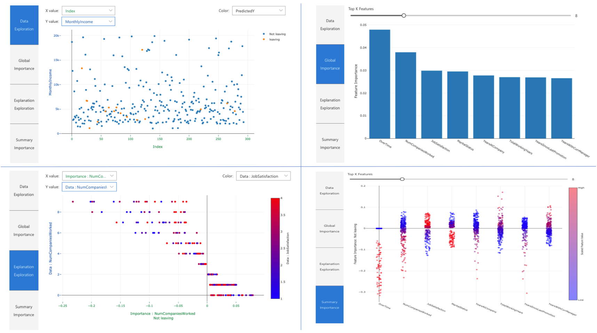
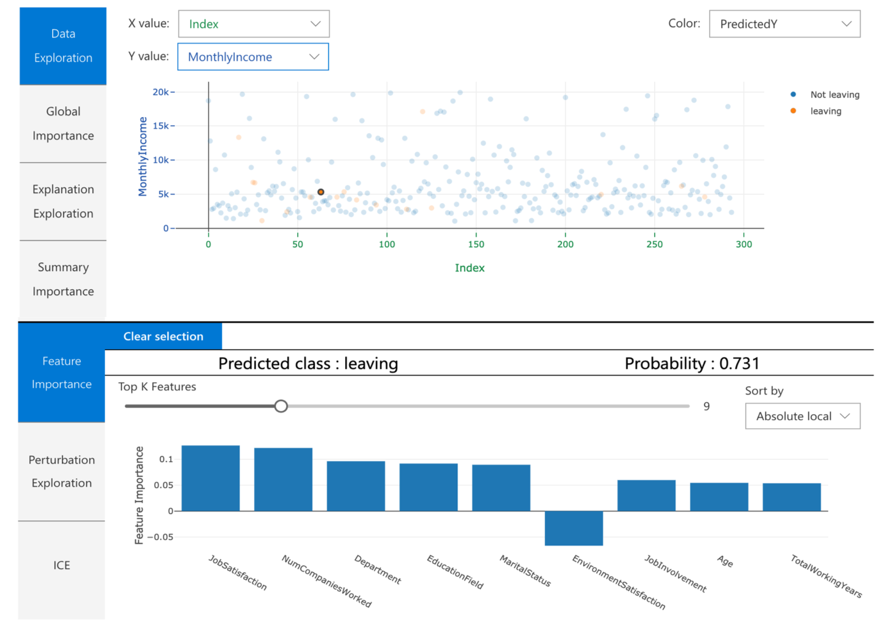
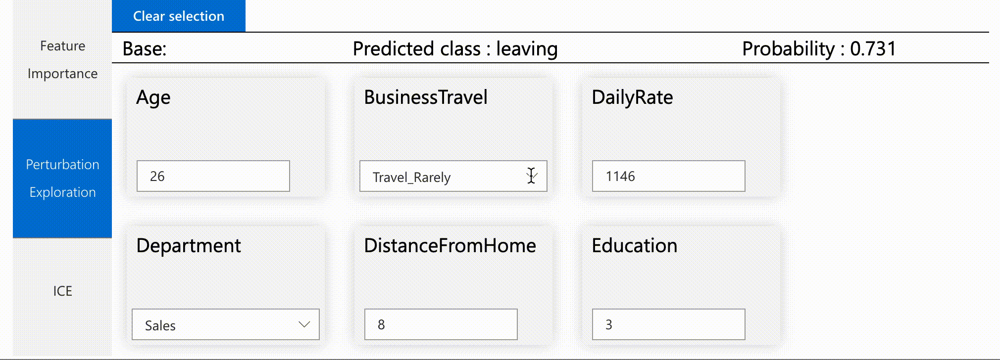
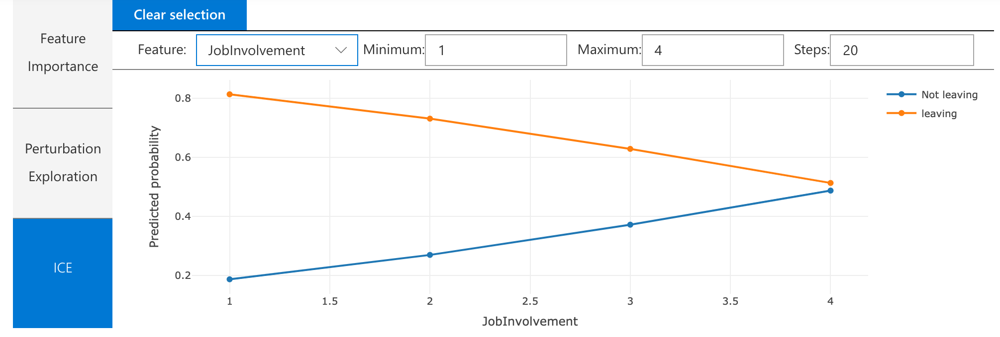
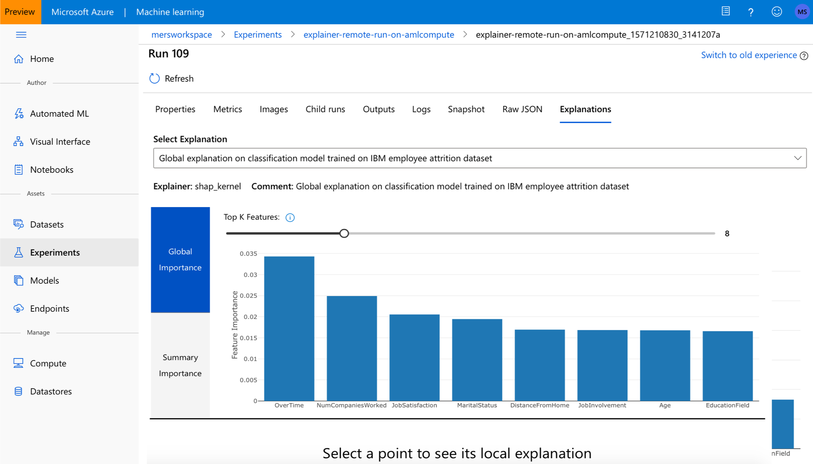

# Use the interpretability package to explain ML models & predictions in Python

[!INCLUDE [applies-to-skus](../../includes/aml-applies-to-basic-enterprise-sku.md)]

In this how-to guide, you learn to use the interpretability package of the Azure Machine Learning Python SDK to perform the following tasks:


* Explain the entire model behavior or individual predictions on your personal machine locally.

* Enable interpretability techniques for engineered features.

* Explain the behavior for the entire model and individual predictions in Azure.

* Use a visualization dashboard to interact with your model explanations.

* Deploy a scoring explainer alongside your model to observe explanations during inferencing.


For more information on the supported interpretability techniques and machine learning models, see [Model interpretability in Azure Machine Learning](how-to-machine-learning-interpretability.md) and [sample notebooks](https://github.com/Azure/MachineLearningNotebooks/tree/master/how-to-use-azureml/explain-model).

## Generate feature importance value on your personal machine 
The following example shows how to use the interpretability package on your personal machine without contacting Azure services.

1. Install `azureml-interpret` and `azureml-contrib-interpret` packages.
    ```bash
    pip install azureml-interpret
    pip install azureml-contrib-interpret
    ```

2. Train a sample model in a local Jupyter notebook.

    ```python
    # load breast cancer dataset, a well-known small dataset that comes with scikit-learn
    from sklearn.datasets import load_breast_cancer
    from sklearn import svm
    from sklearn.model_selection import train_test_split
    breast_cancer_data = load_breast_cancer()
    classes = breast_cancer_data.target_names.tolist()
    
    # split data into train and test
    from sklearn.model_selection import train_test_split
    x_train, x_test, y_train, y_test = train_test_split(breast_cancer_data.data,            
                                                        breast_cancer_data.target,  
                                                        test_size=0.2,
                                                        random_state=0)
    clf = svm.SVC(gamma=0.001, C=100., probability=True)
    model = clf.fit(x_train, y_train)
    ```

3. Call the explainer locally.
   * To initialize an explainer object, pass your model and some training data to the explainer's constructor.
   * To make your explanations and visualizations more informative, you can choose to pass in feature names and output class names if doing classification.

   The following code blocks show how to instantiate an explainer object with `TabularExplainer`, `MimicExplainer`, and `PFIExplainer` locally.
   * `TabularExplainer` calls one of the three SHAP explainers underneath (`TreeExplainer`, `DeepExplainer`, or `KernelExplainer`).
   * `TabularExplainer` automatically selects the most appropriate one for your use case, but you can call each of its three underlying explainers directly.

    ```python
    from interpret.ext.blackbox import TabularExplainer

    # "features" and "classes" fields are optional
    explainer = TabularExplainer(model, 
                                 x_train, 
                                 features=breast_cancer_data.feature_names, 
                                 classes=classes)
    ```

    or

    ```python

    from interpret.ext.blackbox import MimicExplainer
    
    # you can use one of the following four interpretable models as a global surrogate to the black box model
    
    from interpret.ext.glassbox import LGBMExplainableModel
    from interpret.ext.glassbox import LinearExplainableModel
    from interpret.ext.glassbox import SGDExplainableModel
    from interpret.ext.glassbox import DecisionTreeExplainableModel

    # "features" and "classes" fields are optional
    # augment_data is optional and if true, oversamples the initialization examples to improve surrogate model accuracy to fit original model.  Useful for high-dimensional data where the number of rows is less than the number of columns.
    # max_num_of_augmentations is optional and defines max number of times we can increase the input data size.
    # LGBMExplainableModel can be replaced with LinearExplainableModel, SGDExplainableModel, or DecisionTreeExplainableModel
    explainer = MimicExplainer(model, 
                               x_train, 
                               LGBMExplainableModel, 
                               augment_data=True, 
                               max_num_of_augmentations=10, 
                               features=breast_cancer_data.feature_names, 
                               classes=classes)
    ```

    or

    ```python
    from interpret.ext.blackbox import PFIExplainer

    # "features" and "classes" fields are optional
    explainer = PFIExplainer(model,
                             features=breast_cancer_data.feature_names, 
                             classes=classes)
    ```

### Explain the entire model behavior (global explanation) 

Refer to the following example to help you get the aggregate (global) feature importance values.

```python

# you can use the training data or the test data here
global_explanation = explainer.explain_global(x_train)

# if you used the PFIExplainer in the previous step, use the next line of code instead
# global_explanation = explainer.explain_global(x_train, true_labels=y_test)

# sorted feature importance values and feature names
sorted_global_importance_values = global_explanation.get_ranked_global_values()
sorted_global_importance_names = global_explanation.get_ranked_global_names()
dict(zip(sorted_global_importance_names, sorted_global_importance_values))

# alternatively, you can print out a dictionary that holds the top K feature names and values
global_explanation.get_feature_importance_dict()
```

### Explain an individual prediction (local explanation)
Get the individual feature importance values of different datapoints by calling explanations for an individual instance or a group of instances.
> [!NOTE]
> `PFIExplainer` does not support local explanations.

```python
# get explanation for the first data point in the test set
local_explanation = explainer.explain_local(x_test[0:5])

# sorted feature importance values and feature names
sorted_local_importance_names = local_explanation.get_ranked_local_names()
sorted_local_importance_values = local_explanation.get_ranked_local_values()
```

### Raw feature transformations

You can opt to get explanations in terms of raw, untransformed features rather than engineered features. For this option, you pass your feature transformation pipeline to the explainer in `train_explain.py`. Otherwise, the explainer provides explanations in terms of engineered features.

The format of supported transformations is the same as described in [sklearn-pandas](https://github.com/scikit-learn-contrib/sklearn-pandas). In general, any transformations are supported as long as they operate on a single column so that it's clear they're  one-to-many.

Get an explanation for raw features by using a `sklearn.compose.ColumnTransformer` or with a list of fitted transformer tuples. The following example  uses `sklearn.compose.ColumnTransformer`.

```python
from sklearn.compose import ColumnTransformer

numeric_transformer = Pipeline(steps=[
    ('imputer', SimpleImputer(strategy='median')),
    ('scaler', StandardScaler())])

categorical_transformer = Pipeline(steps=[
    ('imputer', SimpleImputer(strategy='constant', fill_value='missing')),
    ('onehot', OneHotEncoder(handle_unknown='ignore'))])

preprocessor = ColumnTransformer(
    transformers=[
        ('num', numeric_transformer, numeric_features),
        ('cat', categorical_transformer, categorical_features)])

# append classifier to preprocessing pipeline.
# now we have a full prediction pipeline.
clf = Pipeline(steps=[('preprocessor', preprocessor),
                      ('classifier', LogisticRegression(solver='lbfgs'))])


# clf.steps[-1][1] returns the trained classification model
# pass transformation as an input to create the explanation object
# "features" and "classes" fields are optional
tabular_explainer = TabularExplainer(clf.steps[-1][1],
                                     initialization_examples=x_train,
                                     features=dataset_feature_names,
                                     classes=dataset_classes,
                                     transformations=preprocessor)
```

In case you want to run the example with the list of fitted transformer tuples, use the following code:

```python
from sklearn.pipeline import Pipeline
from sklearn.impute import SimpleImputer
from sklearn.preprocessing import StandardScaler, OneHotEncoder
from sklearn.linear_model import LogisticRegression
from sklearn_pandas import DataFrameMapper

# assume that we have created two arrays, numerical and categorical, which holds the numerical and categorical feature names

numeric_transformations = [([f], Pipeline(steps=[('imputer', SimpleImputer(
    strategy='median')), ('scaler', StandardScaler())])) for f in numerical]

categorical_transformations = [([f], OneHotEncoder(
    handle_unknown='ignore', sparse=False)) for f in categorical]

transformations = numeric_transformations + categorical_transformations

# append model to preprocessing pipeline.
# now we have a full prediction pipeline.
clf = Pipeline(steps=[('preprocessor', DataFrameMapper(transformations)),
                      ('classifier', LogisticRegression(solver='lbfgs'))])

# clf.steps[-1][1] returns the trained classification model
# pass transformation as an input to create the explanation object
# "features" and "classes" fields are optional
tabular_explainer = TabularExplainer(clf.steps[-1][1],
                                     initialization_examples=x_train,
                                     features=dataset_feature_names,
                                     classes=dataset_classes,
                                     transformations=transformations)
```

## Generate feature importance values via remote runs

The following example shows how you can use the `ExplanationClient` class to enable model interpretability for remote runs. It is conceptually similar to the local process, except you:

* Use the `ExplanationClient` in the remote run to upload the interpretability context.
* Download the context later in a local environment.

1. Install `azureml-interpret` and `azureml-contrib-interpret` packages.
    ```bash
    pip install azureml-interpret
    pip install azureml-contrib-interpret
    ```
1. Create a training script in a local Jupyter notebook. For example, `train_explain.py`.

    ```python
    from azureml.contrib.interpret.explanation.explanation_client import ExplanationClient
    from azureml.core.run import Run
    from interpret.ext.blackbox import TabularExplainer

    run = Run.get_context()
    client = ExplanationClient.from_run(run)

    # write code to get and split your data into train and test sets here
    # write code to train your model here 

    # explain predictions on your local machine
    # "features" and "classes" fields are optional
    explainer = TabularExplainer(model, 
                                 x_train, 
                                 features=feature_names, 
                                 classes=classes)

    # explain overall model predictions (global explanation)
    global_explanation = explainer.explain_global(x_test)
    
    # uploading global model explanation data for storage or visualization in webUX
    # the explanation can then be downloaded on any compute
    # multiple explanations can be uploaded
    client.upload_model_explanation(global_explanation, comment='global explanation: all features')
    # or you can only upload the explanation object with the top k feature info
    #client.upload_model_explanation(global_explanation, top_k=2, comment='global explanation: Only top 2 features')
    ```

1. Set up an Azure Machine Learning Compute as your compute target and submit your training run. See [setting up compute targets for model training](how-to-set-up-training-targets.md#amlcompute) for instructions. You might also find the [example notebooks](https://github.com/Azure/MachineLearningNotebooks/tree/master/how-to-use-azureml/explain-model/azure-integration/remote-explanation) helpful.

1. Download the explanation in your local Jupyter notebook.

    ```python
    from azureml.contrib.interpret.explanation.explanation_client import ExplanationClient
    
    client = ExplanationClient.from_run(run)
    
    # get model explanation data
    explanation = client.download_model_explanation()
    # or only get the top k (e.g., 4) most important features with their importance values
    explanation = client.download_model_explanation(top_k=4)
    
    global_importance_values = explanation.get_ranked_global_values()
    global_importance_names = explanation.get_ranked_global_names()
    print('global importance values: {}'.format(global_importance_values))
    print('global importance names: {}'.format(global_importance_names))
    ```


## Visualizations

After you download the explanations in your local Jupyter notebook, you can use the visualization dashboard to understand and interpret your model.

### Understand entire model behavior (global explanation) 

The following plots provide an overall view of the trained model along with its predictions and explanations.

|Plot|Description|
|----|-----------|
|Data Exploration| Displays an overview of the dataset along with prediction values.|
|Global Importance|Aggregates feature importance values of individual datapoints to show the model's overall top K (configurable K) important features. Helps understanding of underlying model's overall behavior.|
|Explanation Exploration|Demonstrates how a feature affects a change in model's prediction values, or the probability of prediction values. Shows impact of feature interaction.|
|Summary Importance|Uses individual feature importance values across all data points to show the distribution of each feature's impact on the prediction value. Using this diagram, you investigate in what direction the feature values affects the prediction values.
|

[](./media/how-to-machine-learning-interpretability-aml/global-charts.png#lightbox)

### Understand individual predictions (local explanation) 

You can load the individual feature importance plot for any data point by clicking on any of the individual data points in any of the overall plots.

|Plot|Description|
|----|-----------|
|Local Importance|Shows the top K (configurable K) important features for an individual prediction. Helps illustrate the local behavior of the underlying model on a specific data point.|
|Perturbation Exploration (what if analysis)|Allows changes to feature values of the selected data point and observe resulting changes to prediction value.|
|Individual Conditional Expectation (ICE)| Allows feature value changes from a minimum value to a maximum value. Helps illustrate how the data point's prediction changes when a feature changes.|

[](./media/how-to-machine-learning-interpretability-aml/local-charts.png#lightbox)


[](./media/how-to-machine-learning-interpretability-aml/perturbation.gif#lightbox)


[](./media/how-to-machine-learning-interpretability-aml/ice-plot.png#lightbox)

> [!NOTE]
> Before the Jupyter kernel starts, make sure you enable widget extensions for the visualization dashboard.

* Jupyter notebooks

    ```shell
    jupyter nbextension install --py --sys-prefix azureml.contrib.interpret.visualize
    jupyter nbextension enable --py --sys-prefix azureml.contrib.interpret.visualize
    ```

* JupyterLab

    ```shell
    jupyter labextension install @jupyter-widgets/jupyterlab-manager
    jupyter labextension install microsoft-mli-widget
    ```

To load the visualization dashboard, use the following code.

```python
from interpret_community.widget import ExplanationDashboard

ExplanationDashboard(global_explanation, model, x_test)
```

### Visualization in Azure Machine Learning studio

If you complete the [remote interpretability](how-to-machine-learning-interpretability-aml.md#generate-feature-importance-values-via-remote-runs) steps (uploading generated explanation to Azure Machine Learning Run History), you can view the visualization dashboard in [Azure Machine Learning studio](https://ml.azure.com). This dashboard is a simpler version of the visualization dashboard explained above (explanation exploration and ICE plots are disabled as there is no active compute in studio that can perform their real time computations).

If the dataset, global, and local explanations are available, data populates all of the tabs (except Perturbation Exploration and ICE). If only a global explanation is available, the Summary Importance tab and all local explanation tabs are disabled.

Follow one of these paths to access the visualization dashboard in Azure Machine Learning studio:

* **Experiments** pane (Preview)
  1. Select **Experiments** in the left pane to see a list of experiments that you've run on Azure Machine Learning.
  1. Select a particular experiment to view all the runs in that experiment.
  1. Select a run, and then the **Explanations** tab to the explanation visualization dashboard.

   [](./media/how-to-machine-learning-interpretability-aml/amlstudio-experiments.png#lightbox)

* **Models** pane
  1. If you registered your original model by following the steps in [Deploy models with Azure Machine Learning](https://docs.microsoft.com/azure/machine-learning/how-to-deploy-and-where), you can select **Models** in the left pane to view it.
  1. Select a model, and then the **Explanations** tab to view the explanation visualization dashboard.

## Interpretability at inference time

You can deploy the explainer along with the original model and use it at inference time to provide the individual feature importance values (local explanation) for new any new datapoint. We also offer lighter-weight scoring explainers to improve interpretability performance at inference time. The process of deploying a lighter-weight scoring explainer is similar to deploying a model and includes the following steps:

1. Create an explanation object. For example, you can use `TabularExplainer`:

   ```python
    from interpret.ext.blackbox import TabularExplainer


   explainer = TabularExplainer(model, 
                                initialization_examples=x_train, 
                                features=dataset_feature_names, 
                                classes=dataset_classes, 
                                transformations=transformations)
   ```

1. Create a scoring explainer with the explanation object.

   ```python
   from azureml.interpret.scoring.scoring_explainer import KernelScoringExplainer, save

   # create a lightweight explainer at scoring time
   scoring_explainer = KernelScoringExplainer(explainer)

   # pickle scoring explainer
   # pickle scoring explainer locally
   OUTPUT_DIR = 'my_directory'
   save(scoring_explainer, directory=OUTPUT_DIR, exist_ok=True)
   ```

1. Configure and register an image that uses the scoring explainer model.

   ```python
   # register explainer model using the path from ScoringExplainer.save - could be done on remote compute
   # scoring_explainer.pkl is the filename on disk, while my_scoring_explainer.pkl will be the filename in cloud storage
   run.upload_file('my_scoring_explainer.pkl', os.path.join(OUTPUT_DIR, 'scoring_explainer.pkl'))
   
   scoring_explainer_model = run.register_model(model_name='my_scoring_explainer', 
                                                model_path='my_scoring_explainer.pkl')
   print(scoring_explainer_model.name, scoring_explainer_model.id, scoring_explainer_model.version, sep = '\t')
   ```

1. As an optional step, you can retrieve the scoring explainer from cloud and test the explanations.

   ```python
   from azureml.interpret.scoring.scoring_explainer import load

   # retrieve the scoring explainer model from cloud"
   scoring_explainer_model = Model(ws, 'my_scoring_explainer')
   scoring_explainer_model_path = scoring_explainer_model.download(target_dir=os.getcwd(), exist_ok=True)

   # load scoring explainer from disk
   scoring_explainer = load(scoring_explainer_model_path)

   # test scoring explainer locally
   preds = scoring_explainer.explain(x_test)
   print(preds)
   ```

1. Deploy the image to a compute target, by following these steps:

   1. If needed, register your original prediction model by following the steps in [Deploy models with Azure Machine Learning](https://docs.microsoft.com/azure/machine-learning/how-to-deploy-and-where).

   1. Create a scoring file.

         ```python
         %%writefile score.py
         import json
         import numpy as np
         import pandas as pd
         import os
         import pickle
         from sklearn.externals import joblib
         from sklearn.linear_model import LogisticRegression
         from azureml.core.model import Model
          
         def init():
         
            global original_model
            global scoring_model
             
            # retrieve the path to the model file using the model name
            # assume original model is named original_prediction_model
            original_model_path = Model.get_model_path('original_prediction_model')
            scoring_explainer_path = Model.get_model_path('my_scoring_explainer')

            original_model = joblib.load(original_model_path)
            scoring_explainer = joblib.load(scoring_explainer_path)

         def run(raw_data):
            # get predictions and explanations for each data point
            data = pd.read_json(raw_data)
            # make prediction
            predictions = original_model.predict(data)
            # retrieve model explanations
            local_importance_values = scoring_explainer.explain(data)
            # you can return any data type as long as it is JSON-serializable
            return {'predictions': predictions.tolist(), 'local_importance_values': local_importance_values}
         ```
   1. Define the deployment configuration.

         This configuration depends on the requirements of your model. The following example defines a configuration that uses one CPU core and one GB of memory.

         ```python
         from azureml.core.webservice import AciWebservice

          aciconfig = AciWebservice.deploy_configuration(cpu_cores=1,
                                                    memory_gb=1,
                                                    tags={"data": "NAME_OF_THE_DATASET",
                                                          "method" : "local_explanation"},
                                                    description='Get local explanations for NAME_OF_THE_PROBLEM')
         ```

   1. Create a file with environment dependencies.

         ```python
         from azureml.core.conda_dependencies import CondaDependencies

         # WARNING: to install this, g++ needs to be available on the Docker image and is not by default (look at the next cell)

         azureml_pip_packages = ['azureml-defaults', 'azureml-contrib-interpret', 'azureml-core', 'azureml-telemetry', 'azureml-interpret']
 

         # specify CondaDependencies obj
         myenv = CondaDependencies.create(conda_packages=['scikit-learn', 'pandas'],
                                          pip_packages=['sklearn-pandas'] + azureml_pip_packages,
                                          pin_sdk_version=False)


         with open("myenv.yml","w") as f:
            f.write(myenv.serialize_to_string())

         with open("myenv.yml","r") as f:
            print(f.read())
         ```

   1. Create a custom dockerfile with g++ installed.

         ```python
         %%writefile dockerfile
         RUN apt-get update && apt-get install -y g++
         ```

   1. Deploy the created image.
   
         This process takes approximately five minutes.

         ```python
         from azureml.core.webservice import Webservice
         from azureml.core.image import ContainerImage

         # use the custom scoring, docker, and conda files we created above
         image_config = ContainerImage.image_configuration(execution_script="score.py",
                                                         docker_file="dockerfile",
                                                         runtime="python",
                                                         conda_file="myenv.yml")

         # use configs and models generated above
         service = Webservice.deploy_from_model(workspace=ws,
                                             name='model-scoring-service',
                                             deployment_config=aciconfig,
                                             models=[scoring_explainer_model, original_model],
                                             image_config=image_config)

         service.wait_for_deployment(show_output=True)
         ```

1. Test the deployment.

    ```python
    import requests

    # create data to test service with
    examples = x_list[:4]
    input_data = examples.to_json()

    headers = {'Content-Type':'application/json'}

    # send request to service
    resp = requests.post(service.scoring_uri, input_data, headers=headers)

    print("POST to url", service.scoring_uri)
    # can covert back to Python objects from json string if desired
    print("prediction:", resp.text)
    ```

1. Clean up.

   To delete a deployed web service, use `service.delete()`.

## Next steps

[Learn more about model interpretability](how-to-machine-learning-interpretability.md)

[Check out Azure Machine Learning Interpretability sample notebooks](https://github.com/Azure/MachineLearningNotebooks/tree/master/how-to-use-azureml/explain-model)

