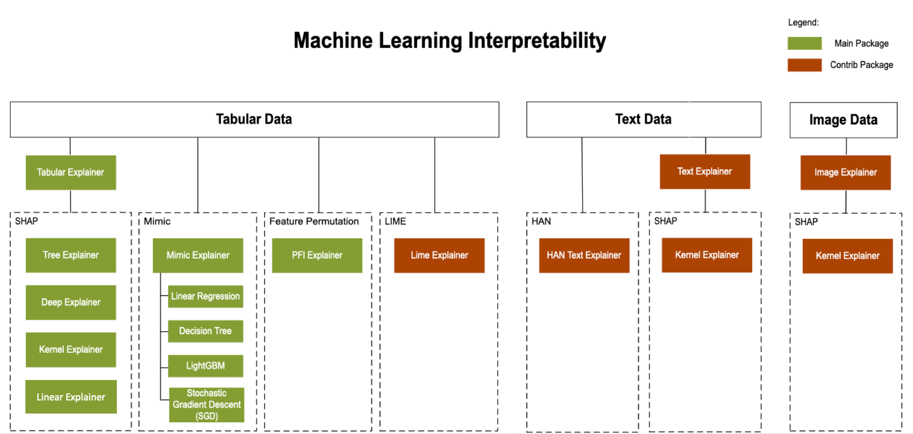

# Model interpretability in Azure Machine Learning
[!INCLUDE [applies-to-skus](../../includes/aml-applies-to-basic-enterprise-sku.md)]

## Overview of model interpretability

Interpretability is critical for data scientists, auditors, and business decision makers alike to ensure compliance with company policies, industry standards, and government regulations:

+ Data scientists need the ability to explain their models to executives and stakeholders, so they can understand the value and accuracy of their findings. They also require interpretability to debug their models and make informed decisions about how to improve them. 

+ Legal auditors require tools to validate models with respect to regulatory compliance and monitor how models' decisions are impacting humans. 

+ Business decision makers need peace-of-mind by having the ability to provide transparency for end users. This allows them to earn and maintain trust.

Enabling the capability of explaining a machine learning model is important during two main phases of model development:
+ During the training phase, as model designers and evaluators can use interpretability output of a model to verify hypotheses and build trust with stakeholders. They also use the insights into the model for debugging, validating model behavior matches their objectives, and to check for model unfairness or insignificant features.

+ During the inferencing phase, as having transparency around deployed models empowers executives to understand "when deployed" how the model is working and how its decisions are treating and impacting people in real life. 

## Interpretability with Azure Machine Learning

The interpretability classes are made available through multiple SDK packages: (Learn how to [install SDK packages for Azure Machine Learning](https://docs.microsoft.com/python/api/overview/azure/ml/install?view=azure-ml-py))

* `azureml.interpret`, the main package, containing functionalities supported by Microsoft.

* `azureml.contrib.interpret`, preview, and experimental functionalities that you can try.

* `azureml.train.automl.automlexplainer` package for interpreting automated machine learning models.

Use `pip install azureml-interpret` and `pip install azureml-interpret-contrib` for general use, and `pip install azureml-interpret-contrib` for AutoML use to get the interpretability packages.

> [!IMPORTANT]
> Content in the `contrib` namespace is not fully supported. As the experimental functionalities become mature, they will gradually be moved to the main namespace.
.

## How to interpret your model

Using the classes and methods in the SDK, you can:
+ Explain model prediction by generating feature importance values for the entire model and/or individual datapoints. 
+ Achieve model interpretability on real-world datasets at scale, during training and inference.
+ Use an interactive visualization dashboard to discover patterns in data and explanations at training time

In machine learning, **features** are the data fields used to predict a target data point. For example,
to predict credit risk, data fields for age, account size, and account age might be used. In this case,
age, account size, and account age are **features**. Feature importance tells you how each data field affected the model's predictions. For example, age may be heavily used in the prediction while account size and age do not affect the prediction values significantly. This process allows data scientists to explain resulting predictions, so that stakeholders have visibility into what features are most important in the model.

Learn about supported interpretability techniques, supported machine learning models, and supported run environments here.

## Supported interpretability techniques

 `azureml-interpret` uses the interpretability techniques developed in [Interpret-Community](https://github.com/interpretml/interpret-community/), an open source python package for training interpretable models and helping to explain blackbox AI systems. [Interpret-Community](https://github.com/interpretml/interpret-community/) serves as the host for this SDK's supported explainers, and currently supports the following interpretability techniques:

|Interpretability Technique|Description|Type|
|--|--|--------------------|
|SHAP Tree Explainer| [SHAP](https://github.com/slundberg/shap)'s tree explainer, which focuses on polynomial time fast SHAP value estimation algorithm specific to **trees and ensembles of trees**.|Model-specific|
|SHAP Deep Explainer| Based on the explanation from SHAP, Deep Explainer "is a high-speed approximation algorithm for SHAP values in deep learning models that builds on a connection with DeepLIFT described in the [SHAP NIPS paper](https://papers.nips.cc/paper/7062-a-unified-approach-to-interpreting-model-predictions). **TensorFlow** models and **Keras** models using the TensorFlow backend are supported (there is also preliminary support for PyTorch)".|Model-specific|
|SHAP Linear Explainer| SHAP's Linear explainer computes SHAP values for a **linear model**, optionally accounting for inter-feature correlations.|Model-specific|
|SHAP Kernel Explainer| SHAP's Kernel explainer uses a specially weighted local linear regression to estimate SHAP values for **any model**.|Model-agnostic|
|Mimic Explainer (Global Surrogate)| Mimic explainer is based on the idea of training [global surrogate models](https://christophm.github.io/interpretable-ml-book/global.html) to mimic blackbox models. A global surrogate model is an intrinsically interpretable model that is trained to approximate the predictions of **any black box model** as accurately as possible. Data scientists can interpret the surrogate model to draw conclusions about the black box model. You can use one of the following interpretable models as your surrogate model: LightGBM (LGBMExplainableModel), Linear Regression (LinearExplainableModel), Stochastic Gradient Descent explainable model (SGDExplainableModel), and Decision Tree (DecisionTreeExplainableModel).|Model-agnostic|
|Permutation Feature Importance Explainer (PFI)| Permutation Feature Importance is a technique used to explain classification and regression models that is inspired by [Breiman's Random Forests paper](https://www.stat.berkeley.edu/~breiman/randomforest2001.pdf) (see section 10). At a high level, the way it works is by randomly shuffling data one feature at a time for the entire dataset and calculating how much the performance metric of interest changes. The larger the change, the more important that feature is. PFI can explain the overall behavior of **any underlying model** but does not explain individual predictions. |Model-agnostic|

Besides the interpretability techniques described above, we support another SHAP-based explainer, called `TabularExplainer`. Depending on the model, `TabularExplainer` uses one of the supported SHAP explainers:

* TreeExplainer for all tree-based models
* DeepExplainer for DNN models
* LinearExplainer for linear models
* KernelExplainer for all other models

`TabularExplainer` has also made significant feature and performance enhancements over the direct SHAP Explainers:

* **Summarization of the initialization dataset**. In cases where speed of explanation is most important, we summarize the initialization dataset and generate a small set of representative samples, which speeds up the generation of overall and individual feature importance values.
* **Sampling the evaluation data set**. If the user passes in a large set of evaluation samples but does not actually need all of them to be evaluated, the sampling parameter can be set to true to speed up the calculation of overall model explanations.

The following diagram shows the current structure of supported explainers.

## Supported machine learning models

The `azureml.interpret` package of the SDK supports models trained with the following dataset formats:
- `numpy.array`
- `pandas.DataFrame`
- `iml.datatypes.DenseData`
- `scipy.sparse.csr_matrix`

The explanation functions accept both models and pipelines as input. If a model is provided, the model must implement the prediction function `predict` or `predict_proba` that conforms to the Scikit convention. If your model does not support this, you can wrap your model in a function that generates the same outcome as `predict` or `predict_proba` in Scikit and use that wrapper function with the selected explainer. If a pipeline is provided, the explanation function assumes that the running pipeline script returns a prediction. Using this wrapping technique, `azureml.interpret` can support models trained via PyTorch, TensorFlow, and Keras deep learning frameworks as well as classic machine learning models.

## Local and remote compute target

The `azureml.interpret` package is designed to work with both local and remote compute targets. If run locally, The SDK functions will not contact any Azure services. 

You can run explanation remotely on Azure Machine Learning Compute and log the explanation info into the Azure Machine Learning Run History Service. Once this information is logged, reports and visualizations from the explanation are readily available on Azure Machine Learning studio for user analysis.

## Next steps

- See the [how-to](how-to-machine-learning-interpretability-aml.md) for enabling interpretability for models training both locally and on Azure Machine Learning remote compute resources. 
- See the [sample notebooks](https://github.com/Azure/MachineLearningNotebooks/tree/master/how-to-use-azureml/explain-model) for additional scenarios. 
- If you're interested in interpretability for text scenarios, see [Interpret-text](https://github.com/interpretml/interpret-text), a related open source repo to [Interpret-Community](https://github.com/interpretml/interpret-community/), for interpretability techniques for NLP. `azureml.interpret` package does not currently support these techniques but you can get started with an [example notebook on text classification](https://github.com/interpretml/interpret-text/blob/master/notebooks/text_classification/text_classification_classical_text_explainer.ipynb).
