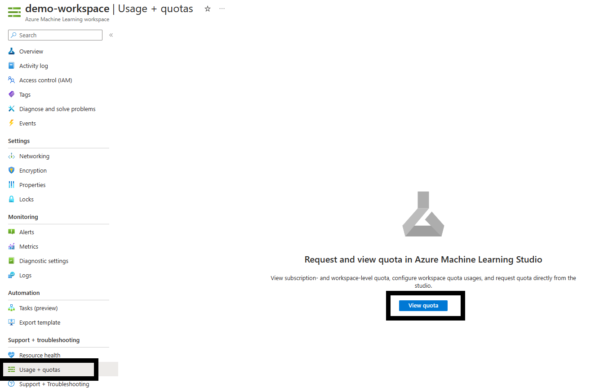
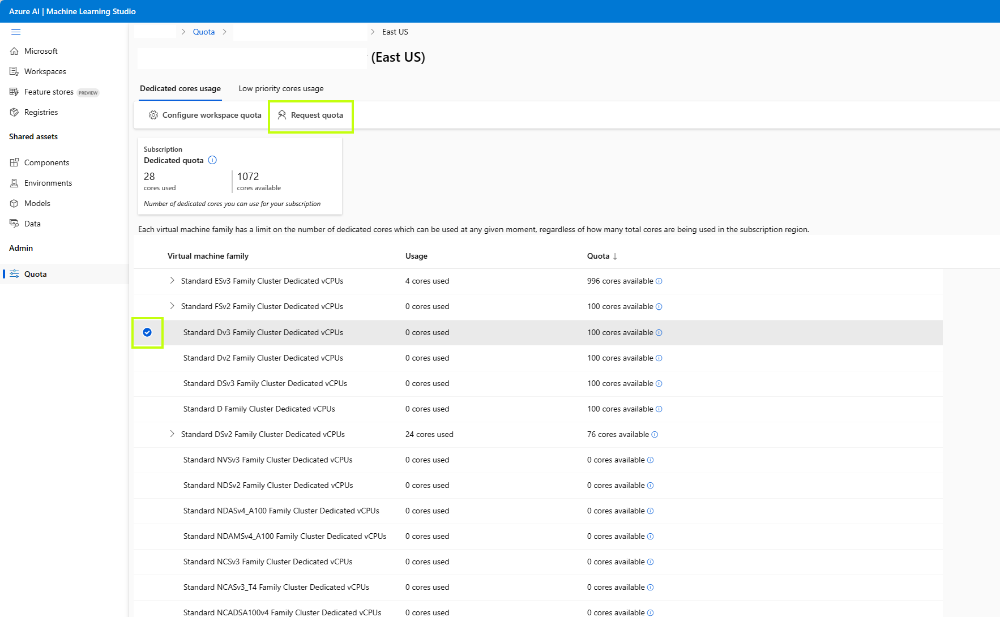
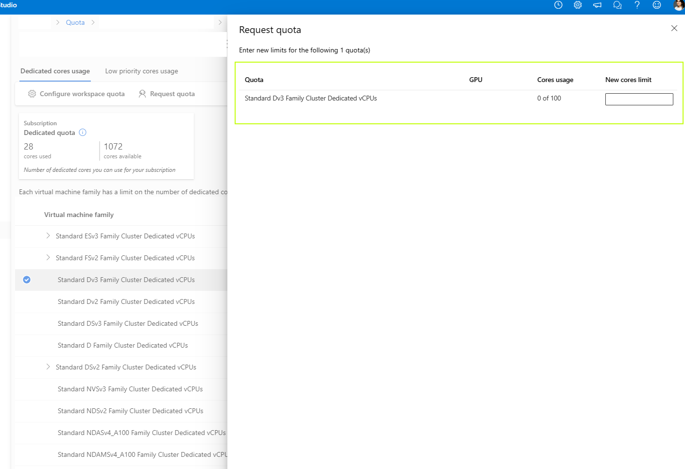
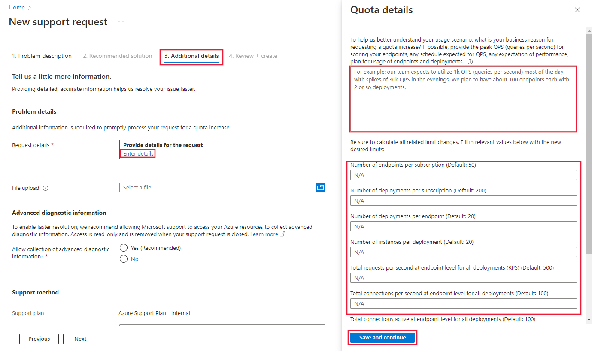

# Manage and increase quotas and limits for resources with Azure Machine Learning

Azure uses quotas and limits to prevent budget overruns due to fraud, and to honor Azure capacity constraints. Consider these limits as you scale for production workloads. In this article, you learn about:

> [!div class="checklist"]
> + Default limits on Azure resources related to [Azure Machine Learning](overview-what-is-azure-machine-learning.md).
> + Creating workspace-level quotas.
> + Viewing your quotas and limits.
> + Requesting quota increases.

Along with managing quotas and limits, you can learn how to [plan and manage costs for Azure Machine Learning](concept-plan-manage-cost.md) or learn about the [service limits in Azure Machine Learning](resource-limits-capacity.md).

## Special considerations

+ Quotas are applied to each subscription in your account. If you have multiple subscriptions, you must request a quota increase for each subscription.

+ A quota is a *credit limit* on Azure resources, *not a capacity guarantee*. If you have large-scale capacity needs, [contact Azure support to increase your quota](#request-quota-increases).

+ A quota is shared across all the services in your subscriptions, including Azure Machine Learning. Calculate usage across all services when you're evaluating capacity.
 
  > [!NOTE]
  > Azure Machine Learning compute is an exception. It has a separate quota from the core compute quota. 

+ **Default limits vary by offer category type**, such as free trial, pay-as-you-go, and virtual machine (VM) series (such as Dv2, F, and G).

## Default resource quotas and limits

In this section, you learn about the default and maximum quotas and limits for the following resources:

+ Azure Machine Learning assets
+ Azure Machine Learning computes (including serverless Spark)
+ Azure Machine Learning shared quota
+ Azure Machine Learning online endpoints (both managed and Kubernetes) and batch endpoints
+ Azure Machine Learning pipelines
+ Azure Machine Learning integration with Synapse
+ Virtual machines
+ Azure Container Instances
+ Azure Storage

> [!IMPORTANT]
> Limits are subject to change. For the latest information, see  [Service limits in Azure Machine Learning](resource-limits-capacity.md).

### Azure Machine Learning assets
The following limits on assets apply on a *per-workspace* basis. 

| **Resource** | **Maximum limit** |
| --- | --- |
| Datasets | 10 million |
| Runs | 10 million |
| Models | 10 million|
| Artifacts | 10 million |

In addition, the maximum **run time** is 30 days and the maximum number of **metrics logged per run** is 1 million.

### Azure Machine Learning Compute
[Azure Machine Learning Compute](concept-compute-target.md#azure-machine-learning-compute-managed) has a default quota limit on both the *number of cores* and the *number of unique compute resources* that are allowed per region in a subscription.

> [!NOTE]
> * The *quota on the number of cores* is split by each VM Family and cumulative total cores.
> * The *quota on the number of unique compute resources* per region is separate from the VM core quota, as it applies only to the managed compute resources of Azure Machine Learning.

To raise the limits for the following items, [Request a quota increase](#request-quota-increases):

* VM family core quotas. To learn more about which VM family to request a quota increase for, see [virtual machine sizes in Azure](../virtual-machines/sizes.md). For example, GPU VM families start with an "N" in their family name (such as the NCv3 series).
* Total subscription core quotas
* Cluster quota
* Other resources in this section

Available resources:
+ **Dedicated cores per region** have a default limit of 24 to 300, depending on your subscription offer type. You can increase the number of dedicated cores per subscription for each VM family. Specialized VM families like NCv2, NCv3, or ND series start with a default of zero cores.  GPUs also default to zero cores.

+ **Low-priority cores per region** have a default limit of 100 to 3,000, depending on your subscription offer type. The number of low-priority cores per subscription can be increased and is a single value across VM families.

+ **Total compute limit per region** has a default limit of 500 per region within a given subscription and can be increased up to a maximum value of 2500 per region. This limit is shared between training clusters, compute instances, and managed online endpoint deployments. A compute instance is considered a single-node cluster for quota purposes. In order to increase the total compute limit, [open an online customer support request](https://ms.portal.azure.com/#view/Microsoft_Azure_Support/NewSupportRequestV3Blade/callerWorkflowId/5088c408-f627-4398-9aa3-c41cdd93a6eb/callerName/Microsoft_Azure_Support%2FHelpAndSupportOverview.ReactView). Provide the following information:

1. When opening the support request, select __Technical__ as the __Issue type__.
1. Select the subscription of your choice
1. Select __Machine Learning__ as the __Service__.
1. Select the resource of your choice
1. In the summary, mention "Increase total compute limits"
1. Select __Compute Cluster__ as the __Problem type__ and __Cluster does not scale up or is stuck in resizing__ as the __Problem subtype__.

    :::image type="content" source="media/how-to-manage-quotas/problem-description.png" alt-text="Screenshot of the problem description tab.":::

1. On the __Additional details__ tab, provide the subscription ID, region, new limit (between 500 and 2500) and business justification if you would like to increase the total compute limits in this region.

    :::image type="content" source="media/how-to-manage-quotas/additional-details.png" alt-text="Screenshot of the additional details tab.":::

1. Finally, select __Create__ to create a support request ticket.

The following table shows more limits in the platform. Reach out to the Azure Machine Learning product team through a **technical** support ticket to request an exception.

| **Resource or Action** | **Maximum limit** |
| --- | --- |
| Workspaces per resource group | 800 |
| Nodes in a single Azure Machine Learning compute (AmlCompute) **cluster** set up as a non communication-enabled pool (that is, can't run MPI jobs) | 100 nodes but configurable up to 65,000 nodes |
| Nodes in a single Parallel Run Step **run** on an Azure Machine Learning compute (AmlCompute) cluster | 100 nodes but configurable up to 65,000 nodes if your cluster is set up to scale as mentioned previously |
| Nodes in a single Azure Machine Learning compute (AmlCompute) **cluster** set up as a communication-enabled pool | 300 nodes but configurable up to 4,000 nodes |
| Nodes in a single Azure Machine Learning compute (AmlCompute) **cluster** set up as a communication-enabled pool on an RDMA enabled VM Family | 100 nodes |
| Nodes in a single MPI **run** on an Azure Machine Learning compute (AmlCompute) cluster | 100 nodes |
| Job lifetime | 21 days1 |
| Job lifetime on a low-priority node | 7 days2 |
| Parameter servers per node | 1 |

1 Maximum lifetime is the duration between when a job starts and when it finishes. Completed jobs persist indefinitely. Data for jobs not completed within the maximum lifetime isn't accessible.

2 Jobs on a low-priority node can be preempted whenever there's a capacity constraint. We recommend that you implement checkpoints in your job.

### Azure Machine Learning shared quota
Azure Machine Learning provides a pool of shared quota that is available for different users across various regions to use concurrently. Depending upon availability, users can temporarily access quota from the shared pool, and use the quota to perform testing for a limited amount of time. The specific time duration depends on the use case. By temporarily using quota from the quota pool, you no longer need to file a support ticket for a short-term quota increase or wait for your quota request to be approved before you can proceed with your workload. 

Use of the shared quota pool is available for running Spark jobs and for testing inferencing for Llama models from the Model Catalog. You should use the shared quota only for creating temporary test endpoints, not production endpoints. For endpoints in production, you should request dedicated quota by [filing a support ticket](https://ml.azure.com/quota). Billing for shared quota is usage-based, just like billing for dedicated virtual machine families.

### Azure Machine Learning online endpoints and batch endpoints

Azure Machine Learning online endpoints and batch endpoints have resource limits described in the following table.

> [!IMPORTANT]
> These limits are _regional_, meaning that you can use up to these limits per each region you're using. For example, if your current limit for number of endpoints per subscription is 100, you can create 100 endpoints in the East US region, 100 endpoints in the West US region, and 100 endpoints in each of the other supported regions in a single subscription. Same principle applies to all the other limits.

To determine the current usage for an endpoint, [view the metrics](how-to-monitor-online-endpoints.md#metrics). 

To request an exception from the Azure Machine Learning product team, use the steps in the [Endpoint limit increases](#endpoint-limit-increases).

| **Resource**&nbsp;&nbsp; | **Limit 1** &nbsp;&nbsp;&nbsp;&nbsp;&nbsp;&nbsp;&nbsp;&nbsp;&nbsp;&nbsp;&nbsp;&nbsp;&nbsp;&nbsp;&nbsp;&nbsp;&nbsp;&nbsp;&nbsp;&nbsp;&nbsp;&nbsp;&nbsp;&nbsp;&nbsp;&nbsp;&nbsp;&nbsp;&nbsp;&nbsp;&nbsp;&nbsp;&nbsp;&nbsp;&nbsp;&nbsp;&nbsp;&nbsp;&nbsp;&nbsp;&nbsp;&nbsp;&nbsp;&nbsp;&nbsp;&nbsp;&nbsp; | **Allows exception** | **Applies to** |
| --- | ---- | --- | --- |
| Endpoint name| Endpoint names must <li> Begin with a letter <li> Be 3-32 characters in length  <li> Only consist of letters and numbers 2 | - | All types of endpoints 3 |
| Deployment name| Deployment names must <li> Begin with a letter <li> Be 3-32 characters in length  <li>  Only consist of letters and numbers 2 | - | All types of endpoints 3 |
| Number of endpoints per subscription | 100 | Yes | All types of endpoints 3 |
| Number of deployments per subscription | 500 | Yes | All types of endpoints 3|
| Number of deployments per endpoint | 20 | Yes | All types of endpoints 3 |
| Number of instances per deployment | 50 4 | Yes | Managed online endpoint |
| Max request time-out at endpoint level | 180 seconds | - | Managed online endpoint |
| Max request time-out at endpoint level | 300 seconds | - | Kubernetes online endpoint |
| Total requests per second at endpoint level for all deployments  | 500 5 | Yes | Managed online endpoint |
| Total connections per second at endpoint level for all deployments  | 500 5 | Yes | Managed online endpoint |
| Total connections active at endpoint level for all deployments  | 500 5 | Yes | Managed online endpoint |
| Total bandwidth at endpoint level for all deployments  | 5 MBPS 5 | Yes | Managed online endpoint |

> [!NOTE]
> 1. This is a regional limit. For example, if current limit on number of endpoint is 100, you can create 100 endpoints in the East US region, 100 endpoints in the West US region, and 100 endpoints in each of the other supported regions in a single subscription. Same principle applies to all the other limits. 
> 2. Single dashes like, `my-endpoint-name`, are accepted in endpoint and deployment names.
> 3. Endpoints and deployments can be of different types, but limits apply to the sum of all types. For example, the sum of managed online endpoints, Kubernetes online endpoint and batch endpoint under each subscription can't exceed 100 per region by default. Similarly, the sum of managed online deployments, Kubernetes online deployments and batch deployments under each subscription can't exceed 500 per region by default.
> 4. We reserve 20% extra compute resources for performing upgrades. For example, if you request 10 instances in a deployment, you must have a quota for 12. Otherwise, you receive an error. There are some VM SKUs that are exempt from extra quota. See [virtual machine quota allocation for deployment](how-to-deploy-online-endpoints.md#virtual-machine-quota-allocation-for-deployment) for more.
> 5. Requests per second, connections, bandwidth etc are related. If you request for increase for any of these limits, ensure estimating/calculating other related limites together.

### Azure Machine Learning pipelines
[Azure Machine Learning pipelines](concept-ml-pipelines.md) have the following limits.

| **Resource** | **Limit** |
| --- | --- |
| Steps in a pipeline | 30,000 |
| Workspaces per resource group | 800 |

### Azure Machine Learning integration with Synapse

Azure Machine Learning serverless Spark provides easy access to distributed computing capability for scaling Apache Spark jobs. Serverless Spark utilizes the same dedicated quota as Azure Machine Learning Compute. Quota limits can be increased by submitting a support ticket and [requesting for quota increase](#request-quota-increases) for ESv3 series under the "Machine Learning Service: Virtual Machine Quota" category.
 
 To view quota usage, navigate to Machine Learning studio and select the subscription name that you would like to see usage for. Select "Quota" in the left panel.

:::image type="content" source="media/how-to-manage-quotas/azure-machine-learning-quota.png" lightbox="media/how-to-manage-quotas/azure-machine-learning-quota.png" alt-text="Screenshot of the Azure Machine Learning quotas.":::

### Virtual machines
Each Azure subscription has a limit on the number of virtual machines across all services. Virtual machine cores have a regional total limit and a regional limit per size series. Both limits are separately enforced.

For example, consider a subscription with a US East total VM core limit of 30, an A series core limit of 30, and a D series core limit of 30. This subscription would be allowed to deploy 30 A1 VMs, or 30 D1 VMs, or a combination of the two that doesn't exceed a total of 30 cores.

You can't raise limits for virtual machines above the values shown in the following table.

[!INCLUDE [azure-subscription-limits-azure-resource-manager](../../includes/azure-subscription-limits-azure-resource-manager.md)]

### Container Instances

For more information, see [Container Instances limits](../azure-resource-manager/management/azure-subscription-service-limits.md#container-instances-limits).

### Storage
Azure Storage has a limit of 250 storage accounts per region, per subscription. This limit includes both Standard and Premium storage accounts.

## Workspace-level quotas

Use workspace-level quotas to manage Azure Machine Learning compute target allocation between multiple [workspaces](concept-workspace.md) in the same subscription.

By default, all workspaces share the same quota as the subscription-level quota for VM families. However, you can set a maximum quota for individual VM families on workspaces in a subscription. Quotas for individual VM families let you share capacity and avoid resource contention issues.

1. Go to any workspace in your subscription.
1. In the left pane, select **Usages + quotas**.
1. Select the **Configure quotas** tab to view the quotas.
1. Expand a VM family.
1. Set a quota limit on any workspace listed under that VM family.

You can't set a negative value or a value higher than the subscription-level quota.

> [!NOTE]
> You need subscription-level permissions to set a quota at the workspace level.

## View quotas in the studio

1. When you create a new compute resource, by default you see only VM sizes that you already have quota to use.  Switch the view to **Select from all options**.  

    :::image type="content" source="media/how-to-manage-quotas/select-all-options.png" alt-text="Screenshot shows select all options to see compute resources that need more quota":::

1. Scroll down until you see the list of VM sizes you don't have quota for.

    :::image type="content" source="media/how-to-manage-quotas/scroll-to-zero-quota.png" alt-text="Screenshot shows list of zero quota":::

1. Use the link to go directly to the online customer support request for more quota.

## View your usage and quotas in the Azure portal

To view your quota for various Azure resources like virtual machines, storage, or network, use the [Azure portal](https://portal.azure.com):

1. On the left pane, select **All services** and then select **Subscriptions** under the **General** category.

2. From the list of subscriptions, select the subscription whose quota you're looking for.

3. Select **Usage + quotas** to view your current quota limits and usage. Use the filters to select the provider and locations. 

You manage the Azure Machine Learning compute quota on your subscription separately from other Azure quotas: 

1. Go to your **Azure Machine Learning** workspace in the Azure portal.

2. On the left pane, in the **Support + troubleshooting** section, select **Usage + quotas** to view your current quota limits and usage.

3. Select a subscription to view the quota limits. Filter to the region you're interested in.

4. You can switch between a subscription-level view and a workspace-level view.

## Request quota and limit increases

VM quota increase is to increase the number of cores per VM family per region. Endpoint limit increase is to increase the endpoint-specific limits per subscription per region. Make sure to choose the right category when you are submitting the quota increase request, as described in the next section.

### VM quota increases

To raise the limit for Azure Machine Learning VM quota above the default limit, you can request for quota increase from the above **Usage + quotas** view or submit a quota increase request from Azure Machine Learning studio.

1. Navigate to the **Usage + quotas** page by following the above instructions. View the current quota limits. Select the SKU for which you'd like to request an increase. 

2. Provide the quota you'd like to increase and the new limit value. Finally, select __Submit__ to continue. 

### Endpoint limit increases

To raise endpoint limit, [open an online customer support request](https://portal.azure.com/#blade/Microsoft_Azure_Support/HelpAndSupportBlade/newsupportrequest/). When requesting for endpoint limit increase, provide the following information:

1. When opening the support request, select __Service and subscription limits (quotas)__ as the __Issue type__.
1. Select the subscription of your choice.
1. Select __Machine Learning Service: Endpoint Limits__ as the __Quota type__.
1. On the __Additional details__ tab, you need to provide detailed reasons for the limit increase in order for your request to be processed. Select __Enter details__ and then provide the limit you'd like to increase and the new value for each limit, the reason for the limit increase request, and __location(s)__ where you need the limit increase. 
Be sure to add the following information into the reason for limit increase:
    1. Description of your scenario and workload (such as text, image, and so on).
    1. Rationale for the requested increase.
        1. Provide the target throughput and its pattern (average/peak QPS, concurrent users).
        1. Provide the target latency at scale and the current latency you observe with a single instance.
        1. Provide the VM SKU and number of instances in total to support the target throughput and latency. Provide how many endpoints/deployments/instances you plan to use in each region.
        1. Confirm if you have a benchmark test that indicates the selected VM SKU and the number of instances that would meet your throughput and latency requirement.
        1. Provide the type of the payload and size of a single payload. Network bandwidth should align with the payload size and requests per second.
        1. Provide planned time plan (by when you need increased limits - provide staged plan if possible) and confirm if (1) the cost of running it at that scale is reflected in your budget and (2) the target VM SKUs are approved.
1. Finally, select __Save and continue__ to continue.

> [!NOTE]
> This endpoint limit increase request is different from VM quota increase request. If your request is related to VM quota increase, follow the instructions in the [VM quota increases](#vm-quota-increases) section.

## Next steps

+ [Plan and manage costs for Azure Machine Learning](concept-plan-manage-cost.md)
+ [Service limits in Azure Machine Learning](resource-limits-capacity.md)
+ [Troubleshooting managed online endpoints deployment and scoring](./how-to-troubleshoot-online-endpoints.md)
