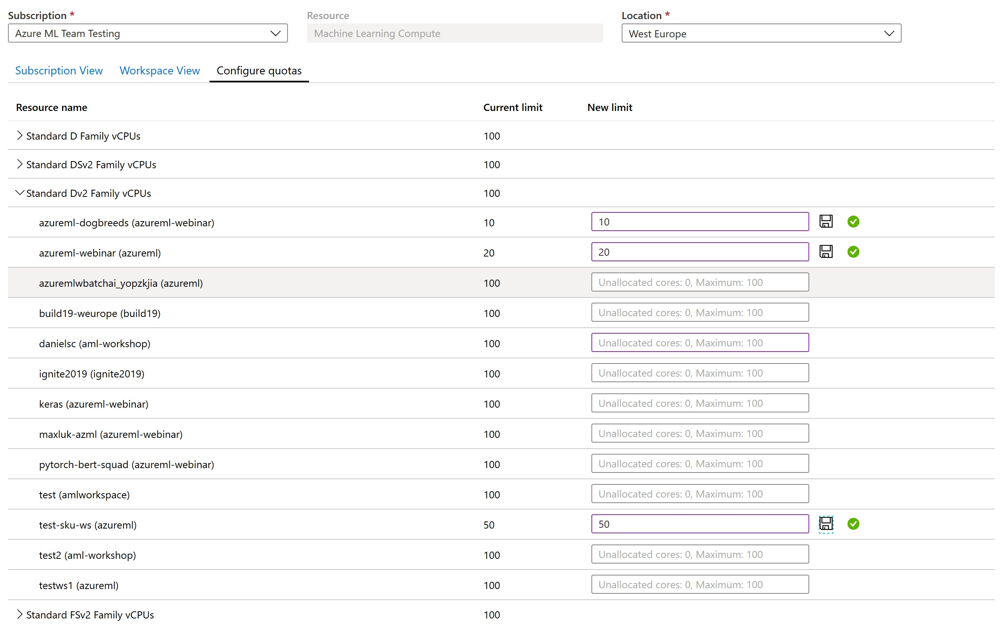

# Manage and increase quotas for resources with Azure Machine Learning

Azure uses limits and quotas to prevent budget overruns due to fraud, and to honor Azure capacity constraints. Consider these limits as you scale for production workloads. In this article, you learn about:

> [!div class="checklist"]
> + Default limits on Azure resources related to [Azure Machine Learning](overview-what-is-azure-machine-learning.md).
> + Creating workspace-level quotas.
> + Viewing your quotas and limits.
> + Requesting quota increases.

Along with managing quotas, you can learn how to [plan and manage costs for Azure Machine Learning](concept-plan-manage-cost.md) or learn about the [service limits in Azure Machine Learning](resource-limits-capacity.md).

## Special considerations

+ Quotas are applied to each subscription in your account. If you have multiple subscriptions, you must request a quota increase for each subscription.

+ A quota is a *credit limit* on Azure resources, *not a capacity guarantee*. If you have large-scale capacity needs, [contact Azure support to increase your quota](#request-quota-increases).

+ A quota is shared across all the services in your subscriptions, including Azure Machine Learning. Calculate usage across all services when you're evaluating capacity.
 
  > [!NOTE]
  > Azure Machine Learning compute is an exception. It has a separate quota from the core compute quota. 

+ **Default limits vary by offer category type**, such as free trial, pay-as-you-go, and virtual machine (VM) series (such as Dv2, F, and G).

## Default resource quotas

In this section, you learn about the default and maximum quota limits for the following resources:

+ Azure Machine Learning assets
    + Azure Machine Learning computes (including serverless Spark)
    + Azure Machine Learning online endpoints (both managed and Kubernetes)
    + Azure Machine Learning pipelines
+ Virtual machines
+ Azure Container Instances
+ Azure Storage

> [!IMPORTANT]
> Limits are subject to change. For the latest information, see  [Service limits in Azure Machine Learning](resource-limits-capacity.md).

### Azure Machine Learning assets
The following limits on assets apply on a *per-workspace* basis. 

| **Resource** | **Maximum limit** |
| --- | --- |
| Datasets | 10 million |
| Runs | 10 million |
| Models | 10 million|
| Artifacts | 10 million |

In addition, the maximum **run time** is 30 days and the maximum number of **metrics logged per run** is 1 million.

### Azure Machine Learning Compute
[Azure Machine Learning Compute](concept-compute-target.md#azure-machine-learning-compute-managed) has a default quota limit on both the *number of cores* and the *number of unique compute resources* that are allowed per region in a subscription.

> [!NOTE]
> * The *quota on the number of cores* is split by each VM Family and cumulative total cores.
> * The *quota on the number of unique compute resources* per region is separate from the VM core quota, as it applies only to the managed compute resources of Azure Machine Learning.

To raise the limits for the following items, [Request a quota increase](#request-quota-increases):

* VM family core quotas. To learn more about which VM family to request a quota increase for, see [virtual machine sizes in Azure](../virtual-machines/sizes.md). For example, GPU VM families start with an "N" in their family name (such as the NCv3 series).
* Total subscription core quotas
* Cluster quota
* Other resources in this section

Available resources:
+ **Dedicated cores per region** have a default limit of 24 to 300, depending on your subscription offer type. You can increase the number of dedicated cores per subscription for each VM family. Specialized VM families like NCv2, NCv3, or ND series start with a default of zero cores.  GPUs also default to zero cores.

+ **Low-priority cores per region** have a default limit of 100 to 3,000, depending on your subscription offer type. The number of low-priority cores per subscription can be increased and is a single value across VM families.

+ **Clusters per region** have a default limit of 200 and it can be increased up to a value of 500 per region within a given subscription. This limit is shared between training clusters, compute instances and managed online endpoint deployments. A compute instance is considered a single-node cluster for quota purposes. Starting 1 September 2023, cluster quota limits will automatically be increased from 200 to 500 on your behalf when usage is approaching close to the 200 default limit, eliminating the need to file for a support ticket.

The following table shows more limits in the platform. Reach out to the Azure Machine Learning product team through a **technical** support ticket to request an exception.

| **Resource or Action** | **Maximum limit** |
| --- | --- |
| Workspaces per resource group | 800 |
| Nodes in a single Azure Machine Learning compute (AmlCompute) **cluster** set up as a non communication-enabled pool (that is, can't run MPI jobs) | 100 nodes but configurable up to 65,000 nodes |
| Nodes in a single Parallel Run Step **run** on an Azure Machine Learning compute (AmlCompute) cluster | 100 nodes but configurable up to 65,000 nodes if your cluster is set up to scale as mentioned previously |
| Nodes in a single Azure Machine Learning compute (AmlCompute) **cluster** set up as a communication-enabled pool | 300 nodes but configurable up to 4000 nodes |
| Nodes in a single Azure Machine Learning compute (AmlCompute) **cluster** set up as a communication-enabled pool on an RDMA enabled VM Family | 100 nodes |
| Nodes in a single MPI **run** on an Azure Machine Learning compute (AmlCompute) cluster | 100 nodes but can be increased to 300 nodes |
| Job lifetime | 21 days1 |
| Job lifetime on a low-priority node | 7 days2 |
| Parameter servers per node | 1 |

1 Maximum lifetime is the duration between when a job starts and when it finishes. Completed jobs persist indefinitely. Data for jobs not completed within the maximum lifetime isn't accessible.

2 Jobs on a low-priority node can be preempted whenever there's a capacity constraint. We recommend that you implement checkpoints in your job.

### Azure Machine Learning managed online endpoints

Azure Machine Learning managed online endpoints have limits described in the following table. These limits are _regional_, meaning that you can use up to these limits per each region you're using.

| **Resource** | **Limit** | **Allows exception** |
| --- | --- | --- |
| Endpoint name| Endpoint names must <li> Begin with a letter <li> Be 3-32 characters in length  <li> Only consist of letters and numbers 1 | - |
| Deployment name| Deployment names must <li> Begin with a letter <li> Be 3-32 characters in length  <li>  Only consist of letters and numbers 1 | - |
| Number of endpoints per subscription | 50 | Yes |
| Number of deployments per subscription | 200 | Yes |
| Number of deployments per endpoint | 20 | Yes |
| Number of instances per deployment | 20 2 | Yes |
| Max request time-out at endpoint level  | 90 seconds | - |
| Total requests per second at endpoint level for all deployments  | 500 3 | Yes |
| Total connections per second at endpoint level for all deployments  | 500 3 | Yes |
| Total connections active at endpoint level for all deployments  | 500 3 | Yes |
| Total bandwidth at endpoint level for all deployments  | 5 MBPS 3 | Yes |

1 Single dashes like, `my-endpoint-name`, are accepted in endpoint and deployment names.

2 We reserve 20% extra compute resources for performing upgrades. For example, if you request 10 instances in a deployment, you must have a quota for 12. Otherwise, you receive an error.

3 The default limit for some subscriptions may be different. For example, when you request a limit increase it may show 100 instead. If you request a limit increase, be sure to calculate related limit increases you might need. For example, if you request a limit increase for requests per second, you might also want to compute the required connections and bandwidth limits and include that limit increase in the same request.

To determine the current usage for an endpoint, [view the metrics](how-to-monitor-online-endpoints.md#metrics). 

To request an exception from the Azure Machine Learning product team, use the steps in the [Endpoint quota increases](#endpoint-quota-increases).

### Azure Machine Learning kubernetes online endpoints

Azure Machine Learning kubernetes online endpoints have limits described in the following table. 

| **Resource** | **Limit** |
| --- | --- |
| Endpoint name| Same as [managed online endpoint](#azure-machine-learning-managed-online-endpoints) |
| Deployment name| Same as [managed online endpoint](#azure-machine-learning-managed-online-endpoints)|
| Number of endpoints per subscription | 50 |
| Number of deployments per subscription | 200 |
| Number of deployments per endpoint | 20 |
| Max request time-out at endpoint level  | 300 seconds |

The sum of kubernetes online endpoints and managed online endpoints under each subscription can't exceed 50. Similarly, the sum of kubernetes online deployments and managed online deployments under each subscription can't exceed 200.

### Azure Machine Learning pipelines
[Azure Machine Learning pipelines](concept-ml-pipelines.md) have the following limits.

| **Resource** | **Limit** |
| --- | --- |
| Steps in a pipeline | 30,000 |
| Workspaces per resource group | 800 |

### Azure Machine Learning integration with Synapse

Azure Machine Learning serverless Spark provides easy access to distributed computing capability for scaling Apache Spark jobs. Serverless Spark utilizes the same dedicated quota as Azure Machine Learning Compute. Quota limits can be increased by submitting a support ticket and [requesting for quota increase](#request-quota-increases) for ESv3 series under the "Machine Learning Service: Virtual Machine Quota" category.
 
 To view quota usage, navigate to Machine Learning studio and select the subscription name that you would like to see usage for. Select "Quota" in the left panel.

:::image type="content" source="media/how-to-manage-quotas/azure-machine-learning-quota.png" lightbox="media/how-to-manage-quotas/azure-machine-learning-quota.png" alt-text="Screenshot of the Azure Machine Learning quotas.":::

### Virtual machines
Each Azure subscription has a limit on the number of virtual machines across all services. Virtual machine cores have a regional total limit and a regional limit per size series. Both limits are separately enforced.

For example, consider a subscription with a US East total VM core limit of 30, an A series core limit of 30, and a D series core limit of 30. This subscription would be allowed to deploy 30 A1 VMs, or 30 D1 VMs, or a combination of the two that doesn't exceed a total of 30 cores.

You can't raise limits for virtual machines above the values shown in the following table.

[!INCLUDE [azure-subscription-limits-azure-resource-manager](../../includes/azure-subscription-limits-azure-resource-manager.md)]

### Container Instances

For more information, see [Container Instances limits](../azure-resource-manager/management/azure-subscription-service-limits.md#container-instances-limits).

### Storage
Azure Storage has a limit of 250 storage accounts per region, per subscription. This limit includes both Standard and Premium storage accounts.

## Workspace-level quotas

Use workspace-level quotas to manage Azure Machine Learning compute target allocation between multiple [workspaces](concept-workspace.md) in the same subscription.

By default, all workspaces share the same quota as the subscription-level quota for VM families. However, you can set a maximum quota for individual VM families on workspaces in a subscription. Quotas for individual VM families let you share capacity and avoid resource contention issues.

1. Go to any workspace in your subscription.
1. In the left pane, select **Usages + quotas**.
1. Select the **Configure quotas** tab to view the quotas.
1. Expand a VM family.
1. Set a quota limit on any workspace listed under that VM family.

You can't set a negative value or a value higher than the subscription-level quota.

> [!NOTE]
> You need subscription-level permissions to set a quota at the workspace level.

## View quotas in the studio

1. When you create a new compute resource, by default you see only VM sizes that you already have quota to use.  Switch the view to **Select from all options**.  

    :::image type="content" source="media/how-to-manage-quotas/select-all-options.png" alt-text="Screenshot shows select all options to see compute resources that need more quota":::

1. Scroll down until you see the list of VM sizes you don't have quota for.

    :::image type="content" source="media/how-to-manage-quotas/scroll-to-zero-quota.png" alt-text="Screenshot shows list of zero quota":::

1. Use the link to go directly to the online customer support request for more quota.

## View your usage and quotas in the Azure portal

To view your quota for various Azure resources like virtual machines, storage, or network, use the [Azure portal](https://portal.azure.com):

1. On the left pane, select **All services** and then select **Subscriptions** under the **General** category.

2. From the list of subscriptions, select the subscription whose quota you're looking for.

3. Select **Usage + quotas** to view your current quota limits and usage. Use the filters to select the provider and locations. 

You manage the Azure Machine Learning compute quota on your subscription separately from other Azure quotas: 

1. Go to your **Azure Machine Learning** workspace in the Azure portal.

2. On the left pane, in the **Support + troubleshooting** section, select **Usage + quotas** to view your current quota limits and usage.

3. Select a subscription to view the quota limits. Filter to the region you're interested in.

4. You can switch between a subscription-level view and a workspace-level view.

## Request quota increases

To raise the limit or VM quota above the default limit, [open an online customer support request](https://portal.azure.com/#blade/Microsoft_Azure_Support/HelpAndSupportBlade/newsupportrequest/) at no charge.

You can't raise limits above the maximum values shown in the preceding tables. If there's no maximum limit, you can't adjust the limit for the resource.

When you're requesting a quota increase, select the service that you have in mind. For example, select Machine Learning Service, Container Instances, or Storage. For Azure Machine Learning endpoint, you can select the **Request Quota** button while viewing the quota in the preceding steps.
 
1. Scroll to **Machine Learning Service: Virtual Machine Quota**.
 
    :::image type="content" source="./media/how-to-manage-quotas/virtual-machine-quota.png" lightbox="./media/how-to-manage-quotas/virtual-machine-quota.png" alt-text="Screenshot of the VM quota details.":::

2. Under **Additional Details** specify the request details with the number of additional vCPUs required to run your Machine Learning Endpoint.
 
    :::image type="content" source="./media/how-to-manage-quotas/vm-quota-request-additional-info.png" lightbox="./media/how-to-manage-quotas/vm-quota-request-additional-info.png" alt-text="Screenshot of the VM quota additional details.":::

> [!NOTE]
> [Free trial subscriptions](https://azure.microsoft.com/offers/ms-azr-0044p) are not eligible for limit or quota increases. If you have a free trial subscription, you can upgrade to a [pay-as-you-go](https://azure.microsoft.com/offers/ms-azr-0003p/) subscription. For more information, see [Upgrade Azure free trial to pay-as-you-go](../cost-management-billing/manage/upgrade-azure-subscription.md) and [Azure free account FAQ](https://azure.microsoft.com/free/free-account-faq).

### Endpoint quota increases

When requesting the quota increase, provide the following information:

1. When opening the support request, select __Machine Learning Service: Endpoint Limits__ as the __Quota type__.
1. On the __Additional details__ tab, select __Enter details__ and then provide the quota you'd like to increase and the new value, the reason for the quota increase request, and __location(s)__ where you need the quota increase. Finally, select __Save and continue__ to continue.

    :::image type="content" source="./media/how-to-manage-quotas/quota-details.png" lightbox="./media/how-to-manage-quotas/quota-details.png" alt-text="Screenshot of the endpoint quota details form.":::

## Next steps

+ [Plan and manage costs for Azure Machine Learning](concept-plan-manage-cost.md)
+ [Service limits in Azure Machine Learning](resource-limits-capacity.md)
+ [Troubleshooting managed online endpoints deployment and scoring](./how-to-troubleshoot-online-endpoints.md)
