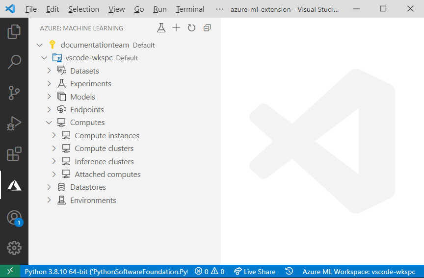

# Manage Azure Machine Learning resources with the VS Code Extension (preview)

Learn how to manage Azure Machine Learning resources with the VS Code extension.

## Prerequisites

- Azure subscription. If you don't have one, sign up to try the [free or paid version of Azure Machine Learning](https://aka.ms/AMLFree).
- Visual Studio Code. If you don't have it, [install it](https://code.visualstudio.com/docs/setup/setup-overview).
- VS Code Azure Machine Learning Extension. Follow the [Azure Machine Learning VS Code extension installation guide](tutorial-setup-vscode-extension.md#install-the-extension) to install the extension.

All of the processes below assume that you are in the Azure Machine Learning view in Visual Studio Code. To launch the extension, select the **Azure** icon in the VS Code activity bar.

## Workspaces

For more information, see [workspaces](concept-workspace.md).

### Create a workspace

1. In the Azure Machine Learning view, right-click your subscription node and select **Create workspace**.
1. In the prompt:
    1. Provide a name for your workspace
    1. Choose your Azure subscription
    1. Choose or create a new resource group to provision the workspace in
    1. Select the location where to provision the workspace.

Alternative methods to create a workspace include:

- Open the command palette **View > Command Palette** and enter into the text prompt **Azure ML: Create Workspace**.
- Click the `+` icon at the top of the Azure Machine Learning view.
- Create a new workspace when prompted to select a workspace during the provisioning of other resources.

### Remove a workspace

1. Expand the subscription node that contains your workspace.
1. Right-click the workspace you want to remove.
1. Select whether you want to remove:
    - *Only the workspace*: This option deletes **only** the workspace Azure resource. The resource group, storage accounts, and any other resources the workspace was attached to are still in Azure.
    - *With associated resources*: This option deletes the workspace **and** all resources associated with it.

## Datastores

The VS Code extension currently supports datastores of the following types:

- Azure File Share
- Azure Blob Storage

When you create a workspace, a datastore is created for each of these types.

For more information, see [datastores](concept-data.md#datastores).

### Create a datastore

1. Expand the subscription node that contains your workspace.
1. Expand the workspace node you want to create the datastore under.
1. Right-click the **Datastores** node and select **Register datastore**.
1. In the prompt:
    1. Provide a name for your datastore.
    1. Choose the datastore type.
    1. Select your storage resource. You can either choose a storage resource that's associated with your workspace or select from any valid storage resource in your Azure subscriptions.
    1. Choose the container where your data is inside the previously selected storage resource.
1. A configuration file appears in VS Code. If you're satisfied with your configuration file, select **Save and continue** or open the VS Code command palette (**View > Command Palette**) and type **Azure ML: Save and Continue**.

### Manage a datastore

1. Expand the subscription node that contains your workspace.
1. Expand your workspace node.
1. Expand the **Datastores** node inside your workspace.
1. Select the datastore you want to:
    - *Set as default*. Whenever you run experiments, this is the datastore that will be used.
    - *Inspect read-only settings*.
    - *Modify*. Change the authentication type and credentials. Supported authentication types include account key and SAS token.

## Datasets

The extension currently supports the following dataset types:

- *Tabular*: Allows you to materialize data into a DataFrame (Pandas or PySpark).
- *File*: A file or collection of files. Allows you to download or mount files to your compute.

For more information, see [datasets](concept-data.md#datasets)

### Create dataset

1. Expand the subscription node that contains your workspace.
1. Expand the workspace node you want to create the datastore under.
1. Right-click the **Datasets** node and select **Create dataset**.
1. In the prompt:
    1. Choose the dataset type
    1. Define whether the data is located on your PC or on the web
    1. Provide the location of your data. This can either be a single file or a directory containing your data files.
    1. Choose the datastore you want to upload your data to.
    1. Provide a prefix that helps identify your dataset in the datastore.

### Version datasets

When building machine learning models, as data changes, you may want to version your dataset. To do so in the VS Code extension:

1. Expand the subscription node that contains your workspace.
1. Expand your workspace node.
1. Expand the **Datasets** node.
1. Right-click the dataset you want to version and select **Create New Version**.
1. In the prompt:
    1. Select the dataset type
    1. Define whether the data is located on your PC or on the web.
    1. Provide the location of your data. This can either be a single file or a directory containing your data files.
    1. Choose the datastore you want to upload your data to.
    1. Provide a prefix that helps identify your dataset in the datastore.

### View dataset properties

This option allows you to see metadata associated with a specific dataset. To do so in the VS Code extension:

1. Expand your workspace node.
1. Expand the **Datasets** node.
1. Right-click the dataset you want to inspect and select **View Dataset Properties**. This will display a configuration file with the properties of the latest dataset version.

> [!NOTE]
> If you have multiple version of your dataset, you can choose to only view the dataset properties of a specific version by expanding the dataset node and performing the same steps described in this section on the version of interest.

### Unregister datasets

To remove a dataset and all version of it, unregister it. To do so in the VS Code extension:

1. Expand your workspace node.
1. Expand the **Datasets** node.
1. Right-click the dataset you want to unregister and select **Unregister dataset**.

## Environments

For more information, see [environments](concept-environments.md).

### Create environment

1. Expand the subscription node that contains your workspace.
1. Expand the workspace node you want to create the datastore under.
1. Right-click the **Environments** node and select **Create Environment**.
1. In the prompt:
    1. Provide a name for your environment
    1. Define your environment configuration:
        - *Curated environments*: Preconfigured environments in Azure Machine Learning. You can further customize the environment by modifying the `dependencies` property in the JSON file. Learn more about [curated environments](resource-curated-environments.md).
        - *Conda dependencies file*: For Anaconda environments, the file containing your environment definition can be provided.
        - *Pip requirements file*: For pip environments, the file containing your environment definition can be provided.
        - *Existing Conda environment*: This option looks for the conda environments in your local PC and tries to build an environment from the selected environment.
        - *Custom*: Define your own channels and dependencies
    1. A configuration file opens in the editor. If you're satisfied with your configuration, select **Save and continue** or open the VS Code command palette (**View > Command Palette**) and type **Azure ML: Save and Continue**.

### View environment configurations

To view the dependencies and configurations for a specific environment in the extension:

1. Expand the subscription node that contains your workspace.
1. Expand your workspace node.
1. Expand the **Environments** node.
1. Right-click the environment you want to view and select **View Environment**.

### Edit environment configurations

To edit the dependencies and configurations for a specific environment in the extension:

1. Expand the subscription node that contains your workspace.
1. Expand the **Environments** node inside your workspace.
1. Right-click the environment you want to view and select **Edit Environment**.
1. After making the modifications, if you're satisfied with your configuration, select **Save and continue** or open the VS Code command palette (**View > Command Palette**) and type **Azure ML: Save and Continue**.

## Experiments

For more information, see [experiments](concept-azure-machine-learning-architecture.md#experiments).

### Create experiment

1. Expand the subscription node that contains your workspace.
1. Expand your workspace node.
1. Right-click the **Experiments** node in your workspace and select **Create experiment**.
1. In the prompt, provide a name for your experiment.

### Run experiment

1. Expand the subscription node that contains your workspace.
1. Expand the **Experiments** node inside your workspace.
1. Right-click the experiment you want to run.
1. Select the **Run Experiment** icon in the activity bar.
1. Select whether you want to run your experiment locally or remotely. See the [debugging guide](how-to-debug-visual-studio-code.md) for more information on running and debugging experiments locally.
1. Choose your subscription.
1. Choose the Azure ML Workspace to run the experiment under.
1. Choose your experiment.
1. Choose or create a compute to run the experiment on.
1. Choose or create a run configuration for your experiment.

Alternatively, you can select the **Run Experiment** button at the top of the extension and configure your experiment run in the prompt.

### View experiment

To view your experiment in Azure Machine Learning Studio:

1. Expand the subscription node that contains your workspace.
1. Expand the **Experiments** node inside your workspace.
1. Right-click the experiment you want to view and select **View Experiment**. 
1. A prompt appears asking you to open the experiment URL in Azure Machine Learning studio. Select **Open**.

### Track run progress

As you're running your experiment, you may want to see its progress. To track the progress of a run in Azure Machine Learning studio from the extension:

1. Expand the subscription node that contains your workspace.
1. Expand the **Experiments** node inside your workspace.
1. Expand the experiment node you want to track progress for.
1. Right-click the run and select **View Run in Azure portal**.
1. A prompt appears asking you to open the run URL in Azure Machine Learning studio. Select **Open**.

### Download run logs & outputs

Once a run is complete, you may want to download the logs and assets such as the model generated as part of an experiment run.

1. Expand the subscription node that contains your workspace.
1. Expand the **Experiments** node inside your workspace.
1. Expand the experiment node you want to track progress for.
1. Right-click the run:
    - To download the outputs, select **Download outputs**.
    - To download the logs, select **Download logs**.

### View run metadata

In the extension, you can inspect metadata such as the run configuration used for the run as well as run details.

## Compute instances

For more information, see [compute instances](concept-compute-instance.md).

### Create compute instance

1. Expand the subscription node that contains your workspace.
1. Expand the workspace node you want to create the compute instance under.
1. Right-click the **Compute instances** node and select **Create compute instance**.
1. In the prompt:
    1. Provide a name for your compute instance.
    1. Select a VM size from the list.
    1. Choose whether you want to enable SSH access.
        1. If you enable SSH access, you'll have to also provide the public SSH key or the file containing the key. For more information, see the [guide on creating and using SSH keys on Azure](../virtual-machines/linux/mac-create-ssh-keys.md).

### Stop or restart compute instance

1. Expand the subscription node that contains your workspace.
1. Expand the **Compute instance** node inside your workspace.
1. Right-click the compute instance you want to stop or restart and select **Stop Compute instance** or **Restart compute instance** respectively.

### View compute instance configuration

1. Expand the subscription node that contains your workspace.
1. Expand the **Compute instance** node inside your workspace.
1. Right-click the compute instance you want to inspect and select **View Compute instance Properties**.

### Delete compute instance

1. Expand the subscription node that contains your workspace.
1. Expand the **Compute instance** node inside your workspace.
1. Right-click the compute instance you want to delete and select **Delete compute instance**.

## Compute clusters

The extension supports the following compute types:

- Azure Machine Learning compute cluster
- Azure Kubernetes Service

For more information, see [compute targets](concept-compute-target.md#train).

### Create compute

1. Expand the subscription node that contains your workspace.
1. Expand the workspace node you want to create the compute cluster under.
1. Right-click the **Compute clusters** node and select **Create Compute**.
1. In the prompt:
    1. Choose a compute type
    1. Choose a VM size. Learn more about [VM sizes](../virtual-machines/sizes.md).
    1. Provide a name for your compute.

### View compute configuration

1. Expand the subscription node that contains your workspace.
1. Expand the **Compute clusters** node inside your workspace.
1. Right-click the compute you want to view and select **View Compute Properties**.

### Edit compute scale settings

1. Expand the subscription node that contains your workspace.
1. Expand the **Compute clusters** node inside your workspace.
1. Right-click the compute you want to edit and select **Edit Compute**.
1. A configuration file for your compute opens in the editor. If you're satisfied with your configuration, select **Save and continue** or open the VS Code command palette (**View > Command Palette**) and type **Azure ML: Save and Continue**.

### Delete compute

1. Expand the subscription node that contains your workspace.
1. Expand the **Compute clusters** node inside your workspace.
1. Right-click the compute you want to delete and select **Delete Compute**.

### Create run configuration

To create a run configuration in the extension:

1. Expand the subscription node that contains your workspace.
1. Expand the **Compute clusters** node inside your workspace.
1. Right-click the compute target you want to create the run configuration under and select **Create Run Configuration**.
1. In the prompt:
    1. Provide a name for your compute target
    1. Choose or create a new environment.
    1. Type the name of the script you want to run or press **Enter** to browser for the script on your local computer.
    1. (Optional) Chose whether you want to create a data reference for your training run. Doing so will prompt you to define a dataset in your run configuration.
        1. Select from one of your registered datasets to link to the run configuration
            A configuration file for your dataset opens in the editor. If you're satisfied with your configuration, select **Save and continue** or open the VS Code command palette (**View > Command Palette**) and type **Azure ML: Save and Continue**.
    1. If you're satisfied with your configuration, select **Save and continue** or open the VS Code command palette (**View > Command Palette**) and type **Azure ML: Save and Continue**.

### Edit run configuration

1. Expand the subscription node that contains your workspace.
1. Expand your compute cluster node in the **Compute clusters** node of your workspace.
1. Right-click the run configuration you want to edit and select **Edit Run Configuration**.
1. A configuration file for your run configuration opens in the editor. If you're satisfied with your configuration, select **Save and continue** or open the VS Code command palette (**View > Command Palette**) and type **Azure ML: Save and Continue**.

### Delete run configuration

1. Expand the subscription node that contains your workspace.
1. Expand your workspace node.
1. Expand the compute cluster node of interest inside the **Compute clusters** node.
1. Right-click the run configuration you want to edit and select **Delete Run Configuration**.

## Models

For more information, see [models](concept-azure-machine-learning-architecture.md#models)

### Register model

1. Expand the subscription node that contains your workspace.
1. Expand your workspace node.
1. Right-click the **Models** node and select **Register Model**.
1. In the prompt:
    1. Provide a name for your model
    1. Choose whether your model is a file or folder.
    1. Find the model in your local PC.
    1. A configuration file for your model in the editor. If you're satisfied with your configuration, select **Save and continue** or open the VS Code command palette (**View > Command Palette**) and type **Azure ML: Save and Continue**.

### View model properties

1. Expand the subscription node that contains your workspace.
1. Expand the **Models** node inside your workspace.
1. Right-click the model whose properties you want to see and select **View Model Properties**. A file opens in the editor containing your model properties.

### Download model

1. Expand the subscription node that contains your workspace.
1. Expand the **Models** node inside your workspace.
1. Right-click the model you want to download and select **Download Model File**.

### Delete a model

1. Expand the subscription node that contains your workspace.
1. Expand the **Models** node inside your workspace.
1. Right-click the model you want to delete and select **Remove Model**.

## Endpoints

The VS Code extension supports the following deployment targets:

- Azure Container Instances
- Azure Kubernetes Service

For more information, see [web service endpoints](concept-azure-machine-learning-architecture.md#web-service-endpoint).

### Create deployments

> [!NOTE]
> Deployment creation currently only works with Conda environments.

1. Expand the subscription node that contains your workspace.
1. Expand your workspace node.
1. Right-click the **Endpoints** node and select **Deploy Service**.
1. In the prompt:
    1. Choose whether you want to use an already registered model or a local model file.
    1. Select your model
    1. Choose the deployment target you want to deploy your model to.
    1. Provide a name for your model.
    1. Provide the script to run when scoring the model.
    1. Provide a Conda dependencies file.
    1. A configuration file for your deployment appears in the editor. If you're satisfied with your configuration, select **Save and continue** or open the VS Code command palette (**View > Command Palette**) and type **Azure ML: Save and Continue**.

> [!NOTE]
> Alternatively, you can right-click a registered model in the *Models* node and select **Deploy Service From Registered Model**.

### Delete deployments

1. Expand the subscription node that contains your workspace.
1. Expand the **Endpoints** node inside your workspace.
1. Right-click the deployment you want to remove and select **Remove service**.
1. A prompt appears confirming you want to remove the service. Select **Ok**.

### Manage deployments

In addition to creating and deleting deployments, you can view and edit settings associated with the deployment.

1. Expand the subscription node that contains your workspace.
1. Expand the **Endpoints** node inside your workspace.
1. Right-click the deployment you want to manage:
    - To edit settings, select **Edit service**.
        - A configuration file for your deployment appears in the editor. If you're satisfied with your configuration, select **Save and continue** or open the VS Code command palette (**View > Command Palette**) and type **Azure ML: Save and Continue**.
    - To view deployment configuration settings, select **View service properties**.

## Next steps

[Train an image classification model](tutorial-train-deploy-image-classification-model-vscode.md) with the VS Code extension.