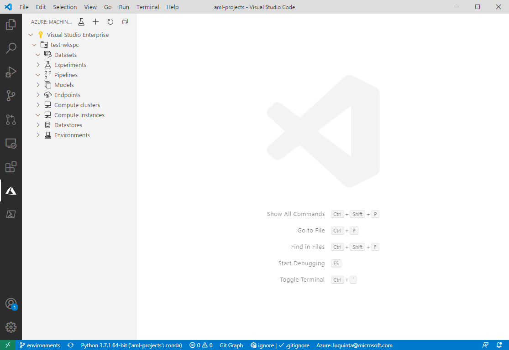

# Manage Azure Machine Learning resources with the VS Code Extension



## Workspaces

Using the VS Code extension, you can:

- Create a workspace
- Remove a workspace

Learn more about [workspaces](concept-workspace.md)

### Create a workspace

1. Select the **Azure** icon in the activity bar.
1. Then, select the `+` icon.
1. In the prompt:
    1. Provide a name for your workspace
    1. Choose your Azure subscription
    1. Choose or create a new resource group to provision the workspace in
    1. Select the location where to provision the workspace.
    1. Choose between the basic and enterprise edition. Learn more about the different [AML editions](concept-editions.md).

> [!NOTE]
> Alternatively, you can create a workspace when provisioning other resources within the extension. When prompted to select a workspace, you can instead choose to create a new one.

### Remove a workspace

1. Select the **Azure** icon in the activity bar.
1. Expand the subscription node that contains your workspace.
1. Right-click the workspace you want to remove.
1. Select whether you want to remove:
    1. *only the workspace*: This option deletes **only** the workspace Azure resource. The resource group, storage accounts, and any other resources the workspace was attached to are still in Azure.
    1. *with associated resources*:. This option deletes the workspace **and** all resources associated with it.

## Datastores

The VS Code extension currently supports datastores of the following types:

- Azure File Share
- Azure Blob Storage

When you create a workspace, a datastore is created for each of these types.

Learn more about [datastores](concept-data.md#datastores)

### Create a datastore

1. Select the **Azure** icon in the activity bar.
1. Expand the subscription node that contains your workspace.
1. Expand the workspace node you want to create the datastore under.
1. Right-click the **Datastores** node and select **Register datastore**.
1. In the prompt:
    1. Provide a name for your datastore
    1. Choose the datastore type.
    1. Select your storage resource. You can either choose a storage resource that's associated with your workspace or select from any valid storage resource in your Azure subscriptions.
    1. Choose the container where your data is inside the previously selected storage resource.
1. A configuration file appears in VS Code with content similar to that below

    ```json
    {
        "datastore": {
            "datastoreName": "my_datastore",
            "authenticationType": "AccountKey",
            "authenticationCredential": "<CREDENTIAL>"
        }
    }
    ```

    If you're satisfied with your configuration file, select **Save and continue** or open the VS Code command palette (**View > Command Palette**) and type **Azure ML: Save and Continue**.

### Manage datastore

1. Select the **Azure** icon in the activity bar.
1. Expand the subscription node that contains your workspace.
1. Then, expand your workspace node.
1. Expand the **Datastores** node inside your workspace.
1. Select the datastore you want to
    1. Set as default. Whenever you run experiments, this is the datastore that will be used.
    1. Inspect read-only settings.
    1. Modify. Change the authentication type and credentials. Supported authentication types include account key and SAS token.

## Datasets

With the VS Code extension you can:

- Create a dataset
- Version a dataset
- View dataset configuration properties
- Unregister a dataset

The extension currently supports the following dataset types:

- *Tabular*: Allows you to materialize data into a DataFrame (Pandas or PySpark).
- *File*: A file or collection of files. Allows you to download or mount files to your compute.

Learn more about [datasets](concept-data.md#datasets)

### Create dataset

1. Select the **Azure** icon in the activity bar.
1. Expand the subscription node that contains your workspace.
1. Expand the workspace node you want to create the datastore under.
1. Right-click the **Datasets** node and select **Create dataset**.
1. In the prompt:
    1. Choose the dataset type
    1. Define whether the data is located on your PC or on the web
    1. Provide the location of your data. This can either be a single file or a directory containing your data files.
    1. Choose the datastore you want to upload your data to.
    1. Provide a prefix that helps identify your dataset in the datastore.

### Version datasets

When building machine learning models, as data changes, you may want to version your dataset. To do so in the VS Code extension:

1. Expand your workspace node.
1. Expand the **Datasets** node.
1. Right-click the dataset you want to version and select **Create New Version**.
1. In the prompt:
    1. Select the dataset type
    1. Define whether the data is located on your PC or on the web.
    1. Provide the location of your data. This can either be a single file or a directory containing your data files.
    1. Choose the datastore you want to upload your data to.
    1. Provide a prefix that helps identify your dataset in the datastore.

### View dataset properties

This option allows you to see metadata associated with a specific dataset. To do so in the VS Code extension:

1. Expand your workspace node.
1. Expand the **Datasets** node.
1. Right-click the dataset you want to inspect and select **View Dataset Properties**. This will display a configuration file with the properties of the latest dataset version.

> [!NOTE]
> If you have multiple version of your dataset, you can choose to only view the dataset properties of a specific version by expanding the dataset node and performing the same steps described in this section on the version of interest.

### Unregister datasets

To remove a dataset and all version of it, unregister it. To do so in the VS Code extension:

1. Expand your workspace node.
1. Expand the **Datasets** node.
1. Right-click the dataset you want to unregister and select **Unregister dataset**.

## Environments

In the VS Code extension, you can:

- Create environments
- View environment configurations
- Edit environment configrations

Learn more about [environments](concept-environments.md).

### Create environment

1. Select the **Azure** icon in the activity bar.
1. Expand the subscription node that contains your workspace.
1. Expand the workspace node you want to create the datastore under.
1. Right-click the **Environments** node and select **Create Environment**.
1. In the prompt:
    1. Provide a name for your environment
    1. Define your environment configuration:

        - Curated environments: Preconfigured environments in Azure Machine Learning. You can further customize the environment by modifying the `dependencies` property in the JSON file. Learn more about [curated environments](resource-curated-environments.md).
        - Conda dependencies file: For Anaconda environments, the file containing your environment definition can be provided.
        - Pip requirements file: For pip environments, the file containing your environment definition can be provided.
        - Existing Conda environment: This option looks for the conda environments in your local PC and tries to build an environment from the selected environment.
        - Custom: Define your own channels and dependencies

    1. A configuration file opens in the editor. If you're satisfied with your configuration, select **Save and continue** or open the VS Code command palette (**View > Command Palette**) and type **Azure ML: Save and Continue**.

### View environment configurations

To view the dependencies and configurations for a specific environment in the extension:

1. Expand your workspace node.
1. Expand the **Environments** node.
1. Right-click the environment you want to view and select **View Environment**.

### Edit environment configurations

To edit the dependencies and configurations for a specific environment in the extension:

1. Expand your workspace node.
1. Expand the **Environments** node.
1. Right-click the environment you want to view and select **Edit Environment**.
1. After making the modifications, if you're satisfied with your configuration, select **Save and continue** or open the VS Code command palette (**View > Command Palette**) and type **Azure ML: Save and Continue**.

## Experiments

The VS Code extension allows you to manage your Azure Machine Learning experiments. In the extension, you can:

- Create experiments
- Run experiments
- View experiments
- Manage runs

### Create experiment

### Run experiment

Using the Run Experiment Button:

1. Select the **Azure** icon in the activity bar.
1. Select the **Run Experiment** icon in the activity bar.
1. Choose your subscription.
1. Choose the Azure ML Workspace to run the experiment under.
1. Choose your experiment.
1. Choose or create a compute to run the experiment on.
1. Choose or create a run configuration for your experiment.

### View experiment

To view your experiment and its progress in Azure Machine Learning Studio:

1. Expand your workspace node.
1. Expand the **Experiments** node.
1. Right-click the experiment you want to view and select **View Experiment**.

## Compute clusters

With the VS Code extension, you can:

- Create comput
- View compute configuration
- Edit compute scale settings
- Delete compute
- Create run configuration
- Edit run configuration
- Delete run configuration

The extension supports the following compute types:

- Azure Machine Learning Compute
- Azure Kubernetes Service

Learn more about [compute targets](concept-compute-target.md#train).

### Create compute

1. Select the **Azure** icon in the activity bar.
1. Expand the subscription node that contains your workspace.
1. Expand the workspace node you want to create the compute cluster under.
1. Right-click the **Compute clusters** node and select **Create Compute**.
1. In the prompt:
    1. Choose a compute type
    1. Choose a VM size. Learn more about [VM sizes](https://docs.microsoft.com/azure/virtual-machines/linux/sizes).
    1. Provide a name for your compute.

### View compute configuration

1. Expand your workspace node.
1. Expand the **Compute clusters** node.
1. Right-click the compute you want to view and select **View Compute Properties**.

### Edit compute scale settings

1. Expand your workspace node.
1. Expand the **Compute clusters** node.
1. Right-click the compute you want to edit and select **Edit Compute**.
1. A configuration file for your compute opens in the editor. If you're satisfied with your configuration, select **Save and continue** or open the VS Code command palette (**View > Command Palette**) and type **Azure ML: Save and Continue**.

### Delete compute

1. Expand your workspace node.
1. Expand the **Compute clusters** node.
1. Right-click the compute you want to delete and select **Delete Compute**.

### Create run configuration

To create a run configuration in the extension:

1. Expand your workspace node.
1. Expand the **Compute clusters** node.
1. Right-click the compute target you want create the run configuration under and select **Create Run Configuration**.
1. In the prompt:
    1. Provide a name for your compute target
    1. Choose or create a new environment.
    1. Type the name of the script you want to run or press **Enter** to browser for the script on your local computer.
    1. Chose whether you want to create a data reference for your training run.
    1. Select from one of your registered datasets to link to the run configuration

        A configuration file for your dataset opens in the editor. If you're satisfied with your configuration, select **Save and continue** or open the VS Code command palette (**View > Command Palette**) and type **Azure ML: Save and Continue**.

    1. If you're satisfied with your configuration, select **Save and continue** or open the VS Code command palette (**View > Command Palette**) and type **Azure ML: Save and Continue**.

### Edit run configuration

1. Expand your workspace node.
1. Expand the compute cluster node in the **Compute clusters** node.
1. Right-click the run configuration you want to edit and select **Edit Run Configuration**.
1. A configuration file for your run configuration opens in the editor. If you're satisfied with your configuration, select **Save and continue** or open the VS Code command palette (**View > Command Palette**) and type **Azure ML: Save and Continue**.

### Delete run configuration

1. Expand your workspace node.
1. Expand the compute cluster node in the **Compute clusters** node.
1. Right-click the run configuration you want to edit and select **Delete Run Configuration**.

## Models

- Register a model
- View model properties
- Download a model
- Delete a model

### Register model

1. Expand your workspace node.
1. Right-click the **Models** node and select **Register Model**.
1. In the prompt:
    1. Provide a name for your model
    1. Choose whether your model is a file or folder.
    1. Find the model in your local PC.
    1. A configuration file for your model in the editor. If you're satisfied with your configuration, select **Save and continue** or open the VS Code command palette (**View > Command Palette**) and type **Azure ML: Save and Continue**.

### View model properties

1. Expand your workspace node.
1. Expand the compute cluster node in the **Models** node.
1. Right-click the the model whose properties you want to see and select **View Model Properties**. A file opens in the editor containing your model properties.

### Download model

1. Expand your workspace node.
1. Expand the compute cluster node in the **Models** node.
1. Right-click the the model you want to download and select **Download Model File**.

### Delete a model

1. Expand your workspace node.
1. Expand the compute cluster node in the **Models** node.
1. Right-click the the model you want to delete and select **Remove Model**.

## Endpoints

You can deploy your model as a web service to the following deployment targets:

- Azure Container Instances
- Azure Kubernetes Service

In the VS Code extension, you can:

- Create deployment

### Create deployment

> [!NOTE]
> Deployment creation currently only works with Conda environments.

1. Expand your workspace node.
1. Right-click the **Endpoints** node and select **Deploy Service**.
1. In the prompt:
    1. Choose whether you want to use an already registered model or a local model file.
    1. Select your model
    1. Choose the deployment target you want to deploy your model to.
    1. Provide a name for your model.
    1. Provide the script to run when scoring the model.
    1. Provide a Conda dependencies file.
    1. A configuration file for your deployment in the editor. If you're satisfied with your configuration, select **Save and continue** or open the VS Code command palette (**View > Command Palette**) and type **Azure ML: Save and Continue**.

> [!NOTE]
> Alternatively, you can right-click a registered model in the *Models* node and select **Deploy Service From Registered Model**. 

## Next steps

[Train an image classification model](tuutorial-train-deploy-image-classification-model-vscode.md) with the VS Code extension.