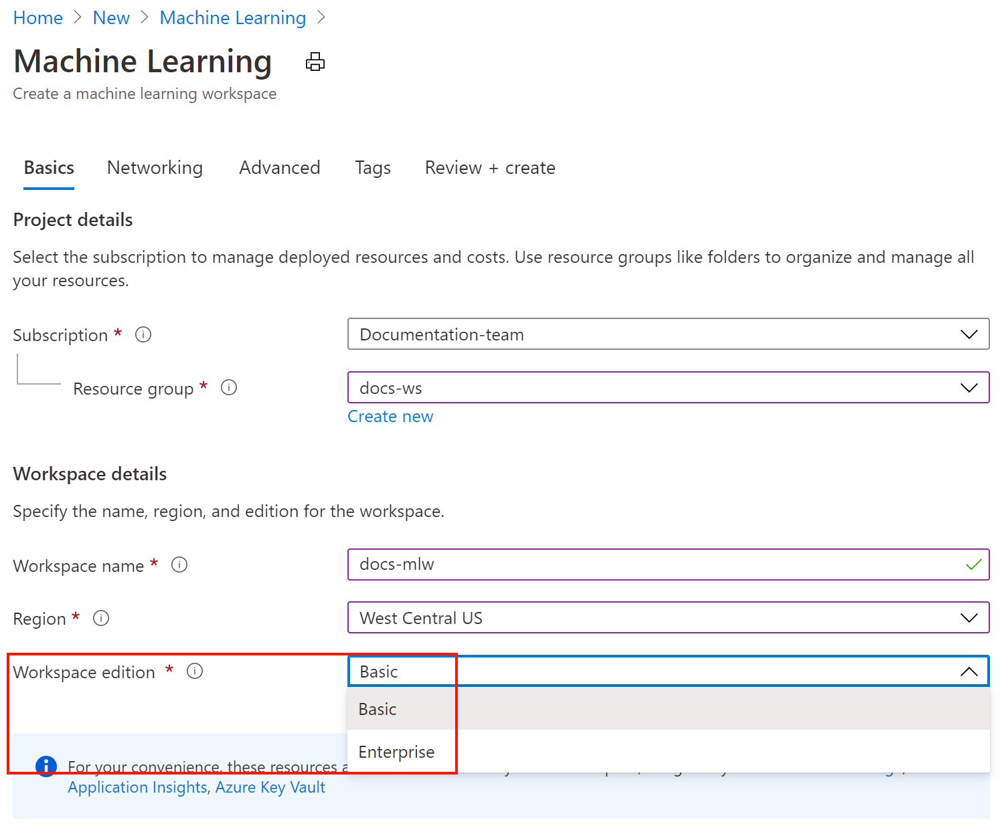

# Create and manage Azure Machine Learning workspaces in the Azure portal

In this article, you'll create, view, and delete [**Azure Machine Learning workspaces**](concept-workspace.md) in the Azure portal for [Azure Machine Learning](overview-what-is-azure-ml.md).  The portal is the easiest way to get started with workspaces but as your needs change or requirements for automation increase you can also create and delete workspaces [using the CLI](reference-azure-machine-learning-cli.md), [with Python code](https://docs.microsoft.com/python/api/overview/azure/ml/intro?view=azure-ml-py&preserve-view=true) or [via the VS Code extension](tutorial-setup-vscode-extension.md).

## Create a workspace

To create a workspace, you need an Azure subscription. If you don't have an Azure subscription, create a free account before you begin. Try the [free or paid version of Azure Machine Learning](https://aka.ms/AMLFree) today.

1. Sign in to the [Azure portal](https://portal.azure.com/) by using the credentials for your Azure subscription. 

1. In the upper-left corner of Azure portal, select **+ Create a resource**.

      

1. Use the search bar to find **Machine Learning**.

1. Select **Machine Learning**.

1. In the **Machine Learning** pane, select **Create** to begin.

1. Provide the following information to configure your new workspace:

   Field|Description 
   ---|---
   Workspace name |Enter a unique name that identifies your workspace. In this example, we use **docs-ws**. Names must be unique across the resource group. Use a name that's easy to recall and to differentiate from workspaces created by others. The workspace name is case-insensitive.
   Subscription |Select the Azure subscription that you want to use.
   Resource group | Use an existing resource group in your subscription or enter a name to create a new resource group. A resource group holds related resources for an Azure solution. In this example, we use **docs-aml**. You need *contributor* or *owner* role to use an existing resource group.  For more information about access, see [Manage access to an Azure Machine Learning workspace](how-to-assign-roles.md).
   Region | Select the Azure region closest to your users and the data resources to create your workspace.
   Workspace edition | Select **Basic** or **Enterprise**.  This workspace edition determines the features to which you'll have access and pricing. Learn more about [Azure Machine Learning](overview-what-is-azure-ml.md). 

    

1. When you're finished configuring the workspace, select **Review + Create**. Optionally, use the [Networking](#networking) and [Advanced](#advanced) sections to configure more settings for the workspace.

1. Review the settings and make any additional changes or corrections. When you're satisfied with the settings, select **Create**.

   > [!Warning] 
   > It can take several minutes to create your workspace in the cloud.

   When the process is finished, a deployment success message appears. 
 
 1. To view the new workspace, select **Go to resource**.

### Networking	

> [!IMPORTANT]	
> For more information on using a private endpoint and virtual network with your workspace, see [Network isolation and privacy](how-to-enable-virtual-network.md).
	
1. The default network configuration is to use a __Public endpoint__, which is accessible on the public internet. To limit access to your workspace to an Azure Virtual Network you have created, you can instead select __Private endpoint__ as the __Connectivity method__, and then use __+ Add__ to configure the endpoint.	
	
   :::image type="content" source="media/how-to-manage-workspace/select-private-endpoint.png" alt-text="Private endpoint selection":::	

1. On the __Create private endpoint__ form, set the location, name, and virtual network to use. If you'd like to use the endpoint with a Private DNS Zone, select __Integrate with private DNS zone__ and select the zone using the __Private DNS Zone__ field. Select __OK__ to create the endpoint. 	

   :::image type="content" source="media/how-to-manage-workspace/create-private-endpoint.png" alt-text="Private endpoint creation":::	

1. When you are finished configuring networking, you can select __Review + Create__, or advance to the optional __Advanced__ configuration.	

    > [!WARNING]	
    > When you create a private endpoint, a new Private DNS Zone named __privatelink.api.azureml.ms__ is created. This contains a link to the virtual network. If you create multiple workspaces with private endpoints in the same resource group, only the virtual network for the first private endpoint may be added to the DNS zone. To add entries for the virtual networks used by the additional workspaces/private endpoints, use the following steps:	
    > 	
    > 1. In the [Azure portal](https://portal.azure.com), select the resource group that contains the workspace. Then select the Private DNS Zone resource named __privatelink.api.azureml.ms__.	
    > 2. In the __Settings__, select __Virtual network links__.	
    > 3. Select __Add__. From the __Add virtual network link__ page, provide a unique __Link name__, and then select the __Virtual network__ to be added. Select __OK__ to add the network link.	
    >	
    > For more information, see [Azure Private Endpoint DNS configuration](/azure/private-link/private-endpoint-dns).	

### Vulnerability scanning

Azure Security Center provides unified security management and advanced threat protection across hybrid cloud workloads. You should allow Azure Security Center to scan your resources and follow its recommendations. For more, see  [Azure Container Registry image scanning by Security Center](https://docs.microsoft.com/azure/security-center/azure-container-registry-integration) and [Azure Kubernetes Services integration with Security Center](https://docs.microsoft.com/azure/security-center/azure-kubernetes-service-integration).

### Advanced	

By default, metrics and metadata for the workspace is stored in an Azure Cosmos DB instance that Microsoft maintains. This data is encrypted using Microsoft-managed keys. 	

To limit the data that Microsoft collects on your workspace, select __High business impact workspace__. For more information on this setting, see [Encryption at rest](concept-enterprise-security.md#encryption-at-rest).

> [!IMPORTANT]	
> Selecting high business impact can only be done when creating a workspace. You cannot change this setting after workspace creation.	
If you are using the __Enterprise__ version of Azure Machine Learning, you can instead provide your own key. Doing so creates the Azure Cosmos DB instance that stores metrics and metadata in your Azure subscription. Use the following steps to use your own key:	

> [!IMPORTANT]	
> Before following these steps, you must first perform the following actions:	
>	
> 1. Authorize the __Machine Learning App__ (in Identity and Access Management) with contributor permissions on your subscription.	
> 1. Follow the steps in [Configure customer-managed keys](/azure/cosmos-db/how-to-setup-cmk) to:	
>     * Register the Azure Cosmos DB provider	
>     * Create and configure an Azure Key Vault	
>     * Generate a key	
>	
>     You do not need to manually create the Azure Cosmos DB instance, one will be created for you during workspace creation. This Azure Cosmos DB instance will be created in a separate resource group using a name based on this pattern: `<your-workspace-resource-name>_<GUID>`.	
>	
> You cannot change this setting after workspace creation. If you delete the Azure Cosmos DB used by your workspace, you must also delete the workspace that is using it.

1. Select __Customer-managed keys__, and then select __Click to select key__.	

    :::image type="content" source="media/how-to-manage-workspace/advanced-workspace.png" alt-text="Customer-managed keys":::	

1. On the __Select key from Azure Key Vault__ form, select an existing Azure Key Vault, a key that it contains, and the version of the key. This key is used to encrypt the data stored in Azure Cosmos DB. Finally, use the __Select__ button to use this key.	

   :::image type="content" source="media/how-to-manage-workspace/select-key-vault.png" alt-text="Select the key":::

### Download a configuration file

1. If you will be creating a [compute instance](tutorial-1st-experiment-sdk-setup.md#azure), skip this step.

1. If you plan to use code on your local environment that references this workspace, select  **Download config.json** from the **Overview** section of the workspace.  

   
   
   Place the file into  the directory structure with your Python scripts or Jupyter Notebooks. It can be in the same directory, a subdirectory named *.azureml*, or in a parent directory. When you create a compute instance, this file is added to the correct directory on the VM for you.
## Find a workspace

1. Sign in to the [Azure portal](https://portal.azure.com/).

1. In the top search field, type **Machine Learning**.  

1. Select **Machine Learning**.

   

1. Look through the list of workspaces found. You can filter based on subscription, resource groups, and locations.  

1. Select a workspace to display its properties.

## Delete a workspace

In the [Azure portal](https://portal.azure.com/), select **Delete**  at the top of the workspace you wish to delete.

:::image type="content" source="./media/how-to-manage-workspace/delete-workspace.png" alt-text="Delete workspace":::

## Clean up resources

[!INCLUDE [aml-delete-resource-group](../../includes/aml-delete-resource-group.md)]

## Troubleshooting

### Resource provider errors

[!INCLUDE [machine-learning-resource-provider](../../includes/machine-learning-resource-provider.md)]

### Moving the workspace

> [!WARNING]
> Moving your Azure Machine Learning workspace to a different subscription, or moving the owning subscription to a new tenant, is not supported. Doing so may cause errors.

### Deleting the Azure Container Registry

The Azure Machine Learning workspace uses Azure Container Registry (ACR) for some operations. It will automatically create an ACR instance when it first needs one.

[!INCLUDE [machine-learning-delete-acr](../../includes/machine-learning-delete-acr.md)]

## Next steps

Follow the full-length tutorial to learn how to use a workspace to build, train, and deploy models with Azure Machine Learning.

> [!div class="nextstepaction"]
> [Tutorial: Train models](tutorial-train-models-with-aml.md)
