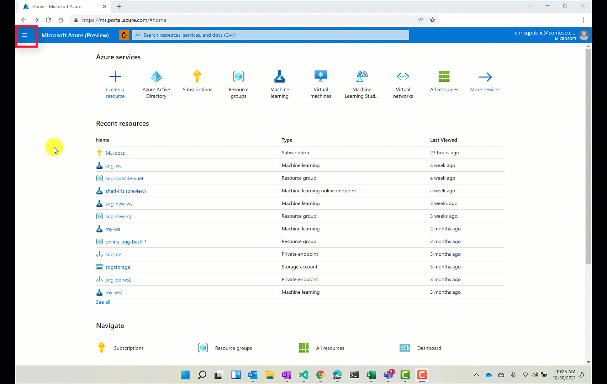

# Create and manage Azure Machine Learning workspaces 

In this article, you'll create, view, and delete [**Azure Machine Learning workspaces**](concept-workspace.md) for [Azure Machine Learning](overview-what-is-azure-ml.md), using the Azure portal or the [SDK for Python](/python/api/overview/azure/ml/)

As your needs change or requirements for automation increase you can also create and delete workspaces [using the CLI](reference-azure-machine-learning-cli.md),  or [via the VS Code extension](tutorial-setup-vscode-extension.md).

## Prerequisites

* An Azure subscription. If you don't have an Azure subscription, create a free account before you begin. Try the [free or paid version of Azure Machine Learning](https://aka.ms/AMLFree) today.
* If using the Python SDK, [install the SDK](/python/api/overview/azure/ml/install).

## Limitations

[!INCLUDE [register-namespace](../../includes/machine-learning-register-namespace.md)]

By default, creating a workspace also creates an Azure Container Registry (ACR).  Since ACR does not currently support unicode characters in resource group names, use a resource group that does not contain these characters.

## Create a workspace

# [Python](#tab/python)

* **Default specification.** By default, dependent resources as well as the resource group will be created automatically. This code creates a workspace named `myworkspace` and a resource group named `myresourcegroup` in `eastus2`.
    
    ```python
    from azureml.core import Workspace
    
    ws = Workspace.create(name='myworkspace',
                   subscription_id='<azure-subscription-id>',
                   resource_group='myresourcegroup',
                   create_resource_group=True,
                   location='eastus2'
                   )
    ```
    Set `create_resource_group` to False if you have an existing Azure resource group that you want to use for the workspace.

* <a name="create-multi-tenant"></a>**Multiple tenants.**  If you have multiple accounts, add the tenant ID of the Azure Active Directory you wish to use.  Find your tenant ID from the [Azure portal](https://portal.azure.com) under **Azure Active Directory, External Identities**.

    ```python
    from azureml.core.authentication import InteractiveLoginAuthentication
    from azureml.core import Workspace
    
    interactive_auth = InteractiveLoginAuthentication(tenant_id="my-tenant-id")
    ws = Workspace.create(name='myworkspace',
                subscription_id='<azure-subscription-id>',
                resource_group='myresourcegroup',
                create_resource_group=True,
                location='eastus2',
                auth=interactive_auth
                )
    ```

* **[Sovereign cloud](reference-machine-learning-cloud-parity.md)**. You'll need extra code to authenticate to Azure if you're working in a sovereign cloud.

    ```python
    from azureml.core.authentication import InteractiveLoginAuthentication
    from azureml.core import Workspace
    
    interactive_auth = InteractiveLoginAuthentication(cloud="<cloud name>") # for example, cloud="AzureUSGovernment"
    ws = Workspace.create(name='myworkspace',
                subscription_id='<azure-subscription-id>',
                resource_group='myresourcegroup',
                create_resource_group=True,
                location='eastus2',
                auth=interactive_auth
                )
    ```

* **Use existing Azure resources**.  You can also create a workspace that uses existing Azure resources with the Azure resource ID format. Find the specific Azure resource IDs in the Azure portal or with the SDK. This example assumes that the resource group, storage account, key vault, App Insights and container registry already exist.

   ```python
   import os
   from azureml.core import Workspace
   from azureml.core.authentication import ServicePrincipalAuthentication

   service_principal_password = os.environ.get("AZUREML_PASSWORD")

   service_principal_auth = ServicePrincipalAuthentication(
      tenant_id="<tenant-id>",
      username="<application-id>",
      password=service_principal_password)

                        auth=service_principal_auth,
                             subscription_id='<azure-subscription-id>',
                             resource_group='myresourcegroup',
                             create_resource_group=False,
                             location='eastus2',
                             friendly_name='My workspace',
                             storage_account='subscriptions/<azure-subscription-id>/resourcegroups/myresourcegroup/providers/microsoft.storage/storageaccounts/mystorageaccount',
                             key_vault='subscriptions/<azure-subscription-id>/resourcegroups/myresourcegroup/providers/microsoft.keyvault/vaults/mykeyvault',
                             app_insights='subscriptions/<azure-subscription-id>/resourcegroups/myresourcegroup/providers/microsoft.insights/components/myappinsights',
                             container_registry='subscriptions/<azure-subscription-id>/resourcegroups/myresourcegroup/providers/microsoft.containerregistry/registries/mycontainerregistry',
                             exist_ok=False)
   ```

For more information, see [Workspace SDK reference](/python/api/azureml-core/azureml.core.workspace.workspace).

If you have problems in accessing your subscription, see [Set up authentication for Azure Machine Learning resources and workflows](how-to-setup-authentication.md), as well as the [Authentication in Azure Machine Learning](https://aka.ms/aml-notebook-auth) notebook.

# [Portal](#tab/azure-portal)

1. Sign in to the [Azure portal](https://portal.azure.com/) by using the credentials for your Azure subscription. 

1. In the upper-left corner of Azure portal, select **+ Create a resource**.

      

1. Use the search bar to find **Machine Learning**.

1. Select **Machine Learning**.

1. In the **Machine Learning** pane, select **Create** to begin.

1. Provide the following information to configure your new workspace:

   Field|Description 
   ---|---
   Workspace name |Enter a unique name that identifies your workspace. In this example, we use **docs-ws**. Names must be unique across the resource group. Use a name that's easy to recall and to differentiate from workspaces created by others. The workspace name is case-insensitive.
   Subscription |Select the Azure subscription that you want to use.
   Resource group | Use an existing resource group in your subscription or enter a name to create a new resource group. A resource group holds related resources for an Azure solution. In this example, we use **docs-aml**. You need *contributor* or *owner* role to use an existing resource group.  For more information about access, see [Manage access to an Azure Machine Learning workspace](how-to-assign-roles.md).
   Region | Select the Azure region closest to your users and the data resources to create your workspace.
   | Storage account | The default storage account for the workspace. By default, a new one is created. |
   | Key Vault | The Azure Key Vault used by the workspace. By default, a new one is created. |
   | Application Insights | The application insights instance for the workspace. By default, a new one is created. |
   | Container Registry | The Azure Container Registry for the workspace. By default, a new one is _not_ initially created for the workspace. Instead, it is created once you need it when creating a Docker image during training or deployment. |

   :::image type="content" source="media/how-to-manage-workspace/create-workspace-form.png" alt-text="Configure your workspace.":::

1. When you're finished configuring the workspace, select **Review + Create**. Optionally, use the [Networking](#networking) and [Advanced](#advanced) sections to configure more settings for the workspace.

1. Review the settings and make any additional changes or corrections. When you're satisfied with the settings, select **Create**.

   > [!Warning] 
   > It can take several minutes to create your workspace in the cloud.

   When the process is finished, a deployment success message appears. 
 
 1. To view the new workspace, select **Go to resource**.
 
---


### Networking	

> [!IMPORTANT]	
> For more information on using a private endpoint and virtual network with your workspace, see [Network isolation and privacy](how-to-network-security-overview.md).


# [Python](#tab/python)

The Azure Machine Learning Python SDK provides the [PrivateEndpointConfig](/python/api/azureml-core/azureml.core.privateendpointconfig) class, which can be used with [Workspace.create()](/python/api/azureml-core/azureml.core.workspace.workspace#create-name--auth-none--subscription-id-none--resource-group-none--location-none--create-resource-group-true--sku--basic---tags-none--friendly-name-none--storage-account-none--key-vault-none--app-insights-none--container-registry-none--adb-workspace-none--cmk-keyvault-none--resource-cmk-uri-none--hbi-workspace-false--default-cpu-compute-target-none--default-gpu-compute-target-none--private-endpoint-config-none--private-endpoint-auto-approval-true--exist-ok-false--show-output-true-) to create a workspace with a private endpoint. This class requires an existing virtual network.

# [Portal](#tab/azure-portal)

1. The default network configuration is to use a __Public endpoint__, which is accessible on the public internet. To limit access to your workspace to an Azure Virtual Network you have created, you can instead select __Private endpoint__ (preview) as the __Connectivity method__, and then use __+ Add__ to configure the endpoint.	

   :::image type="content" source="media/how-to-manage-workspace/select-private-endpoint.png" alt-text="Private endpoint selection":::	

1. On the __Create private endpoint__ form, set the location, name, and virtual network to use. If you'd like to use the endpoint with a Private DNS Zone, select __Integrate with private DNS zone__ and select the zone using the __Private DNS Zone__ field. Select __OK__ to create the endpoint. 	

   :::image type="content" source="media/how-to-manage-workspace/create-private-endpoint.png" alt-text="Private endpoint creation":::	

1. When you are finished configuring networking, you can select __Review + Create__, or advance to the optional __Advanced__ configuration.

---

> [!IMPORTANT]	
> Using a private endpoint with Azure Machine Learning workspace is currently in public preview. This preview is provided without a service level agreement, and it's not recommended for production workloads. Certain features might not be supported or might have constrained capabilities. 	
> For more information, see [Supplemental Terms of Use for Microsoft Azure Previews](https://azure.microsoft.com/support/legal/preview-supplemental-terms/).

### Multiple workspaces with private endpoint

When you create a private endpoint, a new Private DNS Zone named __privatelink.api.azureml.ms__ is created. This contains a link to the virtual network. If you create multiple workspaces with private endpoints in the same resource group, only the virtual network for the first private endpoint may be added to the DNS zone. To add entries for the virtual networks used by the additional workspaces/private endpoints, use the following steps:

1. In the [Azure portal](https://portal.azure.com), select the resource group that contains the workspace. Then select the Private DNS Zone resource named __privatelink.api.azureml.ms__
2. In the __Settings__, select __Virtual network links__.
3. Select __Add__. From the __Add virtual network link__ page, provide a unique __Link name__, and then select the __Virtual network__ to be added. Select __OK__ to add the network link.

For more information, see [Azure Private Endpoint DNS configuration](../private-link/private-endpoint-dns.md).

### Vulnerability scanning

Azure Security Center provides unified security management and advanced threat protection across hybrid cloud workloads. You should allow Azure Security Center to scan your resources and follow its recommendations. For more, see  [Azure Container Registry image scanning by Security Center](../security-center/defender-for-container-registries-introduction.md) and [Azure Kubernetes Services integration with Security Center](../security-center/defender-for-kubernetes-introduction.md).

### Advanced

By default, metadata for the workspace is stored in an Azure Cosmos DB instance that Microsoft maintains. This data is encrypted using Microsoft-managed keys.

To limit the data that Microsoft collects on your workspace, select __High business impact workspace__ in the portal, or set `hbi_workspace=true ` in Python. For more information on this setting, see [Encryption at rest](concept-data-encryption.md#encryption-at-rest).

> [!IMPORTANT]	
> Selecting high business impact can only be done when creating a workspace. You cannot change this setting after workspace creation.	

#### Use your own key

You can provide your own key for data encryption. Doing so creates the Azure Cosmos DB instance that stores metadata in your Azure subscription.

[!INCLUDE [machine-learning-customer-managed-keys.md](../../includes/machine-learning-customer-managed-keys.md)]

Use the following steps to provide your own key:

> [!IMPORTANT]	
> Before following these steps, you must first perform the following actions:	
>
> 1. Authorize the __Machine Learning App__ (in Identity and Access Management) with contributor permissions on your subscription.	
> 1. Follow the steps in [Configure customer-managed keys](../cosmos-db/how-to-setup-cmk.md) to:
>     * Register the Azure Cosmos DB provider
>     * Create and configure an Azure Key Vault
>     * Generate a key
>	
>     You do not need to manually create the Azure Cosmos DB instance, one will be created for you during workspace creation. This Azure Cosmos DB instance will be created in a separate resource group using a name based on this pattern: `<your-workspace-resource-name>_<GUID>`.	
>	
> You cannot change this setting after workspace creation. If you delete the Azure Cosmos DB used by your workspace, you must also delete the workspace that is using it.

# [Python](#tab/python)

Use `cmk_keyvault` and `resource_cmk_uri` to specify the customer managed key.

```python
from azureml.core import Workspace
   ws = Workspace.create(name='myworkspace',
               subscription_id='<azure-subscription-id>',
               resource_group='myresourcegroup',
               create_resource_group=True,
               location='eastus2'
               cmk_keyvault='subscriptions/<azure-subscription-id>/resourcegroups/myresourcegroup/providers/microsoft.keyvault/vaults/<keyvault-name>', 
               resource_cmk_uri='<key-identifier>'
               )

```

# [Portal](#tab/azure-portal)

1. Select __Customer-managed keys__, and then select __Click to select key__.

    :::image type="content" source="media/how-to-manage-workspace/advanced-workspace.png" alt-text="Customer-managed keys":::

1. On the __Select key from Azure Key Vault__ form, select an existing Azure Key Vault, a key that it contains, and the version of the key. This key is used to encrypt the data stored in Azure Cosmos DB. Finally, use the __Select__ button to use this key.

   :::image type="content" source="media/how-to-manage-workspace/select-key-vault.png" alt-text="Select the key":::

---

### Download a configuration file

If you will be creating a [compute instance](tutorial-1st-experiment-sdk-setup.md#azure), skip this step.  The compute instance has already created a copy of this file for you.

# [Python](#tab/python)

If you plan to use code on your local environment that references this workspace (`ws`), write the configuration file:

```python
ws.write_config()
```

# [Portal](#tab/azure-portal)

If you plan to use code on your local environment that references this workspace, select  **Download config.json** from the **Overview** section of the workspace.  

   

---

Place the file into  the directory structure with your Python scripts or Jupyter Notebooks. It can be in the same directory, a subdirectory named *.azureml*, or in a parent directory. When you create a compute instance, this file is added to the correct directory on the VM for you.

## Connect to a workspace

In your Python code, you create a workspace object to connect to your workspace.  This code will read the contents of the configuration file to find your workspace.  You will get a prompt to sign in if you are not already authenticated.

```python
from azureml.core import Workspace

ws = Workspace.from_config()
```

* <a name="connect-multi-tenant"></a>**Multiple tenants.**  If you have multiple accounts, add the tenant ID of the Azure Active Directory you wish to use.  Find your tenant ID from the [Azure portal](https://portal.azure.com) under **Azure Active Directory, External Identities**.

    ```python
    from azureml.core.authentication import InteractiveLoginAuthentication
    from azureml.core import Workspace
    
    interactive_auth = InteractiveLoginAuthentication(tenant_id="my-tenant-id")
    ws = Workspace.from_config(auth=interactive_auth)
    ```

* **[Sovereign cloud](reference-machine-learning-cloud-parity.md)**. You'll need extra code to authenticate to Azure if you're working in a sovereign cloud.

    ```python
    from azureml.core.authentication import InteractiveLoginAuthentication
    from azureml.core import Workspace
    
    interactive_auth = InteractiveLoginAuthentication(cloud="<cloud name>") # for example, cloud="AzureUSGovernment"
    ws = Workspace.from_config(auth=interactive_auth)
    ```
    
If you have problems in accessing your subscription, see [Set up authentication for Azure Machine Learning resources and workflows](how-to-setup-authentication.md), as well as the [Authentication in Azure Machine Learning](https://aka.ms/aml-notebook-auth) notebook.

## <a name="view"></a>Find a workspace

See a list of all the workspaces you can use.

# [Python](#tab/python)

Find your subscriptions in the [Subscriptions page in the Azure portal](https://portal.azure.com/#blade/Microsoft_Azure_Billing/SubscriptionsBlade).  Copy the ID and use it in the code below to see all workspaces available for that subscription.

```python
from azureml.core import Workspace

Workspace.list('<subscription-id>')
```

# [Portal](#tab/azure-portal)

1. Sign in to the [Azure portal](https://portal.azure.com/).

1. In the top search field, type **Machine Learning**.  

1. Select **Machine Learning**.

   

1. Look through the list of workspaces found. You can filter based on subscription, resource groups, and locations.  

1. Select a workspace to display its properties.

---


## Delete a workspace

When you no longer need a workspace, delete it.  

# [Python](#tab/python)

Delete the workspace `ws`:

```python
ws.delete(delete_dependent_resources=False, no_wait=False)
```

The default action is not to delete resources associated with the workspace, i.e., container registry, storage account, key vault, and application insights.  Set `delete_dependent_resources` to True to delete these resources as well.

# [Portal](#tab/azure-portal)

In the [Azure portal](https://portal.azure.com/), select **Delete**  at the top of the workspace you wish to delete.

:::image type="content" source="./media/how-to-manage-workspace/delete-workspace.png" alt-text="Delete workspace":::

---

## Clean up resources

[!INCLUDE [aml-delete-resource-group](../../includes/aml-delete-resource-group.md)]

## Troubleshooting

* **Supported browsers in Azure Machine Learning studio**: We recommend that you use the most up-to-date browser that's compatible with your operating system. The following browsers are supported:
  * Microsoft Edge (The new Microsoft Edge, latest version. Not Microsoft Edge legacy)
  * Safari (latest version, Mac only)
  * Chrome (latest version)
  * Firefox (latest version)

* **Azure portal**: 
  * If you go directly to your workspace from a share link from the SDK or the Azure portal, you can't view the standard **Overview** page that has subscription information in the extension. In this scenario, you also can't switch to another workspace. To view another workspace, go directly to [Azure Machine Learning studio](https://ml.azure.com) and search for the workspace name.
  * All assets (Datasets, Experiments, Computes, and so on) are available only in [Azure Machine Learning studio](https://ml.azure.com). They're *not* available from the Azure portal.

### Resource provider errors

[!INCLUDE [machine-learning-resource-provider](../../includes/machine-learning-resource-provider.md)]

### Moving the workspace

> [!WARNING]
> Moving your Azure Machine Learning workspace to a different subscription, or moving the owning subscription to a new tenant, is not supported. Doing so may cause errors.

### Deleting the Azure Container Registry

The Azure Machine Learning workspace uses Azure Container Registry (ACR) for some operations. It will automatically create an ACR instance when it first needs one.

[!INCLUDE [machine-learning-delete-acr](../../includes/machine-learning-delete-acr.md)]

## Examples

Examples of creating a workspace:
* Use Azure portal to [create a workspace and compute instance](tutorial-1st-experiment-sdk-setup.md)
* Use Python SDK to [create a workspace in your own environment](tutorial-1st-experiment-sdk-setup-local.md)

## Next steps

Once you have a workspace, learn how to [Train and deploy a model](tutorial-train-models-with-aml.md).