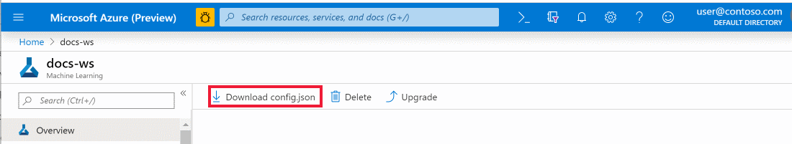

# Manage Azure Machine Learning workspaces in the portal or with the Python SDK (v2)

[!INCLUDE [sdk v2](includes/machine-learning-sdk-v2.md)]

In this article, you create, view, and delete [**Azure Machine Learning workspaces**](concept-workspace.md) for [Azure Machine Learning](overview-what-is-azure-machine-learning.md), with the [Azure portal](https://portal.azure.com) or the [SDK for Python](https://aka.ms/sdk-v2-install).

As your needs change or your automation requirements increase, you can manage workspaces [with the CLI](how-to-manage-workspace-cli.md), [Azure PowerShell](how-to-manage-workspace-powershell.md),  or [via the VS Code extension](how-to-setup-vs-code.md).

## Prerequisites

* An Azure subscription. If you don't have an Azure subscription, create a free account before you begin. Try the [free or paid version of Azure Machine Learning](https://azure.microsoft.com/free/) today.
* With the Python SDK:
   1. [Install the SDK v2](https://aka.ms/sdk-v2-install).
   1. Install azure-identity: `pip install azure-identity`. If in a notebook cell, use `%pip install azure-identity`.
   1. Provide your subscription details:

      [!INCLUDE [sdk v2](includes/machine-learning-sdk-v2.md)]

      [!notebook-python[](~/azureml-examples-main/sdk/python/resources/workspace/workspace.ipynb?name=subscription_id)]

   1. Get a handle to the subscription. All the Python code in this article uses `ml_client`:

      [!notebook-python[](~/azureml-examples-main/sdk/python/resources/workspace/workspace.ipynb?name=ml_client)]
      
        * (Optional) If you have multiple accounts, add the tenant ID of the Microsoft Entra ID you wish to use into the `DefaultAzureCredential`. Find your tenant ID from the [Azure portal](https://portal.azure.com) under **Microsoft Entra ID, External Identities**.
                
            ```python
            DefaultAzureCredential(interactive_browser_tenant_id="<TENANT_ID>")
            ```
                
        * (Optional) If you're working on a [sovereign cloud](reference-machine-learning-cloud-parity.md), you need to specify the cloud into which you want to authenticate. Do this in `DefaultAzureCredential`.
                
            ```python
            from azure.identity import AzureAuthorityHosts
            DefaultAzureCredential(authority=AzureAuthorityHosts.AZURE_GOVERNMENT))
            ```

## Limitations

[!INCLUDE [register-namespace](includes/machine-learning-register-namespace.md)]

* For network isolation with online endpoints, you can use workspace-associated resources (Azure Container Registry (ACR), Storage account, Key Vault, and Application Insights) from a resource group different from that of your workspace. However, these resources must belong to the same subscription and tenant as your workspace. For information about the limitations that apply to securing managed online endpoints, using a workspace's managed virtual network, see [Network isolation with managed online endpoints](concept-secure-online-endpoint.md#limitations).

* Workspace creation also creates an Azure Container Registry (ACR) by default. Since ACR doesn't currently support unicode characters in resource group names, use a resource group that avoids these characters.

* Azure Machine Learning doesn't support hierarchical namespace (Azure Data Lake Storage Gen2 feature) for the default storage account of the workspace.

[!INCLUDE [application-insight](includes/machine-learning-application-insight.md)]

## Create a workspace

You can create a workspace [directly in Azure Machine Learning studio](./quickstart-create-resources.md#create-the-workspace), with limited options available. You can also use one of these methods for more control of options:

# [Python SDK](#tab/python)

[!INCLUDE [sdk v2](includes/machine-learning-sdk-v2.md)]

* **Default specification.** By default, dependent resources and the resource group are created automatically. This code creates a workspace named `myworkspace`, and a resource group named `myresourcegroup` in `eastus2`.

   [!notebook-python[](~/azureml-examples-main/sdk/python/resources/workspace/workspace.ipynb?name=basic_workspace_name)]

* **Use existing Azure resources**. You can also create a workspace that uses existing Azure resources with the Azure resource ID format. Find the specific Azure resource IDs in the Azure portal, or with the SDK. This example assumes that the resource group, storage account, key vault, App Insights, and container registry already exist.

   [!notebook-python[](~/azureml-examples-main/sdk/python/resources/workspace/workspace.ipynb?name=basic_ex_workspace_name)]

For more information, see [Workspace SDK reference](/python/api/azure-ai-ml/azure.ai.ml.entities.workspace).

If you have problems in accessing your subscription, see [Set up authentication for Azure Machine Learning resources and workflows](how-to-setup-authentication.md), and the [Authentication in Azure Machine Learning](https://aka.ms/aml-notebook-auth) notebook.

# [Portal](#tab/azure-portal)

1. Sign in to the [Azure portal](https://portal.azure.com/) by using the credentials for your Azure subscription.

1. In the upper-left corner of Azure portal, select **+ Create a resource**.

    :::image type="content" source="media/how-to-manage-workspace/create-workspace.gif" alt-text="Screenshot show how to create a  workspace in Azure portal.":::

1. Use the search bar to find **Machine Learning**.

1. Select **Machine Learning**.

1. In the **Machine Learning** pane, select **Create** to begin.

1. Provide the following information to configure your new workspace:

   Field|Description 
   ---|---
   Workspace name |Enter a unique name that identifies your workspace. This example uses **docs-ws**. Names must be unique across the resource group. Use a name that's easy to recall and that differentiates from workspaces created by others. The workspace name is case-insensitive.
   Subscription |Select the Azure subscription that you want to use.
   Resource group | Use an existing resource group in your subscription, or enter a name to create a new resource group. A resource group holds related resources for an Azure solution. You need *contributor* or *owner* role to use an existing resource group. For more information about access, see [Manage access to an Azure Machine Learning workspace](how-to-assign-roles.md).
   Region | Select the Azure region closest both to your users and the data resources, to create your workspace.
   | Storage account | The default storage account for the workspace. By default, a new one is created. |
   | Key Vault | The Azure Key Vault used by the workspace. By default, a new one is created. |
   | Application Insights | The application insights instance for the workspace. By default, a new one is created. |
   | Container Registry | The Azure Container Registry for the workspace. By default, a new one isn't initially created for the workspace. Instead, creation of a Docker image during training or deployment additionally creates that Azure Container Registry for the workspace once you need it. |

   :::image type="content" source="media/how-to-manage-workspace/create-workspace-form.png" alt-text="Configure your workspace.":::

1. When you finish the workspace configuration, select **Review + Create**. Optionally, use the [Networking](#networking), [Encryption](#encryption), [Identity](#identity), and  [Tags](#tags) sections to configure more workspace settings.

1. Review the settings and make any other changes or corrections. When you're satisfied with the settings, select **Create**.

   > [!Warning]
   > It can take several minutes to create your workspace in the cloud.

   When the process completes, a deployment success message appears.

1. To view the new workspace, select **Go to resource**.

1. To start using the workspace, select the **Studio web URL** link on the top right. You can also select the workspace from the [Azure Machine Learning studio](https://ml.azure.com) home page.

---

### Networking

> [!IMPORTANT]
> For more information about use of a private endpoint and virtual network with your workspace, see [Network isolation and privacy](how-to-network-security-overview.md).

# [Python SDK](#tab/python)

[!INCLUDE [sdk v2](includes/machine-learning-sdk-v2.md)]

[!notebook-python[](~/azureml-examples-main/sdk/python/resources/workspace/workspace.ipynb?name=basic_private_link_workspace_name)]

This class requires an existing virtual network.

# [Portal](#tab/azure-portal)

1. The default network configuration uses a **Public endpoint**, which is accessible on the public internet. However, you can select **Private with Internet Outbound** or **Private with Approved Outbound** to limit access to your workspace to an Azure Virtual Network you created. Then scroll down to configure the settings.

   :::image type="content" source="media/how-to-manage-workspace/select-private-endpoint.png" alt-text="Private endpoint selection":::

1. Under **Workspace Inbound access** select **Add** to open the **Create private endpoint** form.
1. On the **Create private endpoint** form, set the location, name, and virtual network to use. To use the endpoint with a Private DNS Zone, select **Integrate with private DNS zone** and select the zone using the **Private DNS Zone** field. Select **OK** to create the endpoint.

   :::image type="content" source="media/how-to-manage-workspace/create-private-endpoint.png" alt-text="Private endpoint creation":::

1. If you selected **Private with Internet Outbound**, use the **Workspace Outbound access** section to configure the network and outbound rules.

1. If you selected **Private with Approved Outbound**, use the **Workspace Outbound access** section to add more rules to the required set.

1. When you finish the network configuration, you can select **Review + Create**, or advance to the optional **Encryption** configuration.

---

### Encryption

By default, an Azure Cosmos DB instance stores the workspace metadata. Microsoft maintains this Cosmos DB instance. Microsoft-managed keys encrypt this data.

#### Use your own data encryption key

You can provide your own key for data encryption. This creates the Azure Cosmos DB instance that stores metadata in your Azure subscription. For more information, see [Customer-managed keys](concept-customer-managed-keys.md).

Use these steps to provide your own key:

> [!IMPORTANT]
> Before you follow these steps, you must first perform these actions:
>
> Follow the steps in [Configure customer-managed keys](how-to-setup-customer-managed-keys.md) to:
>
> * Register the Azure Cosmos DB provider
> * Create and configure an Azure Key Vault
> * Generate a key

# [Python SDK](#tab/python)

[!INCLUDE [sdk v2](includes/machine-learning-sdk-v2.md)]

```python

from azure.ai.ml.entities import Workspace, CustomerManagedKey

# specify the workspace details
ws = Workspace(
    name="my_workspace",
    location="eastus",
    display_name="My workspace",
    description="This example shows how to create a workspace",
    customer_managed_key=CustomerManagedKey(
        key_vault="/subscriptions/<SUBSCRIPTION_ID>/resourcegroups/<RESOURCE_GROUP>/providers/microsoft.keyvault/vaults/<VAULT_NAME>"
        key_uri="<KEY-IDENTIFIER>"
    )
    tags=dict(purpose="demo")
)

ml_client.workspaces.begin_create(ws)
```

# [Portal](#tab/azure-portal)

1. Select **Customer-managed keys**, and then select **Click to select key**.

    :::image type="content" source="media/how-to-manage-workspace/advanced-workspace.png" alt-text="Customer-managed keys":::

1. On the **Select key from Azure Key Vault** form, select an existing Azure Key Vault, a key that it contains, and the key version. This key encrypts the data stored in Azure Cosmos DB. Finally, use the **Select** button to use this key.

   :::image type="content" source="media/how-to-manage-workspace/select-key-vault.png" alt-text="Select the key":::

---

### Identity

In the portal, use the **Identity** page to configure managed identity, storage account access, and data impact. For the Python SDK, see the links in the following sections.

#### Managed identity

A workspace can be given either a system assigned identity or a user assigned identity. This identity is used to access resources in your subscription. For more information, see [Set up authentication between Azure Machine Learning and other services](how-to-identity-based-service-authentication.md).

#### Storage account access

Choose between **Credential-based access** or **Identity-based access** when connecting to the default storage account. For identity-based authentication, the Storage Blob Data Contributor role must be granted to the workspace managed identity on the storage account.

#### Data impact

To limit the data that Microsoft collects on your workspace, select **High business impact workspace** in the portal, or set `hbi_workspace=true ` in Python. For more information on this setting, see [Encryption at rest](concept-data-encryption.md#encryption-at-rest).

> [!IMPORTANT]
> Selecting high business impact can only happen when creating a workspace. You can't change this setting after workspace creation.

### Tags

Tags are name/value pairs that enable you to categorize resources and view consolidated billing by applying the same tag to multiple resources and resource groups.

Assign tags for the workspace by entering the name/value pairs.  For more information, see [Use tags to organize your Azure resources](/azure/azure-resource-manager/management/tag-resources).

Also use tags to [enforce workspace policies)(#enforce-policies).


### Download a configuration file

If you run your code on a [compute instance](quickstart-create-resources.md), skip this step. The compute instance creates and stores a copy of this file for you.

To use code on your local environment that references this workspace, download the file:

1. Select your workspace in [Azure studio](https://ml.azure.com)
1. At the top right, select the workspace name, then select  **Download config.json**

   

Place the file in the directory structure that holds your Python scripts or Jupyter Notebooks. The same directory, a subdirectory named *.azureml*, or a parent directory can hold this file. When you create a compute instance, this file is added to the correct directory on the VM for you.

## Enforce policies

You can turn on/off these features of a workspace:

* Feedback opportunities in the workspace.  Opportunities include occasional in-product surveys and the smile-frown feedback tool in the banner of the workspace.
* Ability to [try out preview features](how-to-enable-preview-features.md) in the workspace.

These features are on by default.  To turn them off:

* When creating the workspace, turn off features from the [Tags](#tags) section:

   1. Turn off feedback by adding the pair "ADMIN_HIDE_SURVEY: TRUE"
   1. Turn off previews by adding the pair "AZML_DISABLE_PREVIEW_FEATURE": "TRUE"

* For an existing workspace, turn off features from the **Tags** section:

   1. Go to workspace resource in the [Azure portal](https://portal.azure.com)
   1. Open **Tags** from left navigation panel
   1. Turn off feedback by adding the pair "ADMIN_HIDE_SURVEY: TRUE"
   1. Turn off previews by adding the pair "AZML_DISABLE_PREVIEW_FEATURE: TRUE"
   1. Select **Apply**.  

:::image type="content" source="media/how-to-manage-workspace/tags.png" alt-text="Screenshot shows setting tags to prevent feedback in the workspace.":::

You can turn off previews at a subscription level, ensuring that it's off for all workspace in the subscription.  In this case, users in the subscription also cannot access the preview tool prior to selecting a workspace. This setting is useful for administrators who want to ensure that preview features are not used in their organization. 

The preview setting is ignored on individual workspaces if it is turned off at the subscription level of that workspace.

To disable preview features at the subscription level:

1. Go to subscription resource in the [Azure portal](https://portal.azure.com)
1. Open **Tags** from left navigation panel
1. Turn off previews for all workspaces in the subscription by adding the pair "AZML_DISABLE_PREVIEW_FEATURE": "TRUE"
1. Select **Apply**.  

## Connect to a workspace

When running machine learning tasks with the SDK, you require a MLClient object that specifies the connection to your workspace. You can create an `MLClient` object from parameters, or with a configuration file.

[!INCLUDE [sdk v2](includes/machine-learning-sdk-v2.md)]

* **With a configuration file:** This code reads the contents of the configuration file to find your workspace. It opens a prompt to sign in if you didn't already authenticate.

    ```python
    from azure.ai.ml import MLClient
    
    # read the config from the current directory
    ws_from_config = MLClient.from_config(credential=DefaultAzureCredential())
    ```
* **From parameters**: There's no need to have a config.json file available if you use this approach.
    
    [!notebook-python[](~/azureml-examples-main/sdk/python/resources/workspace/workspace.ipynb?name=ws)]

If you have problems in accessing your subscription, see [Set up authentication for Azure Machine Learning resources and workflows](how-to-setup-authentication.md), and the [Authentication in Azure Machine Learning](https://aka.ms/aml-notebook-auth) notebook.

## Find a workspace

See a list of all the workspaces you have available. You can also search for a workspace inside Studio. See [Search for Azure Machine Learning assets (preview)](how-to-search-assets.md).

# [Python SDK](#tab/python)

[!INCLUDE [sdk v2](includes/machine-learning-sdk-v2.md)]

[!notebook-python[](~/azureml-examples-main/sdk/python/resources/workspace/workspace.ipynb?name=my_ml_client)]
[!notebook-python[](~/azureml-examples-main/sdk/python/resources/workspace/workspace.ipynb?name=ws_name)]

To obtain specific workspace details:

[!notebook-python[](~/azureml-examples-main/sdk/python/resources/workspace/workspace.ipynb?name=ws_location)]

# [Portal](#tab/azure-portal)

1. Sign in to the [Azure portal](https://portal.azure.com/).

1. In the top search field, type **Machine Learning**.

1. Select **Machine Learning**.

   

1. Look through the list of the found workspaces. You can filter based on subscription, resource groups, and locations.

1. Select a workspace to display its properties.

---

## Delete a workspace

When you no longer need a workspace, delete it.

[!INCLUDE [machine-learning-delete-workspace](includes/machine-learning-delete-workspace.md)]

> [!TIP]
> The default behavior for Azure Machine Learning is to _soft delete_ the workspace. This means that the workspace is not immediately deleted, but instead is marked for deletion. For more information, see [Soft delete](./concept-soft-delete.md).

# [Python SDK](#tab/python)

[!INCLUDE [sdk v2](includes/machine-learning-sdk-v2.md)]

```python
ml_client.workspaces.begin_delete(name=ws_basic.name, delete_dependent_resources=True)
```

The default action doesn't automatically delete resources 

- container registry
- storage account
- key vault
- application insights

associated with the workspace. Set `delete_dependent_resources` to True to delete these resources as well.

# [Portal](#tab/azure-portal)

In the [Azure portal](https://portal.azure.com/), select **Delete**  at the top of the workspace you want to delete.

:::image type="content" source="./media/how-to-manage-workspace/delete-workspace.png" alt-text="Delete workspace":::

---

## Clean up resources

[!INCLUDE [aml-delete-resource-group](includes/aml-delete-resource-group.md)]

## Troubleshooting

* **Supported browsers in Azure Machine Learning studio**: We suggest that you use the most up-to-date browser that's compatible with your operating system. These browsers are supported:
  * Microsoft Edge (The new Microsoft Edge, latest version. Note: Microsoft Edge legacy isn't supported)
  * Safari (latest version, Mac only)
  * Chrome (latest version)
  * Firefox (latest version)

* **Azure portal**:
  * If you go directly to your workspace from a share link from the SDK or the Azure portal, you can't view the standard **Overview** page that has subscription information in the extension. Additionally, in this scenario, you can't switch to another workspace. To view another workspace, go directly to [Azure Machine Learning studio](https://ml.azure.com) and search for the workspace name.
  * All assets (Data, Experiments, Computes, and so on) are only available in [Azure Machine Learning studio](https://ml.azure.com). The Azure portal does *not* offer them.
  * Attempting to export a template for a workspace from the Azure portal might return an error similar to this text: `Could not get resource of the type <type>. Resources of this type will not be exported.` As a workaround, use one of the templates provided at [https://github.com/Azure/azure-quickstart-templates/tree/master/quickstarts/microsoft.machinelearningservices](https://github.com/Azure/azure-quickstart-templates/tree/master/quickstarts/microsoft.machinelearningservices) as the basis for your template.

### Workspace diagnostics

[!INCLUDE [machine-learning-workspace-diagnostics](includes/machine-learning-workspace-diagnostics.md)]

### Resource provider errors

[!INCLUDE [machine-learning-resource-provider](includes/machine-learning-resource-provider.md)]

### Deleting the Azure Container Registry

The Azure Machine Learning workspace uses the Azure Container Registry (ACR) for some operations. It automatically creates an ACR instance when it first needs one.

[!INCLUDE [machine-learning-delete-acr](includes/machine-learning-delete-acr.md)]

## Examples

Examples in this article come from [workspace.ipynb](https://github.com/Azure/azureml-examples/blob/main/sdk/python/resources/workspace/workspace.ipynb).

## Next steps

Once you have a workspace, learn how to [Train and deploy a model](tutorial-train-deploy-notebook.md).

To learn more about planning a workspace for your organization's requirements, visit [Organize and set up Azure Machine Learning](/azure/cloud-adoption-framework/ready/azure-best-practices/ai-machine-learning-resource-organization).

* If you need to move a workspace to another Azure subscription, visit [How to move a workspace](how-to-move-workspace.md).

For information on how to keep your Azure Machine Learning up to date with the latest security updates, visit [Vulnerability management](concept-vulnerability-management.md).