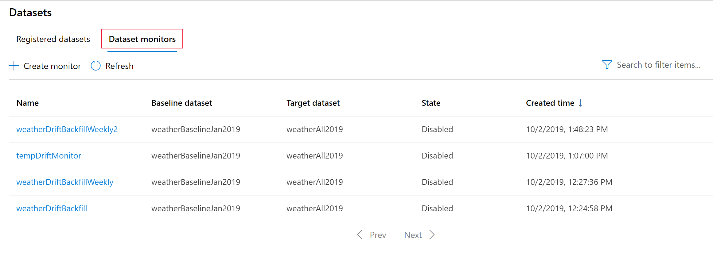
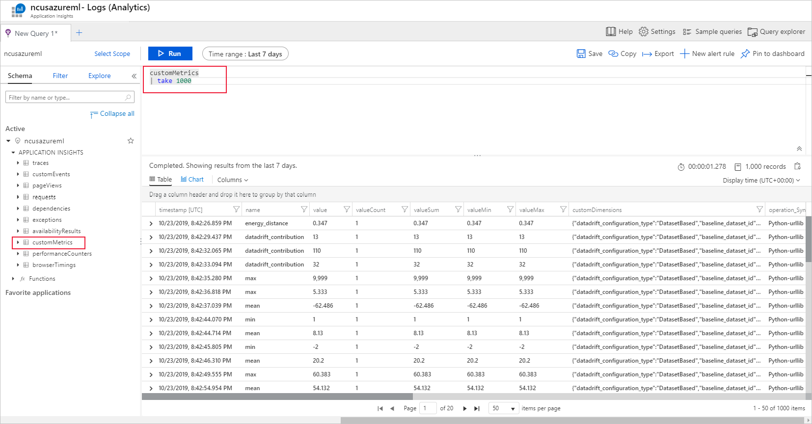
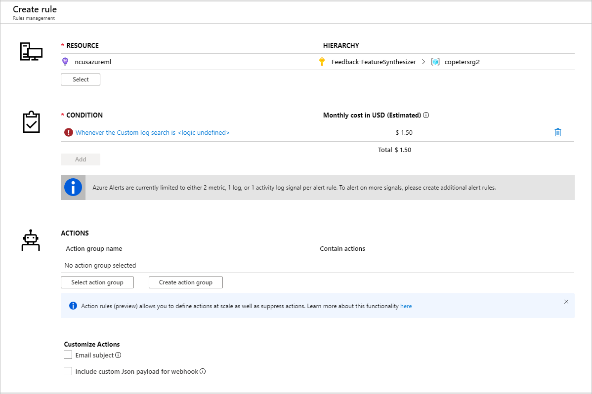
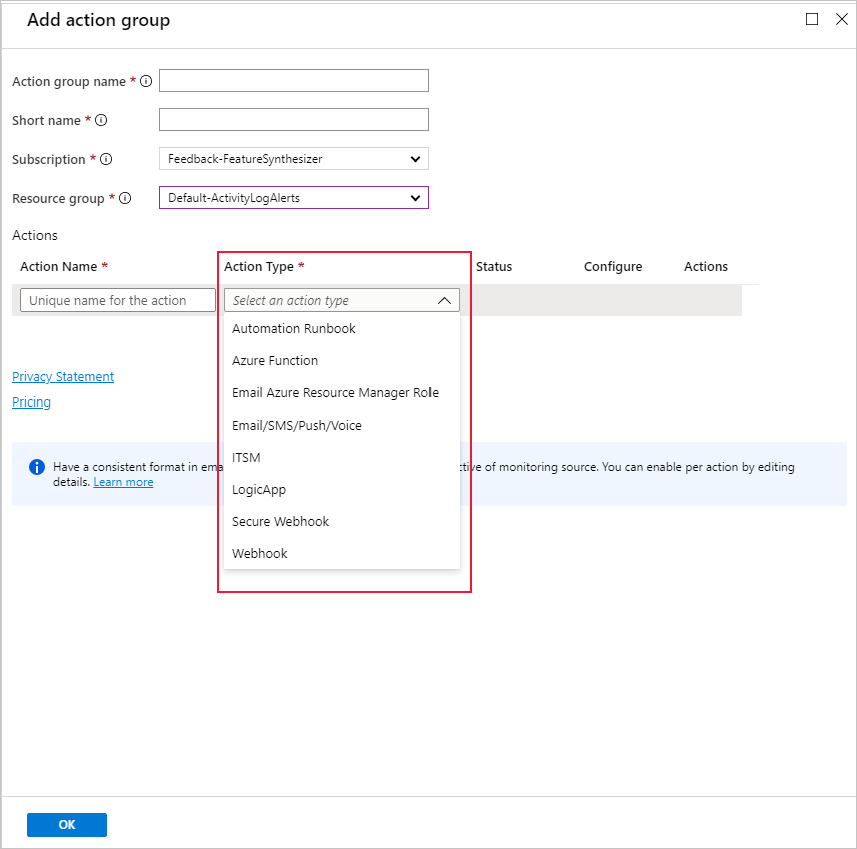

# Detect data drift (preview) on datasets
[!INCLUDE [applies-to-skus](../../includes/aml-applies-to-basic-enterprise-sku.md)]

> [!IMPORTANT]
> Detecting data drift on datasets is currently in public preview.
> The preview version is provided without a service level agreement, and it's not recommended for production workloads. Certain features might not be supported or might have constrained capabilities. 
> For more information, see [Supplemental Terms of Use for Microsoft Azure Previews](https://azure.microsoft.com/support/legal/preview-supplemental-terms/).

Learn how to monitor data drift and set alerts when drift is high.  

With Azure Machine Learning dataset monitors (preview), you can:
* **Analyze drift in your data** to understand how it changes over time.
* **Monitor model data** for differences between training and serving datasets.  Start by [collecting model data from deployed models](how-to-enable-data-collection.md).
* **Monitor new data** for differences between any baseline and target dataset.
* **Profile features in data** to track how statistical properties change over time.
* **Set up alerts on data drift** for early warnings to potential issues. 

An [Azure Machine learning dataset](how-to-create-register-datasets.md) is used to create the monitor. The dataset must include a timestamp column.

You can view data drift metrics with the Python SDK or in Azure Machine Learning studio.  Other metrics and insights are available through the [Azure Application Insights](https://docs.microsoft.com/azure/azure-monitor/app/app-insights-overview) resource associated with the Azure Machine Learning workspace.

> [!Important]
> Monitoring data drift with the SDK is available in all editions. However, monitoring data drift through the studio on the web is Enterprise edition only.

## Prerequisites

To create and work with dataset monitors, you need:
* An Azure subscription. If you don't have an Azure subscription, create a free account before you begin. Try the [free or paid version of Azure Machine Learning](https://aka.ms/AMLFree) today.
* An [Azure Machine Learning workspace](how-to-manage-workspace.md).
* The [Azure Machine Learning SDK for Python installed](https://docs.microsoft.com/python/api/overview/azure/ml/install?view=azure-ml-py&preserve-view=true), which includes the azureml-datasets package.
* Structured (tabular) data with a timestamp specified in the file path, file name, or column in the data.

## What is data drift?

Data drift is one of the top reasons model accuracy degrades over time.  For machine learning models, data drift is the change in model input data that leads to model performance degradation.  Monitoring data drift helps detect these model performance issues.

Causes of data drift include:

- Upstream process changes, such as a sensor being replaced that changes the units of measurement from inches to centimeters. 
- Data quality issues, such as a broken sensor always reading 0.
- Natural drift in the data, such as mean temperature changing with the seasons.
- Change in relation between features, or covariate shift. 

Azure Machine Learning simplifies drift detection by computing a single metric abstracting the complexity of datasets being compared.  These datasets may have hundreds of features and tens of thousands of rows. Once drift is detected, you drill down into which features are causing the drift.  You then inspect feature level metrics to debug and isolate the root cause for the drift.

This top down approach makes it easy to monitor data instead of traditional rules-based techniques. Rules-based techniques such as allowed data range or allowed unique values can be time consuming and error prone.

In Azure Machine Learning, you use dataset monitors to detect and alert for data drift.
  
### Dataset monitors 

With a dataset monitor you can:

* Detect and alert to data drift on new data in a dataset.
* Analyze historical data for drift.
* Profile new data over time.

The data drift algorithm provides an overall measure of change in data and indication of which features are responsible for further investigation. Dataset monitors produce a number of other metrics by profiling new data in the `timeseries` dataset. 

Custom alerting can be set up on all metrics generated by the monitor through [Azure Application Insights](https://docs.microsoft.com/azure/azure-monitor/app/app-insights-overview). Dataset monitors can be used to quickly catch data issues and reduce the time to debug the issue by identifying likely causes.  

Conceptually, there are three primary scenarios for setting up dataset monitors in Azure Machine Learning.

Scenario | Description
---|---
Monitor a model's serving data for drift from the training data | Results from this scenario can be interpreted as monitoring a proxy for the model's accuracy, since model accuracy degrades when the serving data drifts from the training data.
Monitor a time series dataset for drift from a previous time period. | This scenario is more general, and can be used to monitor datasets involved upstream or downstream of model building.  The target dataset must have a timestamp column. The baseline dataset can be any tabular dataset that has features in common with the target dataset.
Perform analysis on past data. | This scenario can be used to understand historical data and inform decisions in settings for dataset monitors.

Dataset monitors depend on the following Azure services.

|Azure service  |Description  |
|---------|---------|
| *Dataset* | Drift uses Machine Learning datasets to retrieve training data and compare data for model training.  Generating profile of data is used to generate some of the reported metrics such as min, max, distinct values, distinct values count. |
| *Azureml pipeline and compute* | The drift calculation job is hosted in azureml pipeline.  The job is triggered on demand or by schedule to run on a compute configured at drift monitor creation time.
| *Application insights*| Drift emits metrics to Application Insights belonging to the machine learning workspace.
| *Azure blob storage*| Drift emits metrics in json format to Azure blob storage.

## How dataset monitors data

Use Machine Learning datasets to monitor for data drift. Specify a baseline dataset - usually the training dataset for a model. A target dataset - usually model input data - is compared over time to your baseline dataset. This comparison means that your target dataset must have a timestamp column specified.

## Create target dataset

The target dataset needs the `timeseries` trait set on it by specifying the timestamp column either from a column in the data or a virtual column derived from the path pattern of the files. Create the dataset with a timestamp through the [Python SDK](#sdk-dataset) or [Azure Machine Learning studio](#studio-dataset). A column representing a "timestamp" must be specified to add `timeseries` trait to the dataset. If your data is partitioned into folder structure with time info, such as '{yyyy/MM/dd}', create a virtual column through the path pattern setting and set it as the "partition timestamp" to improve the importance of time series functionality.

### <a name="sdk-dataset"></a>Python SDK

The [`Dataset`](https://docs.microsoft.com/python/api/azureml-core/azureml.data.tabulardataset?view=azure-ml-py#&preserve-view=truewith-timestamp-columns-timestamp-none--partition-timestamp-none--validate-false----kwargs-) class [`with_timestamp_columns()`](https://docs.microsoft.com/python/api/azureml-core/azureml.data.tabulardataset?view=azure-ml-py#&preserve-view=truewith-timestamp-columns-timestamp-none--partition-timestamp-none--validate-false----kwargs-)  method defines the time stamp column for the dataset.

```python 
from azureml.core import Workspace, Dataset, Datastore

# get workspace object
ws = Workspace.from_config()

# get datastore object 
dstore = Datastore.get(ws, 'your datastore name')

# specify datastore paths
dstore_paths = [(dstore, 'weather/*/*/*/*/data.parquet')]

# specify partition format
partition_format = 'weather/{state}/{date:yyyy/MM/dd}/data.parquet'

# create the Tabular dataset with 'state' and 'date' as virtual columns 
dset = Dataset.Tabular.from_parquet_files(path=dstore_paths, partition_format=partition_format)

# assign the timestamp attribute to a real or virtual column in the dataset
dset = dset.with_timestamp_columns('date')

# register the dataset as the target dataset
dset = dset.register(ws, 'target')
```

For a full example of using the `timeseries` trait of datasets, see the [example notebook](https://github.com/Azure/MachineLearningNotebooks/blob/master/how-to-use-azureml/work-with-data/datasets-tutorial/timeseries-datasets/tabular-timeseries-dataset-filtering.ipynb) or the [datasets SDK documentation](https://docs.microsoft.com/python/api/azureml-core/azureml.data.tabulardataset?view=azure-ml-py#&preserve-view=truewith-timestamp-columns-timestamp-none--partition-timestamp-none--validate-false----kwargs-).

### <a name="studio-dataset"></a>Azure Machine Learning studio
[!INCLUDE [applies-to-skus](../../includes/aml-applies-to-enterprise-sku-inline.md)]

If you create your dataset using Azure Machine Learning studio, ensure the path to your data contains timestamp information, include all subfolders with data, and set the partition format.

In the following example, all data under the subfolder *NoaaIsdFlorida/2019* is taken, and the partition format specifies the timestamp's year, month, and day.

[](media/how-to-monitor-datasets/partition-format-expand.png)

In the **Schema** settings, specify the timestamp column from a virtual or real column in the specified dataset:

:::image type="content" source="media/how-to-monitor-datasets/timestamp.png" alt-text="Set the timestamp":::

If your data is partitioned by date, as is the case here, you can also specify the partition_timestamp.  This allows more efficient processing of dates.

:::image type="content" source="media/how-to-monitor-datasets/timeseries-partitiontimestamp.png" alt-text="Partition timestamp":::


## Create dataset monitors

Create dataset monitors to detect and alert to data drift on a new dataset.  Use either the [Python SDK](#sdk-monitor) or [Azure Machine Learning studio](#studio-monitor).

### <a name="sdk-monitor"></a>Python SDK

See the [Python SDK reference documentation on data drift](/python/api/azureml-datadrift/azureml.datadrift) for full details. 

The following example shows how to create a dataset monitor using the Python SDK

```python
from azureml.core import Workspace, Dataset
from azureml.datadrift import DataDriftDetector
from datetime import datetime

# get the workspace object
ws = Workspace.from_config()

# get the target dataset
dset = Dataset.get_by_name(ws, 'target')

# set the baseline dataset
baseline = target.time_before(datetime(2019, 2, 1))

# set up feature list
features = ['latitude', 'longitude', 'elevation', 'windAngle', 'windSpeed', 'temperature', 'snowDepth', 'stationName', 'countryOrRegion']

# set up data drift detector
monitor = DataDriftDetector.create_from_datasets(ws, 'drift-monitor', baseline, target, 
                                                      compute_target='cpu-cluster', 
                                                      frequency='Week', 
                                                      feature_list=None, 
                                                      drift_threshold=.6, 
                                                      latency=24)

# get data drift detector by name
monitor = DataDriftDetector.get_by_name(ws, 'drift-monitor')

# update data drift detector
monitor = monitor.update(feature_list=features)

# run a backfill for January through May
backfill1 = monitor.backfill(datetime(2019, 1, 1), datetime(2019, 5, 1))

# run a backfill for May through today
backfill1 = monitor.backfill(datetime(2019, 5, 1), datetime.today())

# disable the pipeline schedule for the data drift detector
monitor = monitor.disable_schedule()

# enable the pipeline schedule for the data drift detector
monitor = monitor.enable_schedule()
```

For a full example of setting up a `timeseries` dataset and data drift detector, see our [example notebook](https://aka.ms/datadrift-notebook).

### <a name="studio-monitor"></a> Azure Machine Learning studio
[!INCLUDE [applies-to-skus](../../includes/aml-applies-to-enterprise-sku-inline.md)]

To set up alerts on your dataset monitor, the workspace that contains the dataset you want to create a monitor for must have Enterprise edition capabilities.

After the workspace functionality is confirmed, navigate to the [studio's homepage](https://ml.azure.com) and select the **Datasets** tab on the left. Select **Dataset monitors**.



Click on the **+Create monitor** button and continue through the wizard by clicking **Next**.  

:::image type="content" source="media/how-to-monitor-datasets/wizard.png" alt-text="Create a monitor wizard":::

* **Select target dataset**.  The target dataset is a tabular dataset with timestamp column specified which will be analyzed for data drift. The target dataset must have features in common with the baseline dataset, and should be a `timeseries` dataset, which new data is appended to. Historical data in the target dataset can be analyzed, or new data can be monitored.

* **Select baseline dataset.**  Select the tabular dataset to be used as the baseline for comparison of the target dataset over time.  The baseline dataset must have features in common with the target dataset.  Select a time range to use a slice of the target dataset, or specify a separate dataset to use as the baseline.

* **Monitor settings**.  These settings are for the scheduled dataset monitor pipeline, which will be created. 

    | Setting | Description | Tips | Mutable | 
    | ------- | ----------- | ---- | ------- |
    | Name | Name of the dataset monitor. | | No |
    | Features | List of features that will be analyzed for data drift over time. | Set to a model's output feature(s) to measure concept drift. Don't include features that naturally drift over time (month, year, index, etc.). You can backfill and existing data drift monitor after adjusting the list of features. | Yes | 
    | Compute target | Azure Machine Learning compute target to run the dataset monitor jobs. | | Yes | 
    | Enable | Enable or disable the schedule on the dataset monitor pipeline | Disable the schedule to analyze historical data with the backfill setting. It can be enabled after the dataset monitor is created. | Yes | 
    | Frequency | The frequency that will be used to schedule the pipeline job and analyze historical data if running a backfill. Options include daily, weekly, or monthly. | Each run compares data in the target dataset according to the frequency: <li>Daily: Compare most recent complete day in target dataset with baseline <li>Weekly: Compare most recent complete week (Monday - Sunday) in target dataset with baseline <li>Monthly: Compare most recent complete month in target dataset with baseline | No | 
    | Latency | Time, in hours, it takes for data to arrive in the dataset. For instance, if it takes three days for data to arrive in the SQL DB the dataset encapsulates, set the latency to 72. | Cannot be changed after the dataset monitor is created | No | 
    | Email addresses | Email addresses for alerting based on breach of the data drift percentage threshold. | Emails are sent through Azure Monitor. | Yes | 
    | Threshold | Data drift percentage threshold for email alerting. | Further alerts and events can be set on many other metrics in the workspace's associated Application Insights resource. | Yes |

After finishing the wizard, the resulting dataset monitor will appear in the list. Select it to go to that monitor's details page.

## Understand data drift results

This section shows you the results of monitoring a dataset, found in the **Datasets** / **Dataset monitors** page in Azure studio.  You can update the settings as well as analyze existing data for a specific time period on this page.  

Start with the top-level insights into the magnitude of data drift and a highlight of features to be further investigated.

:::image type="content" source="media/how-to-monitor-datasets/drift-overview.png" alt-text="Drift overview":::


| Metric | Description | 
| ------ | ----------- | 
| Data drift magnitude | A percentage of drift between the baseline and target dataset over time. Ranging from 0 to 100, 0 indicates identical datasets and 100 indicates the Azure Machine Learning data drift model can completely tell the two datasets apart. Noise in the precise percentage measured is expected due to machine learning techniques being used to generate this magnitude. | 
| Top drifting features | Shows the features from the dataset that have drifted the most and are therefore contributing the most to the Drift Magnitude metric. Due to covariate shift, the underlying distribution of a feature does not necessarily need to change to have relatively high feature importance. |
| Threshold | Data Drift magnitude beyond the set threshold will trigger alerts. This can be configured in the monitor settings. | 

### Drift magnitude trend

See how the dataset differs from the target dataset in the specified time period.  The closer to 100%, the more the two datasets differ.

:::image type="content" source="media/how-to-monitor-datasets/drift-magnitude.png" alt-text="Drift magnitude trend":::

### Drift magnitude by features

This section contains feature-level insights into the change in the selected feature's distribution, as well as other statistics, over time.

The target dataset is also profiled over time. The statistical distance between the baseline distribution of each feature is compared with the target dataset's over time.  Conceptually, this is similar to the data drift magnitude.  However this statistical distance is for an individual feature rather than all features. Min, max, and mean are also available.

In the Azure Machine Learning studio, click on a bar in the graph to see the the feature level details for that date. By default, you see the baseline dataset's distribution and the most recent run's distribution of the same feature.

:::image type="content" source="media/how-to-monitor-datasets/drift-by-feature.gif" alt-text="Drift magnitude by features":::

These metrics can also be retrieved in the Python SDK through the `get_metrics()` method on a `DataDriftDetector` object.

### Feature details

Finally, scroll down to view details for each individual feature.  Use the dropdowns above the chart to select the feature, and additionally select the metric you want to view.

:::image type="content" source="media/how-to-monitor-datasets/numeric-feature.gif" alt-text="Numeric feature graph and comparison":::

Metrics in the chart depend on the type of feature.

* Numeric features

    | Metric | Description |  
    | ------ | ----------- |  
    | Wasserstein distance | Minimum amount of work to transform baseline distribution into the target distribution. |
    | Mean value | Average value of the feature. |
    | Min value | Minimum value of the feature. |
    | Max value | Maximum value of the feature. |

* Categorical features
    
    | Metric | Description |  
    | ------ | ----------- |  
    | Euclidian distance     |  Computed for categorical columns. Euclidean distance is computed on two vectors, generated from empirical distribution of the same categorical column from two datasets. 0 indicates there is no difference in the empirical distributions.  The more it deviates from 0, the more this column has drifted. Trends can be observed from a time series plot of this metric and can be helpful in uncovering a drifting feature.  |
    | Unique values | Number of unique values (cardinality) of the feature. |

On this chart, select a single date to compare the feature distribution between the target and this date for the displayed feature. For numeric features, this shows two probability distributions.  If the feature is numeric, a bar chart is shown.

:::image type="content" source="media/how-to-monitor-datasets/select-date-to-compare.gif" alt-text="Select a date to compare to target":::

## Metrics, alerts, and events

Metrics can be queried in the [Azure Application Insights](https://docs.microsoft.com/azure/azure-monitor/app/app-insights-overview) resource associated with your machine learning workspace. You have access to all features of Application Insights including set up for custom alert rules and action groups to trigger an action such as, an Email/SMS/Push/Voice or Azure Function. Refer to the complete Application Insights documentation for details. 

To get started, navigate to the [Azure portal](https://portal.azure.com) and select your workspace's **Overview** page.  The associated Application Insights resource is on the far right:

[](media/how-to-monitor-datasets/ap-overview-expanded.png)

Select Logs (Analytics) under Monitoring on the left pane:


The dataset monitor metrics are stored as `customMetrics`. You can write and run a query after setting up a dataset monitor to view them:

[](media/how-to-monitor-datasets/simple-query-expanded.png)

After identifying metrics to set up alert rules, create a new alert rule:



You can use an existing action group, or create a new one to define the action to be taken when the set conditions are met:



## Next steps

* Head to the [Azure Machine Learning studio](https://ml.azure.com) or the [Python notebook](https://github.com/Azure/MachineLearningNotebooks/blob/master/how-to-use-azureml/work-with-data/datadrift-tutorial/datadrift-tutorial.ipynb) to set up a dataset monitor.
* See how to set up data drift on [models deployed to Azure Kubernetes Service](how-to-monitor-data-drift.md).
* Set up dataset drift monitors with [event grid](how-to-use-event-grid.md). 
* See these common [troubleshooting tips](resource-known-issues.md#data-drift) if you're having problems.
