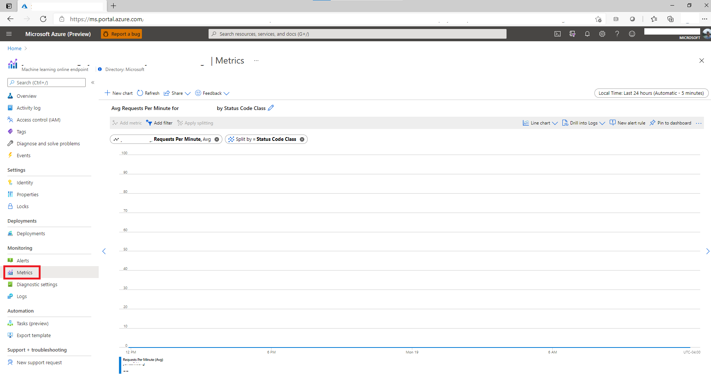
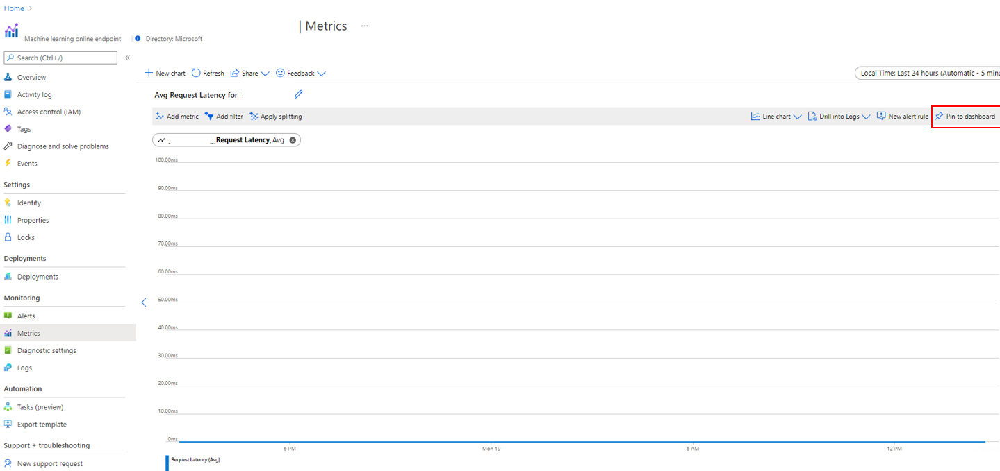
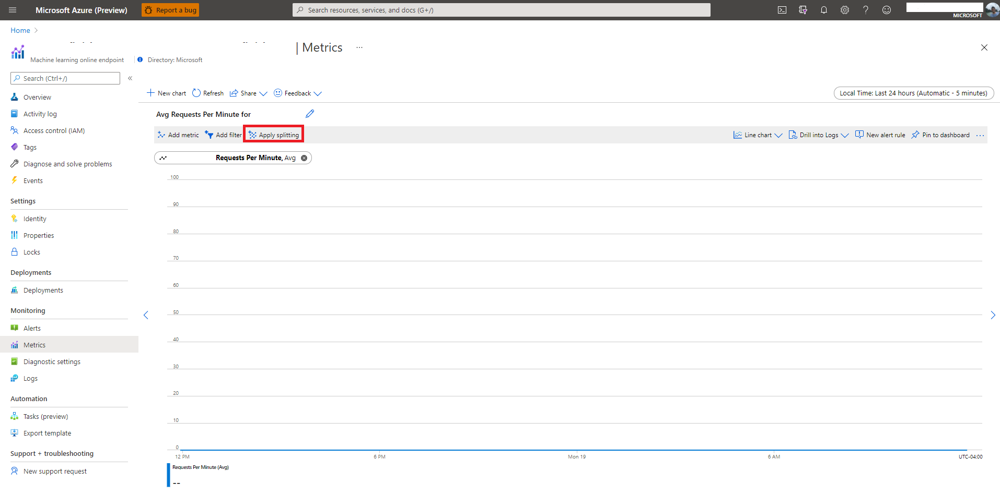
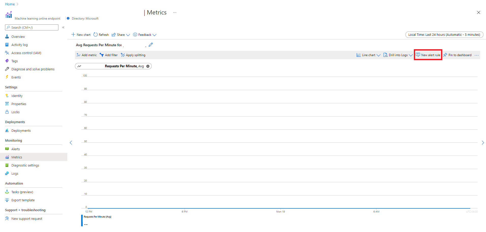
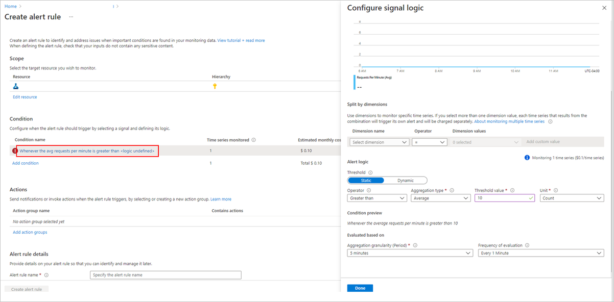
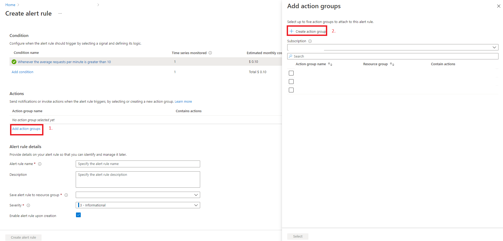

# Monitor managed online endpoints

In this article, you learn how to monitor Azure Machine Learning managed online endpoints. Use Application Insights to view metrics and create alerts to stay up to date with your managed online endpoints.

In this article you learn how to:

> [!div class="checklist"]
> * View metrics for your managed online endpoint
> * Create a dashboard for your metrics
> * Create a metric alert

## Prerequisites

- Deploy an Azure Machine Learning managed online endpoint
- At least [Reader access](../role-based-access-control/role-assignments-portal.md) on the endpoint

## View metrics

Use the following steps to view metrics for a managed endpoint or deployment:
1. Go to the [Azure portal](https://portal.azure.com).
1. Navigate to the managed online endpoint or deployment resource.

    Managed online endpoints and deployments are ARM resources that can be found by going to their owning resource group. Look for the resource types **Machine Learning online endpoint** and **Machine Learning online deployment**.

1. In the left-hand column, select **Metrics**.

    
    

## Available metrics

Depending on the resource that you select, the metrics that you can see will be different. Metrics are scoped differently for managed online endpoints and managed online deployments.

### Metrics at endpoint scope

- Request Latency
- Request Latency P50 (Request latency at the 50th percentile)
- Request Latency P90 (Request latency at the 90th percentile)
- Request Latency P95 (Request latency at the 95th percentile)
- Requests per minute

Split on the following dimensions:

- Deployment
- Status Code
- Status Code Class

### Metrics at deployment scope

- CPU Utilization
- Deployment Capacity (the number of instances of the requested instance type)
- Disk Utilization
- GPU Memory Utilization (only applicable to GPU instances)
- GPU Utilization (only applicable to GPU instances)
- Memory Utilization

Slit on the following dimension:

- InstanceId

## Create a dashboard

You can create custom dashboards to save metric views in the Azure portal. For more information, see [Create custom KPI dashboards using Application Insights](../azure-monitor/app/tutorial-app-dashboards.md#add-custom-metric-chart):

1. Select metrics to viewed.
1. Select the **Pin to dashboard** button in the top right of the metrics window.

    

1. Select **Apply splitting** to split the metric before adding it to a dashboard.

    Splitting lets you drill down further into metric, which can be useful for troubleshooting. For example,  splitting by status code can answer the questions "Were my 4xx responses a result of high traffic?"

    
    
## Create an alert

You can custom alerts to notify you of changes to your metrics:

1. Select **New alert rule** in the top right of the metrics window.

    

1. Select a condition name to specify when your alert should be triggered.

    

1. Select **Add action groups** > **Create action groups** to specify what should happen when your alert is triggered.

    

1. Choose **Create alert rule** to finish creating your alert.

    

## Next steps

* Learn how to [view costs for your deployed endpoint](./how-to-view-online-endpoints-costs.md).
* Read more about [metrics explorer](../azure-monitor/essentials/metrics-charts.md).