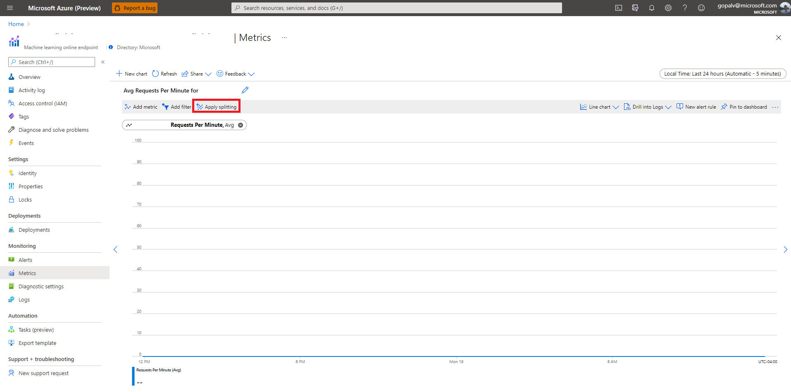
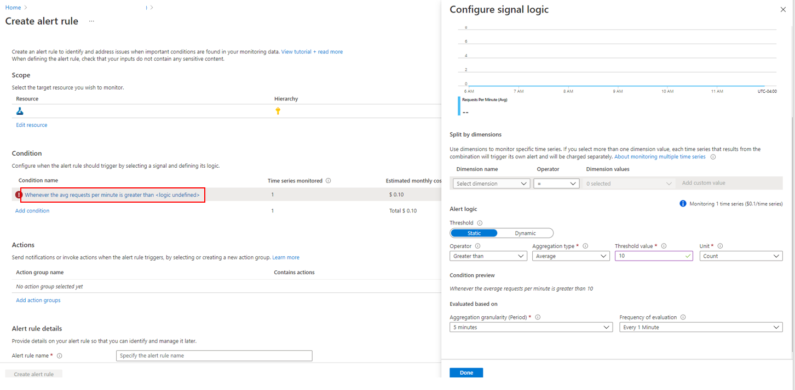
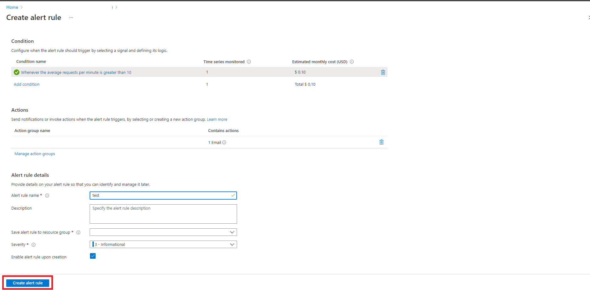

# View metrics for a managed online endpoint

In this document, you will learn how to view metrics and create an alert for an Azure Machine Learning managed online endpoint.

## Prerequisites

In order to follow the steps in this article, you must:

- Have a deployed Azure Machine Learning online endpoint
- Have at least [Reader access](../role-based-access-control/role-assignments-portal.md) on the endpoint

## How to view metrics

To view metrics associated with a given endpoint or deployment, open the endpoint or deployment in the [Azure portal](https://portal.azure.com) and select **Metrics** in the left hand column.

## Create a dashboard

To create a dashboard from your metrics viewed, select the **Pin to dashboard** button in the top right of the metrics window.

You can also split the metric before adding it to a dashboard, by clicking **Apply splitting**. Splitting lets you view more granular breakdowns of a given metric, which can be useful for troubleshooting. Splitting by status code, for example, lets you answer questions like "were my 4xx responses a result of high traffic?".

## Create an alert

To create an alert based on a given metric:

1. Select **New alert rule** in the top right of the metrics window.

    

1. Select the condition name on the resulting screen in order to specify when your alert should be triggered.

    

1. Choose **Add action groups** followed by **Create action groups** to specify what should happen when your alert is triggered.

    

1. Choose **Create alert rule** to finish creating your alert.

    

## Supported metrics at the endpoint level

The following metrics are available at the endpoint scope:

- Request Latency
- Request Latency P50 (Request latency at the 50th percentile)
- Request Latency P90 (Request latency at the 90th percentile)
- Request Latency P95 (Request latency at the 95th percentile)
- Requests per minute

You can split on the following dimensions:

- Deployment
- Status Code
- Status Code Class

## Supported metrics at the deployment level

The following metrics are available at the deployment scope:

- CPU Utilization
- Deployment Capacity (the number of instances of the requested instance type)
- Disk Utilization
- GPU Memory Utilization (only applicable to GPU instances)
- GPU Utilization (only applicable to GPU instances)
- Memory Utilization

You can split on the following dimensions:

- InstanceId

## Next steps

* Learn how to [view costs for your deployed endpoint](./how-to-view-online-endpoints-costs.md).
* Read more about [metrics explorer](../azure-monitor/essentials/metrics-charts.md).