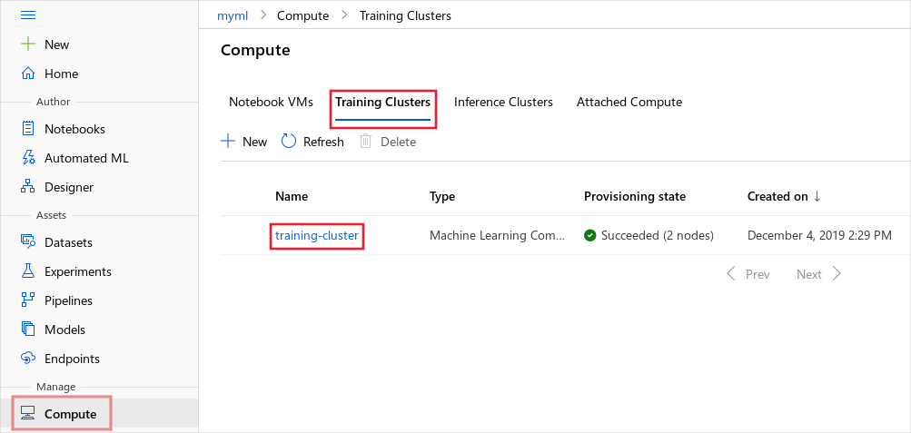
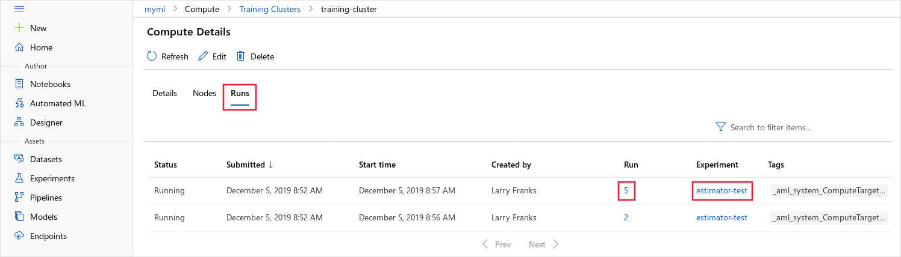

# Monitor and view ML run logs and metrics

Learn how to monitor Azure Machine Learning runs and view their logs. 

When you run an experiment, logs and metrics are streamed for you.  In addition, you can add your own.  To learn how, see [Enable logging in Azure ML training runs](how-to-track-experiments.md).

The logs can help you diagnose errors and warnings for your run. Performance metrics like parameters and model accuracy help you track and monitor your runs.

In this article, you learn how to view logs using the following methods:

> [!div class="checklist"]
> * Monitor runs in the studio
> * Monitor runs using the Jupyter Notebook widget
> * Monitor automated machine learning runs
> * View output logs upon completion
> * View output logs in the studio

For general information on how to manage your experiments, see [Start, monitor, and cancel training runs](how-to-manage-runs.md).

## Monitor runs using the Jupyter notebook widget

When you use the **ScriptRunConfig** method to submit runs, you can watch the progress of the run using the [Jupyter widget](/python/api/azureml-widgets/azureml.widgets). Like the run submission, the widget is asynchronous and provides live updates every 10-15 seconds until the job completes.

View the Jupyter widget while waiting for the run to complete.
    
```python
from azureml.widgets import RunDetails
RunDetails(run).show()
```


You can also get a link to the same display in your workspace.

```python
print(run.get_portal_url())
```

## Monitor automated machine learning runs

For automated machine learning runs, to access the charts from a previous run, replace `<<experiment_name>>` with the appropriate experiment name:

```python
from azureml.widgets import RunDetails
from azureml.core.run import Run

experiment = Experiment (workspace, <<experiment_name>>)
run_id = 'autoML_my_runID' #replace with run_ID
run = Run(experiment, run_id)
RunDetails(run).show()
```


## Show output upon completion

When you use **ScriptRunConfig**, you can use ```run.wait_for_completion(show_output = True)``` to show when the model training is complete. The ```show_output``` flag gives you verbose output. For more information, see the ScriptRunConfig section of [How to enable logging](how-to-track-experiments.md#scriptrun-logs).

<a id="queryrunmetrics"></a>

## View run metrics

## Via the SDK
You can view the metrics of a trained model using ```run.get_metrics()```. See the example below. 

```python
from azureml.core import Run
run = Run.get_context()
run.log('metric-name', metric_value)

metrics = run.get_metrics()
# metrics is of type Dict[str, List[float]] mapping mertic names
# to a list of the values for that metric in the given run.

metrics.get('metric-name')
# list of metrics in the order they were recorded
```

<a name="view-the-experiment-in-the-web-portal"></a>

## View run records in the studio

You can browse completed run records, including logged metrics, in the [Azure Machine Learning studio](https://ml.azure.com).

Navigate to the **Experiments** tab. To view all your runs in your Workspace across Experiments, select the **All runs** tab. You can drill down on runs for specific Experiments by applying the Experiment filter in the top menu bar.

For the individual Experiment view, select the **All experiments** tab. On the experiment run dashboard, you can see tracked metrics and logs for each run. 

You can also edit the run list table to select multiple runs and display either the last, minimum, or maximum logged value for your runs. Customize your charts to compare the logged metrics values and aggregates across multiple runs. 


### View and download log files for a run 

Log files are an essential resource for debugging the Azure ML workloads. Drill down to a specific run to view its logs and outputs:  

1. Navigate to the **Experiments** tab.
1. Select the runID for a specific run.
1. Select **Outputs and logs** at the top of the page.
2. Select **Download all** to download all your logs into a zip folder.

:::image type="content" source="media/how-to-monitor-view-training-logs/downloadlogs.png" alt-text="Screenshot of Output and logs section of a run":::

The tables below show the contents of the log files in the folders you'll see in this section.

> [!NOTE]
> You will not necessarily see every file for every run. For example, the 20_image_build_log*.txt only appears when a new image is built (e.g. when you change you environment).

#### `azureml-logs` folder

|File  |Description  |
|---------|---------|
|20_image_build_log.txt     | Docker image building log for the training environment, optional, one per run. Only applicable when updating your Environment. Otherwise AML will reuse cached image. If successful, contains image registry details for the corresponding image.         |
|55_azureml-execution-<node_id>.txt     | stdout/stderr log of host tool, one per node. Pulls image to compute target. Note, this log only appears once you have secured compute resources.         |
|65_job_prep-<node_id>.txt     |   stdout/stderr log of job preparation script, one per node. Download your code to compute target and datastores (if requested).       |
|70_driver_log(_x).txt      |  stdout/stderr log from AML control script and customer training script, one per process. **This is the standard output from your script. This is where your code's logs (e.g. print statements) show up.** In the majority of cases you will monitor the logs here.       |
|70_mpi_log.txt     |   MPI framework log, optional, one per run. Only for MPI run.   |
|75_job_post-<node_id>.txt     |  stdout/stderr log of job release script, one per node. Send logs, release the compute resources back to Azure.        |
|process_info.json      |   show which process is running on which node.  |
|process_status.json      | show process status, i.e. if a process is not started, running or completed.         |

#### `logs > azureml` folder

|File  |Description  |
|---------|---------|
|110_azureml.log      |         |
|job_prep_azureml.log     |   system log for job preparation        |
|job_release_azureml.log     | system log for job release        |

#### `logs > azureml > sidecar > node_id` folder

When sidecar is enabled, job prep and job release scripts will be run within sidecar container.  There is one folder for each node. 

|File  |Description  |
|---------|---------|
|start_cms.txt     |  Log of process that starts when Sidecar Container starts       |
|prep_cmd.txt      |   Log for ContextManagers entered when `job_prep.py` is run (some of this will be streamed to `azureml-logs/65-job_prep`)       |
|release_cmd.txt     |  Log for ComtextManagers exited when `job_release.py` is run        |

#### Other folders

For jobs training on multi-compute clusters, logs are present for each node IP. The structure for each node is the same as single node jobs. There is one additional logs folder for overall execution, stderr, and stdout logs.

Azure Machine Learning logs information from a variety of sources during training, such as AutoML or the Docker container that runs the training job. Many of these logs are not documented. If you encounter problems and contact Microsoft support, they may be able to use these logs during troubleshooting.

## Monitor a compute cluster

To monitor runs for a specific compute target from your browser, use the following steps:

1. In the [Azure Machine Learning studio](https://ml.azure.com/), select your workspace, and then select __Compute__ from the left side of the page.

1. Select __Training Clusters__ to display a list of compute targets used for training. Then select the cluster.

    

1. Select __Runs__. The list of runs that use this cluster is displayed. To view details for a specific run, use the link in the __Run__ column. To view details for the experiment, use the link in the __Experiment__ column.

    
    
    > [!TIP]
    > Since training compute targets are a shared resource, they can have multiple runs queued or active at a given time.
    > 
    > A run can contain child runs, so one training job can result in multiple entries.

Once a run completes, it is no longer displayed on this page. To view information on completed runs, visit the __Experiments__ section of the studio and select the experiment and run. For more information, see the section [View metrics for completed runs](#view-the-experiment-in-the-web-portal).


## Next steps

Try these next steps to learn how to use Azure Machine Learning:

* Learn how to [track experiments and enable logs in the Azure Machine Learning designer](how-to-track-designer-experiments.md).

* See an example of how to register the best model and deploy it in the tutorial, [Train an image classification model with Azure Machine Learning](tutorial-train-models-with-aml.md).
