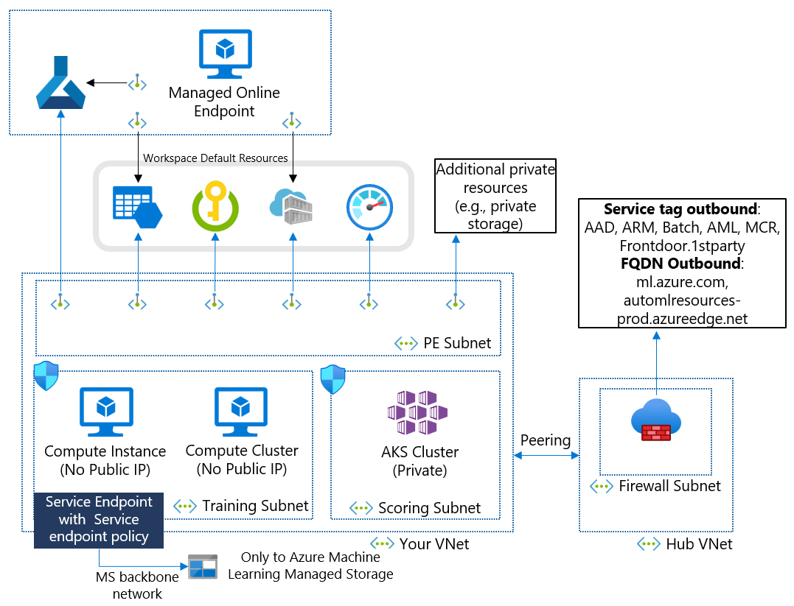

In this article, you learn how to plan your network isolation for Azure Machine Learning and our recommendations. This is a document for IT administrators who want to design network architecture.

## Demystify key considerations

### Azure Machine Learning has both IaaS and PaaS resources

Azure Machine Learning's network isolation involves both Platform as a Service (PaaS) and Infrastructure as a Service (IaaS) components. PaaS services, such as the Azure Machine Learning workspace, storage, key vault, container registry, and monitor, can be isolated using Private Link. IaaS computing services, such as compute instances and compute clusters for AI model training, AKS or managed online endpoints for AI model scoring, can be injected into your virtual network and communicate with PaaS services using Private Link. An example network architecture is below.

In this architecture, Compute Instances, Compute Clusters, and AKS Clusters are located within your virtual network. They can access the Azure Machine Learning workspace or storage using a private endpoint. You can use the service endpoint only for Storage and Key Vault because others do not support service endpoint.

### Required inbound and outbound configurations

Azure Machine Learning has [several required inbound and outbound configurations](https://learn.microsoft.com/azure/machine-learning/how-to-access-azureml-behind-firewall) with your virtual network. If you have a standalone virtual network, configuration is straightforward with your network security group. However, most likely you have hub-spoke or mesh network architecture, firewall, network virtual appliance, proxy, and user defined routing. Make sure to allow inbound and outbound with your network security components.

In this architecture, you have hub and spoke network architecture. Your spoke vnet has resources for Azure Machine Learning. Hub vnet has a firewall that control internet outbound from your virtual networks. In this case, your firewall must allow outbound to required resources and your compute resources in spoke vnet must be able to reach your firewall.

If you use Compute instance with public IP, you need to allow inbound from Azure Machine Learning service tag using Network Security Group (NSG) and user defined routing to skip your firewall. Azure Machine Learning is owned by Microsoft. We recommend using no public IP option to remove this inbound requirement.

### DNS resolution of private link resources and application on Compute Instance

If you have your own DNS server hosted in Azure or on-premises, you need to create conditional forwarder in your DNS server to Azure DNS for all private link enabled PaaS services. You can learn [DNS configuration scenarios](https://learn.microsoft.com/azure/private-link/private-endpoint-dns#dns-configuration-scenarios) and [Azure Machine Learning specific DNS configuations](https://learn.microsoft.com/azure/machine-learning/how-to-custom-dns).

### Data Exfiltration Protection

We have two types of outbound; read only and read/write. Read only outbound cannot be exploitted by malicsious insider but read/write outbound can be. Storage and Frontdoor.frontend are read/write outbound in our case. You can mitigate this data exfiltration risk using [our data exfiltration prevention solution](https://learn.microsoft.com/azure/machine-learning/how-to-prevent-data-loss-exfiltration). We use service endpoint policy with Azure Machine Learning alias to allow outbound to Azure Machine Learning managed storage accounts. You do not need to open outbound to Storage on your firewall.

Compute instance and cluster need to access Azure Machine Learning managed storage accounts to get set-up scripts. Instead of opening the outbound to storage, you can use service endpoint policy with Azure Machine Learning alias to allow the storage access only to Azure Machine Learning storage accounts.

### Managed Online Endpoint

Managed Online Endpoint has built-in network isolation without your Vnet. If you want to disallow public access to your endpoint, set public_network_access disabled. Your endpoint can be accessed via your private endpoint of your workspace. If you want to use private storage account for your deployment, set egress_public_netwrok_access disabled. It automatically creates private endpoints to access your private resources as the below architecture.

### Private IP address shortage in your main network

Azure Machine Learning requires private IPs; one IP per compute instance, compute cluster node, private endpoint. You need material number of IPs if you use AKS. Your hub-spoke network connected with your on-premises might not have enough private IP address spaces. You can have isolated, not-peered VNet for your Azure Machine Learning resources.

With this architecture, your main VNet requires the IPs for private endpoints. You can have hub-spoke VNets for multiple Azure Machine Learning workspaces with large address spaces. A downside of this architecutre is to double the number of private endpoints.

<!-- ### Registry -->

## Recommended Architecture

This is a recommended architecture to make all resources private but allow outbound internet access from your Vnet. This is the option to balance your network security and your ML engineers' productivity.

You can automate this environment creation using [this template](https://learn.microsoft.com/azure/machine-learning/tutorial-create-secure-workspace-template) without Managed online endpoint or AKS. 

### Removing firewall requirement

If you want to remove a firewall requirement, you can use NSG and [Azure virtual network NAT](https://learn.microsoft.com/azure/virtual-network/nat-gateway/nat-overview) to allow internet outbound from your private computing resources.

### Using public workspace

You can use public Azure Machine Learning workspace if you are fine only with Azure AD authentication and authrication with conditional access. Note that the workspace has some features to show data in your private storage account and we recommend using private workspace.

## Recommended Architecture with Data Exfiltration Prevention

This is a recommende architecture to make all resources private and control outbound destinations to prevent data exfiltration. This is the option to use Azure Machine Learning with your sensitive data in production.

### Using public workspace

You can use the public Azure Machine Learning workspace if you are fine only with Azure AD authentication and authorization with conditional access. Note that the workspace has some features to show data in your private storage account and we recommend using private workspace.

