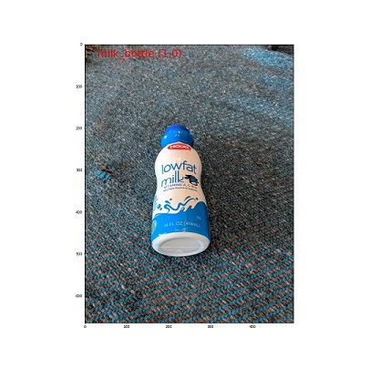

# Preparing Datasets for AutoML Images

In this article, you'll learn how to prepare image datasets to build computer vision models using AutoML. we'll describe the schema and data preparation needed for 
+ **Image Classification**
+ **Image Classification Multi-label**
+ **Object Detection**
+ **Instance Segmentation**

You'll also learn to upload prepared datasets to a [datastore](https://docs.microsoft.com/en-us/azure/machine-learning/concept-azure-machine-learning-architecture#datasets-and-datastores) and understand inference formats for different tasks.

To generate models for computer vision, you'll need to bring in labeled image data as input for model training in the form of an [AzureML Tabular Dataset](https://docs.microsoft.com/en-us/python/api/azureml-core/azureml.data.tabulardataset?view=azure-ml-py). You can either use a dataset that you've exported from a Data Labeling project, or create a new AzureML Tabular Dataset with your labeled training data via SDK.


## Input Data formats/Schema for AutoML Image models

Azure Machine Learning AutoML for Images requires input image data to be prepared in [JSONL](https://jsonlines.org/) (JSON Lines) format. This section describes input data formats or schema for image classification multi-class, image classification multi-label, object detection, and instance segmentation. We'll also provide a sample of final training or validation JSON Lines file.

### Image Classification (binary/multi-class)



| Key       | Description  | Example |
| -------- |----------|-----|
| image_url | Image location in AML datastore<br>`Required, String` | `"AmlDatastore://data_directory/Image_01.jpg"` |
| image_details | Image details<br>`Optional, Dictionary` | `"image_details":{"format": "jpg", "width": "400px", "height": "258px"}` |
| format  | Image type (all the available Image formats in [Pillow](https://pillow.readthedocs.io/en/stable/releasenotes/8.0.1.html) library are supported)<br>`Optional, String from {"jpg", "jpeg", "png", "jpe", "jfif","bmp", "tif", "tiff"}`  |  `"jpg" or "jpeg" or "png" or "jpe" or "jfif" or "bmp" or "tif" or "tiff"` |
| width | Width of the image<br>`Optional, String or Positive Integer`  | `"400px" or 400`|
| height | Height of the image<br>`Optional, String or Positive Integer` | `"200px" or 200` |
| label | Class/label of the image<br>`Required, String` | `"cat"` |


**Input data format/schema in each JSON Line:**
```json
{
   "image_url":"AmlDatastore://data_directory/../Image_name.image_format",
   "image_details":{
      "format":"image_format",
      "width":"image_width",
      "height":"image_height"
   },
   "label":"class_name",
}
```

Example of a JSONL file for multi-class image classification:
```json
{"image_url": "AmlDatastore://image_data/Image_01.jpg", "image_details":{"format": "jpg", "width": "400px", "height": "258px"}, "label": "can"}
{"image_url": "AmlDatastore://image_data/Image_02.jpg", "image_details": {"format": "jpg", "width": "397px", "height": "296px"}, "label": "milk_bottle"}
.
.
.
{"image_url": "AmlDatastore://image_data/Image_n.jpg", "image_details": {"format": "jpg", "width": "1024px", "height": "768px"}, "label": "water_bottle"}
  ```

### Image Classification Multi-label


| Key       | Description  | Example |
| -------- |----------|-----|
| image_url | Image location in AML datastore<br>`Required, String` | `"AmlDatastore://data_directory/Image_01.jpg"` |
| image_details | Image details<br>`Optional, Dictionary` | `"image_details":{"format": "jpg", "width": "400px", "height": "258px"}` |
| format  | Image type (all the Image formats available in [Pillow](https://pillow.readthedocs.io/en/stable/releasenotes/8.0.1.html) library are supported)<br>`Optional, String from {"jpg", "jpeg", "png", "jpe", "jfif", "bmp", "tif", "tiff"}`  |  `"jpg" or "jpeg" or "png" or "jpe" or "jfif" or "bmp" or "tif" or "tiff"` |
| width | Width of the image<br>`Optional, String or Positive Integer`  | `"400px" or 400`|
| height | Height of the image<br>`Optional, String or Positive Integer` | `"200px" or 200` |
| label | List of classes/labels in the image<br>`Required, List of Strings` | `["cat","dog"]` |

**Input data format/schema in each JSON Line:**
```json
{
   "image_url":"AmlDatastore://data_directory/../Image_name.image_format",
   "image_details":{
      "format":"image_format",
      "width":"image_width",
      "height":"image_height"
   },
   "label":[
      "class_name_1",
      "class_name_2",
      "class_name_3",
      "...",
      "class_name_n"
        
   ]
}
```

Example of a JSONL file for Image Classification Multi-label:

```json
{"image_url": "AmlDatastore://image_data/Image_01.jpg", "image_details":{"format": "jpg", "width": "400px", "height": "258px"}, "label": ["can"]}
{"image_url": "AmlDatastore://image_data/Image_02.jpg", "image_details": {"format": "jpg", "width": "397px", "height": "296px"}, "label": ["can","milk_bottle"]}
.
.
.
{"image_url": "AmlDatastore://image_data/Image_n.jpg", "image_details": {"format": "jpg", "width": "1024px", "height": "768px"}, "label": ["carton","milk_bottle","water_bottle"]}
  ```

### Object Detection


| Key       | Description  | Example |
| -------- |----------|-----|
| image_url | Image location in AML datastore<br>`Required, String` | `"AmlDatastore://data_directory/Image_01.jpg"` |
| image_details | Image details<br>`Optional, Dictionary` | `"image_details":{"format": "jpg", "width": "400px", "height": "258px"}` |
| format  | Image type (all the Image formats available in Pillow library are supported. But for YOLO only image formats allowed by opencv are supported)<br>`Optional, String from {"jpg", "jpeg", "png", "jpe", "jfif", "bmp", "tif", "tiff"}`  |  `"jpg" or "jpeg" or "png" or "jpe" or "jfif" or "bmp" or "tif" or "tiff"` |
| width | Width of the image<br>`Optional, String or Positive Integer`  | `"499px" or 499`|
| height | Height of the image<br>`Optional, String or Positive Integer` | `"665px" or 665` |
| label (outer key) | List of bounding boxes, where each box is a dictionary of `label, topX, topY, bottomX, bottomY, isCrowd` their top-left and bottom-right coordinates<br>`Required, List of dictionaries` | `[{"label": "cat", "topX": 0.260, "topY": 0.406, "bottomX": 0.735, "bottomY": 0.701, "isCrowd": 0}]` |
| label (inner key)| Class/label of the object in the bounding box<br>`Required, String` | `"cat"` |
| topX | Ratio of x coordinate of top-left corner of the bounding box and width of the image<br>`Required, Float in the range [0,1]` | `0.260` |
| topY | Ratio of y coordinate of top-left corner of the bounding box and height of the image<br>`Required, Float in the range [0,1]` | `0.406` |
| bottomX | Ratio of x coordinate of bottom-right corner of the bounding box and width of the image<br>`Required, Float in the range [0,1]` | `0.735` |
| bottomY | Ratio of y coordinate of bottom-right corner of the bounding box and height of the image<br>`Required, Float in the range [0,1]` | `0.701` |
| isCrowd | Indicates whether the bounding box is around the crowd of objects. if this special flag is set, we skip this particular  bounding box when calculating the metric.<br>`Optional, Bool` | `0` |


**Input data format/schema in each JSON Line:**

Here, 
- xmin = x coordinate of top-left corner of bounding box
- ymin = y coordinate of top-left corner of bounding box
- xmax = x coordinate of bottom-right corner of bounding box
- ymax = y coordinate of bottom-right corner of bounding box

topX, topY, bottomX, bottomY are top-left and bottom-right corners of a bounding box normalized with image width, height, width, height respectively.

```json
{
   "image_url":"AmlDatastore://data_directory/../Image_name.image_format",
   "image_details":{
      "format":"image_format",
      "width":"image_width",
      "height":"image_height"
   },
   "label":[
      {
         "label":"class_name_1",
         "topX":"xmin/width",
         "topY":"ymin/height",
         "bottomX":"xmax/width",
         "bottomY":"ymax/height",
         "isCrowd":"isCrowd"
      },
      {
         "label":"class_name_2",
         "topX":"xmin/width",
         "topY":"ymin/height",
         "bottomX":"xmax/width",
         "bottomY":"ymax/height",
         "isCrowd":"isCrowd"
      },
      "..."
   ]
}
```

Example of a JSONL file for Object Detection:
```json
{"image_url": "AmlDatastore://image_data/Image_01.jpg", "image_details": {"format": "jpg", "width": "499px", "height": "666px"}, "label": [{"label": "can", "topX": 0.260, "topY": 0.406, "bottomX": 0.735, "bottomY": 0.701, "isCrowd": 0}]}
{"image_url": "AmlDatastore://image_data/Image_02.jpg", "image_details": {"format": "jpg", "width": "499px", "height": "666px"}, "label": [{"label": "carton", "topX": 0.172, "topY": 0.153, "bottomX": 0.432, "bottomY": 0.659, "isCrowd": 0}, {"label": "milk_bottle", "topX": 0.300, "topY": 0.566, "bottomX": 0.891, "bottomY": 0.735, "isCrowd": 0}]}
.
.
.
{"image_url": "AmlDatastore://image_data/Image_n.jpg", "image_details": {"format": "jpg", "width": "499px", "height": "666px"}, "label": [{"label": "carton", "topX": 0.0180, "topY": 0.297, "bottomX": 0.380, "bottomY": 0.836, "isCrowd": 0}, {"label": "milk_bottle", "topX": 0.454, "topY": 0.348, "bottomX": 0.613, "bottomY": 0.683, "isCrowd": 0}, {"label": "water_bottle", "topX": 0.667, "topY": 0.279, "bottomX": 0.841, "bottomY": 0.615, "isCrowd": 0}]}
  ```


### Instance Segmentation
For Instance Segmentation, we only support polygon as input and output, no masks.


| Key       | Description  | Example |
| -------- |----------|-----|
| image_url | Image location in AML datastore<br>`Required, String` | `"AmlDatastore://data_directory/Image_01.jpg"` |
| image_details | Image details<br>`Optional, Dictionary` | `"image_details":{"format": "jpg", "width": "400px", "height": "258px"}` |
| format  | Image type<br>`Optional, String from {"jpg", "jpeg", "png", "jpe", "jfif", "bmp", "tif", "tiff" }`  |  `"jpg" or "jpeg" or "png" or "jpe" or "jfif" or "bmp" or "tif" or "tiff"` |
| width | Width of the image<br>`Optional, String or Positive Integer`  | `"499px" or 499`|
| height | Height of the image<br>`Optional, String or Positive Integer` | `"665px" or 665` |
| label (outer key) | List of masks, where each mask is a dictionary of `label, bbox, isCrowd, polygon coordinates` <br>`Required, List of dictionaries` | ` [{"label": "can", "bbox": "null", "isCrowd": 0, "polygon": [[0.577, 0.689,`<br> ` 0.562, 0.681,`<br> `0.559, 0.686]]}]` |
| label (inner key)| Class/label of the object in the mask<br>`Required, String` | `"cat"` |
| isCrowd | Indicates whether the mask is around the crowd of objects<br>`Optional, Bool` | `0` |
| polygon | Polygon coordinates for the the object<br>`Required, List of List(list of multiple instances) of Float values in the range [0,1]` | ` [[0.577, 0.689, 0.567, 0.689, 0.559, 0.686]]` |

**Input data format/schema in each JSON Line:**
```json
{
   "image_url":"AmlDatastore://data_directory/../Image_name.image_format",
   "image_details":{
      "format":"image_format",
      "width":"image_width",
      "height":"image_height"
   },
   "label":[
      {
         "label":"class_name",
         "isCrowd":"isCrowd",
         "polygon":[["x1", "y1", "x2", "y2", "x3", "y3", "..." "xn", "yn"]]
      }
   ]
}
```

Example of a JSONL file for Instance Segmentation:

```python
{"image_url": "AmlDatastore://image_data/Image_01.jpg", "image_details": {"format": "jpg", "width": "499px", "height": "666px"}, "label": [{"label": "can", "isCrowd": 0, "polygon": [[0.577, 0.689, 0.567, 0.689, 0.559, 0.686, 0.380, 0.593, 0.304, 0.555, 0.294, 0.545, 0.290, 0.534, 0.274, 0.512, 0.2705, 0.496, 0.270, 0.478, 0.284, 0.453, 0.308, 0.4326, 0.326, 0.423, 0.356, 0.4159, 0.418, 0.417, 0.635, 0.493, 0.683, 0.507, 0.701, 0.5180, 0.709, 0.528, 0.713, 0.545, 0.719, 0.554, 0.719, 0.579, 0.713, 0.597, 0.697, 0.621, 0.695, 0.629, 0.631, 0.678, 0.619, 0.683, 0.595, 0.683, 0.577, 0.689]]}]}
{"image_url": "AmlDatastore://image_data/Image_02.jpg", "image_details": {"format": "jpg", "width": "499px", "height": "666px"}, "label": [{"label": "carton", "isCrowd": 0, "polygon": [[0.240, 0.65, 0.234, 0.654, 0.230, 0.647, 0.210, 0.512, 0.202, 0.403, 0.182, 0.267, 0.184, 0.243, 0.180, 0.166, 0.186, 0.159, 0.198, 0.156, 0.396, 0.162, 0.408, 0.169, 0.406, 0.217, 0.414, 0.249, 0.422, 0.262, 0.422, 0.569, 0.342, 0.569, 0.334, 0.572, 0.320, 0.585, 0.308, 0.624, 0.306, 0.648, 0.240, 0.657]]}, {"label": "milk_bottle",  "isCrowd": 0, "polygon": [[0.675, 0.732, 0.635, 0.731, 0.621, 0.725, 0.573, 0.717, 0.516, 0.717, 0.505, 0.720, 0.462, 0.722, 0.438, 0.719, 0.396, 0.719, 0.358, 0.714, 0.334, 0.714, 0.322, 0.711, 0.312, 0.701, 0.306, 0.687, 0.304, 0.663, 0.308, 0.630, 0.320, 0.596, 0.32, 0.588, 0.326, 0.579]]}]}
.
.
.
{"image_url": "AmlDatastore://image_data/Image_n.jpg", "image_details": {"format": "jpg", "width": "499px", "height": "666px"}, "label": [{"label": "water_bottle", "isCrowd": 0, "polygon": [[0.334, 0.626, 0.304, 0.621, 0.254, 0.603, 0.164, 0.605, 0.158, 0.602, 0.146, 0.602, 0.142, 0.608, 0.094, 0.612, 0.0841, 0.599, 0.080, 0.585, 0.080, 0.539, 0.0823, 0.536, 0.0921, 0.533, 0.126, 0.530, 0.132, 0.533, 0.144, 0.533, 0.162, 0.525, 0.172, 0.525, 0.186, 0.521, 0.196, 0.521 ]]}, {"label": "milk_bottle", "isCrowd": 0, "polygon": [[0.392, 0.773, 0.3802, 0.732, 0.379, 0.767, 0.367, 0.755, 0.362, 0.735, 0.362, 0.714, 0.352, 0.644, 0.352, 0.611, 0.362, 0.597, 0.40, 0.593, 0.444,  0.494, 0.588, 0.515, 0.585, 0.621, 0.588, 0.671, 0.582, 0.713, 0.572, 0.753 ]]}]}
```

## Input Data Preparation

There are three ways in which you can prepare the data to train computer vision models on AutoML for images.
+ **Azure Machine Learning data labeling** (If labeled data is unavailable then use data labeling tool to manually label images, which automatically generates the data required for training in the expected format)
+ **Use converters** (Use the script provided to generate JSONL files for images)
+ **Custom script** (Use your own script to generate the data in JSON Lines format based on the schema defined above)

### Azure Machine Learning data labeling

For manually labeling image datasets, refer to [Azure Machine Learning data labeling](https://docs.microsoft.com/en-us/azure/machine-learning/how-to-create-image-labeling-projects#create-a-labeling-project) tool for machine-learning-assisted data labeling, or human-in-the-loop labeling. It helps to create, manage, and monitor data labeling tasks for 
+ Image classification (multi-class and multi-label)
+ Object detection (bounding box)
+ Instance segmentation (polygon)

Data Labeling Project should be exported as an Azure ML Dataset, which can then be used to train the AutoML model.
### Use Converters

For popular vision data formats, we provide scripts to generate JSONL files for training and validation data. For example, VOC and COCO data formats for Object detection are frequently used in computer vision. We provide scripts to convert data from raw files to JSON Lines text files for training and validation sets.

#### Image Classification (binary/multi-class)
If the images are stored in their respective class wise directories like the following,
- /water_bottle/
- /milk_bottle/
- /carton/
- /can/

where {water_bottle, milk_bottle, carton, can} are the classes in the dataset. We need to convert this data to JSONL format and upload all the images along with JSONL files for training and validation sets to create AzureML Dataset, which can be used for training models.
We'll use [fridgeObjects](https://cvbp-secondary.z19.web.core.windows.net/datasets/image_classification/fridgeObjects.zip) dataset with 134 images and 4 classes/labels to explain the JSONL file generation process. Following script generates `train_annotations.jsonl` and `validation_annotations.jsonl` files under the parent directory with 80% of the data for training and 20% for validation. For more information on multi-class classification schema for JSONL files, see input data format/schema section.

```python
import json
import os

src = "./fridgeObjects/"
train_validation_ratio = 5

# Retrieving default datastore that got automatically created when we setup a workspace
workspaceblobstore = workspace.get_default_datastore().name

# Path to the training and validation files
train_annotations_file = os.path.join(src, "train_annotations.jsonl")
validation_annotations_file = os.path.join(src, "validation_annotations.jsonl")

# sample json line dictionary
json_line_sample = \
    {
        "image_url": "AmlDatastore://" + workspaceblobstore + "/"
                     + os.path.basename(os.path.dirname(src)),
        "label": "",
        "label_confidence": 1.0
    }

index = 0
# Scan each sub directary and generate jsonl line
with open(train_annotations_file, 'w') as train_f:
    with open(validation_annotations_file, 'w') as validation_f:
        for className in os.listdir(src):
            subDir = src + className
            if not os.path.isdir(subDir):
                continue
            # Scan each sub directary
            print("Parsing " + subDir)
            for image in os.listdir(subDir):
                json_line = dict(json_line_sample)
                json_line["image_url"] += f"/{className}/{image}"
                json_line["label"] = className

                if index % train_validation_ratio == 0:
                    # validation annotation
                    validation_f.write(json.dumps(json_line) + "\n")
                else:
                    # train annotation
                    train_f.write(json.dumps(json_line) + "\n")
                index += 1

```
For more information, see [AutoMLImage_MultiClass_SampleNotebook notebook](https://github.com/Azure/azureml-examples/tree/main/python-sdk/tutorials/automl-with-azureml/image-classification-multiclass).

#### Image Classification Multi-label
We'll use [multi-label fridge objects dataset](https://cvbp-secondary.z19.web.core.windows.net/datasets/image_classification/multilabelFridgeObjects.zip). It has 128 images and 4 classes/labels {can, carton, milk bottle, water bottle} with a .csv file having image names with their respective labels and a folder containing all the images. It's one of the common data formats used in multi-label image classification.

Following script generates JSONL files (`train_annotations.jsonl` and `validation_annotations.jsonl`) for this dataset under the parent directory (multilabelFridgeObjects) with 80% of the dataset for training and 20% for validation. For more information on multi-label classification schema for JSONL files, see input data format/schema section.

```python
import json
import os
import xml.etree.ElementTree as ET

src = "./multilabelFridgeObjects"
train_validation_ratio = 5

# Retrieving default datastore that got automatically created when we setup a workspace
workspaceblobstore = workspace.get_default_datastore().name

# Path to the labels file.
labelFile = os.path.join(src, "labels.csv")

# Path to the training and validation files
train_annotations_file = os.path.join(src, "train_annotations.jsonl")
validation_annotations_file = os.path.join(src, "validation_annotations.jsonl")

# sample json line dictionary
json_line_sample = \
    {
        "image_url": "AmlDatastore://" + workspaceblobstore + "/multilabelFridgeObjects",
        "label": []
    }

# Read each annotation and convert it to jsonl line
with open(train_annotations_file, 'w') as train_f:
    with open(validation_annotations_file, 'w') as validation_f:
        with open(labelFile, 'r') as labels:
            for i, line in enumerate(labels):
                # Skipping the title line and any empty lines.
                if (i == 0 or len(line.strip()) == 0):
                    continue
                line_split = line.strip().split(",")
                if len(line_split) != 2:
                    print("Skipping the invalid line: {}".format(line))
                    continue
                json_line = dict(json_line_sample)
                json_line["image_url"] += f"/images/{line_split[0]}"
                json_line["label"] = line_split[1].strip().split(" ")

                if i % train_validation_ratio == 0:
                    # validation annotation
                    validation_f.write(json.dumps(json_line) + "\n")
                else:
                    # train annotation
                    train_f.write(json.dumps(json_line) + "\n")


```
For more information, see [AutoMLImage_MultiLabel_SampleNotebook](https://github.com/Azure/azureml-examples/tree/main/python-sdk/tutorials/automl-with-azureml/image-classification-multilabel).

#### Object Detection
Most Object Detection datasets are available in either Pascal VOC format or COCO format. In this section, you'll use raw input data available in Pascal VOC or COCO format and generate JSONL files.

#### Pascal VOC format:

we'll use [fridge object detection dataset](https://cvbp-secondary.z19.web.core.windows.net/datasets/object_detection/odFridgeObjects.zip) of 128 images and 4 classes or labels {can, carton, milk bottle, water bottle} to demonstrate object detection dataset preparation.

If your dataset is in Pascal VOC format, following script can be utilized to generate JSONL files. For more information on object detection schema for JSONL files, see input data format/schema section.

```python
import json
import os
import xml.etree.ElementTree as ET

src = "./odFridgeObjects/"
train_validation_ratio = 5

# Retrieving default datastore that got automatically created when we setup a workspace
workspaceblobstore = ws.get_default_datastore().name

# Path to the annotations
annotations_folder = os.path.join(src, "annotations")

# Path to the training and validation files
train_annotations_file = os.path.join(src, "train_annotations.jsonl")
validation_annotations_file = os.path.join(src, "validation_annotations.jsonl")

# sample json line dictionary
json_line_sample = \
    {
        "image_url": "AmlDatastore://" + workspaceblobstore + "/"
                     + os.path.basename(os.path.dirname(src)) + "/" + "images",
        "image_details": {"format": None, "width": None, "height": None},
        "label": []
    }

# Read each annotation and convert it to jsonl line
with open(train_annotations_file, 'w') as train_f:
    with open(validation_annotations_file, 'w') as validation_f:
        for i, filename in enumerate(os.listdir(annotations_folder)):
            if filename.endswith(".xml"):
                print("Parsing " + os.path.join(src, filename))

                root = ET.parse(os.path.join(annotations_folder, filename)).getroot()

                width = int(root.find('size/width').text)
                height = int(root.find('size/height').text)

                labels = []
                for object in root.findall('object'):
                    name = object.find('name').text
                    xmin = object.find('bndbox/xmin').text
                    ymin = object.find('bndbox/ymin').text
                    xmax = object.find('bndbox/xmax').text
                    ymax = object.find('bndbox/ymax').text
                    isCrowd = int(object.find('difficult').text)
                    labels.append({"label": name,
                                   "topX": float(xmin)/width,
                                   "topY": float(ymin)/height,
                                   "bottomX": float(xmax)/width,
                                   "bottomY": float(ymax)/height,
                                   "isCrowd": isCrowd})
                # build the jsonl file
                image_filename = root.find("filename").text
                _, file_extension = os.path.splitext(image_filename)
                json_line = dict(json_line_sample)
                json_line["image_url"] = json_line["image_url"] + "/" + image_filename
                json_line["image_details"]["format"] = file_extension[1:]
                json_line["image_details"]["width"] = width
                json_line["image_details"]["height"] = height
                json_line["label"] = labels

                if i % train_validation_ratio == 0:
                    # validation annotation
                    validation_f.write(json.dumps(json_line) + "\n")
                else:
                    # train annotation
                    train_f.write(json.dumps(json_line) + "\n")
            else:
                print("Skipping unknown file: {}".format(filename))

```
#### COCO format:
If your dataset is in COCO format, use the [coco2jsonl.py](https://github.com/Azure/azureml-examples/tree/main/python-sdk/tutorials/automl-with-azureml/image-object-detection) script to generate JSONL files.
```python
# Generate jsonl file from coco file
!python coco2jsonl.py \
--input_coco_file_path "./odFridgeObjects_coco.json" \
--output_dir "./odFridgeObjects" --output_file_name "odFridgeObjects_from_coco.jsonl" \
--task_type "ObjectDetection" \
--base_url "AmlDatastore://workspaceblobstore/odFridgeObjects/images/"
```
For more information, see [AutoMLImage_ObjectDetection_SampleNotebook](https://github.com/Azure/azureml-examples/tree/main/python-sdk/tutorials/automl-with-azureml/image-object-detection).

#### Instance Segmentation
Instance Segmentation datasets in Pascal VOC format consist of Images, their annotations (in XML format) and masks for each image. We'll use [fridge objects dataset](https://cvbp-secondary.z19.web.core.windows.net/datasets/object_detection/odFridgeObjectsMask.zip) in the VOC format to generate JSONL files using  [jsonl_converter](https://github.com/Azure/azureml-examples/tree/main/python-sdk/tutorials/automl-with-azureml/image-instance-segmentation) script.  

```python
from jsonl_converter import convert_mask_in_VOC_to_jsonl

data_path = "./odFridgeObjectsMask/"
convert_mask_in_VOC_to_jsonl(data_path, workspace)
```
For more information, see [AutoMLImage_InstanceSegmentation_SampleNotebook](https://github.com/Azure/azureml-examples/tree/main/python-sdk/tutorials/automl-with-azureml/image-instance-segmentation).

### Custom script
If your dataset doesn't follow any of the previously mentioned raw formats, you can use your own script to generate JSON Lines files based on schema defined in the first section.

## Upload the JSONL file and images to Datastore
In order to use the data for training in Azure ML, we upload the data to our Azure ML Workspace via a [Datastore](https://docs.microsoft.com/en-us/azure/machine-learning/concept-azure-machine-learning-architecture#datasets-and-datastores). The datastore provides a mechanism for you to upload/download data, and interact with it from your remote compute targets. It's an abstraction over Azure Storage.

Upload the entire parent directory consisting of images and JSONL files to the cloud using the following code.
```python
# Retrieving default datastore that got automatically created when we setup a workspace
ds = ws.get_default_datastore()
ds.upload(src_dir='./fridgeObjects', target_path='fridgeObjects')
```
Once the data uploading is done, we can create an [AzureML Tabular Dataset](https://docs.microsoft.com/en-us/python/api/azureml-core/azureml.data.tabulardataset?view=azure-ml-py) for training as below.

```python
from azureml.core import Dataset
from azureml.data import DataType

training_dataset_name = 'fridgeObjectsTrainingDataset'
# create training dataset
training_dataset = Dataset.Tabular.from_json_lines_files(
   path=ds.path("fridgeObjects/train_annotations.jsonl"),
   set_column_types={"image_url": DataType.to_stream(ds.workspace)},
)
training_dataset = training_dataset.register(
   workspace=ws, name=training_dataset_name
)
print("Training dataset name: " + training_dataset.name)
```

## Data format for Inference
In this section, you'll learn the input data format required to make predictions with the endpoint. Use the deployed web service (model endpoint) to make inferences on new images. Any aforementioned image format is accepted with content type **application/octet-stream**.

### Input format
Following is the input format needed to generate predictions on any task using task-specific model endpoint. After we [deploy the model](https://docs.microsoft.com/en-us/azure/machine-learning/how-to-deploy-and-where?tabs=azcli), we can use the following code snippet to get predictions for all tasks.

```python
# input image for inference
sample_image = './test_image.jpg'
# Load image data
data = open(sample_image, 'rb').read()
# Set the content type
headers = {'Content-Type': 'application/octet-stream'}
# If authentication is enabled, set the authorization header
headers['Authorization'] = f'Bearer {key}'
# Make the request and display the response
response = requests.post(scoring_uri, data, headers=headers)
```
### Output format

Predictions made on model endpoints follow different structure depending on the task type. This section explores the output data formats for multi-class, multi-label image classification, object detection, and instance segmentation tasks.  

#### Image Classification
Endpoint for Image classification returns all the labels in the dataset and their probability scores for the input image in the following format.
```json
{
   "filename":"/tmp/tmppjr4et28",
   "probs":[
      2.098e-06,
      4.783e-08,
      0.999,
      8.637e-06
   ],
   "labels":[
      "can",
      "carton",
      "milk_bottle",
      "water_bottle"
   ]
}
```
#### Image Classification Multi-label
For Image Classification Multi-label, model endpoint returns labels and their probabilities.
```json
{
   "filename":"/tmp/tmpsdzxlmlm",
   "probs":[
      0.997,
      0.960,
      0.982,
      0.0250
   ],
   "labels":[
      "can",
      "carton",
      "milk_bottle",
      "water_bottle"
   ]
}
```
#### Object Detection
Object detection model returns multiple boxes with their scaled top-left and bottom-right coordinates along with box label and confidence score.
```json
{
   "filename":"/tmp/tmpdkg2wkdy",
   "boxes":[
      {
         "box":{
            "topX":0.224,
            "topY":0.285,
            "bottomX":0.399,
            "bottomY":0.620
         },
         "label":"milk_bottle",
         "score":0.937
      },
      {
         "box":{
            "topX":0.664,
            "topY":0.484,
            "bottomX":0.959,
            "bottomY":0.812
         },
         "label":"can",
         "score":0.891
      },
      {
         "box":{
            "topX":0.423,
            "topY":0.253,
            "bottomX":0.632,
            "bottomY":0.725
         },
         "label":"water_bottle",
         "score":0.876
      }
   ]
}
```
#### Instance Segmentation
In Instance Segmentation, output consists of multiple boxes with their scaled top-left and bottom-right coordinates, labels, confidence scores, and polygons (not masks). Here, the polygon values are in the same format that we discussed in the schema section.

```json
{
   "filename":"/tmp/tmpi8604s0h",
   "boxes":[
      {
         "box":{
            "topX":0.679,
            "topY":0.491,
            "bottomX":0.926,
            "bottomY":0.810
         },
         "label":"can",
         "score":0.992,
         "polygon":[
            [
               0.82, 0.81125, 0.771, 0.81, 0.7583, 0.805, 0.741, 0.797, 0.735, 0.791, 0.718, 0.785, 0.715, 0.77875, 0.706, 0.775, 0.696, 0.75875, 0.695, 0.7175, 0.698, 0.5675, 0.705, 0.5525, 0.706, 0.54, 0.725, 0.52, 0.735, 0.505, 0.745, 0.5025, 0.755, 0.49375
            ]
         ]
      },
      {
         "box":{
            "topX":0.220,
            "topY":0.298,
            "bottomX":0.397,
            "bottomY":0.601
         },
         "label":"milk_bottle",
         "score":0.989,
         "polygon":[
            [
               0.365, 0.6025, 0.273, 0.6025, 0.26, 0.595, 0.2633, 0.58875, 0.251, 0.546, 0.248, 0.50125, 0.25, 0.485, 0.246, 0.47875, 0.245, 0.46375, 0.233, 0.4425, 0.231, 0.43, 0.226, 0.42375, 0.226, 0.40875, 0.234, 0.385, 0.2416, 0.37125, 0.238, 0.345, 0.234, 0.335, 0.233, 0.32875, 0.24, 0.305, 0.58625, 0.38, 0.5925, 0.375, 0.59875, 0.365
            ]
         ]
      },
      {
         "box":{
            "topX":0.433,
            "topY":0.280,
            "bottomX":0.621,
            "bottomY":0.679
         },
         "label":"water_bottle",
         "score":0.988,
         "polygon":[
            [
               0.576, 0.68, 0.5017, 0.68, 0.475, 0.6775, 0.46, 0.6625, 0.445, 0.63, 0.443, 0.5725, 0.44, 0.56, 0.435, 0.515, 0.431, 0.50125, 0.431, 0.43375, 0.433, 0.42625, 0.445, 0.4175, 0.456, 0.4075, 0.465, 0.38125, 0.468, 0.3275, 0.471, 0.318
            ]
         ]
      }
   ]
}
```