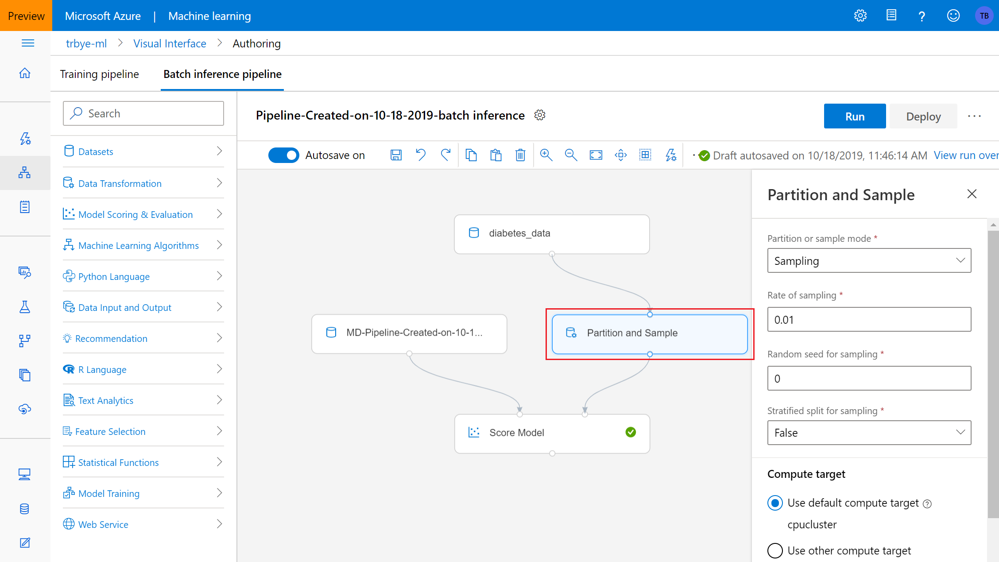
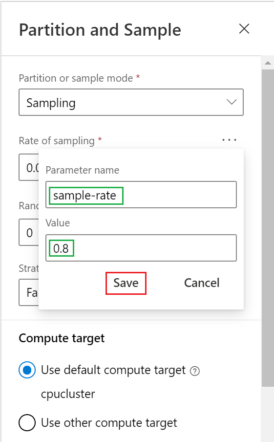

# Run batch predictions using Azure Machine Learning designer
[!INCLUDE [applies-to-skus](../../includes/aml-applies-to-basic-enterprise-sku.md)]

In this how-to, you learn how to use the designer to train a model and set up a batch prediction pipeline and web service. Batch prediction allows for continuous and on-demand scoring of trained models on large data sets, optionally configured as a web service that can be triggered from any HTTP library. 

For setting up batch scoring services using the SDK, see the accompanying [how-to](how-to-use-parallel-run-step.md).

In this how-to, you learn the following tasks:

> [!div class="checklist"]
> * Create a basic ML experiment in a pipeline
> * Create a parameterized batch inference pipeline
> * Manage and run pipelines manually or from a REST endpoint

## Prerequisites

1. If you don’t have an Azure subscription, create a free account before you begin. Try the [free or paid version of the Azure Machine Learning](https://aka.ms/AMLFree).

1. Create a [workspace](tutorial-1st-experiment-sdk-setup.md).

1. Sign in to [Azure Machine Learning studio](https://ml.azure.com/).

This how-to assumes basic knowledge of building a simple pipeline in the designer. For a guided introduction to the designer, complete the [tutorial](tutorial-designer-automobile-price-train-score.md). 

## Create a pipeline

To create a batch inference pipeline, you first need a machine learning experiment. To create one, navigate to the **Designer** tab in your workspace and create a new pipeline by selecting the **Easy-to-use prebuilt modules** option.

The following is a simple machine learning model for demonstration purposes. The data is a registered Dataset created from the Azure Open Datasets diabetes data. See the [how-to section](how-to-create-register-datasets.md#create-datasets-with-azure-open-datasets) for registering Datasets from Azure Open Datasets. The data is split into training and validation sets, and a boosted decision tree is trained and scored. The pipeline must be run at least once to be able to create an inferencing pipeline. Click the **Run** button to run the pipeline.

## Create a batch inference pipeline

Now that the pipeline has been run, there is a new option available next to **Run** and **Publish** called **Create inference pipeline**. Click the dropdown and select **Batch inference pipeline**.

The result is a default batch inference pipeline. This includes a node for your original pipeline experiment setup, a node for raw data for scoring, and a node to score the raw data against your original pipeline.

You can add other nodes to change the behavior of the batch inferencing process. In this example, you add a node for randomly sampling from the input data before scoring. Create a **Partition and Sample** node and place it between the raw data and scoring nodes. Next, click on the **Partition and Sample** node to gain access to the settings and parameters.

The *Rate of sampling* parameter controls what percent of the original data set to take a random sample from. This is a parameter that will be useful to adjust frequently, so you enable it as a pipeline parameter. Pipeline parameters can be changed at runtime, and can be specified in a payload object when rerunning the pipeline from a REST endpoint. 

To enable this field as a pipeline parameter, click the ellipses above the field and then click **Add to pipeline parameter**. 

Next, give the parameter a name and default value. The name will be used to identify the parameter, and specify it in a REST call.

## Deploy batch inferencing pipeline

Now you are ready to deploy the pipeline. Click the **Deploy** button, which opens the interface to set up an endpoint. Click the dropdown and select **New PipelineEndpoint**.

Give the endpoint a name and optional description. Near the bottom you see the `sample-rate` parameter you configured with a default value of 0.8. When you're ready, click **Deploy**.

## Manage endpoints 

After deployment is complete, go to the **Endpoints** tab and click the name of the endpoint you just created.

This screen shows all published pipelines under the specific endpoint. Click on your inferencing pipeline.

The pipeline details page shows you detailed run history and connection string information for your pipeline. Click the **Run** button to create a manual run of the pipeline.

In the run setup, you can provide a description for the run, and change the value for any pipeline parameters. This time, rerun the inferencing pipeline with a sample rate of 0.9. Click **Run** to run the pipeline.

The **Consume** tab contains the REST endpoint for rerunning your pipeline. To make a rest call, you will need an OAuth 2.0 bearer-type authentication header. See the following [tutorial section](tutorial-pipeline-batch-scoring-classification.md#publish-and-run-from-a-rest-endpoint) for more detail on setting up authentication to your workspace and making a parameterized REST call.

## Next steps

Follow the designer [tutorial](tutorial-designer-automobile-price-train-score.md) to train and deploy a regression model.
