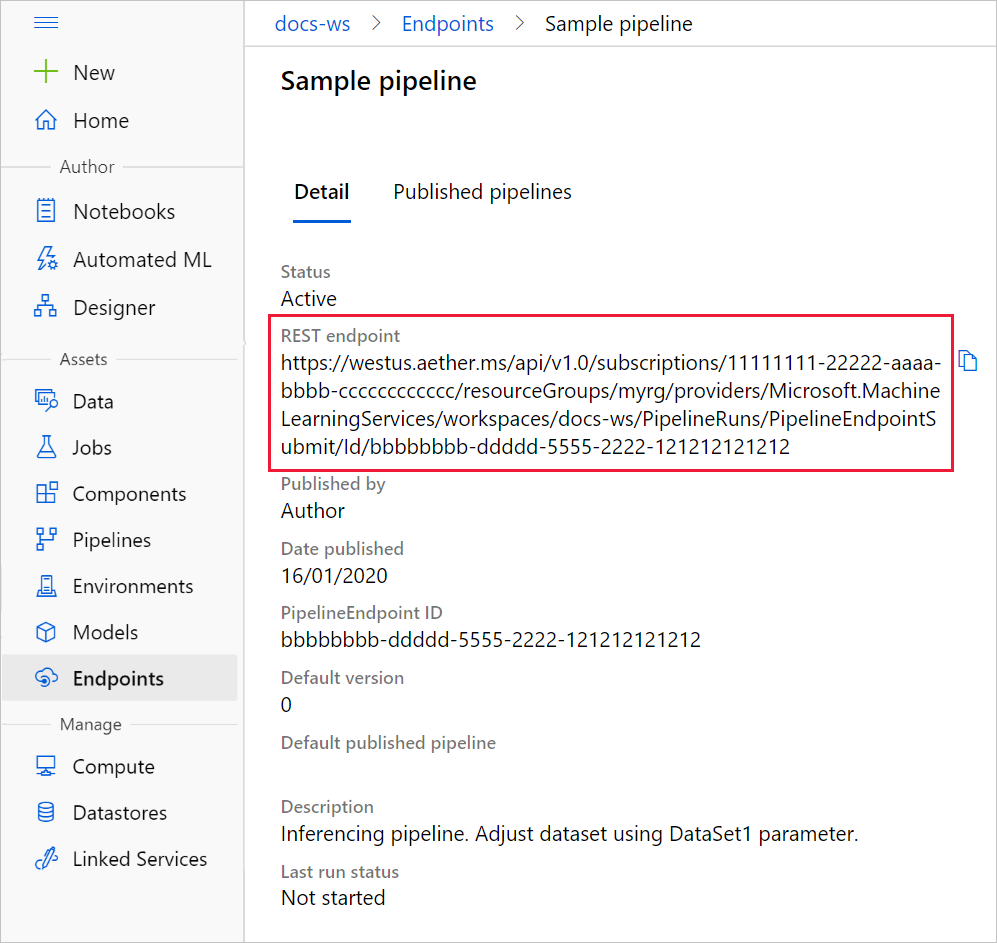

# Run batch predictions using Azure Machine Learning designer
[!INCLUDE [applies-to-skus](../../includes/aml-applies-to-basic-enterprise-sku.md)]

In this article, you learn how to use the designer to create a batch prediction pipeline. Batch prediction lets you continuously score large datasets on-demand. Use the designer to automatically creates a web service that can be triggered from any HTTP library.

In this how-to, you learn the following tasks:

> [!div class="checklist"]
> * Create a parameterized batch inference pipeline
> * Manage and run pipelines manually or from a REST endpoint

To learn how to set up batch scoring services using the SDK, see the accompanying [how-to](how-to-run-batch-predictions.md).

## Prerequisites

This how-to assumes you already have a training pipeline. For a guided introduction to the designer, complete [part one of the designer tutorial](tutorial-designer-automobile-price-train-score.md). 

## Open the training pipeline

Your training pipeline must be run at least once to be able to create an inferencing pipeline.

1. Go to the **Designer** tab in your workspace.

1. Select the training pipeline you want to use to score data.

1. **Run** the pipeline.

    

## Create a batch inference pipeline

Now that the training pipeline has been run, you can create a batch inference pipeline.

1. Next to **Run**, select the new dropdown **Create inference pipeline**.

1. Select **Batch inference pipeline**.

    
    
The result is a default batch inference pipeline. 

## Create a dataset parameter

To create predictions on new data, you can either manually connect a different dataset in this pipeline draft view or create a parameter for your dataset. Parameters let you change the behavior of the batch inferencing process at runtime to use new data.

In this section, you will create a dataset parameter to specify a different dataset to make predictions on.

1. Select the dataset module.

1. A pane will appear to the right of the canvas. At the bottom of the pane, select **Set as pipeline parameter**.
   
    Enter a name for the parameter, or accept the default value.

## Publish batch inferencing pipeline

Now you're ready to deploy the inferencig pipeline. This will deploy the pipeline and make it avaialble to use by others.

1. Select the **Publish** button.

1. In the dialog that appears, expand the drop down for **PipelineEndpoint**, and select **New PipelineEndpoint**.

1. Provide an endpoint name and optional description.

    Near the bottom of the dialog, you can see the `Dataset1` parameter you configured with a default value of the dataset ID used during training.

1. Select **Publish**.

## Manage endpoints 

You can visually manage any endpoints you create in Azure Machine Learning. In this section, you will setup a manual pipeline run and alter the pipeline parameter you created in the earlier section.

1. After deployment is complete, go to the **Endpoints** section.

1. Select **Pipeline endpoints**.

1. Select the name of the endpoint you just created.

1. Select **Published pipelines**.

    This screen shows all published pipelines published under the specific endpoint. You can also set a new pipeline as the default pipeline for the endpoint here.

1. Select the pipeline you just published.

    The pipeline details page shows you detailed run history and connection string information for your pipeline. 
    
1. Select **Run** to create a manual run of the pipeline.

    
    
    In the run setup, you can provide a description for the run, and change the value for any pipeline parameters.
    
1. Select **Run** to run the pipeline.

## Consume an endpoint

You can find information on how to consume pipeline endpoints and published pipeline in the **Endpoints** section.

You can find the REST endpoint of a pipeline endpoint in the run overview panel. By calling the endpoint, you are consuming its default published pipeline.

You can also consume a published pipeline in the **Published pipelines** page. Select a published pipeline and find the REST endpoint of it. 

To make a REST call, you will need an OAuth 2.0 bearer-type authentication header. See the following [tutorial section](tutorial-pipeline-batch-scoring-classification.md#publish-and-run-from-a-rest-endpoint) for more detail on setting up authentication to your workspace and making a parameterized REST call.

## Versioning endpoints

The designer assigns a version to each pipeline that you publish to an endpoint. You can specify the pipeline version that you want to execute as a parameter in your REST endpoint call. If you don't specify a version number, the default pipeline will execute.

When you publish a pipeline, you can choose to make it the new default pipeline for that endpoint.

You can also set a new default pipeline in the **Published pipelines** tab of your endpoint.

## Next steps

Follow the designer [tutorial](tutorial-designer-automobile-price-train-score.md) to train and deploy a regression model.
