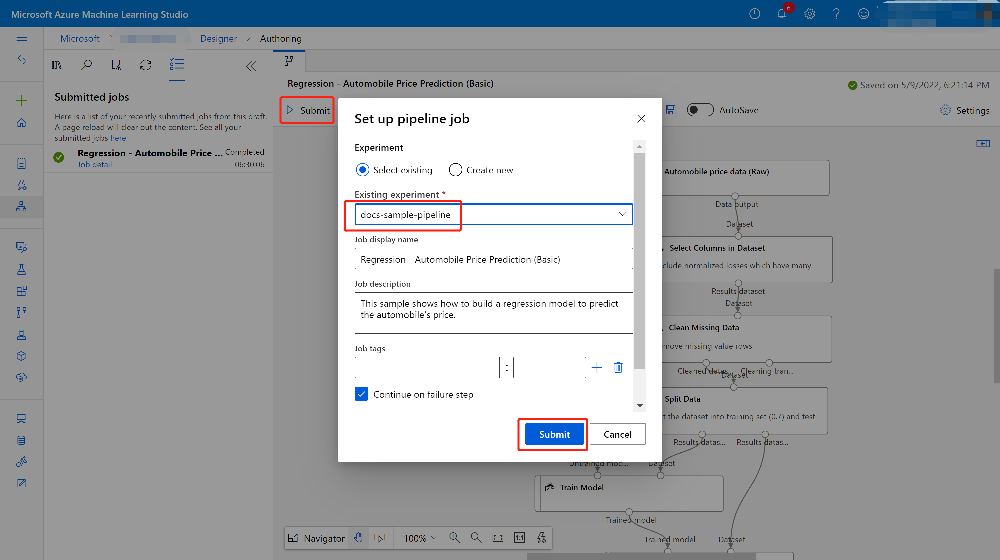
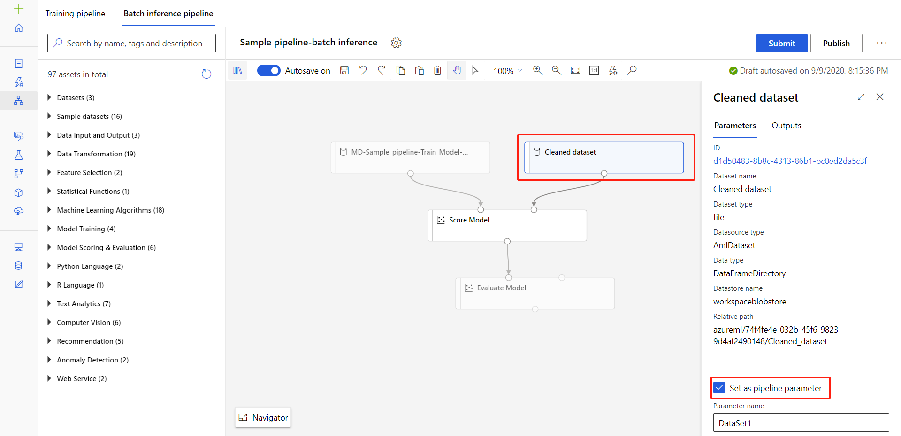
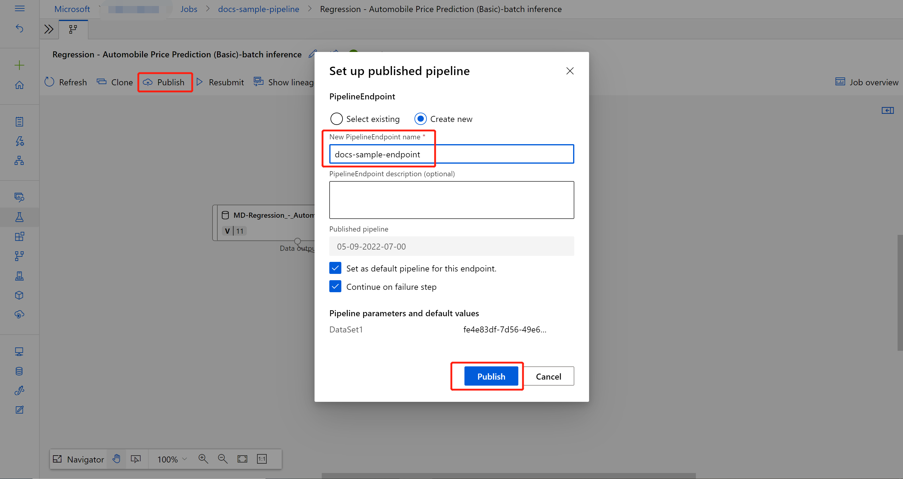
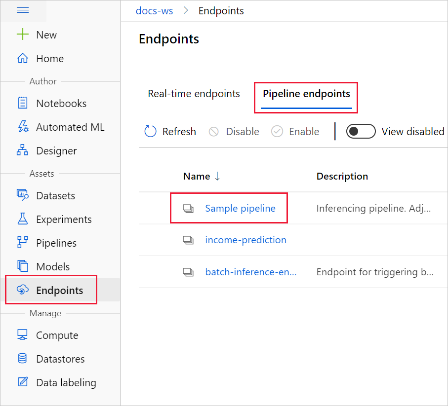
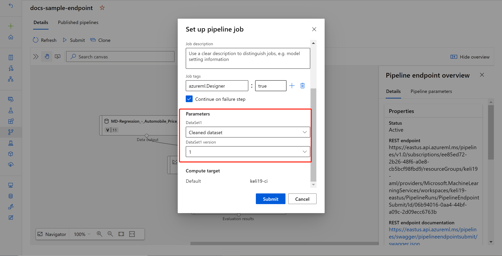
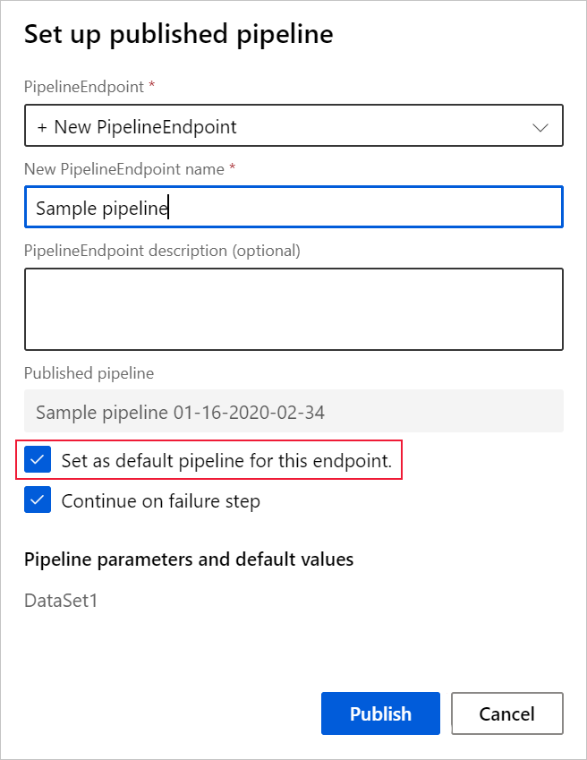
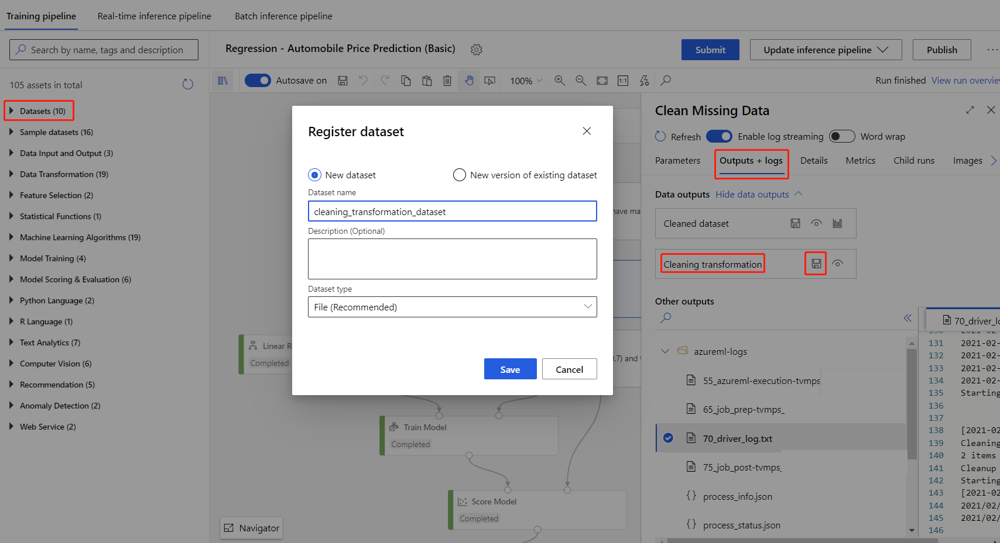
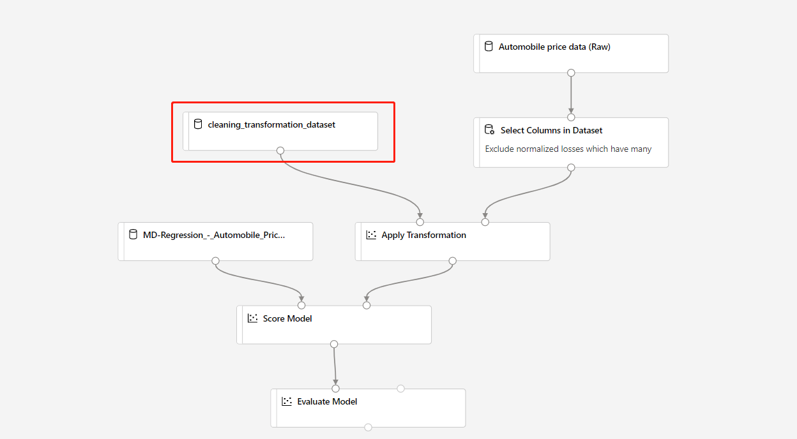

# Run batch predictions using Azure Machine Learning designer

In this article, you learn how to use the designer to create a batch prediction pipeline. Batch prediction lets you continuously score large datasets on-demand using a web service that can be triggered from any HTTP library.

In this how-to, you learn to do the following tasks:

> [!div class="checklist"]
> * Create and publish a batch inference pipeline
> * Consume a pipeline endpoint
> * Manage endpoint versions

To learn how to set up batch scoring services using the SDK, see the accompanying [how-to](./tutorial-pipeline-batch-scoring-classification.md).

## Prerequisites

This how-to assumes you already have a training pipeline. For a guided introduction to the designer, complete [part one of the designer tutorial](tutorial-designer-automobile-price-train-score.md). 

[!INCLUDE [machine-learning-missing-ui](../../includes/machine-learning-missing-ui.md)]

## Create a batch inference pipeline

Your training pipeline must be run at least once to be able to create an inferencing pipeline.

1. Go to the **Designer** tab in your workspace.

1. Select the training pipeline that trains the model you want to use to make prediction.

1. **Submit** the pipeline.

    

Now that the training pipeline has been run, you can create a batch inference pipeline.

1. Next to **Submit**, select the new dropdown **Create inference pipeline**.

1. Select **Batch inference pipeline**.

    
    
The result is a default batch inference pipeline. 

### Add a pipeline parameter

To create predictions on new data, you can either manually connect a different dataset in this pipeline draft view or create a parameter for your dataset. Parameters let you change the behavior of the batch inferencing process at runtime.

In this section, you create a dataset parameter to specify a different dataset to make predictions on.

1. Select the dataset module.

1. A pane will appear to the right of the canvas. At the bottom of the pane, select **Set as pipeline parameter**.
   
    Enter a name for the parameter, or accept the default value.

    > [!div class="mx-imgBorder"]
    > 

## Publish your batch inference pipeline

Now you're ready to deploy the inference pipeline. This will deploy the pipeline and make it available for others to use.

1. Select the **Publish** button.

1. In the dialog that appears, expand the drop-down for **PipelineEndpoint**, and select **New PipelineEndpoint**.

1. Provide an endpoint name and optional description.

    Near the bottom of the dialog, you can see the parameter you configured with a default value of the dataset ID used during training.

1. Select **Publish**.

## Consume an endpoint

Now, you have a published pipeline with a dataset parameter. The pipeline will use the trained model created in the training pipeline to score the dataset you provide as a parameter.

### Submit a pipeline run 

In this section, you will set up a manual pipeline run and alter the pipeline parameter to score new data. 

1. After the deployment is complete, go to the **Endpoints** section.

1. Select **Pipeline endpoints**.

1. Select the name of the endpoint you created.

1. Select **Published pipelines**.

    This screen shows all published pipelines published under this endpoint.

1. Select the pipeline you published.

    The pipeline details page shows you a detailed run history and connection string information for your pipeline. 
    
1. Select **Submit** to create a manual run of the pipeline.

    
    
1. Change the parameter to use a different dataset.
    
1. Select **Submit** to run the pipeline.

### Use the REST endpoint

You can find information on how to consume pipeline endpoints and published pipeline in the **Endpoints** section.

You can find the REST endpoint of a pipeline endpoint in the run overview panel. By calling the endpoint, you are consuming its default published pipeline.

You can also consume a published pipeline in the **Published pipelines** page. Select a published pipeline and you can find the REST endpoint of it in the **Published pipeline overview** panel to the right of the graph. 

To make a REST call, you will need an OAuth 2.0 bearer-type authentication header. See the following [tutorial section](tutorial-pipeline-batch-scoring-classification.md#publish-and-run-from-a-rest-endpoint) for more detail on setting up authentication to your workspace and making a parameterized REST call.

## Versioning endpoints

The designer assigns a version to each subsequent pipeline that you publish to an endpoint. You can specify the pipeline version that you want to execute as a parameter in your REST call. If you don't specify a version number, the designer will use the default pipeline.

When you publish a pipeline, you can choose to make it the new default pipeline for that endpoint.

You can also set a new default pipeline in the **Published pipelines** tab of your endpoint.

## Limitations

If you make some modifications in your training pipeline, you should re-submit the training pipeline, **Update**  the inference pipeline and run the inference pipeline again.

Note that only models will be updated in the inference pipeline, while data transformation will not be updated.

To use the updated transformation in inference pipeline, you need to register the transformation output of the transformation module as dataset.

Then manually replace the **TD-** module in inference pipeline with the registered dataset.

Then you can submit the inference pipeline with the updated model and transformation, and publish.

## Next steps

Follow the designer [tutorial](tutorial-designer-automobile-price-train-score.md) to train and deploy a regression model.

For how to publish and run a published pipeline using SDK, see [this article](how-to-deploy-pipelines.md).
