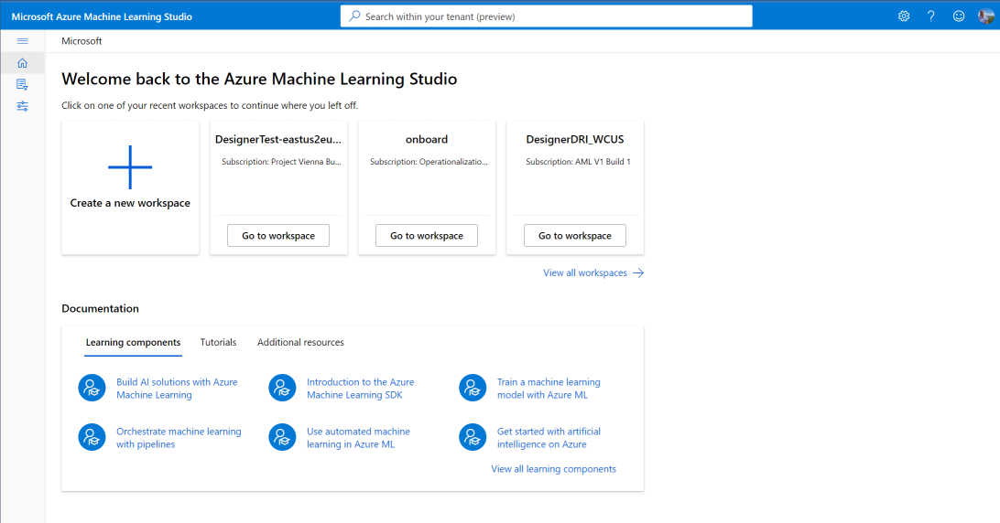
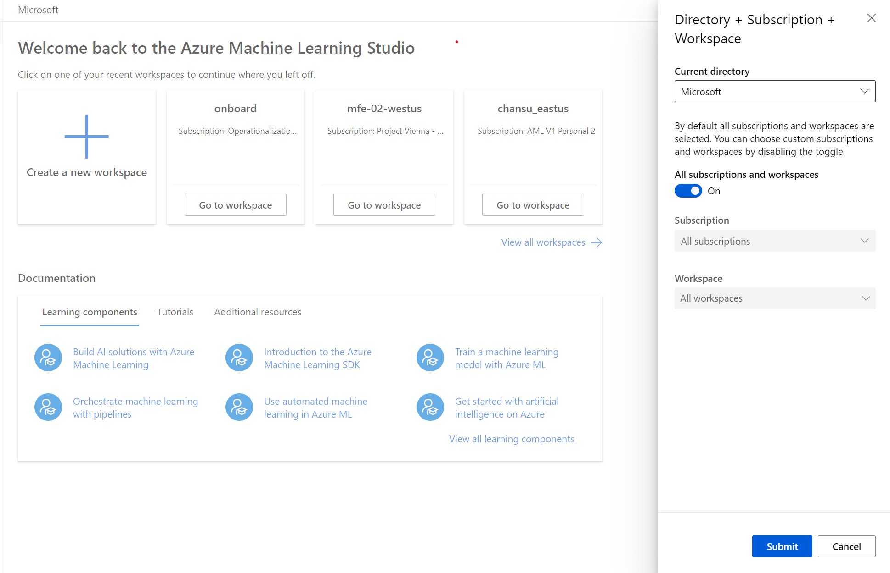
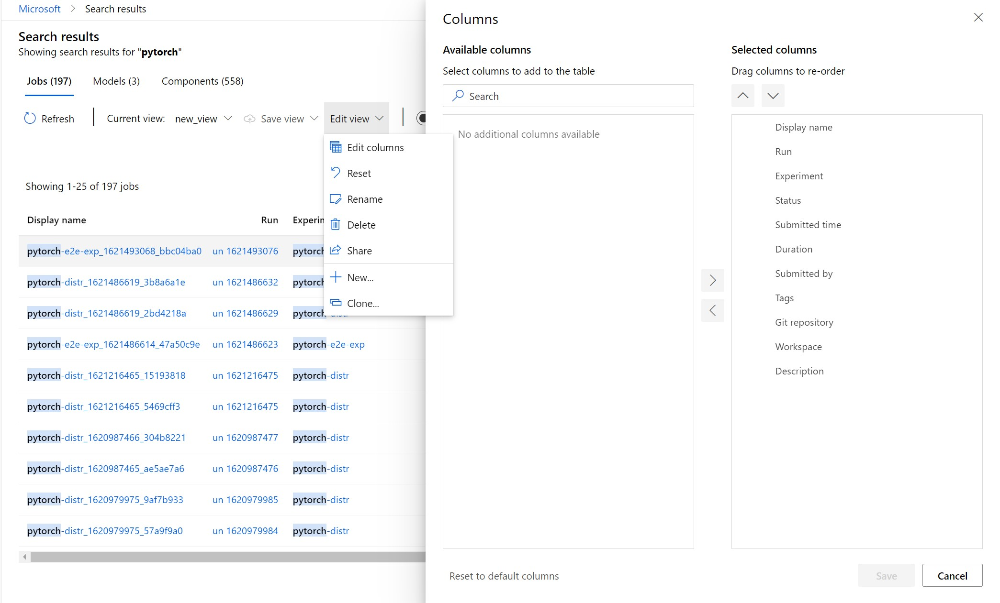

# Search for Azure Machine Learning assets across multiple workspaces (Public Preview)

## Overview 

Users can now search for machine learning assets such as jobs, models, and components across all workspaces, resource groups, and subscriptions in their organization through a unified global view. 

## Get started 

### Global homepage 

From this centralized global view, select from recently visited workspaces or browse documentation and tutorial resources.

### Search

Type search text into the global search bar and hit enter to trigger a 'contains' search.
The search will scan across all metadata fields for the given asset. Results are sorted by relevance as determined by the relevance weightings for the asset columns. 

Use the asset quick links to navigate to search results for jobs, models, and components created by you. 

Change the scope of applicable subscriptions and workspaces by clicking the 'Change' link. 

### Structured search 

Click on any number of filters to create more specific search queries. The following filters are supported:
* Job: 
* Model:
* Component:
* Tags:
* SubmittedBy: 

If an asset filter (job, model, component) is present, results will be scoped to those tabs. Other filters will apply to all assets unless an asset filter is also present in the query. Similarly, free text search can be provided alongside filters but will be scoped to the tabs chosen by asset filters if present. 

> [!TIP] 
> * Filters search for exact matches of text. Use free text queries for a contains search.
> * Quotations are required around values that include spaces or other special characters.  
> * If duplicate filters are provided, only the first will be recognized in search results. 
> * Input text of any language is supported but filter strings must match the provided options (ex. submittedBy:).
> * The tags filter can accept multiple key:value pairs separated by a comma (ex. tags:"key1:value1, key2:value2").

### Results

Explore the Jobs, Models, and Components tabs to view all search results. Click on an asset to be directed to the details page in the context of the relevant workspace. Results from workspaces a user doesn't have access to won't be displayed, click on the 'details' button to view the list of workspaces.

### Filters

To add more specificity to the search results, use the column filters sidebar. 

### Custom views

Customize the display of columns in the search results table. These views can be saved and shared as well. 

### Known issues

If you've previously used this feature, a search result error may occur. Reselect your preferred workspaces in the Directory + Subscription + Workspace tab.
