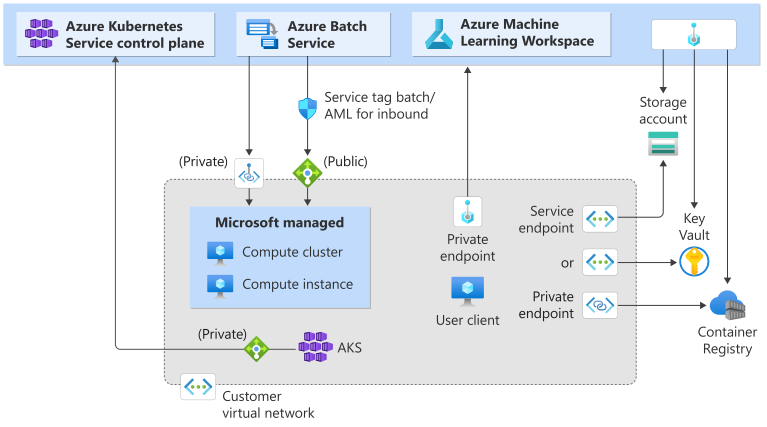

# Secure Azure Kubernetes Service inferencing environment

If you have an Azure Kubernetes (AKS) cluster behind of VNet, you would need to secure Azure Machine Learning workspace resources and a compute environment using the same or peered VNet. In this article, you'll learn: 
  * What is a secure AKS inferencing environment
  * How to configure a secure AKS inferencing environment

## Limitations

* If your AKS cluster is behind of a VNet, your workspace and its associated resources (storage, key vault, Azure Container Registry) must have private endpoints or service endpoints in the same or peered VNet as AKS cluster's VNet. For more information on securing the workspace and associated resources, see [create a secure workspace](tutorial-create-secure-workspace.md).
* If your workspace has a __private endpoint__, the Azure Kubernetes Service cluster must be in the same Azure region as the workspace.
* Using a [public fully qualified domain name (FQDN) with a private AKS cluster](../aks/private-clusters.md) is __not supported__ with Azure Machine Learning.

## What is a secure AKS inferencing environment

Azure Machine Learning AKS inferencing environment consists of workspace, your AKS cluster, and workspace associated resources - Azure Storage, Azure Key Vault, and Azure Container Services(ARC). The following table compares how services access different part of Azure Machine Learning network with or without a VNet.

| Scenario | Workspace | Associated resources (Storage account, Key Vault, ACR) | AKS cluster |
|-|-|-|-|-|
|**No virtual network**| Public IP | Public IP | Public IP |
|**Public workspace, all other resources in a virtual network** | Public IP | Public IP (service endpoint)   **- or -**   Private IP (private endpoint) | Private IP  |
|**Secure resources in a virtual network**| Private IP (private endpoint) | Public IP (service endpoint)   **- or -**   Private IP (private endpoint) | Private IP  | 

In a secure AKS inferencing environment, AKS cluster accesses different part of Azure Machine Learning services with private endpoint only (private IP). The following network diagram shows a secured Azure Machine Learning workspace with a private AKS cluster or default AKS cluster behind of VNet.

 

## How to configure a secure AKS inferencing environment

To configure a secure AKS inferencing environment, you must have VNet information for AKS. [VNet](../virtual-network/quick-create-portal.md) can be created independently or during AKS cluster deployment. There are two options for AKS cluster in a VNet:
  * Deploy default AKS cluster to your VNet
  * Or create private AKS cluster to your VNet

For default AKS cluster, you can find VNet information under the resource group of `MC_[rg_name][aks_name][region]`. 

After you have VNet information for AKS cluster and if you already have workspace available, use following steps to configure a secure AKS inferencing environment:
  
  * Use your AKS cluster VNet information to add new private endpoints for the Azure Storage Account, Azure Key Vault, and Azure Container Registry used by your workspace. These private endpoints should exist in the same or peered VNet as AKS cluster. For more information, see the [secure workspace with private endpoint](./how-to-secure-workspace-vnet.md#secure-the-workspace-with-private-endpoint) article.
  * If you have other storage that is used by your Azure Machine Learning workloads, add a new private endpoint for that storage. The private endpoint should be in the same or peered VNet as AKS cluster and have private DNS zone integration enabled.
  * Add a new private endpoint to your workspace. This private endpoint should be in the same or peered VNet as your AKS cluster and have private DNS zone integration enabled.

If you have AKS cluster ready but don't have workspace created yet, you can use AKS cluster VNet when creating the workspace. Use the AKS cluster VNet information when following the [create secure workspace](./tutorial-create-secure-workspace.md) tutorial. Once the workspace has been created, add a new private endpoint to your workspace as the last step. For all the above steps, it's important to ensure that all private endpoints should exist in the same AKS cluster VNet and have private DNS zone integration enabled.

Special notes for configuring a secure AKS inferencing environment:
  * Use system-assigned managed identity when creating workspace, as storage account with private endpoint only allows access with system-assigned managed identity.
  * When attaching AKS cluster to an HBI workspace, assign a system-assigned managed identity with both `Storage Blob Data Contributor` and `Storage Account Contributor` roles.
  * If you're using default ACR created by workspace, ensure you have the __premium SKU__ for ACR. Also enable the `Firewall exception` to allow trusted Microsoft services to access ACR.
  * If your workspace is also behind a VNet, follow the instructions in [securely connect to your workspace](./how-to-secure-workspace-vnet.md#securely-connect-to-your-workspace) to access the workspace.
  * For storage account private endpoint, make sure to enable `Allow Azure services on the trusted services list to access this storage account`.

>[!Note]
>
> If your AKS that is behind a VNet has been stopped and **restarted**, you need to:
> 1. First, follow the steps in [Stop and start an Azure Kubernetes Service (AKS) cluster](../aks/start-stop-cluster.md) to delete and recreate a private endpoint linked to this cluster. 
> 1. Then, reattach the Kubernetes computes attached from this AKS in your workspace. 
>
> Otherwise, the creation, update, and deletion of endpoints/deployments to this AKS cluster will fail.

## Next steps

This article is part of a series on securing an Azure Machine Learning workflow. See the other articles in this series:

* [Virtual network overview](how-to-network-security-overview.md)
* [Secure the training environment](how-to-secure-training-vnet.md)
* [Secure online endpoints (inference)](how-to-secure-online-endpoint.md)
* [Enable studio functionality](how-to-enable-studio-virtual-network.md)
* [Use custom DNS](how-to-custom-dns.md)
* [Use a firewall](how-to-access-azureml-behind-firewall.md)
* [Tutorial: Create a secure workspace](tutorial-create-secure-workspace.md)
* [Tutorial: Create a secure workspace using a template](tutorial-create-secure-workspace-template.md)
* [API platform network isolation](how-to-configure-network-isolation-with-v2.md)